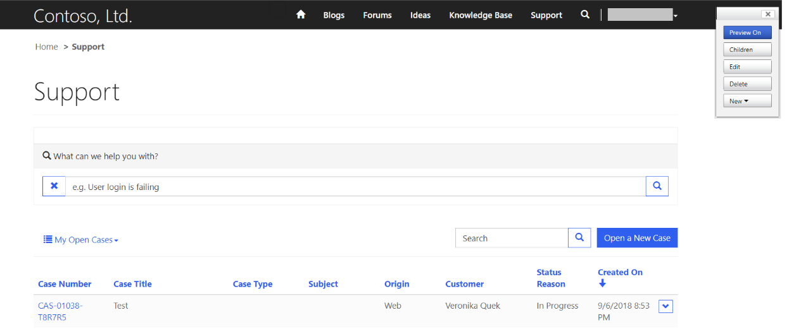
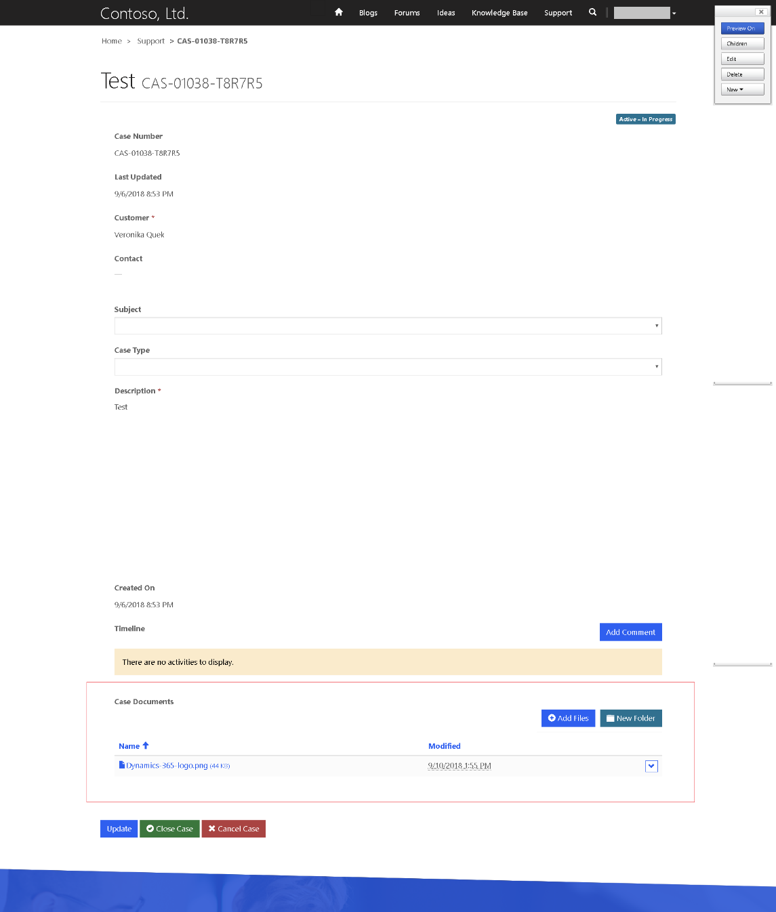

# Manage SharePoint documents

Dynamics 365 supports integration with SharePoint Online that enables you to use the document management capabilities of SharePoint from within Dynamic 365. Dynamics 365 Portal now supports uploading and displaying documents to and from SharePoint directly on an entity form or web form in a portal. This allows portal users to view, download, add, and delete documents from a portal. Portal users can also create subfolders to organize their documents.

> [!NOTE]
> Document management works only with SharePoint Online.
> Document management is supported with server-based integration.

To work with the document management capabilities of SharePoint from within Dynamics 365, you must:

1.	[Set up SharePoint integration from portal admin center](#step-1-set-up-sharepoint-integration-from-portal-admin-center)

2.	[Enable document management functionality in Dynamics 365](#step-2-enable-document-management-functionality-in-dynamics-365)

3.	[Enable document management for entities](#step-3-enable-document-management-for-entities)

4.	[Configure the appropriate form in Dynamics 365 to display documents](#step-4-configure-the-appropriate-form-to-display-documents)

5.	[Create appropriate entity permission and assign it to the appropriate web role](#step-5-create-appropriate-entity-permission-and-assign-it-to-the-appropriate-web-role)

## Step 1: Set up SharePoint integration from portal admin center

To use the document management capabilities of SharePoint from within Dynamics 365, you must enable SharePoint integration from the portal admin center.

> [!NOTE]
> You must be a global administrator to perform this action.

1.	Go to the Dynamics 365 admin center and select the **Applications** tab.

2.	Select the name of the portal for which you want enable SharePoint integration, and then select **Manage**.

3.	Go to **Set up SharePoint integration** > **Enable SharePoint integration**.

4.	Select **Enable** in the confirmation window. This will enable the portal to communicate with SharePoint. While the SharePoint integration is being enabled, the portal restarts and will be unavailable for a few minutes. A message appears when SharePoint integration is enabled.

When SharePoint integration is enabled, the following action becomes available:

- **Disable SharePoint integration**: Allows you to disable the SharePoint integration with your portal. While the SharePoint integration is being disabled, the portal restarts and will be unavailable for a few minutes. A message appears when SharePoint integration is disabled.

> [!NOTE]
> Enabling or disabling the SharePoint integration will update the Azure Active Directory (Azure AD) application for the portal and add or remove the required SharePoint permissions, respectively. You will also be redirected to provide your consent for the changes to be made in the Azure AD application. 

If you do not provide your consent:

- Enabling or disabling the SharePoint integration will not be complete and an error message will display.

- Your out-of-the-box Azure AD logon on the portal will not work. 

## Step 2: Enable document management functionality in Dynamics 365

You must enable document management functionality in Dynamics 365 by using server-based SharePoint integration. Server-based SharePoint integration allows Dynamics 365 (online) and SharePoint Online to perform a server-to-server connection. The default SharePoint site record is used by the portal. For information on how to enable document management functionality in Dynamics 365, see [Configure server-based authentication with Dynamics 365 (online) and SharePoint Online](https://docs.microsoft.com/en-us/dynamics365/customer-engagement/admin/configure-server-based-authentication-sharepoint-online).

## Step 3: Enable document management for entities
You must enable document management for entities to store documents related to Dynamics 365 entity records in SharePoint. For information on how to enable document management for entities, see [Enable SharePoint document management for specific entities](https://docs.microsoft.com/en-us/dynamics365/customer-engagement/admin/enable-sharepoint-document-management-specific-entities).

## Step 4: Configure the appropriate form to display documents

### Dynamics 365 customization

Identify the form where you want to use document management capabilities. You must edit the form by using Dynamics 365 form editor and add a subgrid to it. The subgrid adds a section to the form, which allows you to work with documents from within a portal. You must set the following properties in the subgrid for this feature to work:

- Under **Data Source**, select **Document Locations** from the **Entity** list.

- Under **Data Source**, select **Active Document Locations** from the **Default View** list.

You can specify name and label as per your requirement. Save and publish the form once the subgrid is added and configured.

> [!NOTE]
> Document management must be enabled for the entity for which you edit the form. More information: [Enable document management for entities](#enable-document-management-for-entities)

### Dynamics 365 Portal configuration

If you do not already have an entity or web form configured, then configure one. For more information on configuring entity forms, see [Add a form to your portal](entity-forms-custom-logic.md#add-a-form-to-your-portal). If you are configuring this on a web form, see [Define web form properties for portals](web-form-properties.md) and [Define web form steps for portals](web-form-steps.md).

Apart from the standard configuration required for entity form or web form, you must set the following properties to enable document management:

- **Entity Name** and **Form Name**: Enter the Dynamics 365 entity and form names customized in the previous step, respectively.

- Select the **Enable Entity Permission** check box on the form to allow a user to read the documents.

- Set the **Mode** to **Edit** to allow document uploads.

## Step 5: Create appropriate entity permission and assign it to the appropriate web role

Two entity permission records are required to establish the necessary access to view and upload documents.

- Permissions on the entity of the entity or web form: 
    - Create an **Entity Permission** record specifying the **Entity Name** as the entity of the entity form or web form configured previously. 
    - Select a **Scope** and scope relationship that is appropriate to the desired behavior of the form. 
    - Enable **Read** and **Append To** privileges to allow read access to documents and optionally enable **Write** privilege to allow document uploads. Ignore the **Child Entity Permissions** section for now since it will be populated by the next step.
- Permissions on the **Document Location** with **Parent scope** referring to the previous permission record: 
    - Create an **Entity Permission** record specifying the **Entity Name** as **Document Location** entity with **Scope** set to **Parent**. 
    - Select the Parent Entity Permission to the entity permission record created in previous step. 
    - Privileges 
        - The minimum privileges to allow read access to documents are **Read**, **Create**, and **Append**. 
        - Include **Write** privileges for document upload access. 
        - Include **Delete** to allow deletion of a document.

> [!NOTE]
> A corresponding child entity permission on the **Document Location** entity needs to be created for each instance of the parent entity permission record that exists on the entity of the entity or web form where documents need to be shown.

## Configure file upload size

By default, the file size is set to 10 MB. However, you can configure the file size to a maximum of 50 MB by using the site setting `SharePoint/MaxUploadSize`.

## Sample configuration to enable document management on the Case entity form

This sample provides exact steps and configuration values to enable document management on the Case entity in Community portal.

1.	Follow the instructions in [Step 1](#step-1-set-up-sharepoint-integration-from-portal-admin-center) to ensure that the portal has permissions to integrate with SharePoint. 

2.	Follow the instructions in [Step 2](#step-2-enable-document-management-functionality-in-dynamics-365) to ensure that server-based configuration is complete for Dynamics 365 and SharePoint integration. 

3.	Follow the instructions in [Step 3](#step-3-enable-document-management-for-entities) to ensure Document Management is enabled for the Case entity.

4.	Follow the instructions in [Step 4](#step-4-configure-the-appropriate-form-to-display-documents) with the following configurations:

    - Dynamics 365 customization

        a. Go to **Settings** > **Customization** > **Customize the System**. 

        b. In the **Default Solution**, go to the **Case** entity > **Forms**. 
    
        c. Open the **Web – Edit Case** in form editor.

         > [!div class="mx-imgBorder"]
         > 
    
        d. Select the **Created On** field on the form, and on the **Insert** tab, select **Sub-Grid**.

         > [!div class="mx-imgBorder"]
         > 
    
        e. In the **Set Properties** dialog box, set the following properties, and select **OK**:

         - **Name** (This can be any name): CaseDocuments 
    
         - **Label** (This can be any label name): Case Documents 
      
         - **Entity**: Document Locations 
    
         - **Default View**: Active Document Locations

         > [!div class="mx-imgBorder"]
         > 

        f. In the form editor, select **Save** and then select **Publish**.

    - Dynamics 365 Portal configuration

        a. In Dynamics 365, go to **Portals** > **Entity Forms**.
    
        b. Find and open **Customer Service - Edit Case** entity form.
    
        c. Review and ensure the following properties are set:
    
         - **Entity Name**: Case (incident)
    
         - **Form Name**: Web – Edit Case
    
         - **Mode**: Edit
    
         - **Entity Permission**: Enabled
    
         > [!div class="mx-imgBorder"]
         > 
    
        d. If you’ve made any changes to the form, select **Save**.

5. Follow [Step 5](#step-5-create-appropriate-entity-permission-and-assign-it-to-the-appropriate-web-role
) to make sure entity permissions are granted to the users.

   1. Go to the **Web Role** record that is associated to the user. For this sample, we’ll assume that the user has an Administrator web role.

   2. Ensure that an Entity Permission record exists by the name of **Customer Service - Cases where contact is customer**. 

      > [!NOTE]
      > Ensure that your web role has this entity permission added. If your user is already an Administrator, then the above entity permission need not be explicitly assigned.

   3. Create a new entity permission, enter the following details, and select **Save**:

    - **Name** (This can be any name): Customer Service - Related Documents

    - **Entity Name**: Document Location
        
    - **Scope**: Parent
        
    - **Parent Entity Permission**: Customer Service - Cases where contact is customer
        
    - **Parent Relationship**: incident_SharePointDocumentLocations
        
    - **Privileges**: Read, Create, Append, Write, Delete

      > [!div class="mx-imgBorder"]
      > 
  
   4. Sign in to Portal to ensure document management is enabled for the Case entity.

      a. Go to the **Support** page.

      > [!div class="mx-imgBorder"]
      > 

      b. Click on an existing Case record from the list. Go to the **Case Documents** section on the page and see the document list added.

      > [!div class="mx-imgBorder"]
      > 

