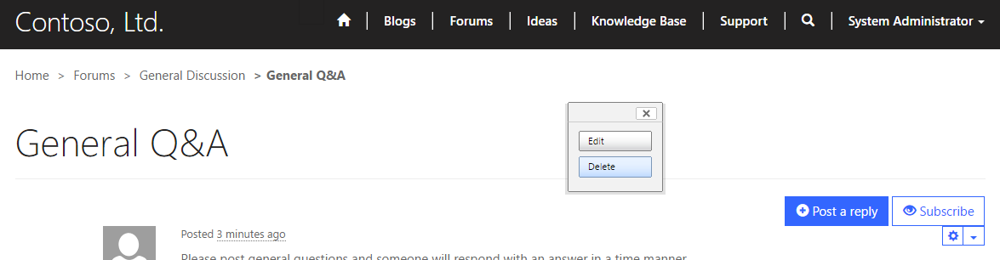
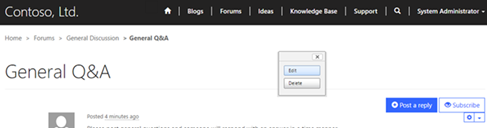
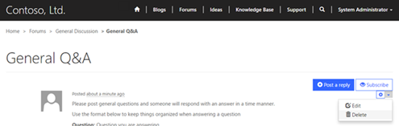
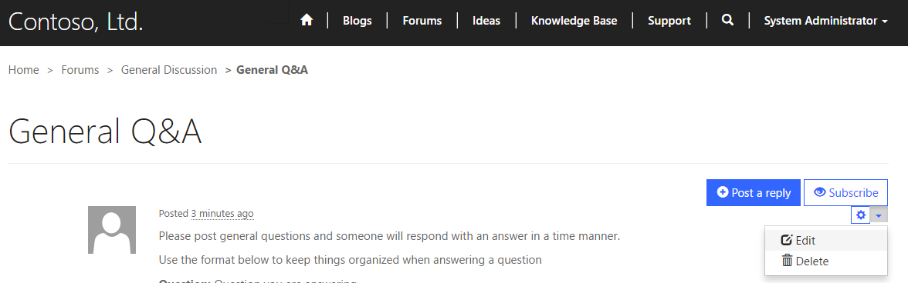
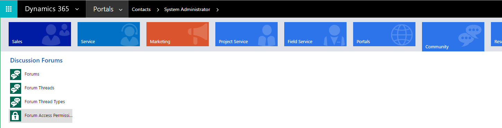
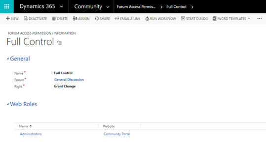

# Moderate forums
The moderators are users of the forum who are granted access to the forum's threads and posts of all members for moderating the discussion and keeping the forum clean (neutralizing spam and spambots, for example). Moderators also answer users' concerns about the forum, general questions, as well as respond to specific complaints. They also can do anything to lend a helping hand to a user in need. Common privileges of moderators include: deleting, adding, editing, removing of threads or posts. Essentially, it is the duty of the moderator to manage the day-to-day affairs of a forum or board as it applies to the stream of user contributions and interactions. The relative effectiveness of this user management directly impacts the quality of a forum in general, its appeal, and its usefulness as a community of interrelated users.

The table below explains many of the Forum Access Permission attributes used by portals.

| Name  | Description                                                                                                                                |
|-------|--------------------------------------------------------------------------------------------------------------------------------------------|
| Name  | A name used for reference within [!INCLUDE[pn-dynamics-crm](../includes/pn-dynamics-crm.md)].                                                                                             |
| Forum | The [Manage forum threads](manage-forum-threads.md) associated with the permission.                                                          |  
| Right | The permission setting can be one of the following: **Restrict Read**, which prevents viewing of the forum for users in a web role associated with the rule, and   **Grant Change** which allows a user in a web role associated with the rule to moderate the forum. Grant Change takes precedence over Restrict Read.
||

## Assign moderators to forums in [!INCLUDE[pn-microsoftcrm](../includes/pn-microsoftcrm.md)]

To specify moderators for a forum within [!INCLUDE[pn-dynamics-crm](../includes/pn-dynamics-crm.md)], the contact record of the portal user must be assigned to a web role that is associated with a Forum Access Permission record that has the Right set to Grant Change. For more information, see [Create web roles for portals](create-web-roles.md).  

## Forum moderation within the portal

For portal users with moderation permission, moderation controls will automatically be displayed in the portal once signed in. Depending on the page template implemented by your developer, the functionality providing users the ability to moderate may or may not be present and the images displayed within this document may be different than your actual portal.

### Delete an entire forum thread

1. Select **Delete** on the admin toolbar.  
2. In the **Delete this thread?** pop-up window, select **Yes**.

  

### Edit the forum thread

1. Select **Edit** on the admin toolbar.
2. Make the changes you want in the **Edit Thread** pop-up window.
3. Select **Save**.

### Delete a forum post

1. Select the down arrow next to the post you want to delete.
2. Select **Delete**.
3. In the **Delete this thread?** pop-up window, select **Yes**.

  

### Edit a forum post

1. Select the down arrow next to the post you want to edit.
2. Select **Edit**
3. Change the information you want to change in the **Edit this content** pop-up window.
4. Select **Save**.

## Manage forum access permissions in [!INCLUDE[pn-dynamics-crm](../includes/pn-dynamics-crm.md)]

Forum Access Permission is a security rule that can be assigned to a particular forum and web role that can restrict particular users from viewing the forum or granting particular users the ability to moderate a forum within the webpages. To create, edit, or delete forum access permissions from within [!INCLUDE[pn-dynamics-crm](../includes/pn-dynamics-crm.md)]:

1. Sign in to **[!INCLUDE[pn-dynamics-crm](../includes/pn-dynamics-crm.md)]**.
2. Navigate to **Community**.
3. Select **Forum Access Permissions**.

To create a new forum access permission, select **New**.

### Edit an existing forum access permission

1. Double-click to select an existing **Forum Access Permission** listed in the grid.
2. Specify values for the fields provided.
3. Select **Save & Close**.

  

> [!Note]
> A web role must be assigned for the rule to apply for users associated with the given role. See [Create web roles for portals](create-web-roles.md).

### See also

[Setup and moderate forums](setup-moderate-forums.md)  
[Manage forum threads](manage-forum-threads.md)  
[Create forum posts on the portal](create-forum-posts.md)  
[Subscribe to alerts](subscribe-alerts.md)  

