# Get started with the new portal content editor

> [!IMPORTANT]
> - [!INCLUDE[cc-preview-features-definition](../includes/cc-preview-features-definition.md)]
> - [!INCLUDE[cc-preview-features-no-ms-support](../includes/cc-preview-features-no-ms-support.md)] 
> 
> **Send us feedback**
> We'd love your feedback on the new portal content editor! To send us feedback, register your account on the [Microsoft Insider program](https://experience.dynamics.com/insider/), and then [submit your feedback](https://go.microsoft.com/fwlink/p/?linkid=2030693).

[!INCLUDE[pn-dynamics-crm](../includes/pn-dynamics-crm.md)] Portal allows customization by using [!INCLUDE[pn-dynamics-crm](../includes/pn-dynamics-crm.md)] entities and some WYSIWYG support through it’s front end editing tools in the portal runtime. A new and simplified portal editor is now available for [!INCLUDE[pn-dynamics-crm](../includes/pn-dynamics-crm.md)] Portal customizers that will help to reduce the learning curve on Dynamics 365 Portal customization and increase a customizer’s productivity.

> [!NOTE]
> - Portal’s out-of-the-box administrator webrole and any contact linked to that webrole can use the new editor.
> - Only contacts with a web role which has following authorizations will be able to navigate to the new editor:
>   - Following website access permissions should be enabled:
>       - Manage Content Snippets
>       - Manage Site Markers
>       - Manage Web Link Sets
>       - Preview Unpublished Entities
>       More information: [Create website access permissions](website-access-permission.md)
>   - Webpage access permission as Grant Change on the Home (root) page of the portal website needs to be enabled. More information: [Control webpage access for portals](webpage-access-control.md)
> - Drag and drop is not currently supported on the canvas and will be coming in one of the subsequent releases.

## Use the new editor

1.	Sign in to the portal with administrator credentials. A message is displayed at the top of the screen to try the new editor.

2.	Select **Try new editor** to open the new editor.

    > [!div class="mx-imgBorder"]
    > 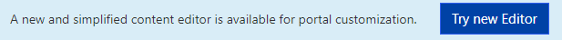

    The new editor opens:

    > [!div class="mx-imgBorder"]
    > 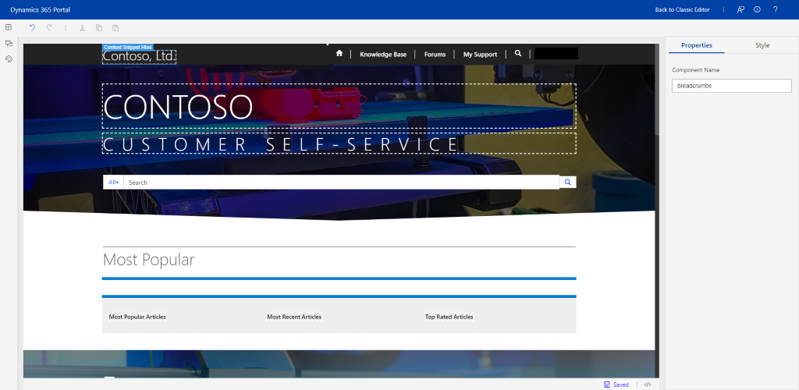

3.	Select a content snippet to select its text, and then edit it. Format options are displayed for changing the font size and style.

    > [!div class="mx-imgBorder"]
    > 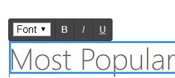

    > [!NOTE]
    > You can also point to the content snippet and select **Edit**.

4.	After making the changes, click outside the content snippet boundary to save the changes. The status is displayed in the content snippet and footer.

5.	To view the source of the content snippet, select the content snippet, and then select the source code icon **</>** in the footer. The source code is displayed in the **Source code editor** pane at the bottom of the screen. The changes you made earlier are updated in the source code.

## Add and edit a text box in a content snippet

1.	Select a content snippet or a text box in the content snippet, and then select **Components** from the pane at the left-side of the screen.

    > [!div class="mx-imgBorder"]
    > 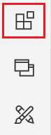

    The **Components** pane opens.

    > [!div class="mx-imgBorder"]
    > 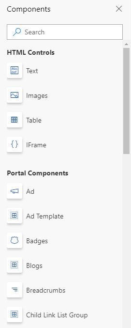

2.	Under **HTML controls**, select **Text** to add a text box. You can edit the text as per your requirement. 

3.	Click outside the content snippet to save the changes. You can also view changes in the source code editor.

## Add and edit an image in a content snippet

1.	Select a content snippet or a text box in the content snippet, and then select **Components** from the pane at the left-side of the screen.

    > [!div class="mx-imgBorder"]
    > 

    The **Components** pane opens.

    > [!div class="mx-imgBorder"]
    > 

2.	Under **HTML controls**, select **Images**. The image placeholder is added on the canvas.

    > [!div class="mx-imgBorder"]
    > 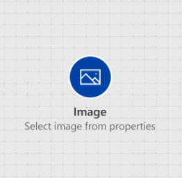

3.	In the **Properties** pane, perform the following actions:

    - In the **URL** field, modify the link of the image. Please note that only secured links are accepted, that is, https:// is mandatory.

    - To resize the image, update values in the **Width** and **Height** fields.

        > [!div class="mx-imgBorder"]
        > 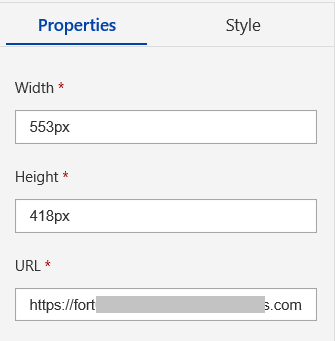
    
    > [!NOTE]
    > You can also select the image on canvas and drag the handles to resize it.

4.	Click outside the content snippet to save the changes. You can also view changes in the source code editor.

## Add and edit an iFrame in a content snippet

1.	Select a content snippet or a text box in the content snippet, and then select **Components** from the pane at the left-side of the screen.

    > [!div class="mx-imgBorder"]
    > 

    The **Components** pane opens.

    > [!div class="mx-imgBorder"]
    > 

2.	Under **HTML controls**, select **iFrame**. The iFrame placeholder is added on the canvas.

    > [!div class="mx-imgBorder"]
    > 

3.	In the **Properties** pane, perform the following actions:

    - In the **Link** field, modify the link of the iFrame. Please note that only secured links are accepted, that is, https:// is mandatory.
    
    - To resize the iFrame, update values in the **Width** and **Height** fields.

        > [!div class="mx-imgBorder"]
        > 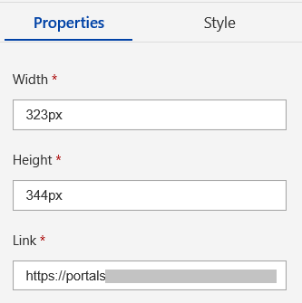
    
    > [!NOTE]
    > You can also select the iFrame on canvas and drag the handles to resize it.

4.	Click outside the content snippet to save the changes. You can also view changes in the source code editor.

## Add web templates or portal components in a content snippet

> [!NOTE]
> You cannot edit a web template or a portal component. 

1.	Select a content snippet or a text box in the content snippet, and then select **Components** from the pane at the left-side of the screen.

    > [!div class="mx-imgBorder"]
    > 

    The **Components** pane opens.

    > [!div class="mx-imgBorder"]
    > 

2.	Select a web template or a portal component.

There are two types of web templates:
- Web templates which require no input (for example, Breadcrumb): You can add a breadcrumb on the content snippet. After adding the breadcrumb, click outside the content snippet to save changes and render the breadcrumb.

- Web templates which require specific inputs:

    - **Ad**: For the Ad control, the advertisement placement name is required. You must specify the placement name from the portal app. If the placement name is not available, you must create it.

      You cannot add an advertisement name from the Properties pane. However, you can modify it through the source code editor as follows:

      ``

    - **Ad Template**: For the Ad Template control, the advertisement name is required. You must specify the name from the portal app. If the advertisement is not available, you must create it. You can also edit its value through the source code editor.

    - **Entity List**: For the Entity List control, the entity list name is required. You must specify the name from the portal app. If the entity list is not available, you must create it. You can also edit its value through the source code editor.

    - **Entity List Filter**: For the Entity List Filter control, the entity list name is required. You must specify the name from the portal app. If the entity list is not available, you must create it. You can also edit its value through the source code editor.

    - **Entity List Grid**: For the Entity List Grid control, the entity list name is required. You must specify the name from the portal app. If the entity list is not available, you must create it. You can also edit its value through the source code editor.

    - **Entity Form**: For the Entity Form control, the entity form name is required. You must specify the name from the portal app. If the entity form is not available, you must create it. You can also edit its value through the source code editor.

    - **Web Form**: For the Web Form control, the web form name is required. You must specify the name from the portal app. If the web form is not available, you must create it. You can also edit its value through the source code editor.

    - **Poll**: For the Poll control, the poll placement name is required. You must specify the placement name from the portal app. If the placement name is not available, you must create it. 

      You cannot add a poll name from the Properties pane. However, you can modify it through the source code editor as follows:

      ``

    - **Poll Template**: For the Poll Template control, the poll name is required. You must specify the name from the portal app. If the poll is not available, you must create it. You can also edit its value through the source code editor.

    - **Random Ad**: For the Random Ad control, advertisement placement name is required. You must specify the name from the portal app. If the advertisement placement is not available, you must create it. You can also edit its value through the source code editor

    - **Random Poll**: For the Random Poll control, poll placement name is required. You must specify the name from the portal app. If the poll placement is not available, you must create it. You can also edit its value through the source code editor

    - **Snippet**: For the Snippet control, you can go to the source code editor and insert the following code to render the content snippet:

      ``
    
    > [!NOTE]
    > Snippet rendering is not supported through properties of the snippet. The usability will be improved in the subsequent update.

## Move to another page

To navigate to another page, select the required header link to see the navigation options.

> [!div class="mx-imgBorder"]
> 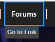

## Go back to the old editor

If you want to go back to the old editor, select Back to classic editor in the header.

> [!div class="mx-imgBorder"]
> 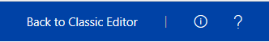

## Test language change in editor

To use multiple languages in the editor, you must have a language pack installed in portal solutions and also enabled it on the portal. Once multiple language is enabled for the portal, you can see the option of language change in header of portal runtime. More information: [Enable multiple languages for a portal](enable-multiple-language-support.md)

After selecting the new language, navigate to the new editor to see content in the portal in the selected language.

> [!div class="mx-imgBorder"]
> 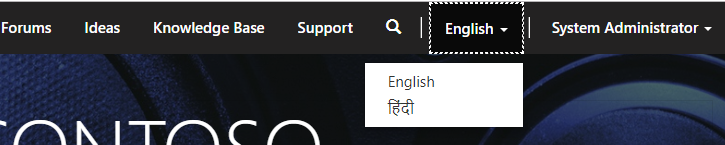

## Known issues

- When you edit the content snippet of the page heading and press the space-bar at the end points of text block, white space is displayed over the page.
- Default font size is not displayed for the selected text.
