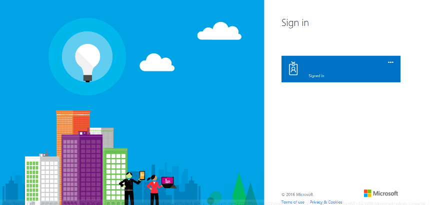
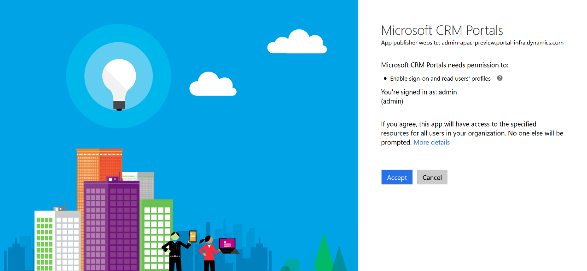
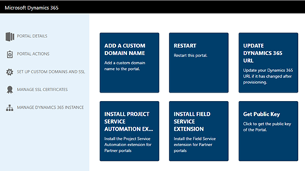
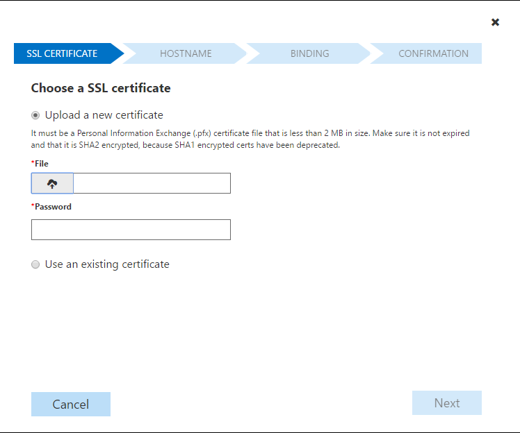

---
title:"Provision a portal for Dynamics 365 | MicrosoftDocs"
description:""
ms.custom:""
ms.date:05/22/2017
ms.service:crm-online
ms.suite:""
ms.tgt_pltfrm:""
ms.topic:article
ms.assetid:1249d87f-6e5e-4ff0-96a9-82978fcbc87c
ms.reviewer:""
author:sbmjais
ms.author:shjais
manager:sakudes
---
# Provision a portal

Applies To: Dynamics 365 (online), Dynamics CRM Online

Portals are websites that you can customize to provide a more personalized experience to your customers, partners, or internal employees. Portals integrate with Dynamics 365 to show data from Dynamics on the portal. By using portals, you can create a variety of experiences where portal users can perform several tasks. For example:

-   Customers can submit cases and find knowledge articles

-   Partners can see and manage sales opportunities

-   Internal employees can create and see best practices

**Note:** You must be a Global Administrator role to provision a portal.

## Before you provision a portal 

You must create portal resources and finish the portal package installation before provisioning a portal.

### Create portal resources

1.  Go to the **Applications** page of the Dynamics 365 Administration Center.

2.  Under **Application**, the portal will have the name of “*Name*-Configuring”.

3.  After this task is finished, this will change to “*Name*”.

### Verify completion of the package installation

1.  Go to the **Applications** page of the Dynamics 365 Administration Center.

2.  Select the portal, and then select the blue pencil button labeled **Manage**.

    1.  If the installation process is not finished, there will be a message at the top stating “This portal is currently being configured and updates are not allowed. Please try again later.”

    2.  If the portal resources are created but the package installation is not finished, the message will instead be “Your Portal URL has been created. However, package installation is still in progress. Please check status here.”

## Provision a portal

To complete provisioning a portal, after you have purchased a new portal license, return to your Dynamics 365 instance.

1.  Go to the Dynamics 365 Administration Center and click the **Applications** tab.

2.  Select the application row titled **Portal Add-On** and click **Manage.**

3.  In the **General Settings** section, enter a **Name** for your portal. The **Name** will help to identify the portal and can be changed later.

4.  The **Type** field represents the type of portal subscription (Trial or Production). This is a system field, so it cannot be changed by the user. The value changes based on if it is trial subscription or paid subscription.

5.  In the **Portal URL** field, enter the subdomain name you want for your portal. You may only use alphanumeric characters or hyphens (-); other characters are not permitted. After the portal is provisioned, the URL cannot be changed, but a custom domain name can be used.

6.  Use the **Dynamics 365 Instance** drop-down list to choose which Dynamics 365 instance you want to link the portal to. Requires System Administrator or System Customizer role in the Dynamics 365 instance you pick to select it.

7.  Choose the default language for your portal from the **Select Portal Language** drop-down list. The available languages will depend on the languages that are installed in your Dynamics 365 instance. Sample data is only provided in one language, so choosing a default language will also decide how the sample data is translated. Arabic and Hebrew are not supported and will not show up.

8.  In the **Select Portal Administrator** drop-down list, select the Dynamics 365 user who will configure, customize, and maintain the portal. All Dynamics 365 users who have the System Administrator role in the organization will show up as options.

9.  In the **Portal Audience** section, choose the type of audience who will visit the new portal. This will determine what options of portals you will be given. You can choose:

-   Partner

    -   Customer Self Service Portal

    -   Custom Portal

    -   Partner Portal

        -   Partner Project Service (Optional, requires solutions installed)

        -   Partner Field Service (Optional, requires solutions installed)

    -   Community Portal

-   Customer

    -   Customer Self Service Portal

    -   Custom Portal

    -   Community Portal

-   Employee

    -   Employee Self Service Portal

| Feature                                | Customer Self-Service Portal | Partner Portal | Employee Self-Service Portal | Community Portal | Custom Portal |
|----------------------------------------|------------------------------|----------------|------------------------------|------------------|---------------|
| World Ready                            | •                            | •              | •                            | •                | •             |
| Multi-Language Support                 | •                            | •              | •                            | •                | •             |
| Portal Administration                  | •                            | •              | •                            | •                | •             |
| Customization and Extensibility        | •                            | •              | •                            | •                | •             |
| Theming                                | •                            | •              | •                            | •                | •             |
| Content Management                     | •                            |                | •                            | •                |               |
| Knowledge Management                   | •                            | •              | •                            | •                |               |
| Support/Case Management                | •                            |                | •                            | •                |               |
| Forums                                 | •                            |                | •                            | •                |               |
| Faceted Search                         | •                            |                | •                            |                  |               |
| Profile Management                     | •                            |                | •                            |                  |               |
| Subscribe to Forum Thread              | •                            |                | •                            |                  |               |
| Comments                               | •                            |                | •                            | •                |               |
| Azure AD Authentication                |                              |                | •                            |                  |               |
| Ideas                                  |                              |                |                              | •                |               |
| Blogs                                  |                              |                |                              | •                |               |
| Project Service Automation Integration |                              | •              |                              |                  |               |
| Field Service Integration              |                              | •              |                              |                  |               |
| Partner Onboarding                     |                              | •              |                              |                  |               |
| Portal Base                            |                              |                |                              |                  | •             |
| Portal Workflows                       |                              |                |                              |                  | •             |
| Web Notifications                      |                              |                |                              |                  | •             |
| Microsoft Identity                     |                              |                |                              |                  | •             |
| Identity Workflows                     |                              |                |                              |                  | •             |
| Web Forms                              |                              |                |                              |                  | •             |
| Feedback                               |                              |                |                              |                  | •             |

10.  In the **Select portal to be deployed** section, choose what type of portal you want to create. The options you see are based on the audience you selected.

      

11.  Click **Submit**, and accept the Terms of Service.

>   
>
> You will be redirected to the Microsoft Office 365 sign in page. Select the Dynamics 365 user that you used to create the portal.
>
>   
>
> You will be asked to provide consent for the Dynamics 365 portals.
>
>   

After you consent, your portal will begin provisioning. Provisioning usually takes a few hours, but can take more depending on system load. The *Name* of the portal on the Application tab will change to “*Name*-Configuring” while it is provisioning. Navigate back to the portal management page to check whether provisioning has succeeded.

## Troubleshoot Provisioning

Sometimes the package installation process or URL creation process can error out. In these cases, the processes can be restarted.

If “*Name*-Configuring” changes to “*Name*-Provisioning Failed,” you need to restart the provisioning process.

1.  Go to the **Applications** page and select the portal.

2.  Select the blue pencil button labeled **Manage**.

3.  Choose one of the following options:

    -   **Restart Provisioning**: Restarts the installation process with the configuration that was previously defined.

    -   **Change Values and Restart Provisioning**: Lets you change some of the values before restarting the provisioning process.

  

If the package installation has failed, the Portal administrator page will open without any issues, but navigating to the actual portal URL will show a message “Getting set up.” To confirm this:

1.  Go to the Solution Management page of the Dynamics 365 Administration Center and check that the package status is “Install Failed.”

2.  If the package status is “Install Failed,” try retrying the installation from the solution page. Also, be sure to check that a system administrator in Dynamics 365 is installing the solution with the default language in Dynamics 365 set to the language the portal should be installed in.

|                                                                 |
|-----------------------------------------------------------------|
|  **Note ** |  

Some solutions have prerequisites for their installation, so an installation will fail if the prerequisites are not met. For example, to install the Partner Field Service for a partner portal, the Partner Portal and Field Service solutions must have already been installed. If you attempt to install the Partner Field Service first, the installation will fail and give you an error message.

## Set up custom domains and SSL certificates for a Dynamics 365 portal

A custom domain can help your customers find your support resources more easily and enhance your brand. Only one custom domain name can be added to a portal. After you have provisioned your portal and acquired your domain name, you will need an SSL certificate to set up a custom host name.

  

1.  Go to the Dynamics 365 Online Admin center and click the **Applications** tab.

2.  Select the name of the portal you want to set up a custom domain for and click **Manage.**

3.  Click on **Portal Actions**.

4.  Click on **Add a Custom Domain Name**

After you have purchased an SSL certificate for your domain, you can use it to link your Dynamics 365 portal to a custom domain using the wizard.

1.  Click **Upload a new certificate** if you have not yet uploaded the .pfx file to the organization. Click the upload button underneath **File** and select the .pfx file. Next enter the password for your SSL certificate in the **Password** field. Otherwise click **Use an existing certificate** and choose the correct certificate from the drop-down menu. Be sure that you are using a SHA2 certificate, SHA1 support is being removed from popular browsers.

2.  Click **Add a new hostname** to create a new custom domain. Enter the desired domain name into the **Domain Name** field. Otherwise, click **Use an existing host name** and choose the desired host name from the drop-down menu. You can only have one custom domain name for a portal.

|  **Note **                                                                                                                                                                                                             |  
|-----------------------------------------------------------------------------------------------------------------------------------------------------------------------------------------------------------------------------------------------------------------------------|
| To create a custom host name, you will need to create a CNAME with your domain provider that points your domain to the URL of your Dynamics 365 portal.                                                                                                                     |
| If you have just added a CNAME with your domain provider, it will take some time to propagate to all DNS servers. If the name is not propagated and you add it here, this will show a message “Plead add a CNAME record to this domain name.” Retry after some time passes. |

3.  Review the information you have entered, then click **Next** to begin creating the SSL Binding.

4.  You should see the message “Custom Domain name has been successfully configured for this Portal. You can now go to {Custom Domain Name} to access this portal.” {Custom Domain Name} will be a hyperlink to the Custom Portal URL that was just configured. Click **Finish** to close the wizard

>   

