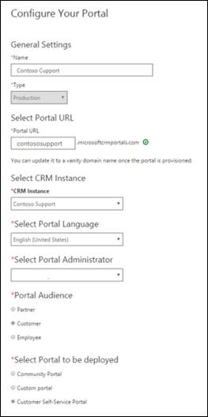
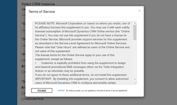
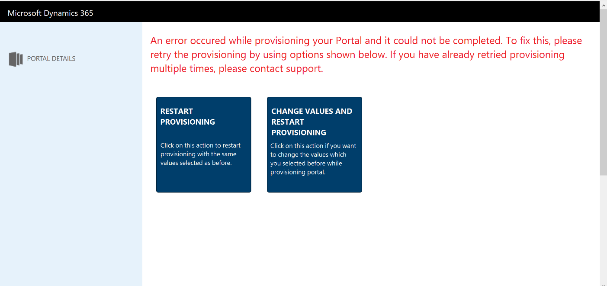

# Provision a portal
Portals are websites that you can customize to provide a more personalized experience to your customers, partners, or internal employees. Portals integrate with [!INCLUDE[pn-dynamics-crm](../includes/pn-dynamics-crm.md)] to show data from [!INCLUDE[pn-dynamics-crm](../includes/pn-dynamics-crm.md)] on the portal. By using portals, you can create a variety of experiences where portal users can perform several tasks. For example:

-   Customers can submit cases and find knowledge articles.
-   Partners can see and manage sales opportunities.
-   Internal employees can create and see best practices.

> [!NOTE]
> - To provision a portal, you must be assigned to the System Administrator role of the [!INCLUDE[pn-dynamics-crm](../includes/pn-dynamics-crm.md)] organization selected for the portal.

To complete provisioning a portal, after you have purchased a new portal license, return to your [!INCLUDE[pn-dynamics-crm](../includes/pn-dynamics-crm.md)] instance.

1.  Go to the [!INCLUDE[pn-crm-online-admin-center](../includes/pn-crm-online-admin-center.md)], and then select the **Applications** tab.
2.  Select the application row titled **Portal Add-On**, and then select **Manage.**
3.  In the **General Settings** section, enter a **Name** for your portal. The **Name** will help to identify the portal and can be changed later.
4.  The **Type** field represents the type of portal subscription (Trial or Production). This is a system field, so it cannot be changed by the user. The value changes based on whether it is trial subscription or paid subscription.
5.  In the **Portal URL** field, enter the subdomain name you want for your portal. You can only use alphanumeric characters or hyphens (-); other characters are not permitted. After the portal is provisioned, the URL cannot be changed, but you can use a custom domain name.
6.  Use the **[!INCLUDE[pn-dynamics-crm](../includes/pn-dynamics-crm.md)] Instance** drop-down list to choose which [!INCLUDE[pn-dynamics-crm](../includes/pn-dynamics-crm.md)] instance you want to link the portal to. Requires System Administrator or System Customizer role in the [!INCLUDE[pn-dynamics-crm](../includes/pn-dynamics-crm.md)] instance you pick to select it.
7.  Choose the default language for your portal from the **Select Portal Language** drop-down list. The available languages will depend on the languages that are installed in your [!INCLUDE[pn-dynamics-crm](../includes/pn-dynamics-crm.md)] instance. 

    >[!NOTE]
    > Sample data is only provided in one language, so choosing a default language will also decide how the sample data is translated. Arabic and Hebrew are not supported and will not appear in the list.

8. In the **Select Portal Administrator** drop-down list, select the [!INCLUDE[pn-dynamics-crm](../includes/pn-dynamics-crm.md)] user who will configure, customize, and maintain the portal. All [!INCLUDE[pn-dynamics-crm](../includes/pn-dynamics-crm.md)] users who have the System Administrator role in the organization will appear as options. 
9. In the **Portal Audience** section, choose the type of audience who will visit the new portal. This will determine what options of portals you will be given. You can choose:

    -   Partner    
        -   Customer Self Service Portal
        -   Custom Portal
        -   Partner Portal
        -   Partner Project Service (Optional, requires solutions installed)
        -   Partner Field Service (Optional, requires solutions installed)
        -   Community Portal
    
    -   Customer
        -   Customer Self Service Portal
        -   Custom Portal
        -   Community Portal
    
    -   Employee
        -   Employee Self Service Portal

The table below summarizes the features associated with each portal option:

| Feature                                | Customer Self-Service Portal | Partner Portal | Employee Self-Service Portal | Community Portal | Custom Portal |
|----------------------------------------|------------------------------|----------------|------------------------------|------------------|---------------|
| World Ready                            | •                            | •              | •                            | •                | •             |
| Multi-Language Support                 | •                            | •              | •                            | •                | •             |
| Portal Administration                  | •                            | •              | •                            | •                | •             |
| Customization and Extensibility        | •                            | •              | •                            | •                | •             |
| Theming                                | •                            | •              | •                            | •                | •             |
| Content Management                     | •                            |                | •                            | •                |               |
| Knowledge Management                   | •                            | •              | •                            | •                |               |
| Support/Case Management                | •                            |                | •                            | •                |               |
| Forums                                 | •                            |                | •                            | •                |               |
| Faceted Search                         | •                            |                | •                            |                  |               |
| Profile Management                     | •                            |                | •                            |                  |               |
| Subscribe to Forum Thread              | •                            |                | •                            |                  |               |
| Comments                               | •                            |                | •                            | •                |               |
| [!INCLUDE[pn-azure-shortest](../includes/pn-azure-shortest.md)] AD Authentication                |                              |                | •                            |                  |               |
| Ideas                                  |                              |                |                              | •                |               |
| Blogs                                  |                              |                |                              | •                |               |
| Project Service Automation Integration |                              | •              |                              |                  |               |
| Field Service Integration              |                              | •              |                              |                  |               |
| Partner Onboarding                     |                              | •              |                              |                  |               |
| Portal Base                            |  •                           | •              |  •                           | •                | •             |
| Portal Workflows                       |  •                           | •              |  •                           | •                | •             |
| Web Notifications                      |  •                           | •              |  •                           | •                | •             |
| [!INCLUDE[cc-microsoft](../includes/cc-microsoft.md)] Identity                     |     •                         |  •              |     •                         |   •               | •             |
| Identity Workflows                     | •                            |  •             |     •                         |   •               | •             |
| Web Forms                              |  •                            | •               |    •                          | •                 | •             |
| Feedback                               |   •                           |  •              |  •                            | •                 | •             |
||
10. In the **Select portal to be deployed** section, choose what type of portal you want to create. The options you see are based on the audience you selected.

      

11. Select **Submit**, and accept the Terms of Service.

      

After you accept the Terms of Service, the portal will begin provisioning. Provisioning usually takes 30 minutes but can take a few hours depending on the system load. The *Name* of the portal on the Application tab will change to "*Name*-Configuring" while it is provisioning. Navigate back to the portal management page to check whether provisioning has succeeded.

> [!Note]
> When a portal user signs in to the portal for the first time by using an Azure AD credential, a consent page is displayed to all users irrespective of the user or portal type.

## Troubleshoot provisioning

Sometimes the package installation process or URL creation process can error out. In these cases, the processes can be restarted.

If "*Name*-Configuring" changes to "*Name*-Provisioning Failed," you need to restart the provisioning process.

1. Go to the **Applications** page, and select the portal.
2. Select the blue pencil button labeled **Manage**.
3. Choose one of the following options:

    -   **Restart Provisioning**: Restarts the installation process with the configuration that was previously defined.

    -   **Change Values and Restart Provisioning**: Lets you change some of the values before restarting the provisioning process.

      

If the package installation has failed, the portal administrator page will open without any issues, but navigating to the actual portal URL will show a message "Getting set up." To confirm this:

1. Go to the Solution Management page of the [!INCLUDE[pn-crm-online-admin-center](../includes/pn-crm-online-admin-center.md)] and check that the package status is **Install Failed**. 
2. If the package status is **Install Failed**, try retrying the installation from the solution page. Also, be sure to check that a system administrator in [!INCLUDE[pn-dynamics-crm](../includes/pn-dynamics-crm.md)] is installing the solution with the default language in [!INCLUDE[pn-dynamics-crm](../includes/pn-dynamics-crm.md)] set to the language the portal should be installed in.

> [!Note]
> Some solutions have prerequisites for their installation, so an installation will fail if the prerequisites are not met. For example, to install the Partner Field Service for a partner portal, the Partner Portal and Field Service solutions must have already been installed. If you attempt to install the Partner Field Service first, the installation will fail and give you an error message.
