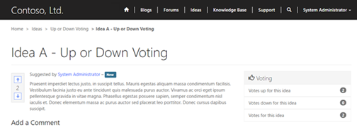

# Rate or vote on a webpage or blog post on a portal

Applies To: Dynamics 365 (online), Dynamics CRM Online

Ratings provides users with the ability to rate or vote on a webpage or [blog post](manage-blogs.md). Ratings can also be enabled for comments on pages or blog posts. By default, this feature is disabled and can be enabled on a page-by-page basis within Dynamics 365.  

Ratings are custom Dynamics 365 activities and thus can be used in the same way as any other activity such as emails, phone calls, and so on. Because Ratings are activities, it is possible, with customization, to have ratings appear for any entity you choose that appears and is rendered on the portal, including custom entities.

## Enable page ratings

1.  Login to **Dynamics 365.**

<!-- -->

1.  Navigate to **Portals.**

2.  Click **Web Pages.**

3.  Double-click on the desired **Web Page** listed in the grid.

4.  Set **Enable Ratings** to **Yes.**

5.  Click **Save & Close.**

Enabling Ratings for blog posts works in much the same way.

## Use ratings

For webpages that have page ratings enabled and the developer has applied the control to the template, users can rate the page either by using the rating scale or voting, depending on the type chosen when the control was added to the page template.

### Rating Type

  

### Vote Type

  

## Manage ratings in Dynamics 365

The ratings for webpages can be viewed, modified, or deleted within Dynamics 365.

1.  Login to **Dynamics 365.**

<!-- -->

1.  Navigate to **the Web page, Blog Post, Page Comment, or Blog Post Comment** that you are interested in seeing the ratings for.

2.  Navigate to **Activities.**

The associated view lists the ratings for the selected webpage, blog post, or idea. Within this view, users can modify or delete existing ratings.

### See Also

[Configure a Dynamics 365 portal](configure-portal.md)  
[Add a webpage to render a list of records](add-webpage-render-list-records.md)  
[Create and run advertisements on a portal](create-run-advertisement.md)  
[Gather feedback by using polls on a portal](gather-feedback-poll.md)  
[Redirect to a new URL on a portal](add-redirect-url.md)  

