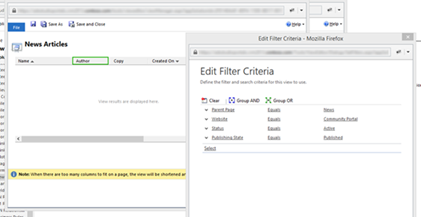
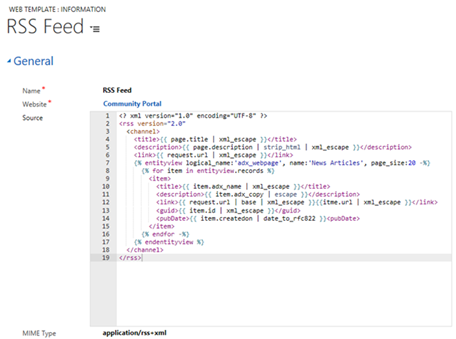
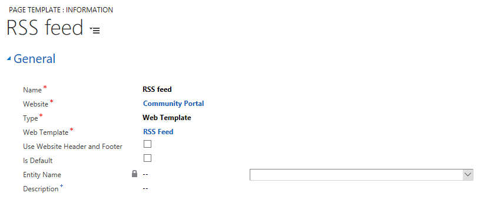
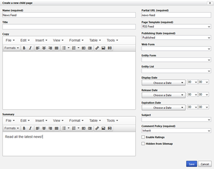
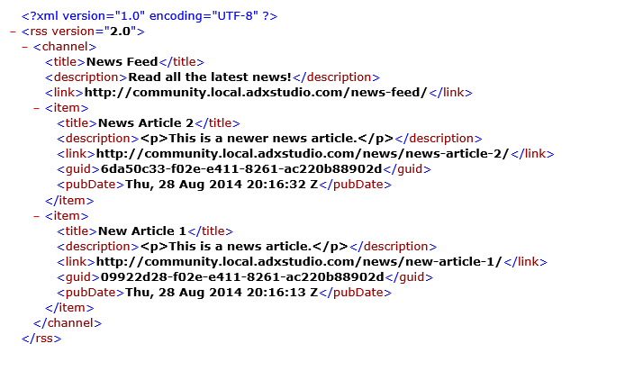

# Create a custom page template to render an RSS feed
In this example, we'll create a custom page template to render an [RSS feed](http://en.wikipedia.org/wiki/RSS) of news articles, using Liquid and a Web Template Page Template. [!INCLUDE[proc-more-information](../includes/proc-more-information.md)] [Store source content by using web templates](store-content-web-templates.md)  

First, we'll create a new [!INCLUDE[pn-dynamics-crm](../includes/pn-dynamics-crm.md)] view that we'll use to load the data for our feed. In this example, we'll make it a view on Web Pages, and use this entity to store our articles. We can use this view to configure the sorting and filtering of results, and include as columns the entity attributes that we want available in our Liquid template.

  

Next, we'll create a Web Template for our RSS feed. This template will be applied to a particular webpage in our website, so we'll use the title and summary of that page as the title and description of the feed. The we'll use the entityview tag to load our newly-created "News Articles" view. [!INCLUDE[proc-more-information](../includes/proc-more-information.md)] [*[!INCLUDE[pn-dynamics-crm](../includes/pn-dynamics-crm.md)] entity tags*](#dynamics-365-entity-tags). Note that we also set the **MIME Type** field of the Web Template to application/rss+xml. This indicates what the response content type could be when our template is rendered.  

  

Now, we'll create a new page template, allowing us to assign our RSS feed template to any webpage in our website. Note that we deselect **Use Website Header and Footer**, as we want to take over rendering of the entire page response for our feed.

  

Now all that's left is to create a new Web Page to host our feed, giving it a title and summary, and assigning it our "RSS Feed" template. We can do this in [!INCLUDE[pn-dynamics-crm](../includes/pn-dynamics-crm.md)] or by using the portal inline editing features:

  

Now, when we request this new webpage, we'll receive our RSS feed XML:

  

In this example, we've seen how we can combine Liquid, Web Templates, [!INCLUDE[pn-dynamics-crm](../includes/pn-dynamics-crm.md)] views, and portals content management features to create a custom RSS feed. The combination of these features adds powerful customization capabilities to any portal application.

### See also

[Create advanced templates for portals](create-advanced-templates.md)  
[Create a custom page template by using Liquid and a web template page template](create-custom-template.md)  
[Render the entity list associated with the current page](render-entity-list-current-page.md)  
[Render a website header and primary navigation bar](render-site-header-primary-navigation.md)  
[Render up to three levels of page hierarchy by using hybrid navigation](hybrid-navigation-render-page-hierachy.md)  

