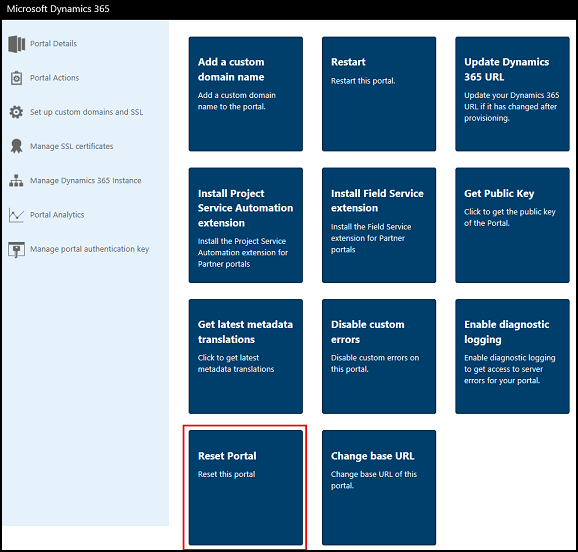
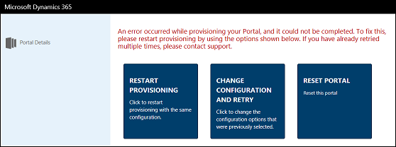
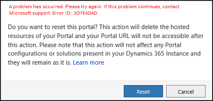
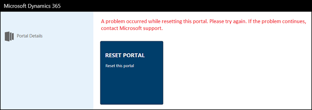

# Reset a portal

Once a portal is provisioned, there are certain conditions when you want to delete resources of your portal like when you move your Dynamics 365 organization to another tenant or to another data center or if you want to remove portal from your organization.

To do this, you can reset your portal which will delete all the hosted resources associated with your portal, so you can provision the portal again. Once the reset operation is finished, your portal URL will not be accessible anymore.

It is important to note that resetting your portal doesn’t remove portal configuration or solutions present in your Dynamics 365 instance and they will remain as it is.

You can reset a completely configured portal, or if portal provisioning or update of Dynamics 365 instance has failed.

To reset a configured portal:

1.	Go to the Dynamics 365 Administration Center page and select the **Applications** tab.

2.	Select the name of the portal that you want to reset, and then select **Manage**.

3.	Go to **Portal Actions** > **Reset Portal**.

    

4.	Select **Reset** in the confirmation window.

> [!NOTE]
> - If you don't have appropriate permissions on associated Azure Active Directory application, an error is displayed. You must contact global administrator for the appropriate permissions.
> - When the portal is reset successfully, the portal name and its status on the **Application** tab in Dynamics 365 Administration Center does not change. For example, if your portal name and status were Portal 1 and Configured respectively, then after resetting the portal, these values do not change. If you want to change the portal name, you can change it on the **Portals Details** tab in Portal Admin Center. However, the status value cannot be reverted to Not Configured.

> It is important to note that the portal's status on the **Application** tab does not represent its provisioning status and does not affect the functioning of your portal. It just represents if you have ever accessed Portal Admin center for that corresponding portal or not.

If your portal is not provisioned correctly, it goes in an error state and the following screen is displayed. In this case, you can also reset the portal by selecting **Reset Portal** on the error screen.

## Troubleshooting

This section provides information about troubleshooting issues while resetting a portal.

### Reset request could not be submitted

If a portal reset request could not be submitted, an error is displayed as shown in the below image. In this case, you must close and reopen the Portal Admin Center, and try to reset the portal again. If the issue persists, contact Microsoft support.

### Reset portal job fails

If a reset portal job fails, an error message is displayed along with the **Reset Portal** action.

Typically, these are transient errors and you must select **Reset Portal** to restart the job. If the issue persists, contact Microsoft support.

