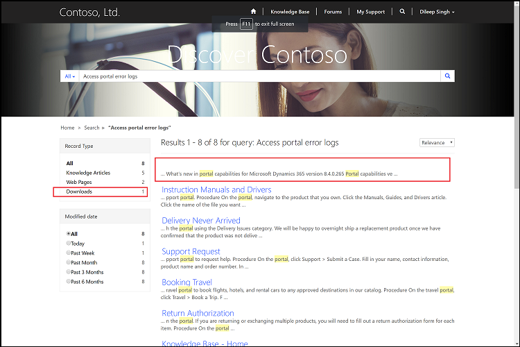

# Search within file attachment content

You can use the [!INCLUDE[pn-dynamics-crm](../includes/pn-dynamics-crm.md)] notes attachment to include downloadable files in knowledge base articles. You can also use web files to create an FAQ page with downloadable content.

You can configure your portal to allow portal users to search within the attachment content (knowledge base articles and web files). This helps users to find the information that they're looking for.

In knowledge base articles, any notes attachment with the defined prefix are indexed. In web files, the latest notes attachment are indexed.

To index the attachments, you must create the following site settings and set their value to **True**:

|Site setting|Description|
|------------|-----------|
|Search/IndexNotesAttachments|Indicates whether the content of notes attachments in  knowledge base articles and web files should be indexed. By default, it is set to **False**.|
|KnowledgeManagement/DisplayNotes|Indicates whether to index attachments of knowledge base articles. By default, it is set to **False**.|
|||

When you search for a term, the search results also include attachments. If the search term matches a notes attachment, the link to the corresponding knowledge base article is also provided. To see downloadable attachments, select **Downloads** under **Record Type** in the left pane. To modify the **Downloads** label, edit the Search/Facet/Downloads content snippet. By default, the value is set to **Downloads**.

 

> [!NOTE]
> - To use this functionality, you must [enable relevance search](https://docs.microsoft.com/en-us/dynamics365/customer-engagement/admin/configure-relevance-search-organization) in [!INCLUDE[pn-dynamics-crm](../includes/pn-dynamics-crm.md)]. More information: [Relevance search](https://docs.microsoft.com/en-us/dynamics365/customer-engagement/basics/relevance-search-results)
> - For the search to function within attachments, the [!INCLUDE[pn-dynamics-crm](../includes/pn-dynamics-crm.md)] version must be 9.0.1.x or later.
 
## Update portal configurations

If you already have a portal before April 2018 and you have upgraded your portal to the latest version, you must use the following configurations to have the same user experience as a new portal installation.

**Content Snippets**

To modify the label displayed in the search results for annotation and web file downloads, create a content snippet Search/Facet/Downloads, and then set its value as required. The default value is **Downloads**.

**Web Files**

The content of file attachments associated with web files can now be indexed. You can update existing web files for CSS files and image files (for example, bootstrap.min.css, theme.css, and homehero.jpg) to be excluded from search. 

1. Go to **Portals** > **Web Files**.
2. Open the file to be excluded from search.
3. Under **Miscellaneous**, select **Yes** in the **Exclude From Search** field.

**Web Templates**

The Faceted Search - Results Template web template is revised to display files associated with knowledge base articles as primary search result items with a related article link. You must update the Faceted Search - Results Template web template to the following source:

```



  <script id="search-view-results" type="text/x-handlebars-template">
   {{#if items}}
    <div class="page-header">
     <h3>{{openTag}} stringFormat "{{ resx.Search_Results_Format_String }}" firstResultNumber lastResultNumber itemCount {{closingTag}}
      <em class="querytext">{{{query}}}</em>
      {{#if isResetVisible}}
       <a class="btn btn-default btn-sm facet-clear-all" role="button" title="{{ snippets['Search/Facet/ClearConstraints'] | default: res['Search_Filter_Clear_All'] }}" tabIndex="0">{{ snippets['Search/Facet/ClearConstraints'] | default: res['Search_Filter_Clear_All'] }}</a>
      {{/if}}
     </h3>
    </div>
   <ul>
    {{#each items}}
     <li>
      <h3><a title="{{title}}" href="{{url}}">{{#if parent}}<span class="glyphicon glyphicon-file pull-left text-muted" aria-hidden="true"></span>{{/if}}{{title}}</a></h3>
      <p class="fragment">{{{fragment}}}</p>
      {{#if parent}}
       <p class="small related-article">{{ resx.Related_Article }}: <a title="{{parent.title}}" href="{{parent.absoluteUrl}}">{{parent.title}}</a></p>
      {{/if}}
      <ul class="note-group small list-unstyled">
       {{#if relatedNotes}}
        {{#each relatedNotes}}
         <li class="note-item">
         {{#if isImage}}
          <a target="_blank" title="{{title}}" href="{{absoluteUrl}}"><span class="glyphicon glyphicon-file" aria-hidden="true"></span>&nbsp;{{title}}</a>
         {{else}}
          <a title="{{title}}" href="{{absoluteUrl}}"><span class="glyphicon glyphicon-file" aria-hidden="true"></span>&nbsp;{{title}}</a>
         {{/if}}
         <p class="fragment text-muted">{{{fragment}}}</p>
         </li>
        {{/each}}
        {{/if}}
      </ul>
     </li>
    {{/each}}
   </ul>
   {{else}}
    <h2>{{ resx.Search_No_Results_Found }}<em class="querytext">{{{query}}}</em>
     {{#if isResetVisible}}
      <a class="btn btn-default btn-sm facet-clear-all" role="button" title="{{ snippets['Search/Facet/ClearConstraints'] | default: res['Search_Filter_Clear_All'] }}" tabIndex="0">{{ snippets['Search/Facet/ClearConstraints'] | default: res['Search_Filter_Clear_All'] }}</a>
     {{/if}}
    </h2>
   {{/if}}
  </script>

```

**Site Settings**

You must add `\_logicalname:annotation~0.9^0.25` value to the Search/Query site setting. After it's added, the value should be as follows:
```
+(@Query) \_title:(@Query) \_logicalname:knowledgearticle~0.9^0.3 \_logicalname:annotation~0.9^0.25 \_logicalname:adx_webpage~0.9^0.2 -\_logicalname:adx_webfile~0.9 adx_partialurl:(@Query) \_logicalname:adx_blogpost~0.9^0.1 -\_logicalname:adx_communityforumthread~0.9
```

To configure the facets to group annotations associated with knowledge base articles and web files in a single facet, edit the Search/RecordTypeFacetsEntities site setting name and append `;Downloads:annotation,adx_webfile` to its value.

To allow attachments associated with knowledge articles to appear in the portal and search results, edit the KnowledgeManagement/DisplayNotes site setting and set its value to **True**. The site setting KnowledgeManagement/NotesFilter contains a prefix value that must be prefixed to the note text field on notes; only notes with the specified prefix value will appear on the portal. By default, the value is \*WEB\*, but you can change it through the site setting.

To enable the indexing of file attachments associated with notes, create the Search/IndexNotesAttachments site setting and set its value to **True**.
