# Search

In [!INCLUDE[pn-dynamics-crm](../includes/pn-dynamics-crm.md)] Portal, you can search for records across multiple entities by using portal’s global search functionality. You can also search within records of entity list using entity list search functionality. 

Entity list search functionality in portal uses FetchXML in the backend to search the columns defined in entity list and then display results. 

Global search uses an external search index which is based on Lucene.Net and is used to search within multiple entities and fields at once.

# Global search

Global search of Dynamics 365 Portal allows you to search for records across multiple entities. It also allows you to search across multiple columns and configure what columns of an entity would be searchable.

A few benefits of global search are:
- Finds matches to any word in the search term in any field in the entity. Matches can include inflectional words like stream, streaming, or streamed.
- Returns results from all searchable entities in a single list sorted by relevance, based on factors like number of words matched, or their proximity to each other in the text.
- Highlights matches in the search results.
- Provides facet options which can be used to filter down search results further.

In global search, the better the match, the higher it appears in the results. A match has a higher relevancy if more words from the search term are found in close proximity to each other. The smaller the amount of text where the search words are found, the higher the relevancy. For example, if you find the search words in a company name and address, it might be a better match than the same words found in a large article, far apart from each other. Because the results are returned in a single list, you can see a mix of records displayed one after another and matched works are highlighted. 

Below are the details of how global search works in Dynamics 365 Portal and various configuration options available.

## Entities searchable in portal global search

The following entities can be searched within a portal website provided the appropriate solution packages have been installed and search has been added to a portal. The columns that are indexed will consist of the columns found in the Portals Search view, which can be customized.  Each entity in the list has its default set of attributes indexed as listed below:
- Knowledge Article
    - Notes and attachment of a knowledge article are searchable as well. More information: [Search within file attachment content](search-file-attachment.md)
    - Only those articles are searchable which are published, and the Internal Only field is set to false.
- Blog 
- Blog Post 
- Blog Post Comment 
- Forum 
- Forum Post 
- Forum Thread 
- Idea 
- Idea Comment 
- Idea Forum 
- Web File 
    - Attachment content of web files are searchable as well. More information: [Search within file attachment content](search-file-attachment.md)
- Web Page 
- Incident 

> [!NOTE]
> Apart from the entities listed above, no other entity can be enabled for global search in a portal.

## Fields searchable in global search

All the fields available in the view defined by the Search/IndexQueryName site setting for any entity are indexed in global search and are searchable. 
Default value for Search/IndexQueryName is “Portal Search”.

If the view is not available for any entity, it is not indexed, and the results are not displayed in global search.

> [!NOTE]
> If you change the value of Search/IndexQueryName site setting, you need to trigger a manual re-index of the build using steps defined in How to rebuild full search index?

## Related site settings

Following site settings are related to global search:

| Name    | Default Value     | Description       |
|-----------------------|--------------------|-------------|
| Search/Enabled | true  | A Boolean value that indicates whether search is enabled or not. If you set its value to false, global search in portal is turned off. If you are using out-of-the-box web templates and you turn this setting off, the search box will not be displayed in header as well as on the search page. Also, no results are returned even if direct URL for search page is hit.  |
| search/filters  | Content:adx_webpage;Events:adx_event,adx_eventschedule;Blogs:adx_blog,adx_blogpost,adx_blogpostcomment;Forums:adx_communityforum,adx_communityforumthread,adx_communityforumpost;Ideas:adx_ideaforum,adx_idea,adx_ideacomment;Issues:adx_issueforum,adx_issue,adx_issuecomment;Help Desk:incident | A collection of search logical name filter options. Defining a value here will add drop-down filter options to global search. This value should be in the form of name/value pairs, with name and value separated by a colon, and pairs separated by a semicolon. For example: "Forums:adx_communityforum,adx_communityforumthread,adx_communityforumpost;Blogs:adx_blog,adx_blogpost,adx_blogpostcomment".  |
| Search/IndexQueryName   | Portal Search  | The name of the system view used by the portal search query to define the fields of an entity enabled which are indexed and searched.   |
| search/query  | +(@Query) _title:(@Query) _logicalname:adx_webpage~0.9^0.2 -_logicalname:adx_webfile~0.9 adx_partialurl:(@Query) _logicalname:adx_blogpost~0.9^0.1 -_logicalname:adx_communityforumthread~0.9   | This setting adds additional weights and filters to the query which a user enters in the default search box which is displayed on portal. In the default value, @Query is the query text entered by a user. For information on how to modify this value, follow [Lucene query syntax](http://lucene.apache.org/core/old_versioned_docs/versions/2_9_1/queryparsersyntax.html). **Note**: It is important to note that this weighting and filtering only applies to the search box which comes in default search page of the portal. If you are using liquid search tag to create your own search page, then this setting doesn’t apply. |
| Search/Stemmer  | English    | The language used by the portal search's stemming algorithm.   |
| Search/FacetedView  | True   | This enables facets in the search results. When set to True, facets will be shown along with results on the search page.  |
| Search/IndexNotesAttachments   | True    | Indicates whether the content of notes attachments in knowledge base articles and web files should be indexed. By default, it is set to False. More information: [Search within file attachment content](search-file-attachment.md)    |
| Search/RecordTypeFacetsEntities  | Blogs:adx_blog,adx_blogpost;Forums:adx_communityforum,adx_communityforumthread,adx_communityforumpost;Ideas:adx_ideaforum,adx_idea;Downloads:annotation,adx_webfile    | This determines how the entities are grouped in Record Type facet on Search page. This setting is in the format  “DisplayNameinRecordTypeFacet1:logicalnameofentity1,logicalnameofentity2; DisplayNameinRecordTypeFacet2:logicalnameofentity3,logicalnameofentity4”  Display Name in Record Type facet will appear on the UI. This facet group will combine the result of the entities defined in the configuration.   |
| KnowledgeManagement/DisplayNotes | True   | Indicates whether to index attachments of knowledge base articles. By default, it is set to False. |
|||

## Related content snippets

Following content snippets are related to global search:

| Name   | Default Value  | Description   |
|------------------|-----------------|--------------------|
| Header/Search/FilterLabel| Search Filter| |
| Header/Search/Label| Search| This content snippet determines the watermark text shown in the search box in portal header. 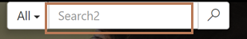    |
| Header/Search/ToolTip| Search  | This content snippet determines the tooltip text shown when you hover over search icon in portal header. 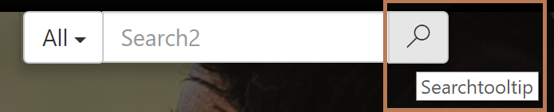  |
| Search/Default/FilterText| All   | This content snippet determines the default text shown in the filter drop-down list next to the search box. 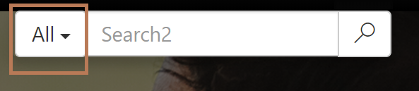  |
| Search/Facet/All| All| This content snippet determines the default text shown for “all records facet” in the “Record Type” facet of search result page. 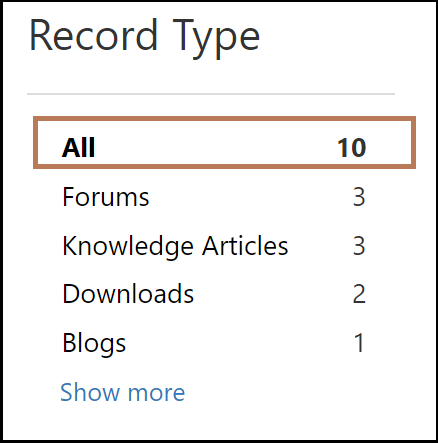 |
| Search/Facet/ClearConstraints   | Clear All  | This content snippet determines the label of the button which resets all the facets applied in the search results page. 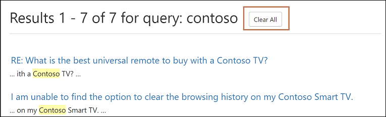 |
| Search/Facet/Downloads   | Downloads   | This content snippet determines the label displayed in search results of annotation attachments and web file records in “Record Type” facet. 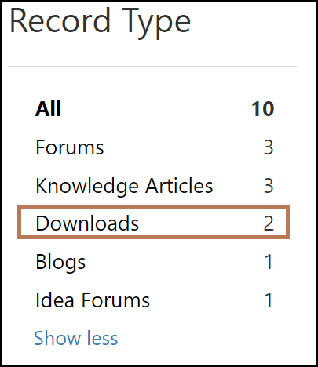|
| Search/Facet/Less    | Show less  | This content snippet determines the label of the button which collapses facet results. 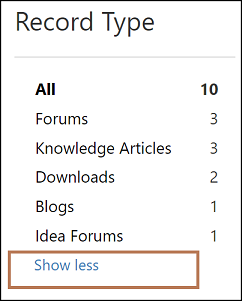 |
| Search/Facet/ModifiedDate  | Modified date  | This content snippet determines the label of the header shown for the Modified date facet. 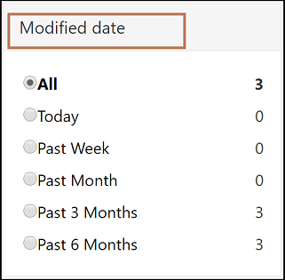   |
| Search/Facet/More   | Show more  | This content snippet determines the label of the button which expands facet results. 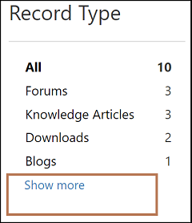  |
| Search/Facet/Product  | Products | This content snippet determines the label of the Products facet. 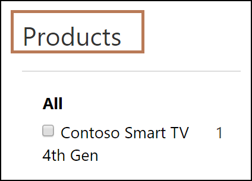  |
| Search/Facet/Rating   | Rating   | This content snippet determines the label of the Rating facet. 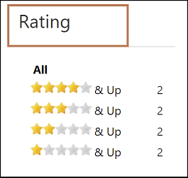  |
| Search/Facet/RecordType   | Record Type | This content snippet determines the label of the Record Type facet. 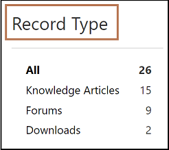     |
| Search/Facet/SortOrder/AverageUserRating | Average User Ratings | This content snippet determines the label shown for the “Sort by Average User Ratings” option in the sorting drop-down list on the Search Results page. 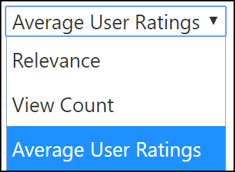  |
| Search/Facet/SortOrder/Relevance| Relevance| This content snippet determines the label shown for the “Sort by Relevance” option in the sorting drop-down list on the Search Results page. 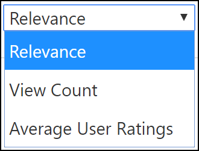|
| Search/Facet/SortOrder/Views| View Count| This content snippet determines the label shown for the “Sort by View Count” option in the sorting drop-down list on the Search Results page. 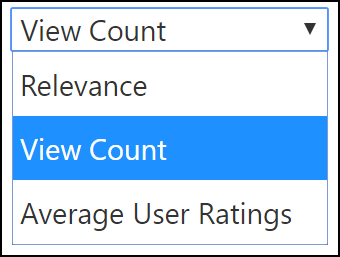|
|||