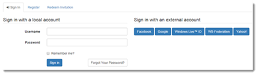
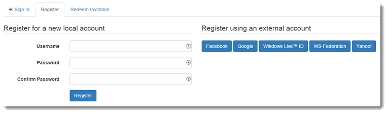
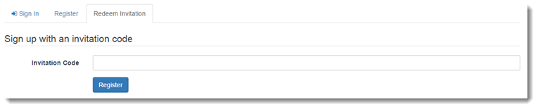
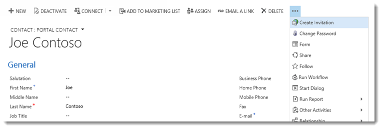
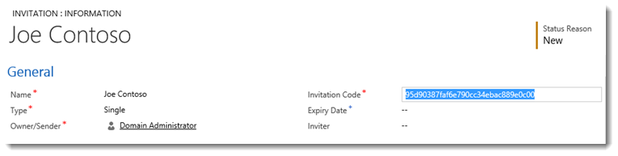
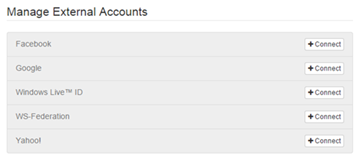

# Set authentication identity for a portal
[comment]: <> (verify and fix images)

Portal capabilities for [!INCLUDE[pn-microsoftcrm](../includes/pn-microsoftcrm.md)] provides authentication functionality built on the [ASP.NET Identity](http://www.asp.net/identity) API. ASP.NET Identity is in turn built on the [OWIN](http://www.asp.net/aspnet/overview/owin-and-katana) framework, which is also an important component of the authentication system. The services provided include:

- Local (username/password) user sign-in
- External (social provider) user sign-in through third party identity providers
- Two-factor authentication with email or SMS
- Email address confirmation
- Password recovery
- Invitation code sign-up for registering pre-generated contact records

## Requirements

Portal capabilities for [!INCLUDE[pn-microsoftcrm](../includes/pn-microsoftcrm.md)] requires

- [!INCLUDE[pn-microsoftcrm](../includes/pn-microsoftcrm.md)] Portal Base
- [!INCLUDE[cc-microsoft](../includes/cc-microsoft.md)] Identity
- [!INCLUDE[cc-microsoft](../includes/cc-microsoft.md)] Identity Workflows solution packages

## Authentication overview

Returning portal visitors have the option to authenticate using local user credentials and/or external identity provider accounts. A new visitor can register for a new user account either by providing a username/password or by signing-in through an external provider. Visitors who are sent an invitation code (by the portal administrator) have the option to redeem the code in the process of signing-up for a new user account.

**Related Site Settings:**

- `Authentication/Registration/Enabled`
- `Authentication/Registration/LocalLoginEnabled`
- `Authentication/Registration/ExternalLoginEnabled`
- `Authentication/Registration/OpenRegistrationEnabled`
- `Authentication/Registration/InvitationEnabled`
- `Authentication/Registration/RememberMeEnabled`
- `Authentication/Registration/ResetPasswordEnabled`

### Sign-in with a local identity or external identity

  

### Sign-up with a local identity or external identity

  

### Redeem an invitation code manually

  

## Forgot password or password reset 

Returning visitors who require a password reset (and have previously specified an email address on their user profile) have the option of requesting a password reset token to be sent to their email account. A reset token allows its owner to choose a new password. Alternatively, the token can be abandoned, leaving the user’s original password unmodified.

**Related Site Settings:**

- `Authentication/Registration/ResetPasswordEnabled`
- `Authentication/Registration/ResetPasswordRequiresConfirmedEmail`

**Related Processes:**

- Send Password Reset To Contact
- Customize the email in the workflow as necessary
- Submit email to invoke process
- Visitor prompted to check email
- Process: Send Password Reset To Contact
- Password reset email with instructions
- Visitor returns to the reset form
- Password reset complete

## Redeem an invitation

Redeeming an invitation code allows a registering visitor to be associated to an existing contact record that was prepared in advance specifically for that visitor. Typically, the invitation codes are sent out by email but a general code submission form is available for codes sent though other channels. After a valid invitation code is submitted, the normal user registration (sign-up) process takes place to setup the new user account. [!INCLUDE[proc-more-information](../includes/proc-more-information.md)] [Register and invite for a portal](register-invite.md).  

**Related Site Settings:**

`Authentication/Registration/InvitationEnabled`

**Related Processes:**

### Send Invitation
The email sent by this workflow must be customized with the URL to the redeem invitation page on the portal: http://portal.contoso.com/register/?returnurl=%2f&invitation={Invitation Code(Invitation)}

### Create invitation for a new contact

  

### Customize and save the new invitation

  

### Send Invitation

1. Customize the invitation email 
2. Invitation email opens the redemption page
3. Sign-up using the submitted invitation code

      

## Manage user accounts through profile pages

Authenticated users manage their user accounts through the Security navigation bar of the profile page. Users are not limited to the single local account or single external account chosen at user registration time. Users with an external account may choose to create a local account by applying a username and password. Otherwise, users who started with a local account can choose to associate multiple external identities to their account. The profile page is also where the user is reminded to confirm their email address by requesting a confirmation email to be sent to their email account.

**Related Site Settings:**

- `Authentication/Registration/LocalLoginEnabled`

- `Authentication/Registration/ExternalLoginEnabled`

- `Authentication/Registration/TwoFactorEnabled`

- `Authentication/Registration/MobilePhoneEnabled`

## Set or change a password

A user with an existing local account can apply a new password by providing the original password. A user without a local account can choose a username and password to set up a new local account. The username cannot be changed after it is set.

**Related Site Settings:**

`Authentication/Registration/LocalLoginEnabled`

- Create a username and password
- Change an existing password

## Change or confirm an email address

Changing an email address (or setting it for the first time) puts it into an unconfirmed state. The user can request a confirmation email to be sent to the new email address, including instructions on completing the email confirmation process.

**Related Processes:**

### Send Email Confirmation To Contact
1. Customize the email in the workflow as necessary. 
2. Submit a new email (unconfirmed).
3. Check email for confirmation

### Send Email Confirmation To Contact
1. Customize the confirmation email
2.  Click the confirmation link to complete

## Change or confirm mobile phone

Changing the mobile phone value occurs slightly differently from changing the email. The new value is held in a temporary storage without changing the original value. An SMS message containing a security code is sent to the new mobile phone number. Only after the security code is submitted back to the portal (and verified) is the old mobile number replaced with the new value.

**Related Processes:**

`Authentication/Registration/MobilePhoneEnabled`

**Related Processes:**

### Send Sms Confirmation To Contact

>[!Note] 
> The workflow for this process contains a temporary step that sends the security code by email. This is a placeholder step that needs to be replaced by a new step capable of sending SMS messages.

1. Submit new mobile phone (unconfirmed)
2. Wait for SMS with security code

### Send Sms Confirmation To Contact

1. Replace this email step with SMS step.
2. After submitting a valid security code

## Enable two-factor authentication

The two-factor authentication feature increases user account security by requiring proof of ownership of a confirmed email or mobile phone in addition to the standard local/external account sign-in. A user trying to sign into an account with two-factor authentication enabled is sent a security code to the confirmed email or mobile phone associated to their account. The security code must be submitted to complete the sign-in process. A user can choose to remember the browser that successfully passes the verification such that the security code is not required for subsequent sign-ins from the same browser.

Each user account enables this feature individually and requires either a confirmed email or confirmed mobile phone. User accounts with both may choose which method to receive the security code.

**Related Site Settings:**

- `Authentication/Registration/TwoFactorEnabled`
- `Authentication/Registration/RememberBrowserEnabled`

**Related Processes:**

### Send Email Two Factor Code To Contact

1. Send SMS two-factor code To Contact
2. Enable two-factor authentication
3. Choose to receive security code by email or SMS
4.  Wait for email/SMS with security code

Process: Send Email Two Factor Code To Contact

Process: Send Sms Two Factor Code To Contact

5.  Two-factor authentication can be disabled

## Manage external accounts

An authenticated user may connect (register) multiple external identities to their user account one from each of the configured identity providers. After the identities are connected, the user may choose to sign in with any of the connected identities. Existing identities can also be disconnected, as long as a single external or local identity remains.

**Related Site Settings:**

Authentication/Registration/ExternalLoginEnabled

-   External Identity Provider Site Settings

1.  Select a provider to connect

      

2.  Sign-in with provider to connect
3.  Provider is connected
4.  Provider can be disconnected

## Enable ASP.NET identity authentication

The following describes the settings for enabling/disabling various authentication features and behaviors:

| Site Setting Name                                               | Description                                                                                                                                                                                                                                                                                                                                                                                                                                                                                                                                              |
|-----------------------------------------------------------------|----------------------------------------------------------------------------------------------------------------------------------------------------------------------------------------------------------------------------------------------------------------------------------------------------------------------------------------------------------------------------------------------------------------------------------------------------------------------------------------------------------------------------------------------------------|
| Authentication/Registration/LocalLoginEnabled                   | Enables or disables local account sign-in based on a username (or email) and password. Default: false                                                                                                                                                                                                                                                                                                                                                                                                                                                    |
| Authentication/Registration/LocalLoginByEmail                   | Enables or disables local account sign-in using an email address field instead of a username field. Default: false                                                                                                                                                                                                                                                                                                                                                                                                                                       |
| Authentication/Registration/ExternalLoginEnabled                | Enables or disables external account sign-in and registration. Default: true                                                                                                                                                                                                                                                                                                                                                                                                                                                                             |
| Authentication/Registration/RememberMeEnabled                   | Enables or disables a "Remember Me?" checkbox on local sign-in to allow authenticated sessions to persist even when the web browser is closed. Default: true                                                                                                                                                                                                                                                                                                                                                                                             |
| Authentication/Registration/TwoFactorEnabled                    | Enables or disables the option for users to enable two-factor authentication. Users with a confirmed email address or confirmed mobile number can opt into the added security of two-factor authentication. Default: false                                                                                                                                                                                                                                                                                                                               |
| Authentication/Registration/MobilePhoneEnabled                  | Enables or disables the option to add and confirm a mobile phone number. When enabled, it is also necessary to update the Send Sms Confirmation To Contact process in [!INCLUDE[pn-dynamics-crm](../includes/pn-dynamics-crm.md)] such that the workflow is able to send out SMS messages. Default: false                                                                                                                                                                                                                                                                                               |
| Authentication/Registration/RememberBrowserEnabled              | Enables or disables a "Remember Browser?" checkbox on second-factor validation (email/SMS code) to persist the second-factor validation for the current browser. The user will not be required to pass the second-factor validation for subsequent sign-ins as long as the same browser is being used. Default: true                                                                                                                                                                                                                                     |
| Authentication/Registration/ResetPasswordEnabled                | Enables or disables the password reset feature. Default: true                                                                                                                                                                                                                                                                                                                                                                                                                                                                                            |
| Authentication/Registration/ResetPasswordRequiresConfirmedEmail | Enables or disables password reset for confirmed email addresses only. If enabled, unconfirmed email addresses cannot be used to send password reset instructions. Default: false                                                                                                                                                                                                                                                                                                                                                                        |
| Authentication/Registration/TriggerLockoutOnFailedPassword      | Enables or disables recording of failed password attempts. If disabled, user accounts will not be locked out. Default: true                                                                                                                                                                                                                                                                                                                                                                                                                              |
| Authentication/Registration/IsDemoMode                          | Enables or disables a demo mode flag to be used in development or demonstration environments only. Do not enable this setting on production environments. Demo mode also requires the web browser to be running locally to the web application server. When demo mode is enabled, the password reset code and 2nd-factor code are displayed to the user for quick access. Default: false                                                                                                                                                                 |
| Authentication/Registration/LoginButtonAuthenticationType       | If a portal only requires a single external identity provider (to handle all authentication), this allows the Sign-In button of the header nav bar to link directly to the login page of that external identity provider (instead linking to the intermediate local login form and identity provider selection page). Only a single identity provider can be selected for this action. Specify the [AuthenticationType](https://msdn.microsoft.com/library/microsoft.owin.security.authenticationoptions.authenticationtype.aspx) value of the provider.   
                                                                                                                                                                                                                                                                                                                                                                                                                                                                                                                                                            
  For OAuth2 based providers the accepted values are: Facebook, Google, Yahoo, [!INCLUDE[cc-microsoft](../includes/cc-microsoft.md)], LinkedIn, Yammer, or Twitter                                                                                                                                                                                                                                                                                                                                                                                                                                      
                                                                                                                                                                                                                                                                                                                                                                                                                                                                                                                                                            
  For WS-Federation based providers use the value specified for the Authentication/WsFederation/ADFS/AuthenticationType and Authentication/WsFederation/[!INCLUDE[pn-azure-shortest](../includes/pn-azure-shortest.md)]/\[provider\]/AuthenticationType site settings. Examples: http://adfs.contoso.com/adfs/services/trust, Facebook-0123456789, Google, Yahoo!, uri:[!INCLUDE[pn-ms-windows-short](../includes/pn-ms-windows-short.md)]LiveID.                                                                                                                                                                                                                                 |
  ||

## Enable/disable user registration

The following describes the settings for enabling/disabling user registration (sign-up) options:

| Site Setting Name                                   | Description                                                                                                                                                                             |
|-----------------------------------------------------|-----------------------------------------------------------------------------------------------------------------------------------------------------------------------------------------|
| Authentication/Registration/Enabled                 | Enables or disables all forms of user registration. Registration must be enabled for the other settings in this section to take effect. Default: true                                   |
| Authentication/Registration/OpenRegistrationEnabled | Enables or disables the sign-up registration form for creating new local users. The sign-up form allows any anonymous visitor to the portal to create a new user account. Default: true |
| Authentication/Registration/InvitationEnabled       | Enables or disables the invitation code redemption form for registering users who possess invitation codes. Default: true                                                               |
||

## User credential validation

The following describes the settings for adjusting username and password validation parameters. Validation occurs when signing up for a new local account or changing a password.

| Site Setting Name                                                       | Description                                                                                                                                                                                         |
|-------------------------------------------------------------------------|-----------------------------------------------------------------------------------------------------------------------------------------------------------------------------------------------------|
| Authentication/UserManager/PasswordValidator/EnforcePasswordPolicy      | Whether the password contains characters from three of the following categories: <ul><li>Uppercase letters of European languages (A through Z, with diacritic marks, Greek and Cyrillic characters)</li><li>Lowercase letters of European languages (a through z, sharp-s, with diacritic marks, Greek and Cyrillic characters)</li><li>Base 10 digits (0 through 9)</li><li>Non-alphanumeric characters (special characters) (for example, !, $, \#, %)</li></ul>Default: true. [MSDN](https://technet.microsoft.com/en-us/library/hh994562(v=ws.10).aspx).                                                                                                           |  
| Authentication/UserManager/UserValidator/AllowOnlyAlphanumericUserNames | Whether to allow only alphanumeric characters for the user name. Default: false. [MSDN](https://msdn.microsoft.com/library/dn613211.aspx).                                                          |  
| Authentication/UserManager/UserValidator/RequireUniqueEmail             | Whether unique e-mail is needed for validating the user. Default: true. [MSDN](https://msdn.microsoft.com/library/dn613213.aspx).                                                                   |  
| Authentication/UserManager/PasswordValidator/RequiredLength             | The minimum required password length. Default: 8. [MSDN](https://msdn.microsoft.com/library/microsoft.aspnet.identity.passwordvalidator.requiredlength.aspx).                                       |  
| Authentication/UserManager/PasswordValidator/RequireNonLetterOrDigit    | Whether the password requires a non-letter or digit character. Default: false. [MSDN](https://msdn.microsoft.com/library/microsoft.aspnet.identity.passwordvalidator.requirenonletterordigit.aspx). |  
| Authentication/UserManager/PasswordValidator/RequireDigit               | Whether the password requires a numeric digit ('0' - '9'). Default: false. [MSDN](https://msdn.microsoft.com/library/microsoft.aspnet.identity.passwordvalidator.requiredigit.aspx).                |  
| Authentication/UserManager/PasswordValidator/RequireLowercase           | Whether the password requires a lower case letter ('a' - 'z'). Default: false. [MSDN](https://msdn.microsoft.com/library/microsoft.aspnet.identity.passwordvalidator.requirelowercase.aspx).        |  
| Authentication/UserManager/PasswordValidator/RequireUppercase           | Whether the password requires an upper case letter ('A' - 'Z'). Default: false. [MSDN](https://msdn.microsoft.com/library/microsoft.aspnet.identity.passwordvalidator.requireuppercase.aspx).       | 
|| 

## User account lockout settings

The following describes the settings that define how and when an account becomes locked from authentication. When a certain number of failed password attempts are detected under a short period of time, the user account is locked for a period of time. The use can try again after the lockout period elapses.

| Site Setting Name                                               | Description                                                                                                                                                                                                                                     |
|-----------------------------------------------------------------|-------------------------------------------------------------------------------------------------------------------------------------------------------------------------------------------------------------------------------------------------|
| Authentication/UserManager/UserLockoutEnabledByDefault          | Indicates whether the user lockout is enabled when users are created. Default: true. [MSDN](https://msdn.microsoft.com/library/dn613214.aspx).                                                                                                  |  
| Authentication/UserManager/DefaultAccountLockoutTimeSpan        | The default amount of time that a user is locked out for after Authentication/UserManager/MaxFailedAccessAttemptsBeforeLockout is reached. Default: 24:00:00 (1 Day). [MSDN](https://msdn.microsoft.com/library/dn613201.aspx).                 |  
| Authentication/UserManager/MaxFailedAccessAttemptsBeforeLockout | The maximum number of access attempts allowed before a user is locked out (if lockout is enabled). Default: 5. [MSDN](https://msdn.microsoft.com/library/dn613202.aspx).                                                                        |  
| Authentication/ApplicationCookie/ExpireTimeSpan                 | The default amount of time cookie authentication sessions are valid for. Default: 24:00:00 (1 Day). [MSDN](https://msdn.microsoft.com/en-us/library/microsoft.owin.security.cookies.cookieauthenticationoptions.expiretimespan(v=vs.113).aspx). |
||  

### See Also

[Configure [!INCLUDE[pn-dynamics-crm](../includes/pn-dynamics-crm.md)] portal authentication](configure-portal-authentication.md)  
[OAuth2 provider settings for portals](configure-oauth2-settings.md)  
[Open ID Connect provider settings for portals](configure-openid-settings.md)  
[WS-Federation provider settings for portals](configure-ws-federation-settings.md)  
[SAML 2.0 provider settings for portals](configure-saml2-settings.md)  
[Facebook App (Page Tab) authentication for portals](#facebook-app-page-tab-authentication-for-portals)  

