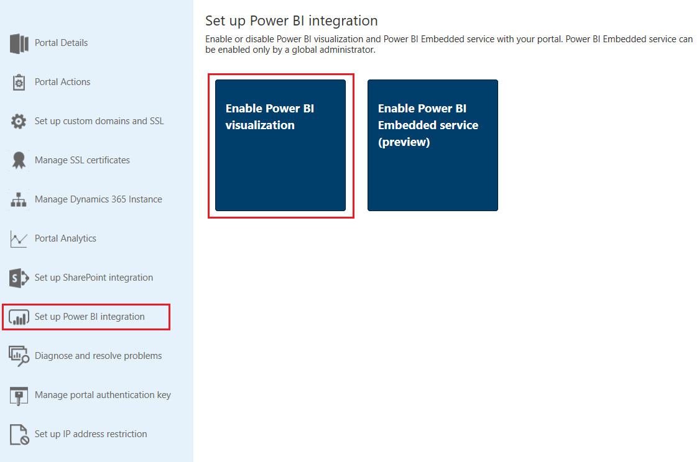
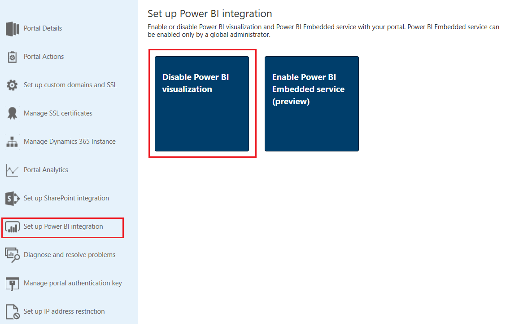

# Set up Power BI integration

Power BI is one of the best tools to deliver insights with simple and interactive visualization. To view dashboards and reports from Power BI on web pages in a portal, you must enable Power BI integration from the Portal Admin Center.

> [!NOTE]
> - You must be a global administrator to perform this action.
> - You must have an appropriate Power BI license.

**Set up Power BI integration**

1.	Go to the Dynamics 365 admin center and select the **Applications** tab.

2.	Select the name of the portal for which you want enable Power BI integration, and then select **Manage**.

3.	Go to **Set up Power BI integration** > **Enable Power BI visualization**.

    > [!div class="mx-imgBorder"]
    > 

4.	Select **Enable** in the confirmation message. While Power BI visualization is being enabled, the portal restarts and will be unavailable for a few minutes. A message appears when Power BI visualization is enabled.

Customizers can use the [powerbi](dynamics-entity-tags.md#powerbi) Liquid tag to embed Power BI dashboards and reports on web pages in a portal. While embedding the Power BI content, customizers can use [filter parameters](https://docs.microsoft.com/en-us/power-bi/service-url-filters) to create personalized views. More information: [powerbi Liquid tag](dynamics-entity-tags.md#powerbi)

When Power BI visualization is enabled, the following action becomes available:

- **Disable Power BI visualization**: Allows you to disable Power BI visualization on your portal. While Power BI visualization is being disabled, the portal restarts and will be unavailable for a few minutes. A message appears when Power BI visualization is disabled.

  > [!div class="mx-imgBorder"]
  > 
