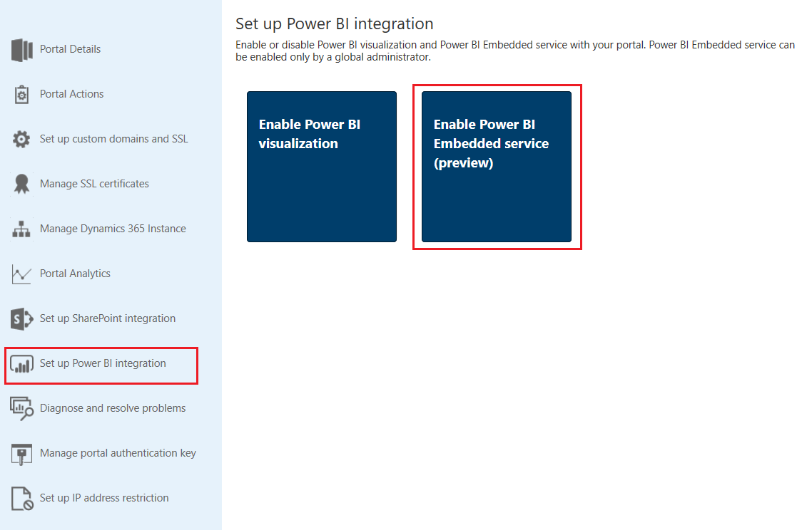
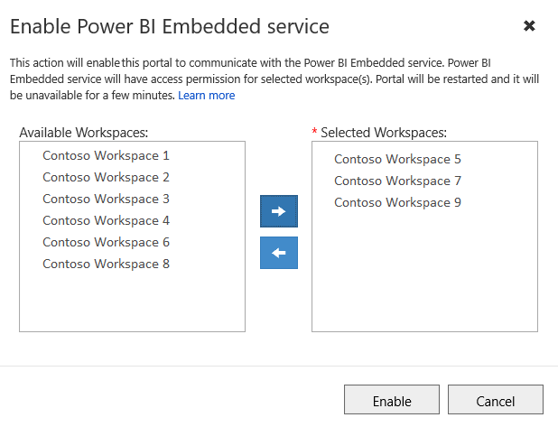
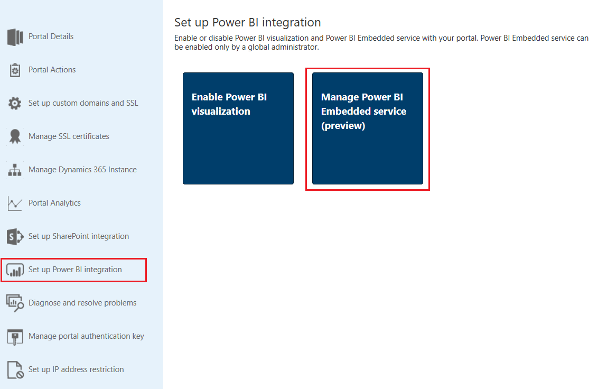
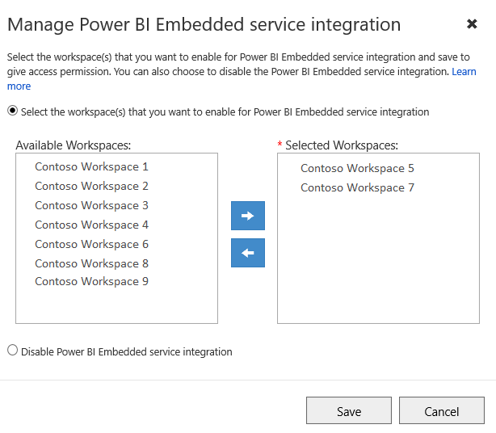
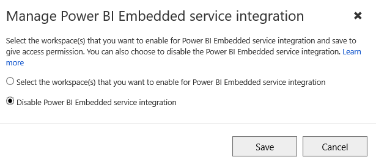

# Set up Power BI integration

Power BI is one of the best tools to deliver insights with simple and interactive visualization. To view dashboards and reports from Power BI on web pages in a portal, you must enable Power BI visualization from the Portal Admin Center. You can also embed dashboards and reports created in the new workspace of Power BI by enabling the Power BI Embedded service integration.

> [!NOTE]
> - You must have an appropriate Power BI license.
> - To use Power BI Embedded service, you must have an appropriate Power BI Embedded license.

## Enable Power BI visualization

Enabling Power BI visualization allows you to embed dashboards and reports on web pages in a portal by using the powerbi Liquid tag.

1.	Go to the [!INCLUDE[pn-crm-online-admin-center](../includes/pn-crm-online-admin-center.md)] page and select the **Applications** tab.

2.	Select the name of the portal for which you want enable Power BI visualization, and then select **Manage**.

3.	Go to **Set up Power BI integration** > **Enable Power BI visualization**.

    > [!div class=mx-imgBorder]
    > 

4.	Select **Enable** in the confirmation message. While Power BI visualization is being enabled, the portal restarts and will be unavailable for a few minutes. A message appears when Power BI visualization is enabled.

Customizers can use the [powerbi](dynamics-entity-tags.md#powerbi) Liquid tag to embed Power BI dashboards and reports on web pages in a portal. While embedding the Power BI content, customizers can use [filter parameters](https://docs.microsoft.com/en-us/power-bi/service-url-filters) to create personalized views. More information: [powerbi Liquid tag](dynamics-entity-tags.md#powerbi)

### Disable Power BI visualization

1.	Go to the [!INCLUDE[pn-crm-online-admin-center](../includes/pn-crm-online-admin-center.md)] page and select the **Applications** tab.

2.	Select the name of the portal for which you want disable Power BI visualization, and then select **Manage**.

3.	Go to **Set up Power BI integration** > **Disable Power BI visualization**.

    > [!div class=mx-imgBorder]
    > 

4. Select **Disable** in the confirmation message. While Power BI visualization is being disabled, the portal restarts and will be unavailable for a few minutes. A message appears when Power BI visualization is disabled.

## Enable Power BI Embedded service

Enabling Power BI Embedded service allows you to embed dashboards and reports created in the new workspace of Power BI. The dashboards and reports are embedded on web pages in a portal by using the powerbi Liquid tag.

**Pre-requisites**: Before enabling Power BI Embedded service, you must ensure that you have created your dashboards and reports in the new workspace in Power BI. After creating the workspace, provide access to the global administrator so the workspaces are displayed in Portal Admin Center. For more information on creating new worksapces and adding access to them, see [Create the new workspaces (preview) in Power BI](https://docs.microsoft.com/en-us/power-bi/service-create-the-new-workspaces).

**Power BI Embedded service limitations**: For information on limitations, see [Considerations and limitations](https://docs.microsoft.com/en-us/power-bi/developer/embed-service-principal#considerations-and-limitations).

> [!NOTE]
> Ensure that Power BI visualization is enabled for the powerbi Liquid tag to work.

1. Go to the [!INCLUDE[pn-crm-online-admin-center](../includes/pn-crm-online-admin-center.md)] page and select the **Applications** tab.

2. Select the name of the portal for which you want enable Power BI Embedded service, and then select **Manage**.

3. Go to **Set up Power BI integration** > **Enable Power BI Embedded service (preview)**.

    > [!div class=mx-imgBorder]
    > 

4. In the **Enable Power BI Embedded service integration** window, select and move the Power BI workspaces from which dashboards and reports need to be displayed in your portal to the **Selected workspaces** list.

    > [!div class=mx-imgBorder]
    > 

5. Select **Enable**. While Power BI Embedded service is being enabled, the portal restarts and will be unavailable for a few minutes. A message appears when Power BI Embedded service is disabled.

Customizers can use the [powerbi](dynamics-entity-tags.md#powerbi) Liquid tag to embed Power BI dashboards and reports from the new workspaces in Power BI on the web pages in a portal. To use Power BI Embedded service, the authentication type must be specified as **powerbiembedded**. While embedding the Power BI content, customizers can use [filter parameters](https://docs.microsoft.com/en-us/power-bi/service-url-filters) to create personalized views. More information: [powerbi Liquid tag](dynamics-entity-tags.md#powerbi)

### Manage Power BI Embedded service

1. Go to the [!INCLUDE[pn-crm-online-admin-center](../includes/pn-crm-online-admin-center.md)] page and select the **Applications** tab.

2. Select the name of the portal for which you want update or disable Power BI Embedded service, and then select **Manage**.

3. Go to **Set up Power BI integration** > **Manage Power BI Embedded service (preview)**.

    > [!div class=mx-imgBorder]
    > 

4. In the **Manage Power BI Embedded service integration** window, remove or move the Power BI workspaces from which dashboards and reports need to be displayed in your portal to the **Selected workspaces** list.

    > [!div class=mx-imgBorder]
    > 

5. Select **Save**.

### Disable Power BI Embedded service

1.	Go to the [!INCLUDE[pn-crm-online-admin-center](../includes/pn-crm-online-admin-center.md)] page and select the **Applications** tab.

2.	Select the name of the portal for which you want disable Power BI Embedded service, and then select **Manage**.

3.	Go to **Set up Power BI integration** > **Manage Power BI Embedded service (preview)**.

    > [!div class=mx-imgBorder]
    > 

4. In the **Manage Power BI Embedded service integration** window, select **Disable Power BI Embedded service integration**.

    > [!div class=mx-imgBorder]
    > 

5. Select **Save**.

6. Select **OK** in the confirmation message. While Power BI Embedded service is being disabled, the portal restarts and will be unavailable for a few minutes. A message appears when Power BI Embedded service is disabled.

## Privacy notice  

[!INCLUDE[cc_privacy_powerbi_tiles_dashboards](../includes/cc-privacy-powerbi-tiles-dashboards.md)]

### See also

[powerbi Liquid tag](dynamics-entity-tags.md#powerbi)  
[Add a Power BI report or dashboard to a webpage in portal](add-powerbi-report.md)
