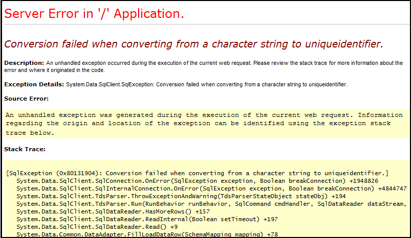

# View portal error logs

As a portal administrator or developer, you can use portal capabilities for Dynamics 365 to create a website for your customers.  One of the common task for a developer is to be able to debug the issues while developing the portal. To aid in debugging of issues, you can access detailed error logs for any issues on your portal. There are multiple ways in which you can get error logs for your portals as described in the below sections.

## Custom error

If any server-side exception occurs in your portal, a customizer error page is displayed by default. This error page has a user-friendly error message which is ideal for a user accessing the portal. To configure the error message, see [Display custom error message](#display-custom-error-message).

However, it is better to see the ASP.NET detailed error page, also known as Yellow Screen of Death (YSOD), for debugging purposes. The detailed error page helps you to get the full stack of server error.

To enable YSOD, you need to [disable custom errors](#display-custom-error-message) on your portal.

> [!NOTE]
> It is advisable to only disable custom errors when you are in the development phase and enable custom errors once you go live.

More information on custom error: [Displaying a Custom Error Page](https://docs.microsoft.com/en-us/aspnet/web-forms/overview/older-versions-getting-started/deploying-web-site-projects/displaying-a-custom-error-page-cs)

### Disable custom error

You can disable custom errors on portals to display the detailed exception message on the screen if any server-side exception occurs in your portal.
1.	Go to the [!INCLUDE[pn-dynamics-crm](../includes/pn-dynamics-crm.md)] Administration Center page and select the **Applications** tab.
2.	Select the name of the portal you want to disable custom errors, and then select **Manage**.
3.	Go to **Portal Actions** > **Disable custom errors**.

    

4.	Click **Disable** in the confirmation message. While the custom errors are being disabled, the portal is restarted  and will be unavailable. A message is displayed when the custom errors are disabled.
