# Overview
One of the most distinguishing features surrounding the portal capabilities introduced in Dynamics 365 Online 2016 Update 1 is the ability to render - and allow the manipulation of - Dynamics 365 data on an internally or externally - facing portal website. In this section, we will profile the entities that provide the foundation of this functionality and discuss the steps necessary to achieve it.

## Entity Forms
An entity form record allows an administrator to render a Dynamics 365 form on a portal to edit, display, orcapture a customizable set of data from its users. The process to complete this is relatively easy and straightforward, and it eliminates the need for any code customizations that would have otherwise been required to achieve such a result before deploying a portal.

This functionality can be taken advantage of for many reasons and use cases, but a common example of how this can be leveraged would be to build a new form under the Lead entity within the Dynamics 365 **Customize the System** interface, then create an entity form record that can be surfaced on the portal to capture lead data through a contact page or some type of information request page. In fact, this specific example is used for the default **Contact Us** page within the portals available in the December 2016 Update for Microsoft Dynamics 365 (online) release. Other examples include using an entity form for profile management or a single page survey.

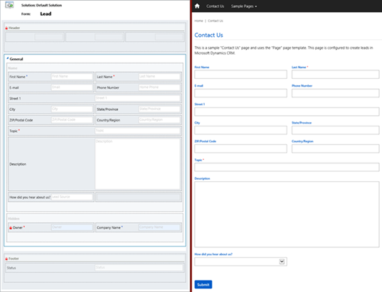

Entity forms contain relationships to web pages and additional properties to control the initialization of the form within the portal.  The relationship to a web page allows dynamic retrieval of the form definition for a given page node within the portal website.

When you create a new entity form, the first step is to decide which entity and form name that you will be rendering and the mode: Insert, Edit, or Read Only. The mode you select will determine if you are creating a new record from the portal, editing an existing record, or just displaying info about a record on the portal.

For this demonstration, let’s consider a scenario in which Contoso, Inc. would like to create a custom entity in Dynamics 365 linked to a form rendered on their Customer Self-Service Portal that will allow users to submit suggestions for improvement that they would like to see the company introduce. The steps that the administrator at Contoso, Inc. would take to achieve this include the following:

1. In Dynamics 365, create the custom entity through **Settings** > **Customizations** > **Customize the System** > **Entities**.  In this example, we’ll call the entity “Suggestion”. Set the entity to display in the **Portals** navigation area, then save it.

2. In Dynamics 365, create two custom fields underneath the Suggestion entity that pertain to the information that should be captured on the form.  In this example, we’ll create “SuggestionOrigin” (Option Set) and “SuggestionSummary” (Multiple Lines of Text) fields.  Both fields will be set to **Business Required**.

3. In Dynamics 365, create a new main form underneath the Suggestion entity:
    1. Insert a one-column tab, and change its section’s properties to two columns.  

    2. Add the custom fields as well as the existing **Name** field.

    3. Give the tab a name of “Suggestion”.

    4. Give the form a name in **Form Properties** of “Suggestion Form”.

    5. Save it and publish.

    

4. In Dynamics 365, navigate to **Portals** > **Entity Forms** and create a new Entity Form record. Name it “Suggestion”, set its **Entity Name** field to “Suggestion (new_suggestion)”, set its **Form Name** to “Suggestion Form”, set its **Tab Name** to “Suggestion”, and its **Form Type** as “Insert”, and modify any of the other options as needed.

5. In the portal, create a new child page named “Suggestions”. Set its **Page Template** value to **Web Form**, set its **Entity Form** value to “Suggestion”, and add an introduction to the form. 
    >[!Note]
    >The Child Page can also be created via Dynamics 365, depending on the user’s preference.

6. If desired, in the portal, edit the Primary Navigation and then click the “+” icon to add a new web link to the form. Name the web link “Suggestions” and assign it to the “Suggestions” page. This will allow users to easily navigate to the form.

When a user visits the Contoso portal, navigates to this created form, enters the relevant data, and submits it, a new record will automatically be generated in Dynamics 365 with the submitted information.

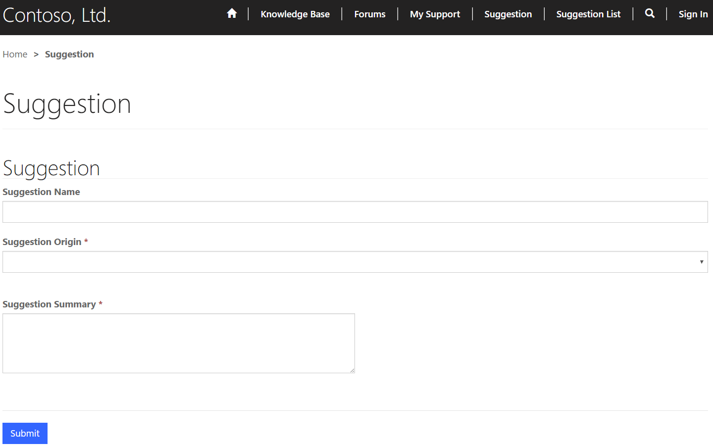

### Entity Form Metadata
Entity form metadata records contain additional behavior modification logic to augment or override the functionality of form fields that would otherwise not be possible with the native entity form editing capabilities in Dynamics 365.

These records allow for additional configuration and manipulation of specific elements on the form, including fields, sub-grids, or entire sections/tabs.  Each element of the form that requires some type of modification requires a separate metadata record, which in turn is associated to the entity form record.

To add metadata records to an entity form, you can navigate to the **Entity Form Metadata Associated View** from the Dynamics 365 navigation menu or these records can be created directly from the entity form itself using the Entity Form Metadata sub-grid toward the very bottom of the record’s form.

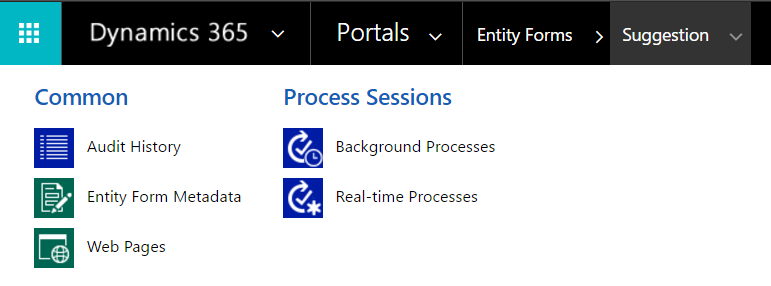

Entity form metadata records can be used for a variety of scenarios, including controlling the style of a field, pre-populating a field with a specific value, setting values on the form upon save, validating user-entered values, and more.

## Entity Lists
While an Entity Form record allows a portal administrator to expose a Dynamics 365 form to portal users, Entity Lists provide administrators with the ability to add a web page to their portal that will render a list of Dynamics 365 records without the need for a developer to surface the view on the portal using custom code.

Entity Lists support sorting and filtering and will be paginated if the number of records is larger than the **Page Size** value specified on the Entity List record. If a **Web Page for Details View** has also been specified, each record will contain a link to the page, and the ID of the record will be appended to the Query String along with the ID Query String Parameter Name.

Entity Lists also support multiple views and actions.  If more than one view has been specified in Dynamics 365, a drop-down menu will be rendered to the end user that allows them to toggle between the various views as they wish. Likewise, if actions such as **Edit** or **Delete** have been added as action buttons, then users with the correct permissions will see these options rendered in the view.

Building on the previous example of the administrator of Contoso, Inc. creating an Entity Form to collect user suggestions, we will now cover the steps that the administrator would take to (very simplistically) expose the submitted records on the portal for other users to review and for easy access for submitting new ones:

1. In Dynamics 365, go to **Settings** > **Customizations** > **Customize the System** > **Entities** > **Suggestions** > **Views** and edit the **Active Suggestions** view.  Add the columns that should be exposed on the portal to this view.

2. Go to **Portals** > **Entity Lists** and create a new Entity List record.  
    1. Enter a name of “Suggestions List”, set its **Entity Name** value to “Suggestion (new_suggestion)”. 

    2. Add the default **Active Suggestions** view or the custom-created view to the **Views** list. 

    3. Set the **Web Page for Create** value to “Suggestions”, and add create button/empty list text as needed.

    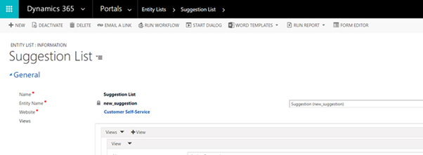

3. In the portal, create a new child page named “Suggestions List”. Set its **Page Template** value to **Full Page**, set its **Entity List** value to “Suggestions List”, and addan introduction to the exposed view.

4. If you want, in the portal, edit the **Primary Navigation** and then click the **Add** button (+) to add a new web link to the list.  Name the web link “Suggestions List” and assign it to the “Suggestions List” page.  You can drag the previously created “Suggestions” form link underneath the new list link to become a child.

Beyond the simplistic setup that was discussed earlier, Entity Lists support many other options, including (but not limited to):
- Allow users to filter and search the records within that respective entity on the portal.
- Allow users to create, edit, or delete records, as well as download the records to an Excel Worksheet.
- Allow users to execute an on-demand workflow against a record selected in the list.
- Display the records from the list using a Bing Maps view of the data 
- Display the records from the list using a Calendar View of the data.

## Web Forms
Web Forms allow users to define entity forms and custom logic within Dynamics 365 to render data entry forms on a portal without the need for custom code. Web Forms support single- and multi-step navigation, as well as branching logic. Web Forms are commonly used to produce surveys, such as the out-of-the-box “Case Satisfaction Survey” web forms, or to facilitate requests, such as the out-of-the-box “Open New Support Request” web form.

Web Forms differ from Entity Forms in that they provide the ability for an administrator to specify one or more forms that are to be loaded to produce a single form or a wizard-style, multi-step process with conditional branching logic. Web Forms also have additional properties that can be specified in Dynamics 365 to override some of the default behaviors and overcome some Dynamics 365 entity metadata and form designer limitations.

The best way to fully grasp how a Web Form is used within a portal is to provide an example of a use case scenario, and then go through the process of constructing the form and all its underlying parts. Earlier in this document, we went through the process of creating a custom Entity Form for users to submit suggestions and a custom Entity List to expose these suggestions within a view on the portal.  Let’s now assume that Contoso wants to survey its users on which of the submitted suggestions they would prefer to be implemented, as well as other information about their user base at the same time.  The steps that the administrator would take to set up such a survey on the portal would be as follows:

1. Create a custom entity through **Settings** > **Customizations** > **Customize the System** > **Entities**.  For this example, we’ll call the entity “Survey”.  

2. Set the entity to display in the **Portals** navigation area, then save it.

3. Create several custom fields underneath the “Survey” entity to represent the answers that will be available for the user to choose on the survey:

    1. Three custom fields entitled “Extended Support Hours”, “New Products”, and “More Stores” for a multiple-choice question that the administrator has planned of “Which is your favorite suggestion for a future Contoso improvement?” Each field is set to a data type of **Two Options**.

    2. Four custom fields entitled “Retail Store”, “Search Engine”, “Web Advertisement”, and “Word of Mouth” for a multiple-choice question that the administrator has planned of “How did you first hear about Contoso Ltd.?” Each field is set to a data type of **Two Options**.

    3. A custom field entitled “Contoso Ltd. Rating” of data type **Option Set**. For **Use Existing Option Set**, select **Yes** and from the drop-down list, select **Likert Scale Quality**.
    4. To track the current portal user filling out the survey, a custom field entitled “Regarding Contact” of data type “Lookup” and target record of “Contact”.

4. Open the main “Information” form underneath the “Survey” entity, click the **General** tab, and then click **Change Properties**. On the **Formatting** tab, select **One Column**, and then click **OK**.

5. Switch to the “Insert” tab of the “Information” form, click “Section”, and choose “Two Columns”. Move the default Name and Owner fields to this section and delete the old one.  Open the properties of the Name field and clear the “Visible by default” option on the “Display” tab.

    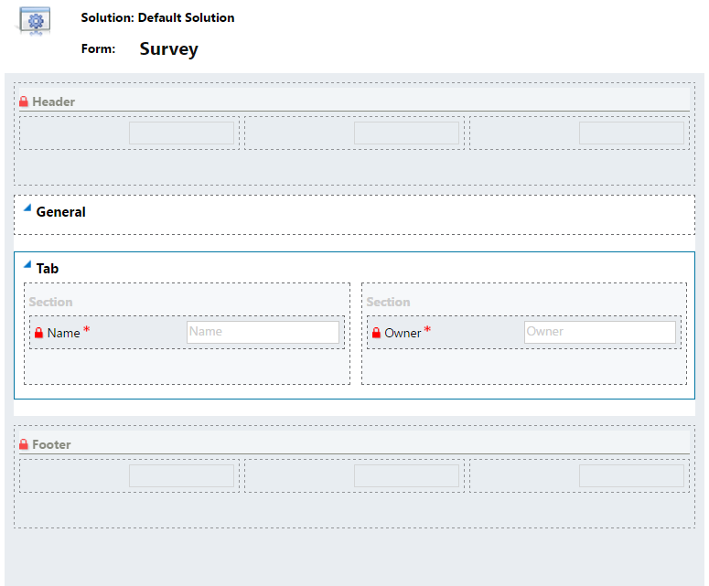

6. Save the form, then click **Save As** in the ribbon to create a copy of the form named “Survey Step 2”. Click **Save As** again to create another copy named “Survey Step 1”.
7. Open the “Survey Step 1” form, switch to the **Insert** tab, and then click **Section** > **Two Columns**.  

8. Open the properties of the new section, change its label to “Which is your favorite suggestion for a future Contoso improvement?”, and select the checkbox for **Show the label of this section on the form** option.  

9. Drag the “Extended Support Hours”, “New Products”, and “More Stores” fields to this section.  

10. Repeat the step of adding a new two-column section, but this time change the label to “How did you first hear about Contoso Ltd.?” and drag the “Retail Store”, “Search Engine”, “Web Advertisement”, and “Word of Mouth” fields to this section. 

11. Open the properties of each field. On the **Formatting** tab, set the **Control Formatting** to **Check box**. Save and close the form.

    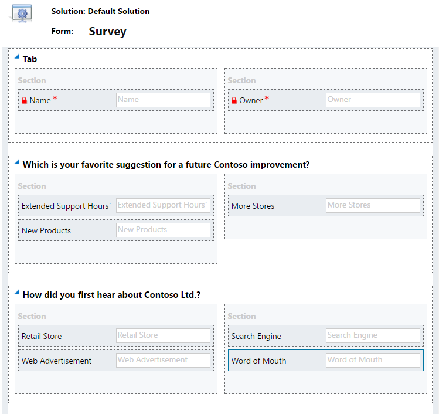

12. Open the “Survey Step 2” form, switch to the **Insert** tab, and select **Section** > **One Column**.  

13. Drag the “Contoso Ltd. Rating” field to the new section, then open the properties of the field on the form and change its label to “Tell us how we're doing!  Please rate the quality of Contoso Ltd.’s various series of products.”  Save and close the form.

14. Within the **Survey forms** area, choose **Form Order** > **Main Form Set**.  This will allow you to configure the form order to work in a sequence of Information > Survey Step 1 > Survey Step 2.

15. On the main Information form and the Insert tab, click Section > Two Columns.  

16. Open the properties of the new section, change its label to “Which is your favorite suggestion for a future Contoso improvement?”, and checkthe box for **Show the label of this section on the form** option.  Drag the “Extended Support Hours”, “New Products”, and “More Stores” fields to this section.

    Repeat the step of adding a new two-column section, but this time change the label to “How did you first hear about Contoso Ltd.?” and drag the “Retail Store”, “Search Engine”, “Web Advertisement”, and “Word of Mouth” fields to this section.  Open the properties of each of the seven fields added to the form to this point, select the Formatting tab, and set the Control Formatting to Check box.  

    Repeat the step of adding a section, but this time choose a one-column section.  Drag the “Contoso Ltd. Rating” field to this section, then open the properties of the field on the form and change its label to “Tell us how we're doing!  Please rate the quality of Contoso Ltd.’s various series of products.”

    Finally, drag the Regarding Contact field to the first section of the General tab to track which user filled out the survey.  Save and close the form, then click Publish All Customizations.

    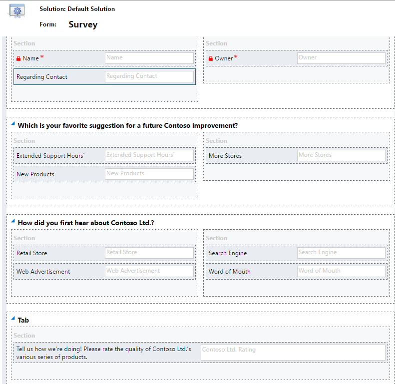

17. Go to Portals > Web Forms and create a new web form entitled “Contoso Ltd. Survey”.  Set the Authentication Required field to Yes and the Multiple Records Per User Permitted field to No, then save the form, but keep it open.

18. On the “Contoso Ltd. Survey” Web Form record, open the Start Step lookup field and then click New to create a new Web Form Step.

    Name the step “Survey Step 1”, set the Target Entity Logical Name to “Survey (new_survey)”, set the Form Name to “Survey Step 1”, select the Associate Current Portal User check box, and set the Target Entity Portal User Lookup Attribute to “Regarding Contact (new_regardingcontact)”.  Save the form, but keep it open.

    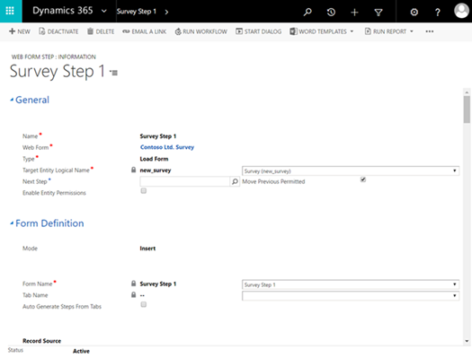

19. On the “Survey Step 1” Web Form Step record, open the Next Step lookup field and then click “New” to create a new Web Form Step.  Name the step “Survey Step 2”, set the Web Form to “Contoso Ltd. Survey”, set the Target Entity Logical Name to “Survey (new_survey)”, set the Mode to “Edit”, set the Form Name to “Survey Step 2”, set the Source Type to “Result From Previous Step”, and set the Success Message to “Thank you for taking the time to complete this survey!”  Make sure that the Next Step field is blank then save the form, but keep it open.

20. On the “Survey Step 2” Web Form Step record, click the far-right chevron in the main Dynamics 365 navigation and select “Metadata” to open the Web Form Metadata Associated View underneath the “Survey Step 2” record.  Click “Add New Web Form Metadata”, then set the Attribute Logical Name on this new record to “Contoso Ltd. Rating (new_contosoltdrating)” and the Style to “Option Set as Horizontal Radio Button List”.  Save and close all the open forms.

    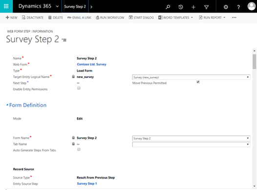

21. In Dynamics 365, navigate to Portals -> Web Pages and create a new Web Page entitled “Contoso Ltd. Survey”.  Set the Website to “Contoso Ltd.”, the Parent Page to “Home”, the Partial URL to “contoso-ltd-survey”, the PageTemplate to “Full Page”, the Publishing State to “Published”, and the Web Form to the “Contoso Ltd. Survey” that was created earlier.  Save the record.

Granted, these steps are very complex and require several Dynamics 365 records to work in tandem with one another to achieve the result. However, after the process is complete, users can navigate to the page that you’ve created on the portal and fill out the survey as intended.

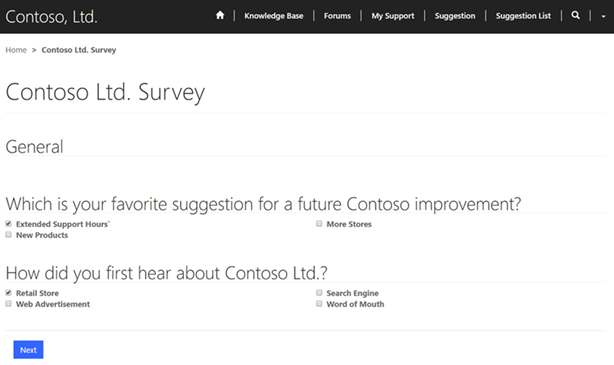

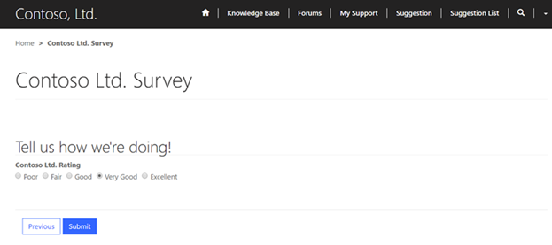

Each completed survey that is submitted will become a record within the **Portals** > **Survey** entity in Dynamics 365, and this record will contain the regarding contact who completed the web form along with all their responses for tabulation.

While most Dynamics 365 forms can be successfully rendered in a portal, there are some call-outs that should be noted as some features aren't supported by the Dynamics 365 EntityFormView control that handles the actual rendering of the entity form.

Here are the supported form elements:
- All Dynamics 365 field validation rules
- Both single and multi-column layouts
- Dynamics 365 label language translations
- Notes (inserted on the form)
- Sub-Grids (inserted on the form)

Here are the supported, but with caveats form elements:
- All Dynamics 365 field types, except Party List fields
- Only “Webpage (HTML)” and image-related Web Resource types are supported
- Record filtering in a lookup field is supported, but only for N:1 relationships
- Lookup fields are supported, but creating a new record through a lookup view on the form isn't supported

Here are the unsupported form elements:
- Form headers and footers won't display in the portal
- iFrames
- Dynamics 365 form scripting

Finally, it’s worth mentioning that the Entity Form record in Microsoft Dynamics 365 has an assortment of options that allow for it to be fine-tuned as needed, including a section for **Attach File** options.  If a form requires the attachment of files, then select the **Attach File** check box and configure the **Attach File Storage Location** option for either **Dynamics 365 Note Attachment** or **Azure Blob Storage**.