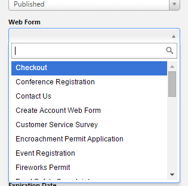
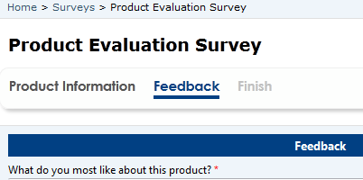
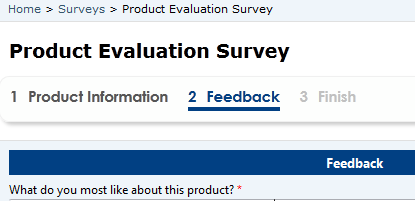
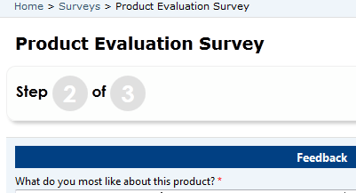
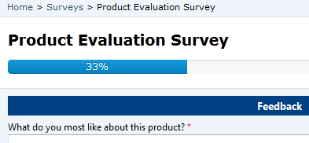
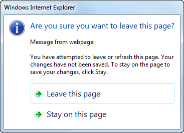

# Define web form properties for portals

The Web form contains relationships to webpages and a start step to control the initialization of the form within the portal. The relationship to the webpage allows dynamic retrieval of the form definition for a given page node within the [website](#website-1).  

The other options on the Web form record itself control top-level preferences for the multiple-step process as a whole, for example whether you'd like to display a progress bar.

To view existing Web forms or to create new Web forms, go to **Portals** > **Web Forms**.

> [!Note]
> A **Web Form** must be associated with a webpage for a given [website](#website-1) for the form to be viewable within the site.  

When creating or editing a webpage, a **Web Form** can be specified in the lookup field provided on the Web Page form.

  

## Web form attributes

The following attributes and relationships determine the functionality of the Web form.

| Name                                | Description                                                                                                                                                                                                                                                                                                                                                    |
|-------------------------------------|----------------------------------------------------------------------------------------------------------------------------------------------------------------------------------------------------------------------------------------------------------------------------------------------------------------------------------------------------------------|
| Name                                | A title of the form used for reference.                                                                                                                                                                                                                                                                                                                        |
| Start Step                          | The first step of the form. A Web form will consist of one or more steps. For more information about these steps please refer to the section titled Web Form Step found below. The first step cannot be of type "Condition".                                                                                                                                                                                                                                                                                              |
| Authentication Required             | If checked, when a user who is not signed in visits the page that contains the form, they will be redirected to the sign-in page. Upon successful sign-in, the user will be redirected back to the page that contains the form.                                                                                                                                          |
| Start New Session On Load           | Selecting **Yes** indicates that if the user opens the form in a new browser or new tab, or closes the browser or page and returns, the form will start a completely new session and begin at the first step. Otherwise the session will be persisted and the user can close the browser or page and resume later exactly where they left off. Default: **No**. |
| Multiple Records Per User Permitted | Selecting **Yes** indicates that a user is permitted to create more than one submission. This assists the form in determining what to do when a user revisits a form. Default: **Yes**.                                                                                                                                                                        |
| Edit Expired State Code             | The target entity's state code integer value that, when combined with the status reason, indicates when an existing record can no longer be edited.                                                                                                                                                                                                              |
| Edit Expired Status Reason          | The target entity's status code integer value that, when combined with the state code, indicates that when an existing record has these values the record is not to be edited anymore&mdash;for example, when a record is updated as complete.                                                                                                                    |
| Edit Expired Message                | The message displayed when the existing record's state code and status reason match the values specified. For each language pack installed and enabled for the [!INCLUDE[pn-dynamics-crm](../includes/pn-dynamics-crm.md)] organization, a field will be available to enter the message in the associated language. Default message; "You have already completed a submission. Thank you!"                     |
||

## Progress indicator settings

| Name                              | Description                                                                                          |
|-----------------------------------|------------------------------------------------------------------------------------------------------|
| Enabled                           | Check to display the progress indicator. Default: **Disabled**.                                      |
| Type                              | One of the following: Title, Numeric (Step x of n), and Progress Bar. Default: **Title**                                                                                    |
| Position                          | One of the following: Top, Bottom, Left, Right. Position is relative to the form. Default: **Top**.                                                   |
| Prepend Step Number to Step Title | Check to add the number of the step to the beginning of the title of the step. Default is unchecked. |
||

Example of the various progress indicator types:

**Title**

  

**Title with Step Number prepended**

  

**Numeric**

  

**Progress Bar**

  

## “Save changes” warning 

| Name                                  | Description                                                                                                                                                                                                                |
|---------------------------------------|----------------------------------------------------------------------------------------------------------------------------------------------------------------------------------------------------------------------------|
| Display Save Changes Warning On Close | Select to display a warning message if the user has made changes to field(s) and they try to reload the page, close the browser, select the browser's back button, or select the previous button in a multiple step form.    |
| Save Changes Warning Message          | For each language pack installed and enabled for the [!INCLUDE[pn-dynamics-crm](../includes/pn-dynamics-crm.md)] organization, a field will be available to enter the message in the associated language. If no message is specified, the browser's default will be used. |
||

Example:

  

>[!Note]
> Firefox does not provide the ability to specify a custom message.

## Web form metadata

Web Form Metadata contains additional behavior modification logic to augment or override the functionality of form fields that is otherwise not possible with the [!INCLUDE[pn-dynamics-crm](../includes/pn-dynamics-crm.md)] native entity form editing capabilities.

On the **Web Form Step** that has fields that you would like to modify, do the following:

1. Select the **Metadata** link in the leftmost navigation area: 
- To add a new record, select **Add New Web Form Metadata**.
- To edit an existing record, double-click to select a record in the grid.

### Web form metadata properties

The following attributes provide additional styling and capabilities for elements on a form.

| Name          | Description                                                                                                                                                                                                |
|---------------|------------------------------------------------------------------------------------------------------------------------------------------------------------------------------------------------------------|
| Web Form Step | The Web Form Step associated with the Web Form Metadata record.                                                                                                                                            |
| Type          | Available options are: Attribute, Section, Tab, and Purchase.
||

- **Web Form Metadata Type = Attribute**: displays the appropriate options for modifying fields on the current form rendered for the related step.
- **Web Form Metadata Type = Section**: displays the options available for modifying a section on the form.
- **Web Form Metadata Type = Tab**: displays the options available for modifying a tab on a form.
- **Web Form Metadata Type = Purchase**: displays products for purchase and to generate a quote record in [!INCLUDE[pn-dynamics-crm](../includes/pn-dynamics-crm.md)] to persist the user's purchase selections to create an order and process payment.  |

### Web form metadata type = attribute

The following properties are displayed when the Type selected is **Attribute**.

| Name                   | Description                                                                                                                                                                                                                                                         |
|------------------------|---------------------------------------------------------------------------------------------------------------------------------------------------------------------------------------------------------------------------------------------------------------------|
| Attribute Logical Name | The logical name of the attribute field to be modified.                                                                                                                                                                                                             |
| Label                  | Replaces the default label assigned to the attribute on the entity with the text specified in this input. For each language pack installed and enabled for the [!INCLUDE[pn-dynamics-crm](../includes/pn-dynamics-crm.md)] organization, a field will be available to enter the message in the associated language. |

### Control style

The following options modify the style and functionality of an attribute's field.

| Name                                            | Description                                                                                                                                                                             |
|-------------------------------------------------|-----------------------------------------------------------------------------------------------------------------------------------------------------------------------------------------|
| Style                                           | One of the following: Option Set as Vertical Radio Button List, Option Set as Horizontal Radio Button List, Single Line of Text as Geolocation Lookup Validator (requires [!INCLUDE[pn-bing](../includes/pn-bing.md)] Maps Settings), Group Whole Number as Constant Sum (requires Group Name), Group Whole Number as Rank Order Scale No Ties (requires Group Name),Group Whole Number as Rank Order Scale Allow Ties (requires Group Name),Multiple Choice Matrix (requires Group Name),Multiple Choice (requires Group Name), Group Whole Number as Stack Rank (requires Group Name).                                                                                                                               |
| Group Name                                      | A name used to group controls together as a composite control.                                                                                                                          |
| Multiple Choice Minimum Required Selected Count | This is the required minimum value selected in the multiple choice question. Only necessary if 'Multiple Choice' Control Style is selected.                                            |
| Multiple Choice Max Selected Count              | This is the maximum number of values that are permitted to be selected in the multiple choice question. Only necessary if 'Multiple Choice' Control Style is selected.                   |
| Constant Sum Minimum Total                      | This is the required minimum value applied to a constant sum response field. Only necessary if 'Group Whole Number as Constant Sum' Control Style is selected.                          |
| Constant Sum Maximum Total                      | This is the maximum number of values that are permitted to be applied to a constant sum response field. Only necessary if 'Group Whole Number as Constant Sum' Control Style is selected. |
| Randomize Option Set Values                     | Specifying Yes results in randomly ordered options listed for an Option Set control. Only applicable to attributes that are of type Option Set.                                         |
| CSS Class                                       | Adds a custom CSS class name to the control.                                                                                                                                            |
||

### Prepopulate field

The following options provide a default value for a field on the form.

| Name                 | Description                                                                                                                                                                                                                                                                                                                                                                                                                                |
|----------------------|--------------------------------------------------------------------------------------------------------------------------------------------------------------------------------------------------------------------------------------------------------------------------------------------------------------------------------------------------------------------------------------------------------------------------------------------|
| Ignore Default Value | Ignores the default value of the specified attribute field. Useful for attributes that are **Two Option** fields that are rendered as Yes and No radio buttons. Because [!INCLUDE[pn-dynamics-crm](../includes/pn-dynamics-crm.md)] automatically assigns a value of yes or no by default, this option makes it possible to display Yes/No questions without a predefined response.                                                                                                       |
| Type                 | One of the following value: Today's Date,  Current User's Contact
| Value                | A value to be assigned to the field when the form is loaded. Selecting Value requires a value to be specified in the **Value** field that will be assigned to the field when the form is loaded. Selecting Today's Date will assign the current date and time to the attribute field. Selecting Current User's Contact requires a **From Attribute** that is an attribute on the contact entity that will be retrieved from the current user's contact record and set on the attribute field specified.
| From Attribute       | An attribute on the contact entity that will be retrieved from the current portal user's record and assigned to the field when the form is loaded.                                                                                                                                                                                                                                                                                       |
||

### Set value on save

The following options specify a value to be set when the form is saved.

| Name              | Description |
|-------------------|-------------|
| Set Value On Save | Yes indicates that a value should be assigned to the attribute using the input provided in the **Value** field. All attribute types are supported except the following: Unique Identifier. |
| Type              | One of the following: <ul><li> Value</li><li>Today's Date</li><li>Current User's Contact</li></ul> You must specify a value to be specified in the **Value** field that will be assigned to the field when the form is saved. Selecting Today's Date will assign the current date and time to the attribute field. Selecting Current User's Contact requires a **From Attribute** that is an attribute on the contact entity that will be retrieved from the current user's contact record and set on the attribute field specified.  |
| Value             | Value assigned to the attribute when the form is being saved. For Two Option (Boolean) fields, use true or false. For Option Set field, use the integer value for the option. For the Customer lookup fields (account or contact), use the `entity-name:entity-guid` syntax. For other lookup (EntityReference) fields, use the GUID. Note that if the attribute is also on the form, the user's value will be overwritten with this value. |                                                                                 |
| From Attribute    | An attribute on the contact entity that will be retrieved from the current portal user's record and assigned to the field during save.|
||

### Validation

The following section contains properties that modify various validation parameters and error messages.

For each language pack installed and enabled for the [!INCLUDE[pn-dynamics-crm](../includes/pn-dynamics-crm.md)] organization, a field will be available to enter the message in the associated language.

| Name                                        | Description                                                                                                                                                                                                                                                      |
|---------------------------------------------|------------------------------------------------------------------------------------------------------------------------------------------------------------------------------------------------------------------------------------------------------------------|
| Validation Error Message                    | Overrides the default validation error message for the field.                                                                                                                                                                                                    |
| Regular Expression                          | A regular expression to be added to validate the field.                                                                                                                                                                                                          |
| Regular Expression Validation Error Message | The validation error message to display if the regular expression validated fails.                                                                                                                                                                               |
| Field is Required                           | Check to require the attribute field to contain a value.                                                                                                                                                                                                   |
| Required Field Validation Error Message     | Overrides the default required field error message if the field does not contain a value.                                                                                                                                                                        |
| Range Validation Error Message              | Overrides the default range validation error message displayed if the field's value is outside of the appropriate minimum and maximum values specified on the entity attribute that are of type Whole Number, Decimal Number, Floating Point Number or Currency. |
Geolocation Validator Error Message         | If the attribute is a Single Line of Text and the Control Style specified is Single Line of Text as Geolocation Lookup Validator, this will override the default error message displayed if input validation fails. |
| Constant Sum Validation Error Message       | If the attribute is a Whole Number type and the Control Style specified is Group Whole Number as Constant Sum, this will override the default error message displayed if input validation fails.                    |
| Multiple Choice Validation Error Message    | If the attribute is a Two Option type and the Control Style specified is Multiple Choice, this will override the default error message displayed if input validation fails.                                         |
| Rank Order No Ties Validation Error Message | If the attribute is a Whole Number type and the Control Style specified is Group Whole Number as Rank Order No Ties, this will override the default error message displayed if input validation fails.              |
||
### Description and instructions

The following properties specify the location and content of custom description or instructions.

| Name                                 | Description                                                                              |
|--------------------------------------|------------------------------------------------------------------------------------------------------------------------------------------------------------------------------------------------------------------------------------------------------------------------------------|
| Add Description                      | Yes results in custom text being displayed on the form in the position specified.                                                                                                                                                                                                  |
| Position                             | One of the following: Above the field, Below the field, and Above the label                                                                                                                                                                                                                                                                 |
| Use Attribute's Description Property | Select **Yes** to use the description assigned to the attribute metadata on the entity. Select 'No' to provide a custom description. Default: **No**.                                                                                                                              |
Description                          | Custom text to be displayed on the form. Used in conjunction when Use Attribute's Description Property is set to **No**. For each language pack installed and enabled for the [!INCLUDE[pn-dynamics-crm](../includes/pn-dynamics-crm.md)] organization, a field will be available to enter the message in the associated language. |
||

### Web form metadata type = section

The following properties are displayed when the Type selected equals **Section**.

| Name         | Description                                                                                                                                                                                                                                                       |
|--------------|-------------------------------------------------------------------------------------------------------------------------------------------------------------------------------------------------------------------------------------------------------------------|
| Section Name | The name of the section on the entity's form in [!INCLUDE[pn-dynamics-crm](../includes/pn-dynamics-crm.md)] to be modified.                                                                                                                                                                                      |
| Label        | Replaces the default label assigned to the section on the entity with the text specified in this input. For each language pack installed and enabled for the [!INCLUDE[pn-dynamics-crm](../includes/pn-dynamics-crm.md)] organization, a field will be available to enter the message in the associated language. |
||

### Web form metadata type = tab

The following properties are displayed when the Type selected equals **Tab**

| Name     | Description                                                                                                                                                                                                                                                   |
|----------|---------------------------------------------------------------------------------------------------------------------------------------------------------------------------------------------------------------------------------------------------------------|
| Tab Name | The name of the tab on the entity's form in [!INCLUDE[pn-dynamics-crm](../includes/pn-dynamics-crm.md)] to be modified.                                                                                                                                                                                      |
| Label    | Replaces the default label assigned to the tab on the entity with the text specified in this input. For each language pack installed and enabled for the [!INCLUDE[pn-dynamics-crm](../includes/pn-dynamics-crm.md)] organization, a field will be available to enter the message in the associated language. |
||

### Web form metadata type = purchase

The following properties are displayed when the Type selected equals **Purchase**. These options provide the necessary details for a Web Form to be able to display products for purchase and to generate a quote record in [!INCLUDE[pn-dynamics-crm](../includes/pn-dynamics-crm.md)] to persist the user's purchase selections to create an order and process payment.

| Name                                    | Description                                                                                                                                                                                                                                                                                                                                       |
|-----------------------------------------|---------------------------------------------------------------------------------------------------------------------------------------------------------------------------------------------------------------------------------------------------------------------------------------------------------------------------------------------------|
| Target Entity Relationship Name         | Relationship from the web form step target entity to the purchase entity, if the step target is not the purchase entity.                                                                                                                                                                                                                          |
| Required Products Relationship Name     | Relationship from the purchase entity for products to be purchased that are a required part of the purchase.                                                                                                                                                                                                                                      |
| Optional Products Relationship Name     | Relationship from the purchase entity for products to be purchased that are optional (the user must opt in to purchase these items).                                                                                                                                                                                                              |
| Line Item Relationship Name             | Relationship from the purchase entity that defines purchase line items.                                                                                                                                                                                                                                                                           |
| Line Item Product Attribute Name        | Purchase line item entity attribute name for Product lookup. If this value is not present and set, the corresponding line item will be excluded from the purchase.                                                                                                                                                                                |
| Line Item Description Attribute Name    | Purchase line item entity attribute name for description.                                                                                                                                                                                                                                                                                         |
| Line Item Quantity Attribute Name       | Purchase line item entity attribute name for item quantity. (Should be a decimal attribute.)                                                                                                                                                                                                                                                      |
| Line Item UoM Attribute Name            | Purchase line item entity attribute name for Unit of Measure lookup.                                                                                                                                                                                                                                                                              |
| Line Item Required Attribute Name       | Purchase line item entity attribute name for whether a line item is required.                                                                                                                                                                                                                                                                     |
| Line Item Order Attribute Name          | Purchase line item entity attribute name for the order in which a line item should be displayed.                                                                                                                                                                                                                                                  |
| Line Item Instructions Attribute Name   | Purchase line item entity attribute name for instructions.                                                                                                                                                                                                                                                                                        |
| Quote Name                              | The name to be used for all purchase quotes generated by this step.                                                                                                                                                                                                                                                                               |
| Requires Shipping                       | A Boolean value. When checked, forces the purchase process to collect shipping information. Note: If a product has a freight weight value, shipping will be required regardless of this setting.                                                                                                                                              |
| Fulfill Order on Payment                | A Boolean value. Checked indicates that the order state should be set to **Fulfilled** when the payment is verified. Requires **Target Entity Order Relationship Name**. If the target entity is **adx\_shoppingcart**, an order will be created automatically upon successful payment and Target Entity Order Relationship Name is not required. |
| Create Invoice on Payment               | A Boolean value. Checked indicates that an invoice should be created when the payment is verified. Requires **Target Entity Invoice Relationship Name**, unless the target entity is adx\_shoppingcart, in which case this relationship is not needed.                                                                                            |
| Target Entity Order Relationship Name   | Relationship from the web form step target entity to the order entity.                                                                                                                                                                                                                                                                            |
| Target Entity Invoice Relationship Name | Relationship from the web form step target entity to the invoice entity.           |
||

## Geolocation configuration for web form

A managed form can be configured to display a map control to either display an existing location as a pin on a map or to provide the ability for the user to specify a location. See [Add Geolocation](add-geolocation.md).

The form's map control requires additional configuration to tell it what the IDs of the various location fields are, to assign values to them or retrieve values from them. The Web Form Step record has a section that defines these field mappings that you must assign values for. The field names will vary depending on the schema you have created.

> [!Note]
> The Geolocation section is not visible in the German Sovereign Cloud environment. If a user has enabled geolocation by using a different form, it will not be displayed during rendering on portal.

### See also

[Configure a Dynamics 365 portal](configure-portal.md)  
[Define entity forms and custom logic within the Dynamics 365 portal](entity-forms-custom-logic.md)  
[Web Form steps for portals](web-form-steps.md)  
[Web Forms metadata for portals](configure-web-form-metadata.md)  
[Web Form subgrid configuration for portals](configure-web-form-subgrid.md)  
[Notes configuration for Web Forms for portals](configure-notes.md)  

