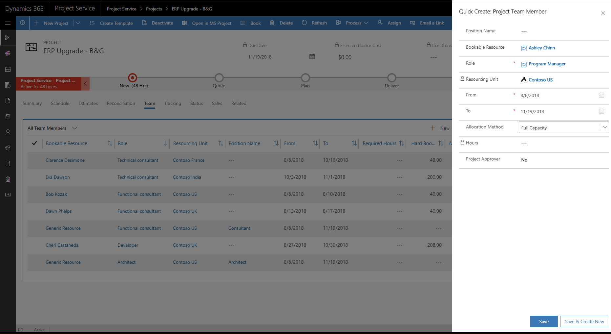
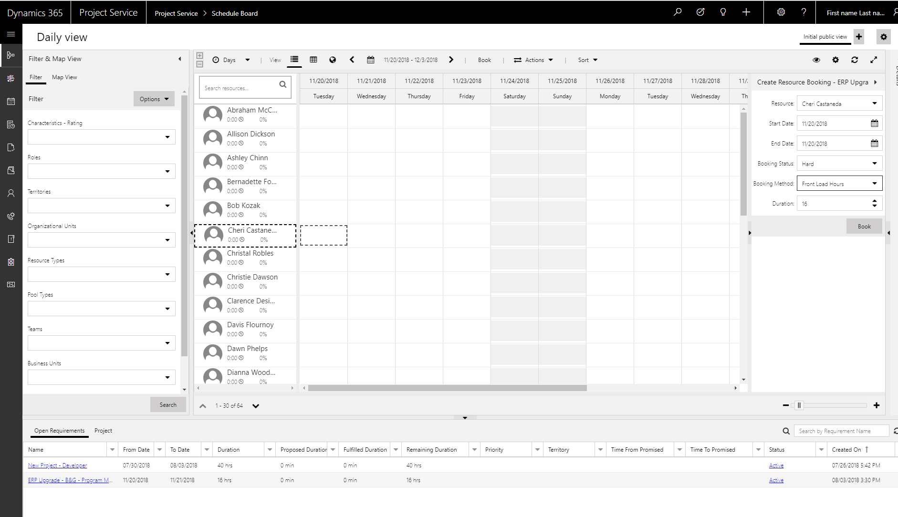

---

title: How do the different booking allocation methods work? (Dynamics 365 for Project Service) | MicrosoftDocs
description: An overview of the different ways you can book allocations in Dynamics 365 Project Service.
author: NeilWOrint 
manager: ShellyHa
ms.service: dynamics-365-customerservice
ms.custom:
  - dyn365-projectservice
ms.date: 8/17/2018
ms.topic: article
ms.prod: 
ms.service: business-applications
ms.technology: Microsoft Dynamics 365 for Project Service 2.x and Microsoft Dynamics 365 for Project Service 3.x
ms.author: john.burrows
audience: Admin

---
# How do the different booking allocation methods work?

## Booking allocation methods
When you add a team member directly to a project on the Team tab or book a resource to a project or requirement by using the Schedule Board, you’ll see several booking allocation methods you can use. 

> [!div class="mx-imgBorder"] 
> 

*Adding a team member directly to a project*

> [!div class="mx-imgBorder"] 
> 
 
*Booking a requirement with Schedule Board*

Here’s a description of the booking allocation methods:
### Full Capacity 
This method books the resource’s full capacity for the specified from and to dates. For example, if a resource has a calendar that’s set to work 8 hours per day, 5 days a week, setting a start and end date that covers 5 working days books them for 40 hours. The booking is done without regard to the resources remaining capacity. If they are already booked during that period on other projects, the 40 hours is booked as additional hours, potentially leading to overbookings.
### Remaining Capacity
This method is only available when directly booking to a project using the Schedule Board. It books the resource’s available capacity within the specified date range. For example, if a resource has a capacity of 40 hours per week and has already been booked 10 hours in a week. Booking using this method for the same week results in a booking for the remaining 30 hours of their capacity for that week.
### Percentage Capacity
This method books the resource for a percentage of their capacity for the specified from and to dates. For example, if a resource has a calendar that is set to work 8 hours per day, 5 days a week, setting a start and end date that covers 5 working days and a 50% capacity would book them for 20 hours. The individual bookings per day is spread equally across the period, for example 4 hours per day, given the above scenario. The booking is done without regard to the resource’s remaining capacity. If they are already booked during that period on other projects, the 20 hours is booked as additional hours, potentially leading to over-bookings.
### Evenly Distribute Hours
This method books the resource for a specified number of hours, distributing it evenly per day over the specified from and to dates. For example, if you book a resource for 20 hours over a 5-day period, this method distributes the 20 hours evenly at 4 hours per day. The booking is done without regard to the resources remaining capacity. If they are already booked during that period on other projects, the 20 hours is booked as additional hours to what they currently have, potentially leading to overbookings.
### Front Load Hours
This method books the resource for a specified number of hours, front-loading the per-day hours over the specified from and to dates. Front-loading consumes the resources available capacity in a “first-in-first-consumed” order. For example, if a resource’s work schedule is 8 hours per day, 5 days per week and they have no current bookings, booking them for 20 hours over a 5 working day period results in the following daily booking pattern: 

|                           |    Day 1    |    Day 2    |    Day 3    |    Day 4    |    Day 5    |    Total    |
|---------------------------|-------------|-------------|-------------|-------------|-------------|-------------|
|    Existing   bookings    |    0        |    0        |    0        |    0        |    0        |    0        |
|    New   booking          |    8        |    8        |    4        |    0        |    0        |    20       |

This method takes into consideration existing bookings and available capacity. For example, if the same resource already has 20 hours of bookings in the work week, the new bookings consume the remaining capacity as follows:

|                     | Day 1 | Day 2 | Day 3 | Day 4 | Day 5 | Total |
|---------------------|-------|-------|-------|-------|-------|-------|
| Existing   bookings | 8     | 8     | 4     | 0     | 0     | 20    |
| New   booking       | 0     | 0     | 4     | 8     | 8     | 20    |

Since available capacity is considered, you may get an error message if the resource has no remaining capacity to be absorbed by the booking. With this method, you can’t get into overbooking situations.
### None
This method is only available booking from the Team tab within a project. It adds the resource as a team member on the project but doesn’t create any bookings that absorb their capacity. This is how the default project manager team member is added when the project is created. The project manager is the user that created the project and is defaulted onto the project so that the project entity record has an owner and there is one approver on the project. Since they don’t have any bookings, if you want to book them you can either delete them and re-add them using the appropriate method listed earlier in this document or add them to tasks and then use Extend Bookings on the Reconciliation tab to create bookings for the assignments.
## Allocation methods that lead to overbooking
To summarize, the following allocation methods lead to overbooking if the resource is already committed in other projects (or work orders or other schedulable entities):
- Full capacity
- Percentage capacity
- Evenly Distribute Hours

When using one of these methods, you won’t be notified that the resource is overbooked. To fix overbooked resources, you’ll need to use the Schedule Board.

