---

title: How can I create a project booking from the Schedule Board? (Dynamics 365 for Project Service) | MicrosoftDocs
description: This article describes how to create a project booking from the Schedule Board in Dynamics 365 Project Service.
author: neil.orint 
manager: ShellyHa
ms.service: dynamics-365-customerservice
ms.custom:
  - dyn365-projectservice
ms.date: 8/17/2018
ms.topic: article
ms.prod: 
ms.service: business-applications
ms.technology: 
ms.author: john.burrows
audience: Admin

---

# How can I create a project booking from the Schedule Board?

Applies to Dynamics 365 Project Service versions 2.x and 3.x 

You can book a resource onto a project either directly on the project team tab of the project or by generating a resource requirement from generic team member assignment and then fulfilling the generated requirement with a project team member.

You can also book a resource onto a project directly from the Schedule Board. There are three options for doing this.

1. From a generated resource requirement. You can generate a resource requirement after creating a generic resource and assigning tasks within a project. On the Schedule Board these resource requirements show up on the Open Requirements tab.

> [!div class="mx-imgBorder"] > 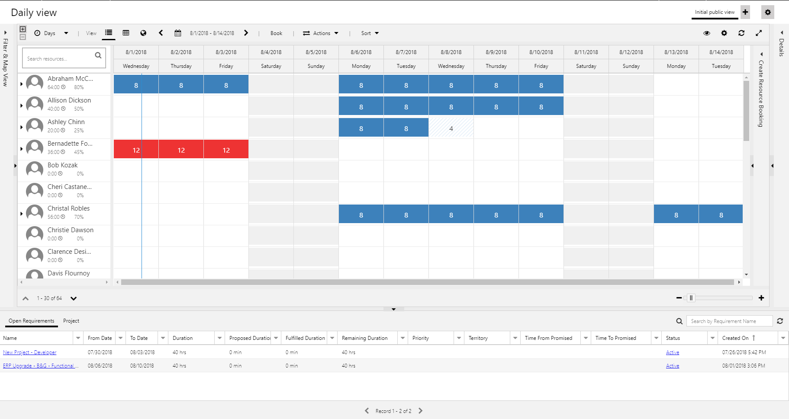

2. Using the primary requirement generated when a project is created. These show up on the Schedule Board on the Project tab. If you have many projects, you may find it easier to use the column filters to find the specific project you are wishing to book to.

> [!div class="mx-imgBorder"] > 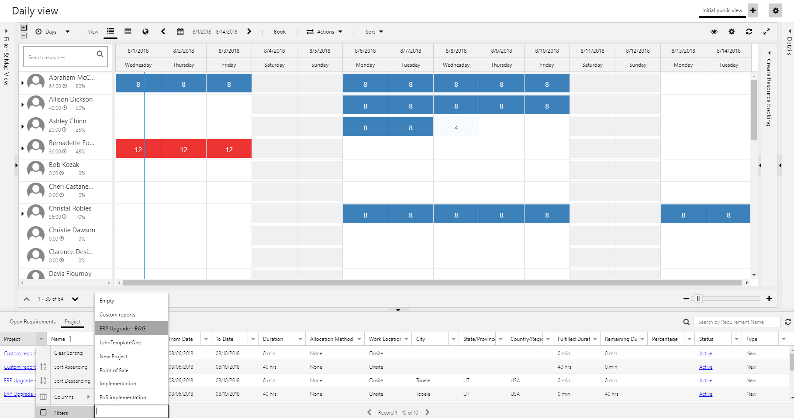

3. Creating a resource requirement from scratch and booking from it. You can create a resource requirement from scratch and associate it to a project. On the Schedule Board the resource requirement shows up on the Open Requirements tab.

## Booking from a generated resource requirement.

You create a generic resource and assign it a task or multiple tasks in a project. You then generate a resource requirement from the generic team member. On the Schedule Board, they will show up on the Open Requirements tab. You may need to use column filters on the grid if you have many open requirements. Click on the requirement to select it. Notice the Find Availability tab appears at the top of the selected row.

> [!div class="mx-imgBorder"] > 
 
Clicking on the tab launches the Schedule Assistant mode of the Schedule Board and filters the available resources that meet the resource requirement.

> [!div class="mx-imgBorder"] > 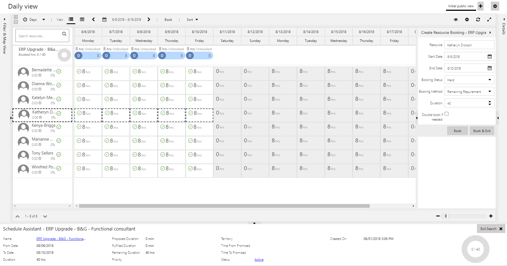
 
From there you can book a resource.
You can also drag and drop the selected row from the bottom of the Schedule Board to a resource in the grid above. Select the requirement and drag it to a resource’s cell.

> [!div class="mx-imgBorder"] > 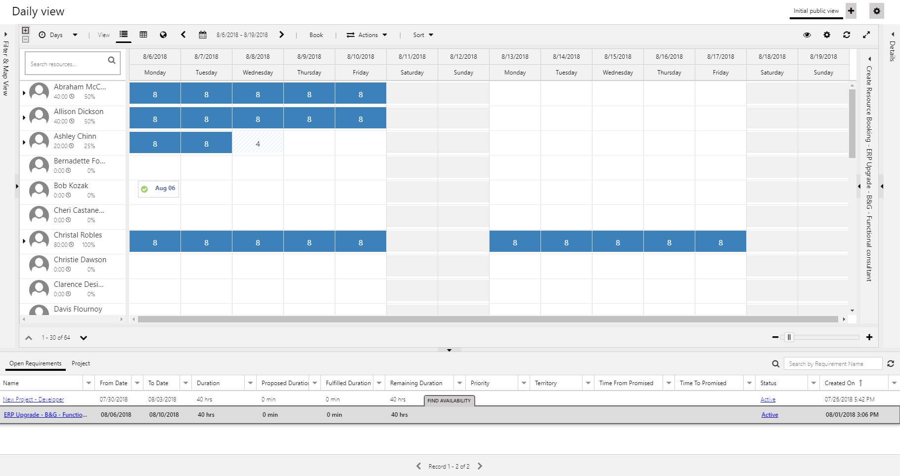
 
When you drop it, it opens the Create Resource Booking panel on the right.

> [!div class="mx-imgBorder"] > 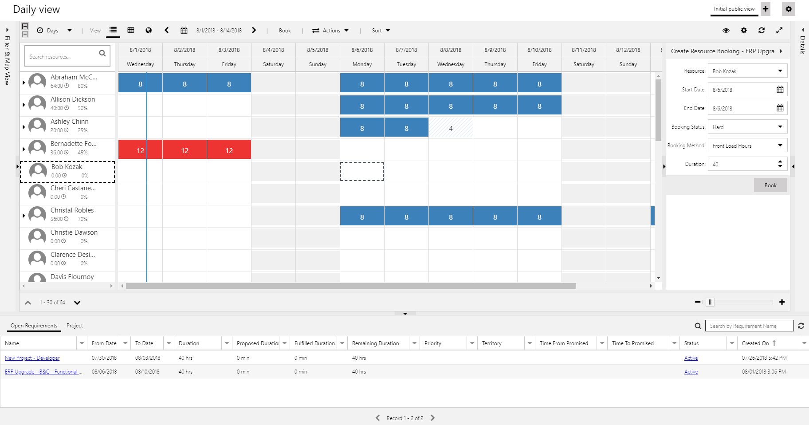
 
Clicking Book books the resource onto the project team.

> [!div class="mx-imgBorder"] > 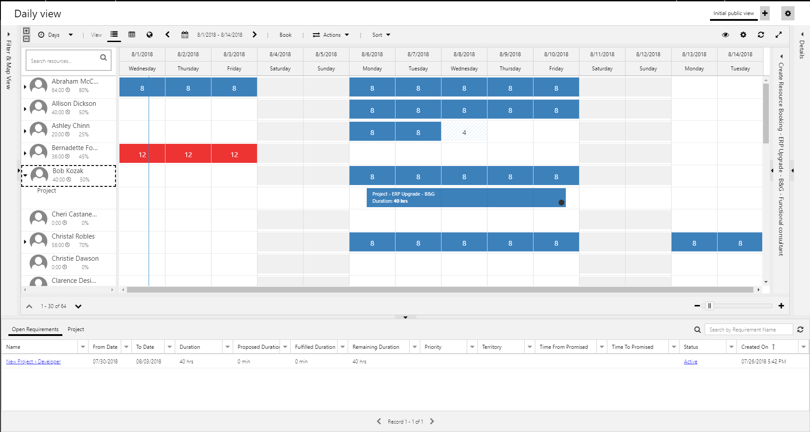
 
## Booking from the Primary Requirement

When you create a project in Project Service, a resource requirement, called the Primary Requirement is created automatically. This is an empty requirement that is used to quickly book a resource with the Schedule Board without either generating a requirement or creating one from scratch. Because the requirement is empty, you’ll need to specify dates as well as the allocation method and hours if applicable. 

To book a resource with the Primary Requirement, on the Schedule Board, click the Project tab. You may need to use the column filter on the Project column if you have many projects.
Click the requirement that only has the project name as its name and has a duration of 0.
 
> [!div class="mx-imgBorder"] > 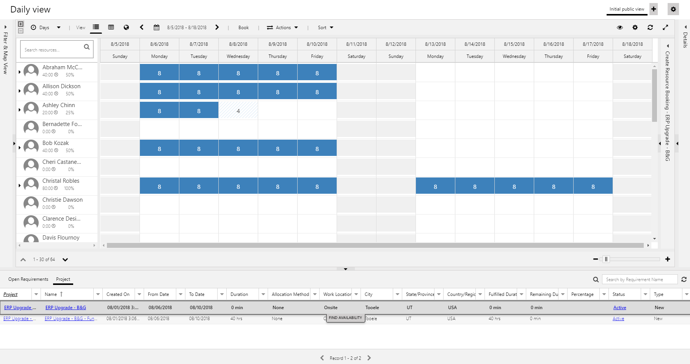

Click on the Find Availability tab that appears on the row. This puts the Schedule Board in the Schedule Assistant mode and shows available resources that can be booked onto the project.

Note that because a Primary Requirement is an empty requirement with 0 duration, you’ll need to set the duration on the Create Resource Booking panel when selecting and booking a resource.

> [!div class="mx-imgBorder"] > 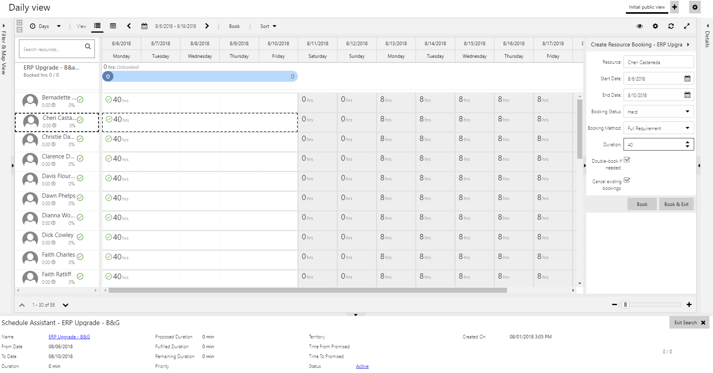
 
You can also select the Project Primary Requirement at the bottom of the Schedule Board and drag it and drop it on a resource to book them.

> [!div class="mx-imgBorder"] > 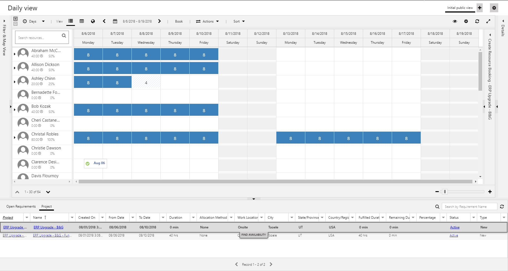
 
Since the Primary Requirement is an empty requirement that has 0 duration, you’ll need to set the duration on the Create Resource Booking panel when selecting and booking a resource.

> [!div class="mx-imgBorder"] > 
 
When you book a resource through the Primary Requirement on the Schedule Board, you add them to the project team without any assignments.

> [!div class="mx-imgBorder"] > 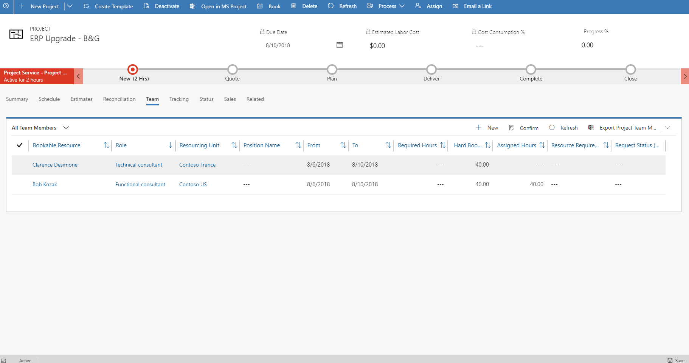
 
## Booking from a new resource requirement

Go to Resource Requirements and click New to create a new resource requirement.

> [!div class="mx-imgBorder"] > 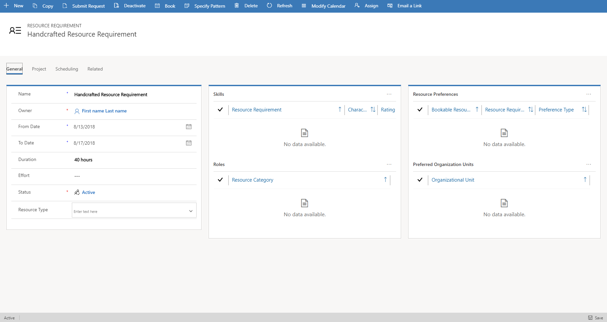
 
You associate the requirement to a project by clicking the Project tab of the requirement and selecting a project.

> [!div class="mx-imgBorder"] > 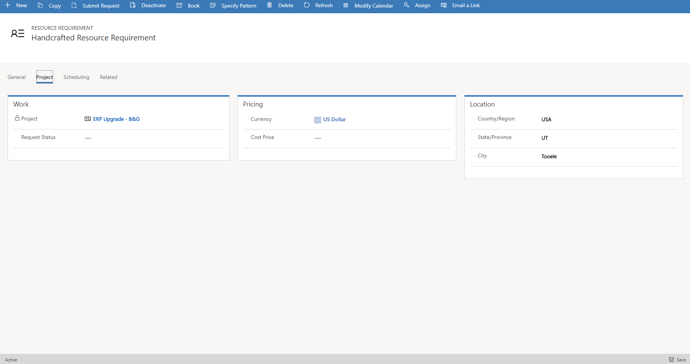
 
This newly-created requirement shows as an Open Requirement on the Schedule Board that you can fulfill.

> [!div class="mx-imgBorder"] > 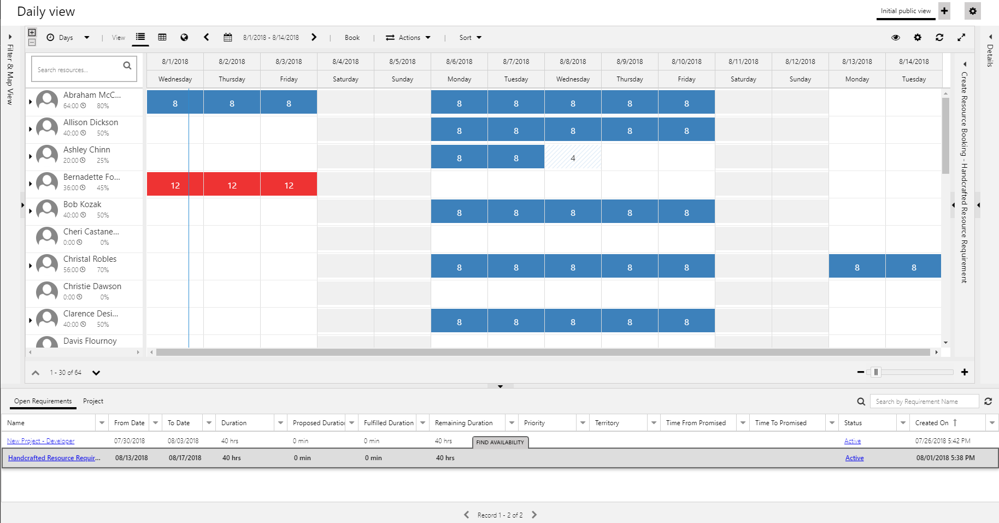

Booking the resource adds them to the project team.

> [!div class="mx-imgBorder"] > 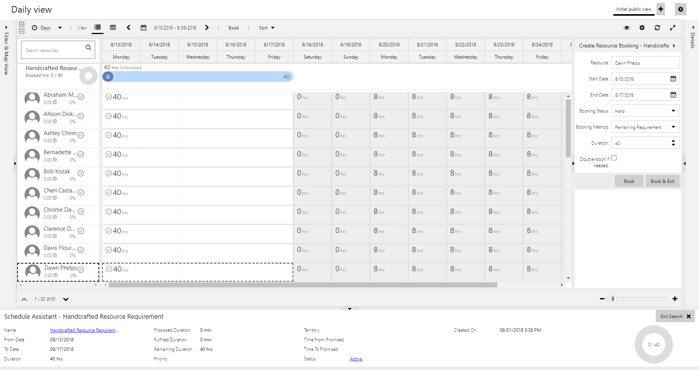
 
At this point they’re booked, and you’ll need to assign them tasks manually.

> [!div class="mx-imgBorder"] > 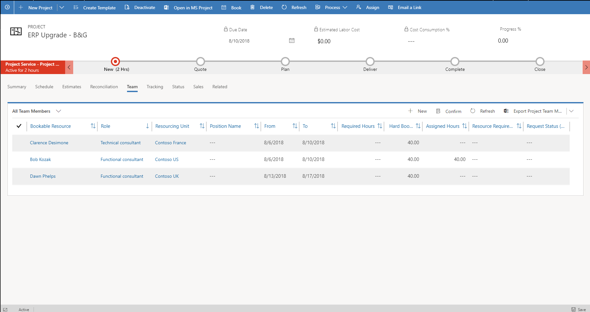
 
