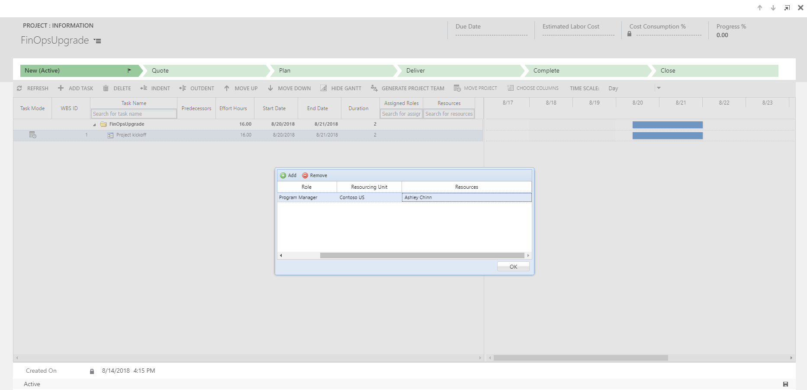
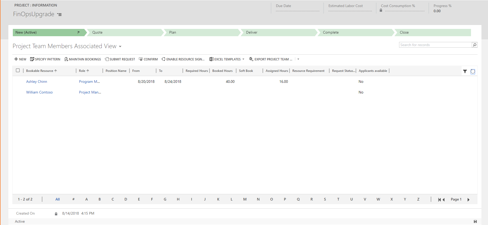
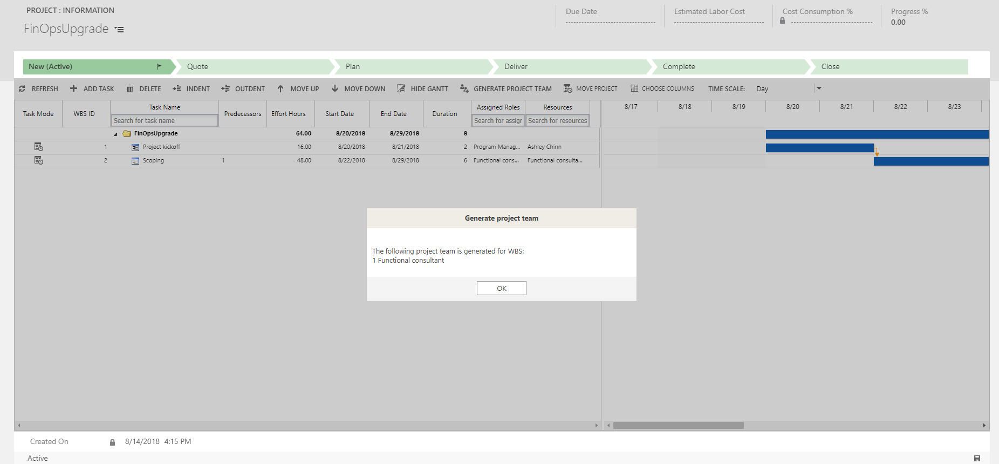
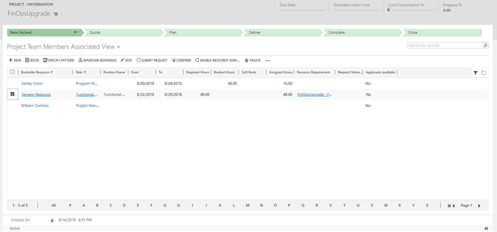
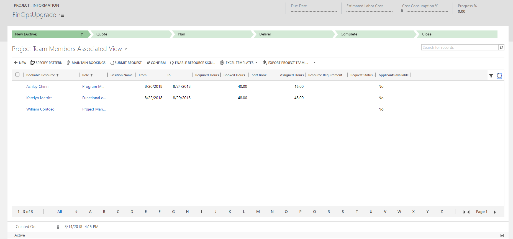

---

title: How do I assign a bookable resource to a task in the web app 
description: An overview of the ways you can assign bookable resources.
author: JohnPBurrows 
manager: kfend
ms.service: dynamics-365-customerservice
ms.custom:
  - dyn365-projectservice
ms.date: 8/21/2018
ms.topic: article
ms.prod: 
ms.service: business-applications
ms.technology: Dynamics 365 for Customer Engagement Project Service 2.x on platform version 9.x
ms.author: john.burrows
audience: Admin
search.audienceType: 
  - admin
  - customizer
  - enduser
search.app: 
  - D365CE
  - D365PS
---

<!--from editor: The metadata includes a mention of Customer Engagement in the ms.technology entry. What should this be updated to? -->

# How do I assign a bookable resource to a task in the web app (Project Service app v2.x)?

[!INCLUDE[cc-applies-to-psa-app-1.x-2.x](../includes/cc-applies-to-psa-app-1x-2x.md)]

There are two ways to assign a resource to a task in Project Service. You can book a resource as a team member and then assign it to a task. Or, you can create a generic team member through role assignment on tasks, generate a team, and then fulfill the backing requirements with a named resource.

Note that if you’d like to assign a bookable resource to a task, the bookable resource team member must have enough available bookings. The status of the booking must be Commit Type Hard Book and Status Committed. If there aren’t enough bookings for the resource, Project Service removes the assignment and displays the following error message:

*Unable to assign resource to task - Following resource(s) do not have sufficient hours booked against project*

## Book a resource as a team member and then assign the resource to a task

With this method you add a resource to the project team and then assign tasks to the resource in the project schedule. Here’s how you do this:
1.	On the team member grid, add a new team member by selecting **New**.
2.	On the Team Member Quick Create screen, select the bookable resource name and set a role.
3.	Select the **From** and **To** dates.

    > [!div class="mx-imgBorder"] 
    > 
 
4.	Select one of the following allocation methods for booking the resource:
    - **Full Capacity** books the resource’s full capacity for the specified from and to dates.
    - **Percentage Capacity** books the resource for a percentage of the resource's capacity for the specified from and to dates.
    - **By Hours Distribute Evenly** books the resource for a specified number of hours, distributing it evenly per day over the specified from and to dates.
    - **By Hours Front Load** books the resource for a specified number of hours, front-loading the per-day hours over the specified from and to dates.

    Don’t select **None** because it adds the resource to the team but doesn’t create any bookings that absorb the resource's capacity.
5.	Select **Save**.

    Note that the hours of the booking must be enough to cover the effort hours and date ranges of the tasks that you assign this resource to. If they aren’t in alignment, you can’t assign the resource to the task.

6.	On the work breakdown structure (WBS) for the task, click the resource cell dropdown. Then: 

    1. Select **Add**.
    2. Select the dropdown under **Resources** and select the team member you added above.
    3. Select **OK**. The team member is now assigned to the task.

    > [!div class="mx-imgBorder"] 
    > 
 
On the team member grid, you’ll see the aggregate of the resource’s assigned hours under Assigned Hours. It will be less than or equal to the booked hours for the resource. 

> [!div class="mx-imgBorder"] 
> 
 
If the task you’re attempting to assign to the resource starts after the end date of the resources bookings, the resource won’t appear in the dropdown.

Note that you can assign a resource to more hours than their booked hours if the resource has some remaining unassigned capacity. In this case the resource will only be partially assigned up to their bookings. You can see these remaining unassigned task hours by adding the Unstaffed Hours column to the work breakdown structure.

If resources are assigned to their booked hours (their booked hours equals their assigned hours), you’ll see the following error message when you attempt to assign them further tasks:

*Unable to assign resource to task - Following resource(s) do not have sufficient hours booked against project.*

Additionally, the default project manager team member that is added to the team when you create the project is added without any bookings and can’t be assigned to any task. They won’t show up in the resource dropdown for tasks.

If you want to assign this resource, you need to remove them from the team and then re-add them with an allocation method other than None. The reason they’re added to the team when the project is created is so that a project has at least one project approver by default.

## Create a generic team member through role assignment on tasks

This method assures that resources have enough bookings for tasks. First, you create a placeholder or generic resource that describes the characteristics of the named resource you ultimately want to work on the tasks by generating a team after assigning roles to tasks. Here’s how you do this:

1. On the work breakdown structure, select a task.
2. Select the **Assigned Role** dropdown icon in the resource cell.
3. Select the **Role** dropdown and select the role for the generic resource.
4. Select **OK**.

    > [!div class="mx-imgBorder"] 
    > 
 
Once you’ve completed assigning roles to the tasks in the WBS, select **Generate Project Team**. Project Service creates the minimum number of generic team members based on the roles, resourcing organization units, and project calendar by aggregating the task assignments.

> [!div class="mx-imgBorder"] 
> 
 
On the Team Member grid, you’ll see resources of the Generic Resource type with the role and position name. If two resources are needed for a role to complete the work, the Generate Team feature creates two team members and uses position name to set them apart.

> [!div class="mx-imgBorder"] 
> 
 
You can open the backing resource requirement for the generic team member by selecting the link under Resource Requirement.

> [!div class="mx-imgBorder"] 
> 

Select **Book** for the generic resource, and then you can use the schedule board to find and book a real resource. You can also submit the requirement for fulfillment by a resource manager by selecting **Submit Request**.

When the generic resource is fulfilled with a named resource, the generic resource is removed from the team and the task assignments for the generic resource are assigned to the named resource that fulfilled the generic resource’s resource requirement.
 

