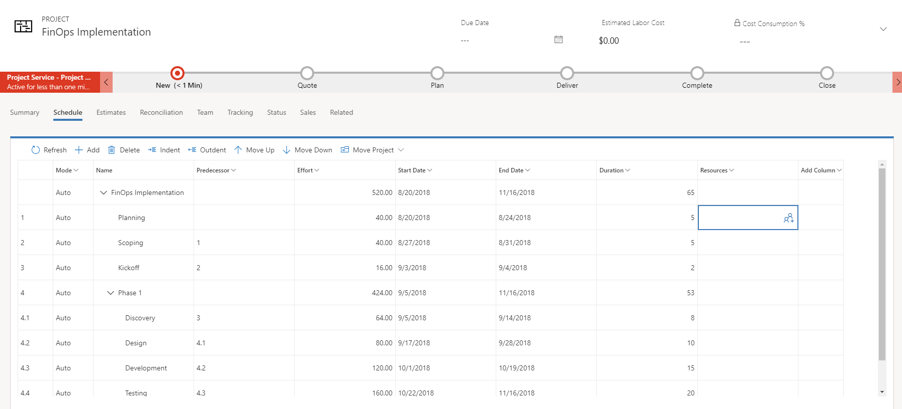
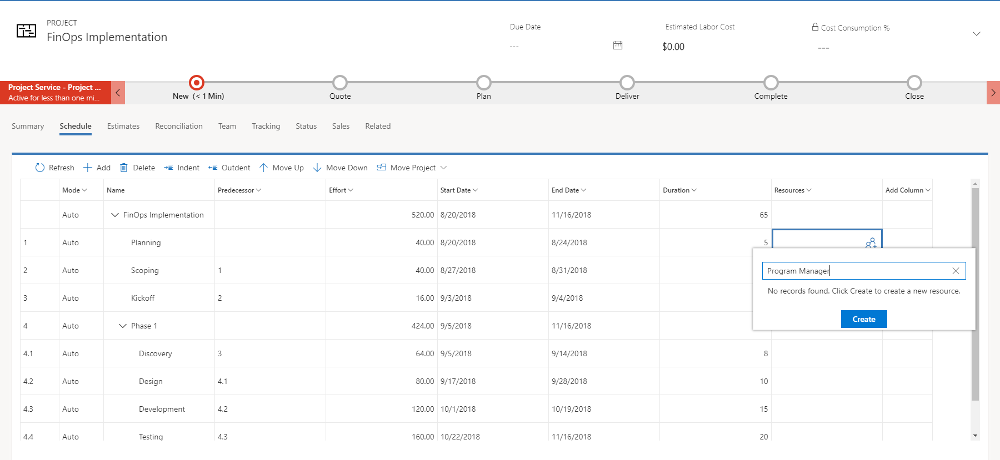
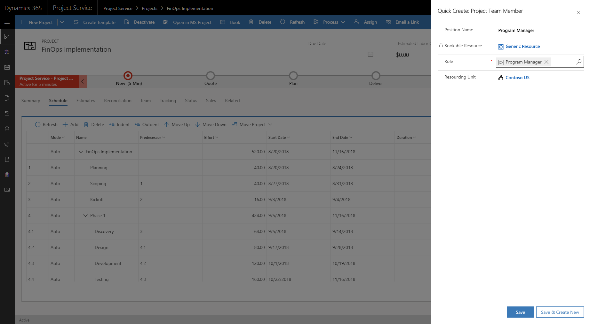
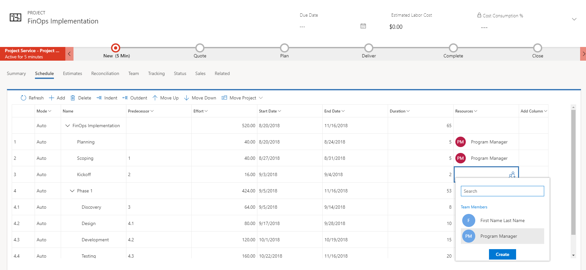
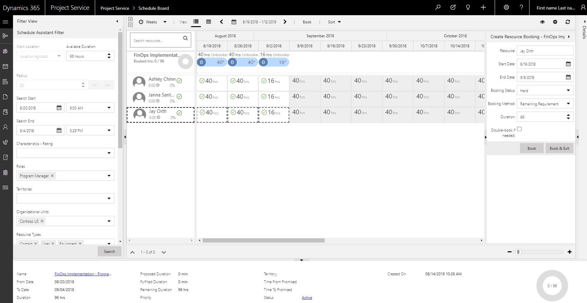
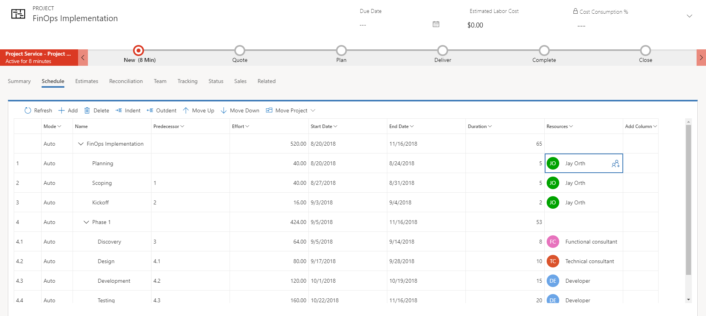
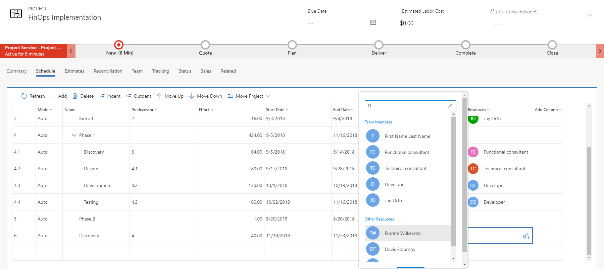

# How do I assign a resource to a task?

[!INCLUDE[cc-applies-to-psa-app-3.x](../includes/cc-applies-to-psa-app-3x.md)]

In this FAQ, we’ll describe the three ways you can assign a resource to a task in Project Service.

## Booking a resource as a team member and then assigning the resource to a task

You can add a resource to the project team and then assign the resource to tasks in the project schedule.

On the **Team Member** tab, you can add a new team member by selecting **New**. That opens the Team Member Quick Create panel, where you can select the bookable resource name and set a role. After that, choose one of the following allocation methods for the resource’s booking:
- **Full Capacity** books the resource’s full capacity for the specified from/to dates.
- **Percentage Capacity** books the resource for a percentage of the resource's capacity for the specified from/to dates.
- **By Hours Distribute Evenly** books the resource for a specified number of hours, distributing them evenly per day over the specified from/to dates.
- **By Hours Front Load** books the resource for a specified number of hours, front-loading the per-day hours over the specified from/to dates.
- **None** adds the resource to the team but doesn’t create any bookings that absorb their capacity.

On the Schedule grid for a task, select the **Resource** icon in the resource cell, and then select the team member you just added. They appear under Team Members.

Note that both on the Team Member tab and the Reconciliation tab, the resource shows booked hours and assigned hours. They should be the same, but don’t have to be as bookings and assignments are not tightly coupled. The Reconciliation tab gives you details when they are different, such as when you assign a resource more hours than you have booked. You can then take corrective action with this information, either extending the resource's bookings or changing the assignment.

## Creating a generic team member through task assignment

With this method you create a placeholder or generic resource that describes the characteristics of the named resource you ultimately want to work on the tasks. You then generate a requirement (or submit a request using the requirement) that is used to search and book the named resource.

1.	On the Schedule grid for a task, select the resource icon in the resource cell.

    > [!div class="mx-imgBorder"] 
    > 

2.	Type a name to serve as the placeholder resource’s name; for example, “Program Manager.”

    > [!div class="mx-imgBorder"] 
    > 
 
3.	Select **Create**.

4.	On the Quick Create Project Team Member field to the right, set the role for the generic resource.

    > [!div class="mx-imgBorder"] 
    > 
 
5.	You can continue to assign tasks to this placeholder resource by selecting the resource on the resource selector for the task. They’re listed under Team Members.

    > [!div class="mx-imgBorder"] 
    > 
 
6.	When you’re done assigning the generic resource, select the generic resource on the **Team** tab and select **Generate Requirement** to create a resource requirement for the generic resource.

    > [!div class="mx-imgBorder"] 
    > 
 
7.	Select **Book** for the generic resource. You can then use the schedule board to find and book a real resource. You can also submit the requirement for fulfillment by a resource manager.

    > [!div class="mx-imgBorder"] 
    > 
 
8.	When the generic resource is fulfilled with a named resource, the generic resource is removed from the team and the task assignments for the generic resource are assigned to the named resource that fulfilled the generic resource’s resource requirement.

    > [!div class="mx-imgBorder"] 
    > 

## Assigning a named resource from the list of all bookable resources

You can use the search box in the resource selector to search all the bookable resources in Project Service and assign them to a task.

1.	On the Schedule grid for a task, click the **Resource** icon in the resource cell.
2.	Start typing a name.
3.	Search results for the name are displayed in the resource selector under Other Resources.
4.	Select the resource and they will be assigned to the task.

    > [!div class="mx-imgBorder"] 
    > 
 
Resources assigned this way are added to the team without any bookings (like adding a team member and selecting none as the allocation method). They’re displayed in the Team tab and Reconciliation tab as resources with only assignments and a booking deficit. Book them if you want to use their availability.

