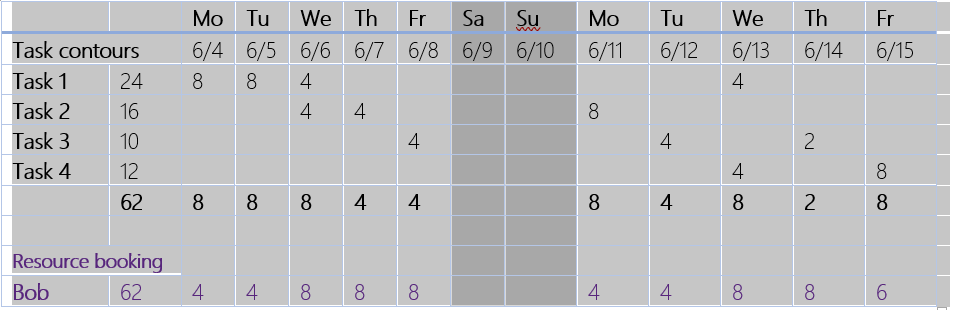

---

title: How are resource bookings and task assignments related? (Dynamics 365 for Project Service) | MicrosoftDocs
description: How does Project Service manage named resources, resource bookings and task assignments.
author: neil.orint 
manager: ShellyHa
ms.service: dynamics-365-customerservice
ms.custom:
  - dyn365-projectservice
ms.date: 8/9/2018
ms.topic: article
ms.prod: 
ms.service: business-applications
ms.technology: 
ms.author: john.burrows
audience: Admin

---
# How are resource bookings and task assignments related?

In Project Service, named resources can be booked to a project team and assigned project tasks in two ways: 
- The resource can be directly booked onto a project and then subsequently assigned to project tasks.
- The tasks can be assigned to a generic or placeholder resource, which is then used to find and replace the generic with a real, named resource. 
In both cases, the act of booking the resource reserves the resource’s capacity.

The project manager planning the project owns the project plan and schedule. By using the generic resource for assignment and then generating a resource request from it the project manager can book resources onto the project with contours specified in the project plan. They can book resources onto a project and then assign them to tasks, but there is no way to align the booking contours with the contours of the tasks. Project Service doesn’t let bookings affect the project schedule.

Consider a complex project with multiple overlapping tasks where multiple resources of the same type need to work concurrently. If a resource is given a contour that differs from that of the aggregate of their assignments, it’s difficult to modify the tasks to fit the contour of the bookings to their discrete tasks and their original contours.

In the example below, the total effort required by the same resource from a set of four tasks is 62 hours over a two-week period and there is a specific contour. If the resource Bob is booked for 62 hours during the same two weeks but with a different contour, the requirement and bookings are in alignment.

> [!div class="mx-imgBorder"] 
> 

However, there is no systematic way to assign the booked hours contour to tasks on a per-day basis. If the project manager is willing to change the project schedule to meet the availability of the resource, then they’ll have to remove the assignment and revise all the tasks to match the booking contours.

In the case where an organization has given the task of project planning to both a project manager and a resource manager, the project manager sets the schedule, and that includes contouring of the work required. The resource manager shouldn’t be able to affect the schedule without the project manager’s knowledge by changing effort contours while booking real resources. If the resource manager is fulfilling something different from what the project manager requested, they need to come to agreement about what changes are needed in the project schedule.

Since bookings and assignments in Project Service are not tightly coupled, it’s possible to book contours that are different than the task contours or change the assignments to result in circumstances where bookings and assignments are out of alignment.

Project Service has a Reconciliation View that allows the project manager to see the bookings and assignments for each project team member. The view uses colors and shading to show where there is a mismatch between a team members bookings and assignments. Based on this information, the project manager can take corrective action to either extend resource bookings for cases where there are assignments and no bookings or cancel bookings where resources are booked but have no assignments.

Note that if you move a task that you have contoured yourself, these contours aren’t maintained. The contours are regenerated according to the project calendar to account for changes in work hours and holidays. This is by design since the system doesn’t know the intent of the original contour and can’t determine whether it makes sense to retain that contour in a new time period. Since bookings and assignments are disconnected, the bookings retain the original booking contours. In this case, you’ll need to cancel and rebook to the new assignment contour.

