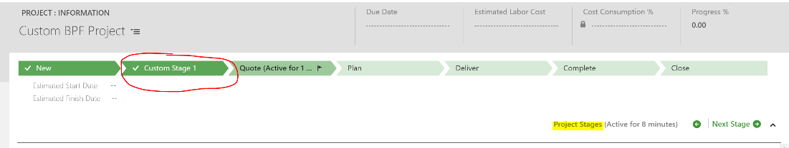
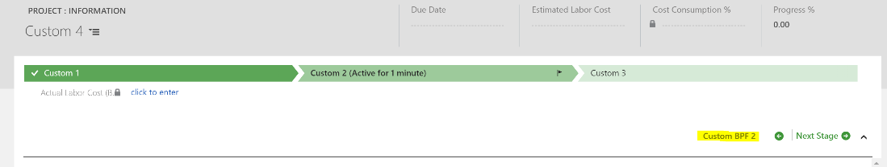
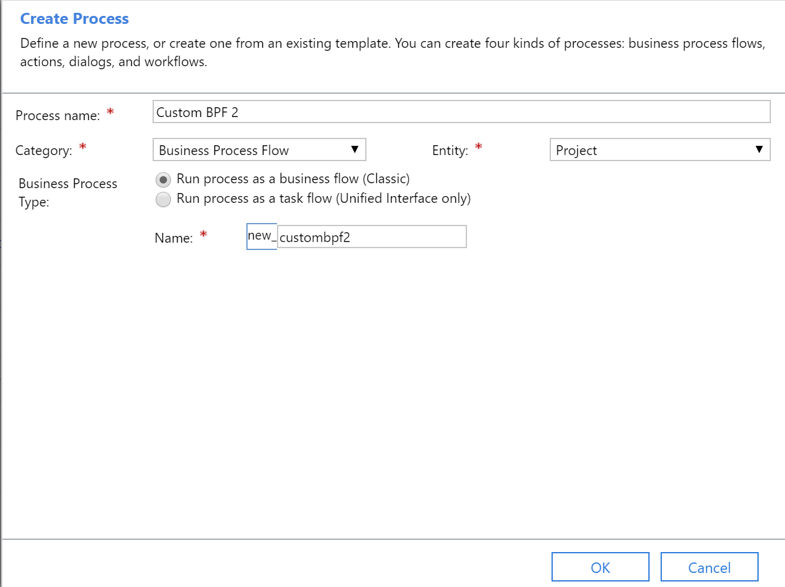
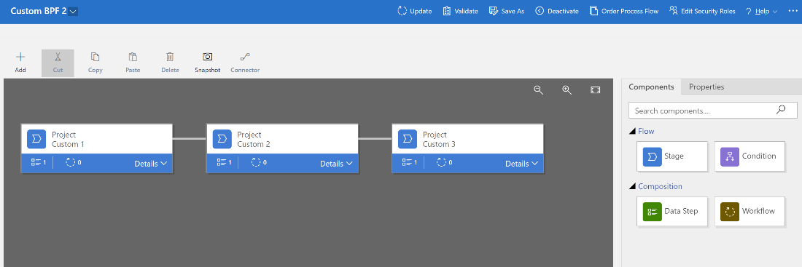
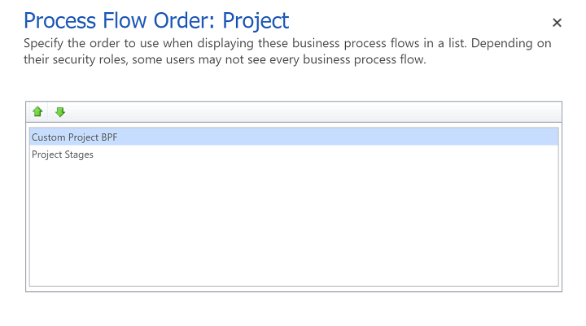
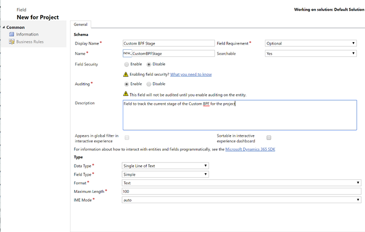
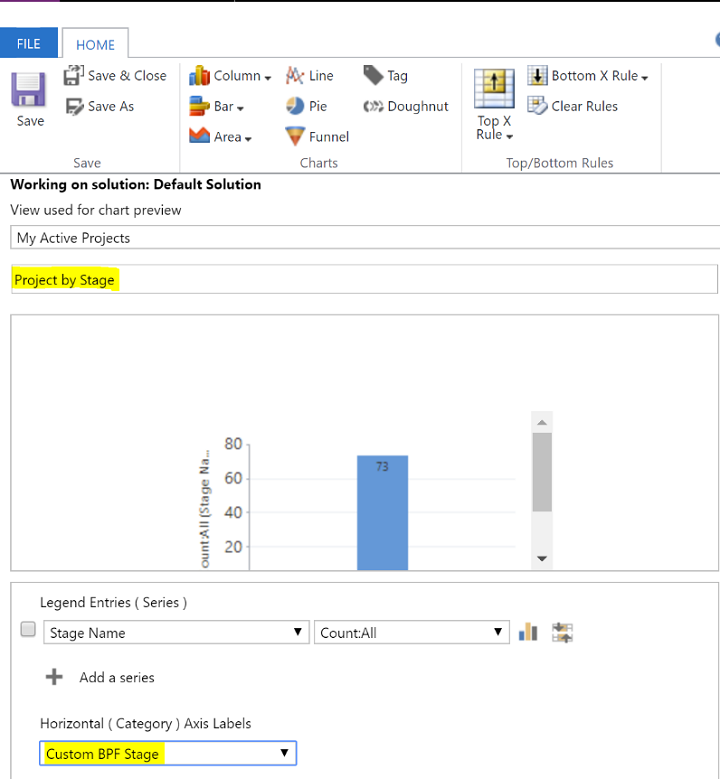
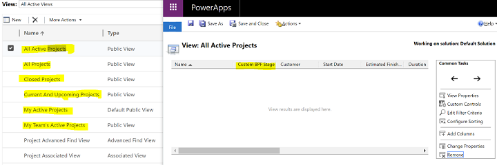

# How do I customize the Project Stages business process flow?
[!INCLUDE[cc-applies-to-psa-app-2-4x-9-0-platform](../includes/cc-applies-to-psa-app-2-4x-9-0-platform.md)]
[!INCLUDE[cc-applies-to-psa-app-1x-8-2-platform](../includes/cc-applies-to-psa-app-1x-8-2-platform.md)]

There's a known limitation in earlier versions of the Project Service application that the names of the stages in the Project Stages business process flow must exactly match the expected English names (**Quote**, **Plan**, **Close**). Otherwise, the business logic, which relies on the English stage names, doesn't work as expected. That's why you don't see familiar actions such as **Switch Process** or **Edit Process** available on the project form, and customizing the business process flow isn't encouraged. 

This limitation has been addressed in version 2.4.5.48 and later. This article provides suggested workarounds if you need to customize the default business process flow for earlier versions.  

## Business logic requires an exact match with English stage names

The Project Stages business process flow includes business logic that drives the following behaviors in the app:
- When the project is associated with a quote, the code sets the business process flow to the **Quote** stage.
- When the project is associated with a contract, the code sets the business process flow to the **Plan** stage.
- When the business process flow is advanced to the **Close** stage, the project record is deactivated. When the project is deactivated, the project form and work breakdown structure (WBS) are set to read-only, the named resource bookings are released, and any associated price lists are deactivated.

This business logic relies on the English names for the project stages. This dependency on the English stage names is the main reason why customization of the Project Stages business process flow isn't encouraged, as well as why you don’t see the common business process flow actions like **Switch Process** or **Edit Process** on the project entity.

## What happens if the stage names don't match the English names?

In the Project Service app version 1.x on the 8.2 platform, when the stage names in the business process flow don’t match the English stage names exactly, the business logic that sets the right stage for quotes or contracts, or that closes the project, is skipped. No error messages are displayed. Therefore it appears that you are able to customize the Project Stages business process flow. However, you won’t see any of the automatic processes working for quotes, contracts, and project close.

In the Project Service app version 2.4.4.30 or earlier on the 9.0 platform, there was a significant architectural change to business process flows, which required a re-write of the business process flow business logic. As a result, if the process stage names don’t match the expected English names, you do receive an error message. 

Therefore, if you want to customize the Project Stages business process flow for the project entity, you can only add brand new stages to the default business process flow for the project entity, while keeping the **Quote**, **Plan**, and **Close** stages as-is. This restriction ensures that you don’t get errors from the business logic that expects the English stage names in the business process flow.

In version 2.4.5.48 or later, the business logic described in this article has been removed from the default business process flow for the project entity. Upgrading to that version or later will let you customize or replace the default business process flow with one of your own. 

## Workarounds for earlier versions

If upgrading isn't an option, you can customize the Project Stages business process flow for the project entity in one of these two ways:

1. Add additional stages to the default configuration, while retaining the English stage names for **Quote**, **Plan**, and **Close**.

   > [!div class="mx-imgBorder"] 
   > 
 
2. Create your own business process flow and make it the primary business process flow for the project entity, which lets you have any stage names you want. However, if you want to use the same standard project stages **Quote**, **Plan**, and **Close**, you need to do some customizations that are driven off your custom stage names. The more complex logic is in the closing of the project, which you can still trigger by just deactivating the project record.

   > [!div class="mx-imgBorder"] 
   > 

### Additional considerations for Project Service app version 2.4.4.30 or earlier on platform 9.0

In Project Service 2.4.4.30 or earlier on platform 9.0, with a custom business process flow the **Stage Name** field on the project entity used in the **Project By Stage** chart and project list views won’t update, because it’s coupled to the default Project Stages business process flow. You can address this issue with the following steps:

- Add a custom field to capture the current business process flow stage that is updated as the user advances through the custom business process flow.

- Modify the **Project By Stage** chart to work with your custom field instead of the default configuration.

### Steps to create your own business process flow for the project entity

To create your own business process flow for the project entity do the following:

1. Go to **Settings** > **Process Center**. Don’t copy the Project Stages business process flow because that also copies the Project Service business logic.

   > [!div class="mx-imgBorder"] 
   > 

2. Use the Process Designer to create the stage names you want. If you want the same functionality as the default stages for **Quote**, **Plan**, and **Close**, you’ll have to create that based on your custom business process flow’s stage names.

   > [!div class="mx-imgBorder"] 
   >  

3. In the Process Designer, click **Order Process Flow** to make the custom business process flow the primary business process flow for the project entity by moving it above the Project Stages business process flow to the top of the list.

   > [!div class="mx-imgBorder"] 
   > 

### The following steps apply to Project Service app 2.4.4.30 or earlier on the 9.0 platform

4. Add a new custom field to the project entity to capture the custom stages in your custom business process flow. You’ll need to add business logic (plugin/workflow) to update this field when the stage on the custom business process flow is updated.

   > [!div class="mx-imgBorder"] 
   > 

5. Modify the **Project By Stage** chart to use your new custom field for stages.

   > [!div class="mx-imgBorder"] 
   > 

6. Modify any views for the project entity to include your new custom field for stages.

   > [!div class="mx-imgBorder"] 
   > 

