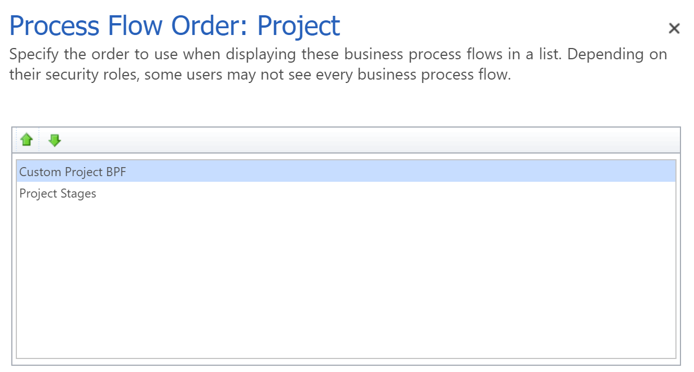
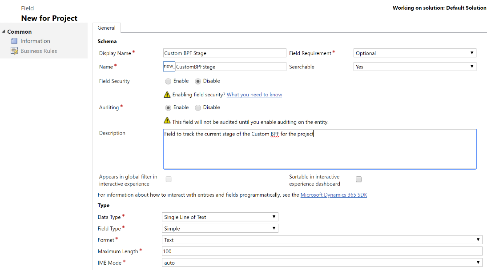
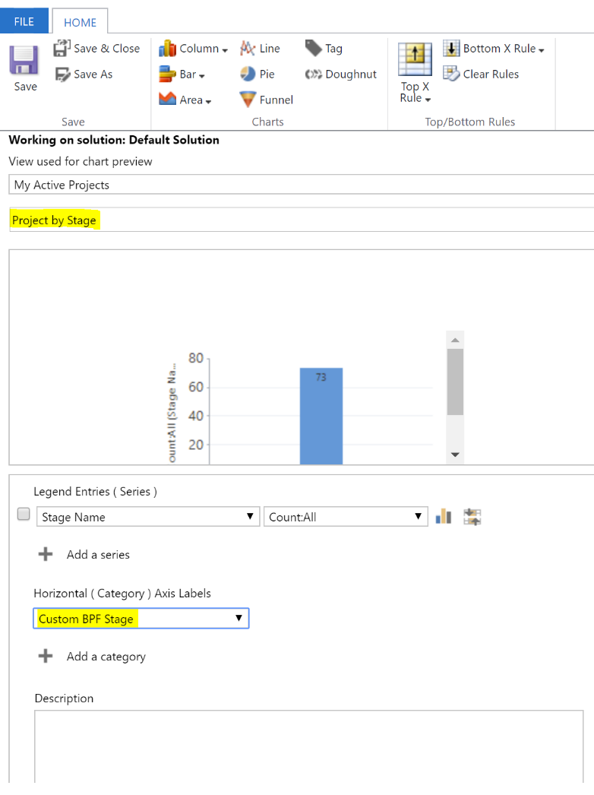

---

title: How do I customize the business process flow? (Dynamics 365 for Project Service) | MicrosoftDocs
description: An overview of how to customize the business process flow (BPF) in Dynamics 365 Project Service.
author: NeilWOrint 
manager: ShellyHa
ms.service: dynamics-365-customerservice
ms.custom:
  - dyn365-projectservice
ms.date: 8/27/2018
ms.topic: article
ms.prod: 
ms.service: business-applications
ms.technology: Dynamics 365 for Project Service 3.x
ms.author: john.burrows
audience: Admin
search.audienceType: 
  - admin
  - customizer
  - enduser
search.app: 
  - D365CE
  - D365PS
  
  ---

# How do I customize the business process flow?

In Project Service version 1.x on the 8.2 platform and version 2.4.4.30 or earlier on the 9.0 platform, the Project Stages Business Process Flow (BPF) project entity includes business logic that drives the following product behaviors:
- When the project is associated with a quote, the code sets the Project Stages BPF to the Quote stage.
- When the project is associated with a contract, the code sets the Project Stages BPF to the Plan stage.
- When the Project Stages BPF is advanced to the Close stage, the project record is deactivated. When the project is deactivated, the project form and work breakdown structure (WBS) are made read-only, the named resource bookings are released, and any associated price lists are deactivated.

The business logic built into the project entity BPF relies on the English stage names to drive these behaviors.

This dependency on the English stage names is the main reason why we’ve discouraged the customization of the Project Stages BPF as well as why you don’t see the common BPF process actions like switch or edit on the project entity.

In Project Service version 1.x on the 8.2 platform, when the stage names within the BPF don’t match the English stage names exactly, the BPF-driven business logic that sets the right stage for quotes or contracts or close the project is skipped and no error messages are displayed. This behavior explains why it appears that you can customize the BPF in this version. However, you won’t see any of the automatic processes working for quotes, contracts, and project close.

In the 9.0 platform, there was a significant architectural change to BPFs at the platform level, which required a re-write of the BPF logic. The impact to Project Service version 2.4.4.30 or earlier is that if the process stage names in the Project Stages BPF don’t match the expected English names, an error is displayed. As a result, if you want to customize the shipped BPF for the Project entity, you can only add new stages to the default BPF for the project entity, keeping the Quote, Plan, and Close stages. This restriction ensures that you don’t get errors from the business logic that expects the English stage names to be in the BPF.

In version 2.5.x.x or later, the business logic described above has been removed from the default BPF for the project entity. Upgrading to that version or later lets you customize or replace the default BPF with one of your own. If upgrading is not an option, you can customize the Project entity BPF by either:

1. Adding additional stages to the default configuration, retaining the English stage names for Quote, Plan, and Close.

> [!div class="mx-imgBorder"] > 
 
2. Creating your own BPF and making it the primary BPF for the project entity, which lets you have any stage names you wish. However, if you want the same standard project stages such as Quote, Plan, and Close, you need to do some customizations that are driven off your custom stage names. The more complex logic is in the closing of the project, which you can still trigger by just deactivating the project record.

> [!div class="mx-imgBorder"] > 

In Project Service 2.4.4.30 or earlier (9.0), with a custom BPF, the Stage Name field on the project entity that is used in the Project By Stage chart and project list views won’t update since it’s coupled to the default Project Stages BPF. You can address this issue with the following steps:

- Adding a custom field to capture the current BPF stage that is updated as the user advances through the custom BPF.
- Modifying the project By stage to work with your custom field instead of the default configuration.

To create your own BPF for the project entity do the following:

1. Go to Settings and then Process Center. Don’t copy the Project Stages BPF as that also copies the Project Service-specific business logic.

> [!div class="mx-imgBorder"] > 

2. Use Process Designer to create the stage names you want. If you want to have the same functionality as the default stages for Quote, Plan, and Close, you’ll have to develop that yourself based on your custom BPF’s stage names.

> [!div class="mx-imgBorder"] >  

3. In the Process Designer, click on Order Process Flow to make the custom BPF the primary BPF for the project entity by moving it above the Project Stages BPF to the top of the list.

> [!div class="mx-imgBorder"] > 

4. *Applies to Project Service 2.4.4.30 or earlier (9.0) only.* Add a new custom field to the Project entity to capture the custom stages in your custom BPF. You’ll need to add business logic (plugin/workflow) to update this field when the stage on the custom BPF is updated.

> [!div class="mx-imgBorder"] > 

5. *Applies to Project Service 2.4.4.30 or earlier (9.0) only.* Modify the Project By Stage chart to use your new custom field for stages.

> [!div class="mx-imgBorder"] > 

6. *Applies to Project Service 2.4.4.30 or earlier (9.0) only.* Modify views on the Project entity to include your new custom field for stages.

> [!div class="mx-imgBorder"] > 

