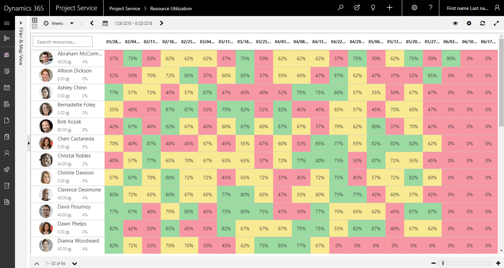
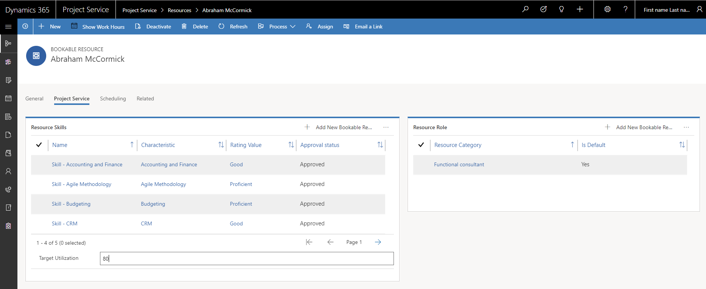
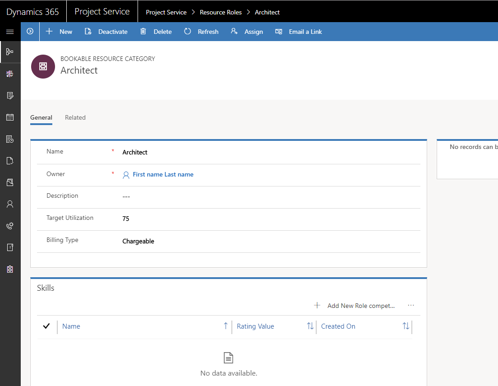

---

title: What is the Utilization View and how do I get it to work? (Dynamics 365 for Project Service) | MicrosoftDocs
description: This article describes how to soft-book project team members with Project Service.
author: NeilWOrint 
manager: ShellyHa
ms.service: dynamics-365-customerservice
ms.custom:
  - dyn365-projectservice
ms.date: 8/21/2018
ms.topic: article
ms.prod: Applies to all versions of Project Service
ms.service: business-applications
ms.technology: Applies to all versions of Project Service
ms.author: john.burrows
audience: Admin

---

# What is the Utilization View and how do I get it to work?
 
You’ll find the Utilization View on the Project Service Resource Utilization screen. The grid shows chargeable utilization for each bookable resource.

> [!div class="mx-imgBorder"] 
> 
 
The view is based on the Schedule Board, so you’ll find many of the same functions you’ll find there.
The chargeable utilization calculation works as follows:

- Chargeable utilization = Chargeable actual hours/resource capacity.

The cells represent the calculated chargeable utilization for the period selected for the view (days, weeks, or months).
The colors in each cell show the chargeable utilization for a resource as compared to their target chargeable utilization. The colors show the following status:

- Green: billable utilization >= resource target utilization.
- Yellow: target utilization – 20 <= billable utilization < target utilization.
- Red: billable utilization < target utilization – 20.

The target utilization can be set on either the resource’s default role or on the individual resource itself. The calculation looks at the individual for the target first, then to the resource’s default role.
You can set the target on a resource in Project Service by clicking Resources and then Resources. Click a resource to open the record and then click on the Project Service tab to set the resource’s target utilization.

> [!div class="mx-imgBorder"] 
> 
 
To set target utilization on a role go to Resources and then Resource Roles. Click on a role to open a record. Set the target utilization for the role.

> [!div class="mx-imgBorder"] 
> 
 
To calculate chargeable utilization for a resource, you need to make some settings. First, target utilization must be set on either the individual resource or on resource roles. 
If you are using resource roles for targets, each individual resource must have a default role. To set this, go to Resources and then Resources. Click a resource to open the record and then click on the Project Service tab. In the Resource Role grid, make sure there’s one role for the resource and Is Default is set to Yes.
 
The resource roles must be set to have a billing type of chargeable. Go to Resources and then Resource Roles. Click on a role to open a record and then set the billing type default to Chargeable.
 
The resource must have working hours for the capacity calculation. To set this, go to Resources, and then Resources. Click a resource to open the record and then click on Show Work Hours. You can bulk-update the list of resources by applying a Work Hour Template from the Resource list view.

The chargeable actual hours are sourced from the Actuals entity. Actuals with billing type of chargeable are included in the calculation and for this reason you must have projects where the actuals that are chargeable.

If you are not seeing chargeable utilization, here are some things you can check:

- The resource has working hours defined for capacity.
- The resource has either an individually defined utilization target or has a default role assigned to it. The role has a utilization target defined for it.
- Actuals have a billing type of chargeable for the period you are expecting a utilization calculation for. Here are some things to check if you are seeing Actuals with billing types other than chargeable:
  - The role used on the actual has a default billing type of something other than chargeable.
  - The role on the project contract line backing the project has been set to non-chargeable.
  - The project does not have an associated contract line.

