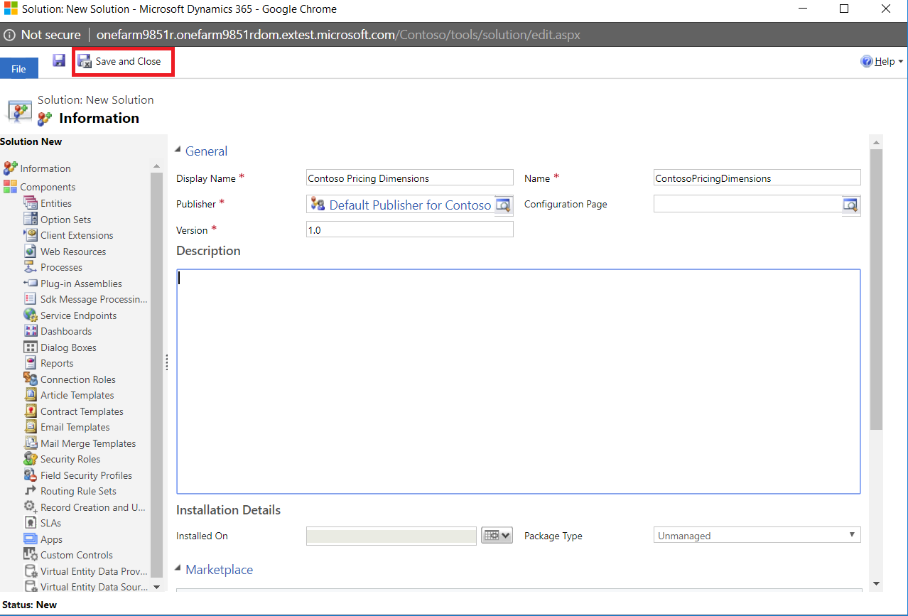

# Create custom entities and option sets in the Power Apps platform

**Important: It is highly recommended that you make all the changes for custom pricing dimensions in a separate solution as shown here. This is an important best practice guideline that can give you a lot of flexibility in removing these changes in the future if you need to and will also help with re-use of your work and make it easy to port these changes to another instance. Once you have made all the required changes, export this solution as a Managed solution and import it into other instances to reuse your pricing setup.**

We will first start with some common steps that you will need to take any time you want to a custom Option set or a custom entity on the Power Apps platform.  

## 1. Create a solution for pricing dimension changes:**

Using the web interface, create a new solution from the Solutions page: Settings->Solutions. Enter all the required fields and save the solution. You can name the solution “<your organization name> Pricing Dimensions.”

*Creating a custom solution for pricing dimensions*
> 
  
  
## 2. Create custom fields and option sets in the pricing dimension solution**

Your pricing dimension may be an option set or an entity. In either case, create them in your pricing solution. Let’s work with an example for this flow. In this walkthrough, we will create 3 pricing dimensions for a fictious company called Contoso:

a. Entity-based dimension called “Standard Title” that has all the standard titles that Contoso uses.

*Standard Title entity definition*
> 

b. Option-set based dimension called “Resource Work Location” where Contoso would like to track the price of “Home” location work and “Onsite” work.

*Resource Work Location definition*
> 

c. Option-set based dimension called “Resource Work hours” with values “Regular” and “Overtime” where Contoso can apply a markup when work is done.

*Resource Work Hours definition*
> 

## 3. Create data for your entity-based dimensions:**
This can be done manually or by using Excel import or service calls. For this walkthrough, we have used “Standard Title” as an entity-based dimension. Let’s create 2 standard titles: Systems Engineer and Senior Systems Engineer. If the data to create is small as in the example, you can use a standard form.

*Sample Data for Standard Title entity*
> 

## 4. Add all the required PSA entities and related components to the Pricing Dimension Solution**
As a next step, you will need to add the following entities in the Project Service to your pricing solution. This step will allow us to make some important schema changes in the pricing solution so that these entities become aware of our new pricing dimensions.

**List of entities to add**
1. Actual
2. Bookable Resource
3. Estimate Line
4. Invoice Line Detail
5. Journal Line
6. Project Contract Line Detail
7. Project Team Member
8. Quote Line Detail
9. Role Price Markup
10. Role Price 
11. Time Entry 

*Add Existing Entities to the Pricing Dimensions Solution*

> 

*Select solution components*

> 

**Note: Make sure to include all forms and views for each of the entities selected.**
On the last step, the platform will prompt you to include any dependent entities for the entities we selected above. Choose the option “No”.

*Do not include all related components*
> 

