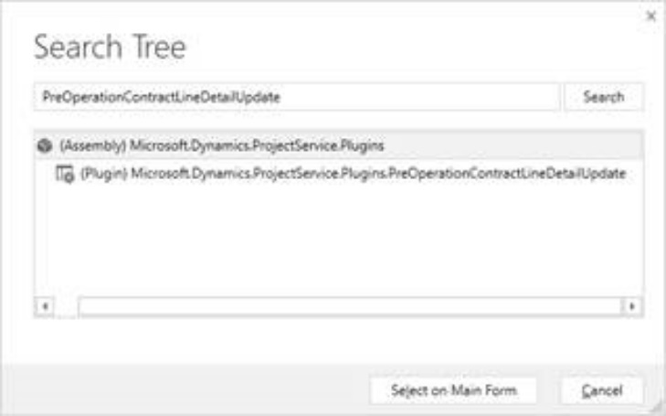
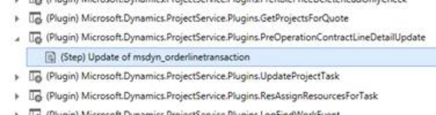
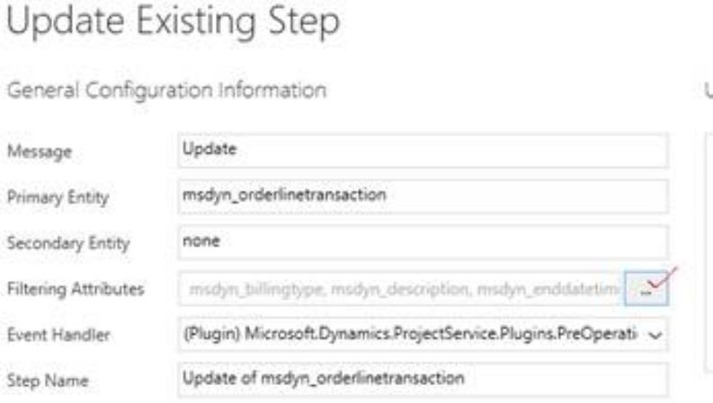
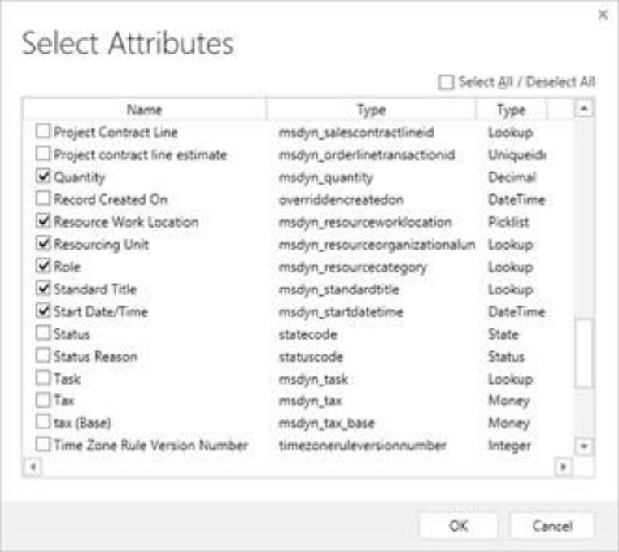
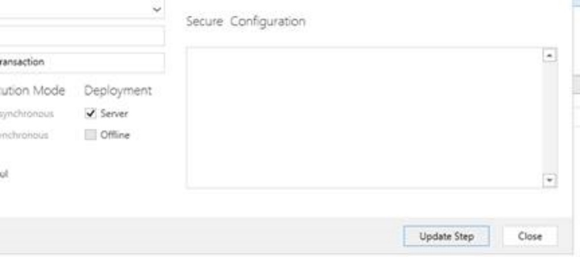

# Step 9: Update plug-in attributes to include newly created pricing dimensions

Whenever a Quote line detail is created on the Quote line form for a Project Quote line, the system creates two estimate lines in the background: one for the cost-side of the estimate and one for sales-side of the estimate. This is true in Project Contract line detail context as well.

Whenever the user makes a change to the quantity or a field on the cost side, that change is propagated to the sales side as well. This is made possible by two plug-ins that will need to be re-registered after a change to pricing dimensions:
*1. PreOperationContractLineDetailUpdate

Step: Update of msdyn_orderlinetransaction

*2. PreOperationQuoteLineDetailUpdate

Step: Update of msdyn_quotelinetransaction

**If you are not using the Project Service Quoting, Contracting features, you can skip this section**

Below are the steps to walk through the process of registering the plugins:

1. Open PluginRegistrationTool and connect to your online instance

2. Click search and search for the plugin to be updated:
*Screenshot of the search tree*
 

3. Once the plugin is found select it and click on “Select on Main Form.”

4. Select the Step of the plugin to be updated and right-click, select Update.

*Screenshot showing an example of a step of the plugin to be updated*
 
 
5. Now in the update window, we click ... in the filtering attributes:

*Screenshot of the Update Existing Step configuration information*
 
 
6. Set checkboxes for pricing attributes:

*Screenshot showing checkbox selection for pricing attributes*
 

7. Click OK to close the form and then select “Update Step.”

*Screenshot showing the “Update Step” button*
 
 
8. Repeat this process for the 2nd plugin: PreOperationQuoteLineDetailUpdate Step: Update of msdyn_quotelinetransaction.

9. Close plug-in registration tool.

