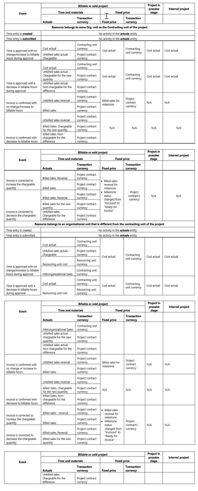

# Actuals

[!INCLUDE[cc-applies-to-psa-app-3.x](../includes/cc-applies-to-psa-app-3x.md)]

In Project Service Automation (PSA), project actuals can be traced back to their source documents including time, expense, and journal entries as well as invoices. 

> 

## Submitting a time entry
Submitting a time entry in PSA for a project that is mapped to a time and material contract line creates two journal lines: one for cost and one for unbilled sales.
 
Submitting a time entry for a project that is mapped to a fixed price contract line only creates a journal line for cost.
Price defaulting logic resides on the journal line. All of the field values from time entry are copied to the journal line. These fields include the date of the transaction, the contract line that the project is mapped to, and the currency result in the appropriate price list. 

The fields that impact price defaulting, such as **Role** and **Org Unit**, result in an appropriate price defaulting on the journal line. If you add a custom field on the time entry, and you want the field value propagated through to actuals, create the field on the **Actuals** entity and use field mappings to get the field copied over to the **Actual** from the time entry.

## Submitting an expense entry

Submitting an expense entry in PSA for a project that’s mapped to a time and material contract line creates two journal lines: one for cost and one for unbilled sales.

Submitting an expense entry for a project that is mapped to a fixed price contract line only creates a journal line for cost.
Price defaulting logic for expenses is based on the expense category selected on the **Expense entry** page. The transaction date, the contract line that the project is mapped to, and the currency are all used to determine the appropriate price list. However, when it comes to the price itself, the amount entered by the user is directly defaulted on the related expense journal lines for cost and sales.

Category-based defaulting of per-unit pricing on expense entries isn’t enabled in the current version of PSA.

## Using journals to record costs

Journals in PSA let you record cost or revenue in the material, fee, time, expense, or tax transaction classes. A journal has a header, lines, and a confirm action. Here are a few reasons you might choose a journal:

- To record material actual costs and sales on a project.
- To move transaction actuals from another system to PSA.
- To record costs that occurred in another system, such as procurement or subcontracting costs.

# Recording actuals based on events that occur on the project

Project Service Automation (PSA) records the financial transactions that occur during a project. These transactions are recorded as **actuals**. The following table shows the different types of actuals that are created based on whether the project type is time and material, fixed-price, or internal, or if the project is in the presales stage.

> 
