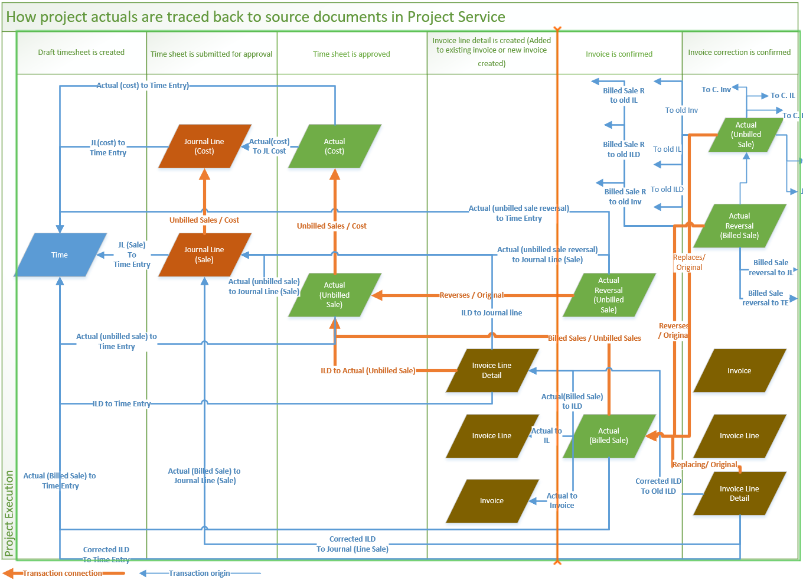

# Actuals

[!INCLUDE[cc-applies-to-psa-app-3.x](../includes/cc-applies-to-psa-app-3x.md)]

Actuals are the amount of work that has been completed on a project. Project actuals can be traced back to their source documents. Those source documents include time, expense, and journal entries, and also invoices.

## Submitting a time entry

In PSA, when a time entry is submitted for a project that is mapped to a time-and-materials contract line, two journal lines are created. One line is for cost, and the other line is for unbilled sales. When a time entry is submitted for a project that is mapped to a fixed-price contract line, a journal line is created only for cost. 

Logic for entering default prices resides on the journal line. All the field values from a time entry are copied to the journal line. These fields include the date of the transaction, the contract line that the project is mapped to, and the currency result in the appropriate price list. 

The fields that affect default prices, such as **Role** and **Org Unit**, cause an appropriate price to be entered by default on the journal line. If you add a custom field on the time entry, and you want the field value to be propagated to actuals, create the field on the Actuals entity, and use field mappings to copy the field from the time entry to the actual.

## Submitting an expense entry

In PSA, when an expense entry is submitted for a project that is mapped to a time-and-materials contract line, two journal lines are created. One line is for cost, and the other line is for unbilled sales. When an expense entry is submitted for a project that is mapped to a fixed-price contract line, a journal line is created only for cost.

Logic for entering default prices for expenses is based on the expense category that is selected on the **Expense entry** page. The transaction date, the contract line that the project is mapped to, and the currency are all used to determine the appropriate price list. However, for the price itself, the amount that the user entered is set directly on the related expense journal lines for cost and sales by default.

In the current version of PSA, category-based entry of per-unit default prices on expense entries isn't available.

## Using journals to record costs

In PSA, journals let you record cost or revenue in the material, fee, time, expense, or tax transaction classes. A journal has a header, lines, and a **Confirm** action. Here are some scenarios where you might use a journal:

- You must record material actual costs and sales on a project.
- You must move transaction actuals from another system to PSA.
- You must record costs that occurred in another system, such as procurement or subcontracting costs.

## Recording actuals based on project events

PSA records the financial transactions that occur during a project. These transactions are recorded as **actuals**. The following tables show the different types of actuals that are created, depending on whether the project is a time-and-materials or fixed-price project, is in the presales stage, or is an internal project.

**The resource belongs to same organizational unit as the project's contracting unit**

<table>
<thead>
<tr>
<th rowspan="3">Event</th>
<th colspan="4">Billable or sold project</th>
<th rowspan="3">Project in the presales stage</th>
<th rowspan="3">Internal project</th>
</tr>
<tr>
<th colspan="2">Time and materials</th>
<th colspan="2">Fixed price</th>
</tr>
<tr>
<th>Actuals</th>
<th>Transaction currency</th>
<th>Fixed price</th>
<th>Transaction currency</th>
</tr>
</thead>
<tbody>
<tr>
<td>A time entry is created.</td>
<td colspan="6">No activity in the Actuals entity</td>
</tr>
<tr>
<td>A time entry is submitted.</td>
<td colspan="6">No activity in the Actuals entity</td>
</tr>
<tr>
<td rowspan="2">Time is approved, and no change to or increase in billable hours occurs during approval.</td>
<td>Cost actual</td>
<td>Contracting unit currency</td>
<td rowspan="2">Cost actual</td>
<td rowspan="2">Contracting unit currency
<td rowspan="2">Cost actual</td>
<td rowspan="2">Cost actual</td>
</tr>
<tr>
<td>Unbilled sales actual – Chargeable</td>
<td>Project contract currency</td>
</tr>
<tr>
<td rowspan="3">Time is approved, and a decrease in billable hours occurs during approval.</td>
<td>Cost actual</td>
<td>Contracting unit currency</td>
<td rowspan="3">Cost actual</td>
<td rowspan="3">Contracting unit currency</td>
<td rowspan="3">Cost actual</td>
<td rowspan="3">Cost actual</td>
</tr>
<tr>
<td>Unbilled sales actual – Chargeable for the new quantity</td>
<td>Project contract currency</td>
</tr>
<tr>
<td>Unbilled sales actual – Non-chargeable for the difference</td>
<td>Project contract currency</td>
</tr>
<tr>
<td rowspan="2">An invoice is confirmed, and no change to or increase in billable hours occurs.</td>
<td>Unbilled sales reversal</td>
<td>Project contract currency</td>
<td rowspan="2">Billed sales for milestone</td>
<td rowspan="2">Project contract currency</td>
<td rowspan="2">Not applicable</td>
<td rowspan="2">Not applicable</td>
</tr>
<tr>
<td>Billed sales</td>
<td>Project contract currency</td>
</tr>
<tr>
<td rowspan="3">An invoice is confirmed, and a decrease in billable hours occurs.</td>
<td>Unbilled sales reversal</td>
<td>Project contract currency</td>
<td rowspan="3">Not applicable</td>
<td rowspan="3">Not applicable</td>
<td rowspan="3">Not applicable</td>
<td rowspan="3">Not applicable</td>
</tr>
<tr>
<td>Billed sales – Chargeable for the new quantity</td>
<td>Project contract currency</td>
</tr>
<tr>
<td>Billed sales – Non-chargeable for the difference</td>
<td>Project contract currency</td>
</tr>
<tr>
<td rowspan="2">An invoice is corrected to increase the chargeable quantity.</td>
<td>Billed sales – Reversal</td>
<td>Project contract currency</td>
<td rowspan="5">
<ul>
<li>Billed sales reversal for milestone</li>
<li>Change in milestone status from <strong>Invoiced</strong> to <strong>Ready for invoice</strong></li>
</ul>
</td>
<td rowspan="5">Project contract currency</td>
<td rowspan="5">Not applicable</td>
<td rowspan="5">Not applicable</td>
</tr>
<tr>
<td>Billed sales</td>
<td>Project contract currency</td>
</tr>
<tr>
<td rowspan="3">An invoice is corrected to decrease the chargeable quantity.</td>
<td>Billed sales – Reversal</td>
<td>Project contract currency</td>
</tr>
<tr>
<td>Billed sales for the new quantity</td>
<td>Project contract currency</td>
</tr>
<tr>
<td>Unbilled sales – Chargeable for the difference</td>
<td>Project contract currency</td>
</tr>
</tbody>
</table>

**The resource belongs to an organizational unit that differs from the project's contracting unit**

<table>
<thead>
<tr>
<th rowspan="3">Event</th>
<th colspan="4">Billable or sold project</th>
<th rowspan="3">Project in the presales stage</th>
<th rowspan="3">Internal project</th>
</tr>
<tr>
<th colspan="2">Time and materials</th>
<th colspan="2">Fixed price</th>
</tr>
<tr>
<th>Actuals</th>
<th>Transaction currency</th>
<th>Fixed price</th>
<th>Transaction currency</th>
</tr>
</thead>
<tbody>
<tr>
<td>A time entry is created.</td>
<td colspan="6">No activity in the Actuals entity</td>
</tr>
<tr>
<td>A time entry is submitted.</td>
<td colspan="6">No activity in the Actuals entity</td>
</tr>
<tr>
<td rowspan="4">Time is approved, and no change to or increase in billable hours occurs during approval.</td>
<td>Cost actual</td>
<td>Contracting unit currency</td>
<td rowspan="4">Cost actual</td>
<td rowspan="4">Contracting unit currency</td>
<td rowspan="4">Cost actual</td>
<td rowspan="4">Cost actual</td>
</tr>
<tr>
<td>Unbilled sales actual – Chargeable</td>
<td>Project contract currency</td>
</tr>
<tr>
<td>Resourcing unit cost</td>
<td>Resourcing unit currency</td>
</tr>
<tr>
<td>Interorganizational sales</td>
<td>Contracting unit currency</td>
</tr>
<tr>
<td rowspan="5">Time is approved, and a decrease in billable hours occurs during approval.</td>
<td>Cost actual</td>
<td>Contracting unit currency</td>
<td rowspan="5">Cost actual</td>
<td rowspan="5">Contracting unit currency</td>
<td rowspan="5">Cost actual</td>
<td rowspan="5">Cost actual</td>
</tr>
<tr>
<td>Resourcing unit cost</td>
<td>Resourcing unit currency</td>
</tr>
<tr>
<td>Interorganizational sales</td>
<td>Contracting unit currency</td>
</tr>
<tr>
<td>Unbilled sales actual – Chargeable for the new quantity</td>
<td>Project contract currency</td>
</tr>
<tr>
<td>Unbilled sales actual – Non-chargeable for the difference</td>
<td>Project contract currency</td>
</tr>
<tr>
<td rowspan="2">An invoice is confirmed, and no change to or increase in billable hours occurs.</td>
<td>Unbilled sales reversal</td>
<td>Project contract currency</td>
<td rowspan="2">Billed sales for milestone</td>
<td rowspan="2">Project contract currency</td>
<td rowspan="2">Not applicable</td>
<td rowspan="2">Not applicable</td>
</tr>
<tr>
<td>Billed sales</td>
<td>Project contract currency</td>
</tr>
<tr>
<td rowspan="3">An invoice is confirmed, and a decrease in billable hours occurs.</td>
<td>Unbilled sales reversal</td>
<td>Project contract currency</td>
<td rowspan="3">Not applicable</td>
<td rowspan="3">Not applicable</td>
<td rowspan="3">Not applicable</td>
<td rowspan="3">Not applicable</td>
</tr>
<tr>
<td>Billed sales – Chargeable for the new quantity</td>
<td>Project contract currency</td>
</tr>
<tr>
<td>Billed sales – Non-chargeable for the difference</td>
<td>Project contract currency</td>
</tr>
<tr>
<td rowspan="2">An invoice is corrected to increase the chargeable quantity.</td>
<td>Billed sales – Reversal</td>
<td>Project contract currency</td>
<td rowspan="5">
<ul>
<li>Billed sales reversal for milestone</li>
<li>Change in milestone status from <strong>Invoiced</strong> to <strong>Ready for invoice</strong></li>
</ul>
</td>
<td rowspan="5">Project contract currency</td>
<td rowspan="5">Not applicable</td>
<td rowspan="5">Not applicable</td>
</tr>
<tr>
<td>Billed sales</td>
<td>Project contract currency</td>
</tr>
<tr>
<td rowspan="3">An invoice is corrected to decrease the chargeable quantity.</td>
<td>Billed sales – Reversal</td>
<td>Project contract currency</td>
</tr>
<tr>
<td>Billed sales for the new quantity</td>
<td>Project contract currency</td>
</tr>
<tr>
<td>Unbilled sales – Chargeable for the difference</td>
<td>Project contract currency</td>
</tr>
</tbody>
</table>
