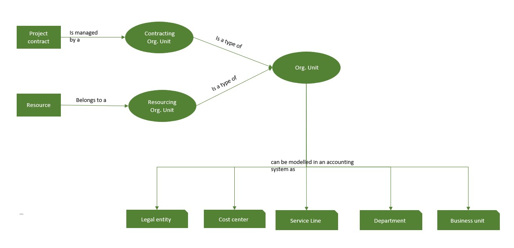

# Organizational units 

[!INCLUDE[cc-applies-to-psa-app-3.x](../includes/cc-applies-to-psa-app-3x.md)]

Dynamics 365 Project Service Automation, an organizational unit is a distinct group or division in a professional services company that employs billable resources that have cost rates.

For professional services companies that employ technical resources in various practice areas or business lines, the cost to fill a role in one practice area or business line might differ from the cost to fill a role in another practice area or business line. The concept  organizational units helps in this scenario by providing a way to group a set of billable roles in a division of a company that has a distinct cost structure for these roles.

## Key attributes and associations of organizational units

In PSA, an organizational unit in PSA has a specific currency and specific cost price lists.

The currency of an organizational unit is the primary currency that is used to track costs.

One or more cost price lists can be attached to each organizational unit. PSA puts the following limitations on the price lists that can be attached to an organizational unit:

- Price lists must be in the currency of the organizational unit
- Price lists must be of cost price lists

In addition, there is an attribute for the organizational unit on the Resource entity. Each resource can be assigned to one organizational unit.

## Roles of organizational units

The organizational unit plays two roles in PSA:

- **Contracting unit** – The organizational unit that represents the company group or division that is primarily responsible for winning the sale and managing the delivery of work and services to the customer. The contracting unit is identified by the **Contracting Unit** field in the header section of the **Opportunity**, **Quote**, **Project Contract**, and **Project** pages.
- **Resourcing unit** – The organizational unit that a resource belongs to or is assigned to. This organizational unit can provide its resources for some roles on statements of work (SOWs) and projects that are owned by the contracting unit.

> 

## Organizational unit FAQs

Here are some of the most frequently asked questions about organizational units.

### How is the Organizational Unit entity in PSA related to the Organization entity that already exists in Dynamics 365?

The Organization entity in Microsoft Dynamics 365 represents the name of a global Dynamics 365 instance. This name is usually the name of the global enterprise.

The Organizational Unit entity represents a group or division in the global enterprise. This group or division has a set of roles and a cost price list for those roles, and those roles and price list differ from the roles and price list of other groups or divisions in the enterprise.

When PSA is installed, a default organizational unit is created based on the organization. All existing resources are assigned to the default organizational unit. If any new Active Directory users or resources are imported into Dynamics 365, the user import process assigns them to the default organizational unit in PSA.
 
### How does the organizational unit entity differ from the business unit entity?

In Dynamics 365, the Business Unit entity is a security construct. The association of a user with a business unit determines the entities and entity records that the user has access to. It also determines the permissions (Create, Read, Write, Delete, Append, Append To, Assign, or Share) that the user has for those entity records.

The Organizational Unit entity represents a company group or division that has distinct cost rates for employees that are assigned to it. The association of a resource with an organizational unit determines the resource's cost to a project engagement.

When you implement Dynamics 365, optimize security authorization for the hierarchy of business units and the assignment of users to business units. Assign all users who must typically access the same set of records to the same business unit. The organizational unit has no effect on security authorization or access.

#### Example of organizational units and business units

Contoso, Ltd. has a thriving Microsoft technology practice. Prakash and Tricia are both C\# developers, but Tricia is in the United States, whereas Prakash is in India. Most of the project engagements require resources from Contoso India and Contoso US, and Prakash and Tricia require the same level of security access to projects in this practice area. However, the cost of developers from Contoso India differs significantly from the cost of developers from Contoso US.

Here is an optimal way to design for this scenario by using Dynamics 365 and PSA.

1. Create the Microsoft technology practice as a business unit, and associate Prakash and Tricia with it. In this way, you help guarantee that both employees have the same level of security access to any projects in that practice area. They both will be able to check progress and report time, expenses, and task updates. 
2. Create two organizational units to hel guarantee that the cost to the project is correctly reflected. 
3. Associate Tricia wtih Contoso US and associate Prakash with Contoso India.
4. Assign appropriate cost price lists to both organizational units. TIn this way, you help guarantee that the costs that are recorded on the project for Prakash and Tricia accurately reflect the difference in costs between Contoso US and Contoso India.

### Are organizational units related to sales territories in Dynamics 365?

There is no association or relationship between sales territories and organizational units. A sales territory is typically a geographical area where sales occur. A sales price list can be associated with each sales territory.

An organizational unit is an internal group or division in the company that tracks costs for a set of roles that it sells to other divisions or to external customers.

#### Example of organizational units and sales territories

Contoso, Ltd. has two development centers: Contoso US and Contoso India. Costs of resources differ greatly between these two development centers.

Contoso sells its IT services in many international markets, such as Latin America, North America, Asia-Pacific, Western Europe, and the Middle East. Bill rates for the same project roles can vary widely across these markets.

Contoso US and Contoso India should be set up as organizational units, and each organizational unit should have its own cost price list. Asia-Pacific, Latin America, North America, Western Europe, and the Middle East should be set up as sales territories, and each sales territory should have its own sales price list.

### Why is there a restriction on the association of price lists with organizational units? 

Sales pricing is usually unique to the geographical areas or markets where services are sold. Internal divisions of a company don't usually have their own sales pricing for the same type of services. However, internal divisions have a different cost of goods sold (COGS), depending on the skills of the people that they employ and the labor conditions of the region where they operate. Because organizational units are modeled as internal divisions of a company, they can have only cost price lists.

### Why can’t we associate sales price lists to organizational units?

In PSA, sales price lists can be associated with customers and sales territories. Transactional entities like Opportunity, Quote, Project Contract, and Project use sales price lists that are attached to the customer account or the sales territory to determine bill rates and potential revenue on the project engagement.

Cost price lists are associated with organizational units. Transactional entities like Opportunity, Quote, Project Contract, and Project use cost price lists that are attached to the contracting unit to determine costs to a project engagement.

### Are organizational units hierarchical in PSA?

No. In the current release of PSA, organizational units are not hierarchical. This means that you can’t:

- Configure a pattern for defaulting cost prices that traverses up a hierarchy. 
- Report revenue or cost rolled up at different levels of the organizational unit hierarchy.

### We're a big multinational firm with a complex, multilevel hierarchy of cost centers, divisions, and billing offices. How can we make the best use of the organizational unit concept in this version of the Project Service app?

When you have a complex hierarchy of cost centers, divisions, billing offices, etc., set up the leaf nodes of that hierarchy as distinct organizational units.
The following example shows a typical hierarchy:

**Contoso India**

  - SAP Practice 

	- Technical Consultants 
	- Functional Consultants 
	
  - Microsoft Technology Practice 

	- Technical Consultants
	- Functional Consultants 
	
**Contoso US**

 - SAP Practice 

	- Technical Consultants 
	- Functional Consultants 
	
 - Microsoft Technology Practice 

	- Technical Consultants 
	- Functional Consultants 
 
If your hierarchy is similar, you must set it up as a flat list, as shown here:
- Contoso India - SAP Practice - Technical Consultants 
- Contoso India - SAP Practice - Functional Consultants 	  
- Contoso India - Microsoft Technology Practice Functional Consultants 
- Contoso India - Microsoft Technology Practice Functional Consultants 
- Contoso US - SAP Practice - Technical Consultants  
- Contoso US - SAP Practice - Functional Consultants  
- Contoso US - Microsoft Technology Practice - Technical Consultants 
- Contoso US - Microsoft Technology Practice - Functional Consultants

### We're a small professional services company that operates as only one division. How can we best use the organizational unit concept in the current version of PSA?

If your company operates as one unit that has one cost price list, you don't have to set up any organizational units. During PSA installation, Dynamics 365 creates one default organizational unit that has the same name as the organization. By default, all users are assigned to this organizational unit. Whenever the system requires that an organizational unit be selected, this organizational unit is selected by default.

### When a project is created from a quote or project contract line, the default contracting unit comes from the quote or project contract. If a project is created before sales entities such as quote or project contract, what is the default contracting unit?

When a project is created on its own, the default contracting unit of the project is based on the user who creates it. That user is also the default project manager. If the project is mapped to a sales entity such as a quote or project contract, the contracting unit on the project is based on the sales entity instead. In this case, project estimates might be recalculated, because the cost price list is used to calculate the cost estimate changes if the contracting unit is changed. The sales price list is used to calculate the sales estimates that will be changed so that they are in sync with the project price list on the quote.

The **Contracting Unit** and **Currency** fields on the project are locked for editing, because they must be in sync with the values on the sales entity (quote or project contract) that the project is mapped to.
