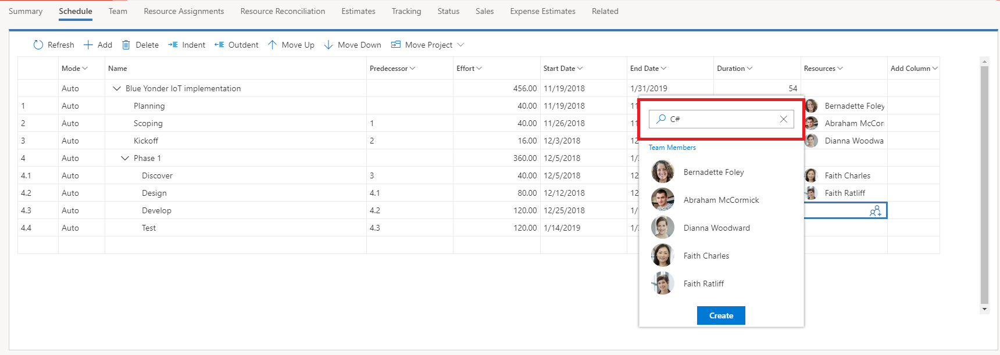
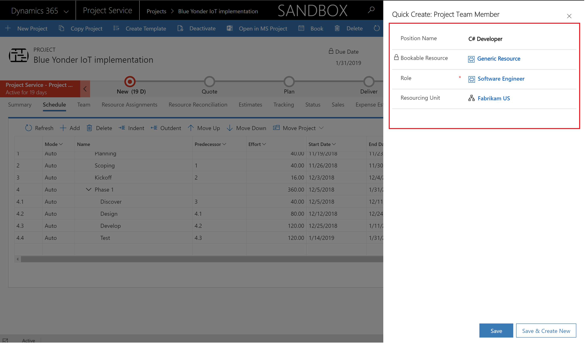
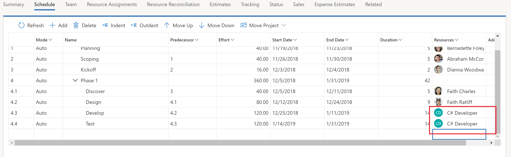
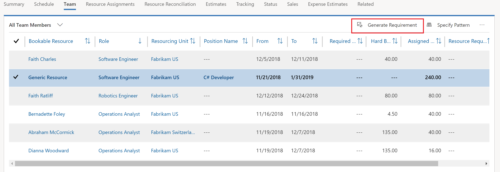
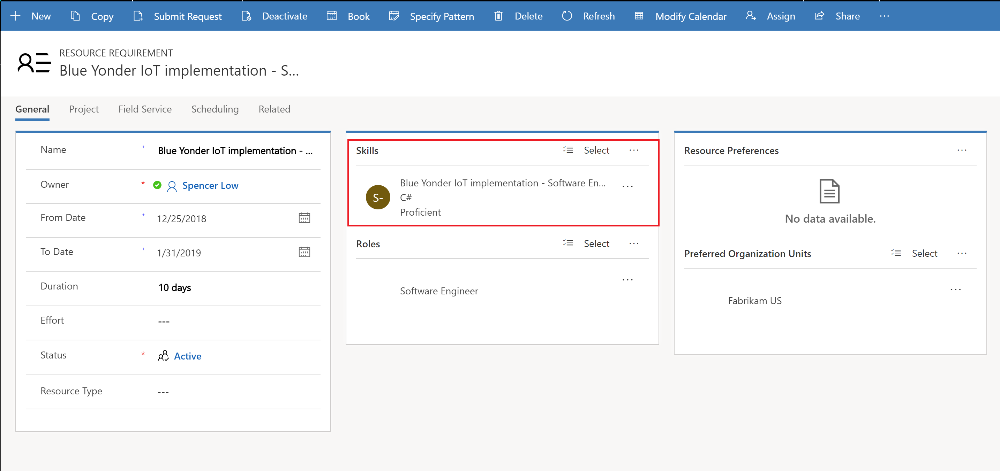

# Assign generic bookable resources to a task and generate resource requirements 

[!INCLUDE[cc-applies-to-psa-app-3.x](../includes/cc-applies-to-psa-app-3x.md)]

In addition to booking and assigning named or real resources to your project, you can assign generic resources to project tasks. These resources can serve as placeholders for named resources until you are ready to staff your project with named resources. 

1. In Project Service Automation (PSA), open the **Project** page and on the **Schedule** tab, enter the position name of the generic resource in the **Resource** cell of the schedule. Or, click the **Resource** icon in the cell to open the resource picker and then enter the name of the generic resource that you want to create.

This will open the **Quick Create: Project Team Member** panel. 

2. Enter the role and organization unit of the generic resource team member and then click **Save**.

3. After you have created the new generic resource team member, it is assigned to the task. You can continue to assign that generic resource to other tasks in the task schedule.

4. After you have assigned the generic resource, you can generate a resource requirement and fulfill it by directly booking or submitting a resource request to a resource manager.

On the team member grid, in addition to being able to use the resource picker as mentioned above, you can add generic resources directly. The resources are added with a resource requirement that is based on the start/end dates and allocation method specified in the **Quick Create: Project Team Member** panel.

You can see a difference if you add the generic team member directly and then assign more tasks to the generic resource than they have required hours to cover. Click **Generate Requirement** to regenerate the requirement to balance the required hours 
against assignments.

You can also click the **Resource requirement** link in the team grid to open the requirement and add skills, preferred resources, etc.

