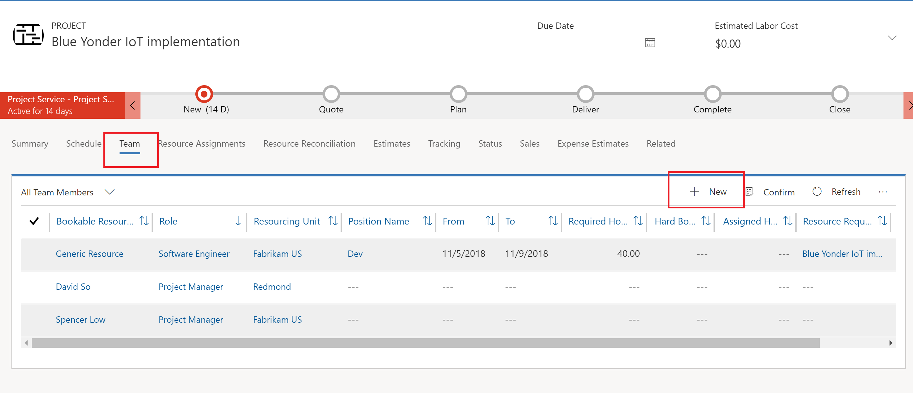
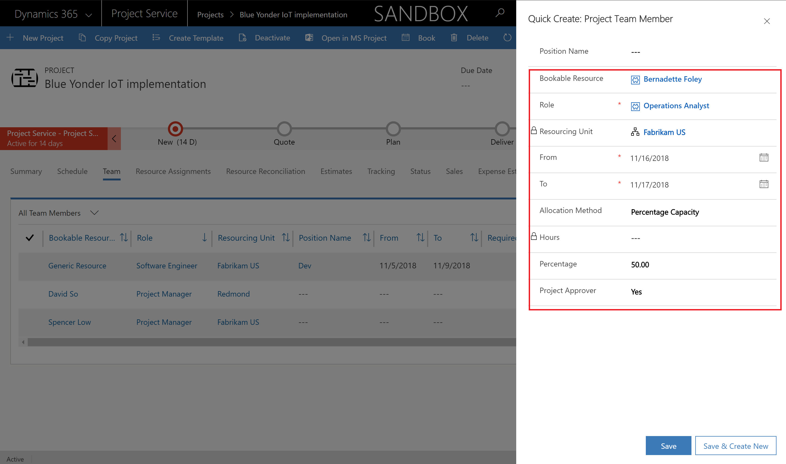
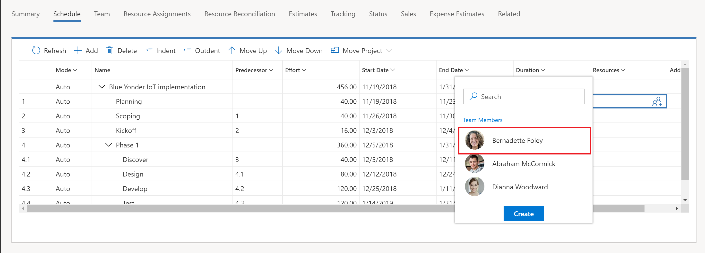
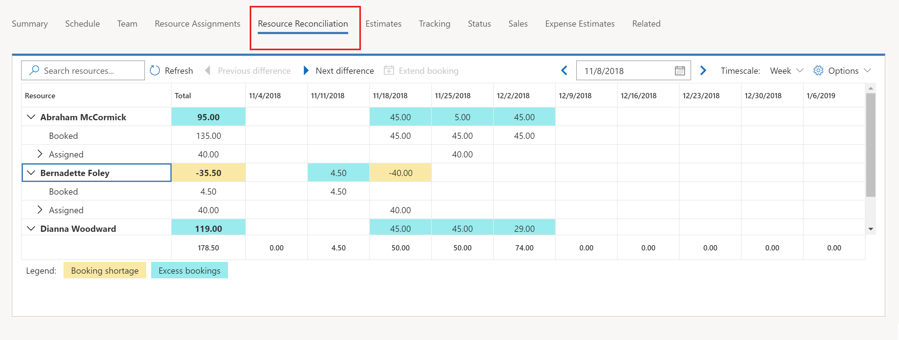
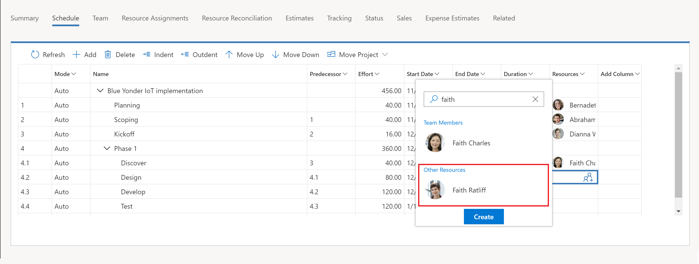
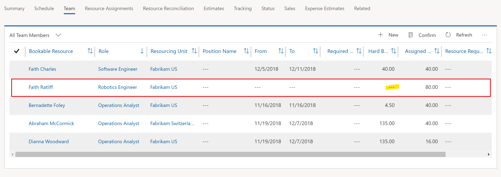
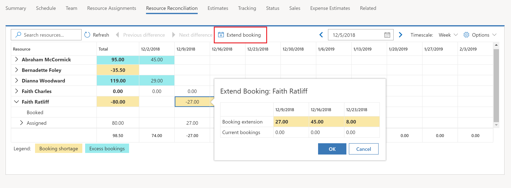

# Book named bookable resources to a project team and assign tasks 

[!INCLUDE[cc-applies-to-psa-app-3.x](../includes/cc-applies-to-psa-app-3x.md)]

You can  add a named resource to your project team by booking them directly onto the team. To do this, complete the following steps.

1. In  Project Service Automation, go to **Projects**, and select the open the project that you are booking for.
2. On the **Project** page, on the **Team** tab, click **New**. 

3. In the **Quick Create Project Team Member** dialog box, select the bookable resource. The **Role** field will populate with the resource's default role if they have one assigned. You can change the role if needed. 
4. Select the from and to dates that the resource will be needed and select the allocation method of the resource's capacity. 
5. If you want the team member to be a project approver, select **Yes** in the **Project Approver** field. This will mean that the team member can approve submitted time and expense entries for this project. 
6. Click **Save**.

You can now assign the booked resource to tasks on the project. On the **Project** page, click the **Schedule** tab to assign tasks to the new resource. The resource picker that is launched from the **Resources** field in the task grid will show the team members that you can select.

In version 3 for Project Service Automation (PSA), resource bookings and task assignments are not tightly coupled. This means that when you use the resource picker in the schedule, you can assign tasks to team members for more hours than their bookings cover on the project.
You can see the differences between team member bookings and assignments on the **Team** tab or on the **Resource Reconciliation** tab. You can also reconcile the differences between bookings and assignments for resources at a more detailed level.

You can also use the resource picker on the **Schedule** tab to search for and select bookable resources that are not already part of the project team. These are shown in the resource picker as **Other Resources**.

When you do this, the resource is added to the project team and assigned to the task, but no bookings are generated.

You can use the **Reconciliation** tab’s extend booking capability or the **Schedule Board** to book the resource’s capacity to the project.

After a team member is booked on your project, you can use maintain bookings or use the Schedule Board directly to manage their bookings.
