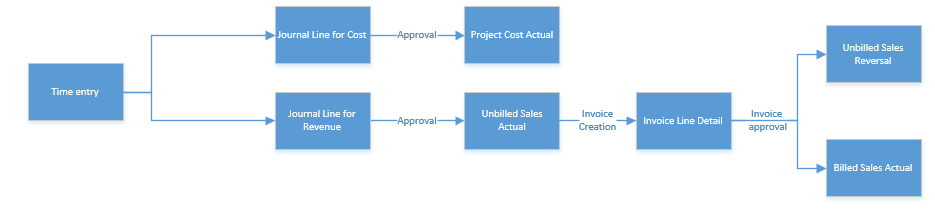

# Business transactions

[!INCLUDE[cc-applies-to-psa-app-3.x](../includes/cc-applies-to-psa-app-3x.md)]

In Dynamics 365 Project Service Automation, *business transaction* is an abstract concept that isn't represented by any entity. However, some common fields and processes on entities are designed to use the concept of business transactions. The following entities use this abstraction:

- Quote line details
- Contract line details
- Estimate lines
- Journal lines
- Actuals

Of these entities, Quote line details, Contract line details, and Estimate lines are mapped to the estimation phase in the project lifecycle. The Journal lines and Actuals entities are mapped to the execution phase in the project lifecycle.

PSA treats records in these five entities as business transactions. The only distinction is that records in entities that are mapped to the estimation phase are considered financial forecasts, whereas the records in entities that are mapped to the execution phase are considered financial facts that have already occurred.

For more information, see [Estimates](estimates.md) and [Actuals](actuals.md).

## Concepts that are unique to business transactions
The following concepts are unique to the concept of business transactions:

- Transaction type
- Transaction class
- Transaction origin
- Transaction connection

### Transaction type

Transaction type represents the timing and context of the financial impact on a project. It's represented by an option set that has the following supported values in PSA:
- Cost
- Project contract
- Unbilled sales
- Billed sales
- Inter organizational sales
- Resourcing unit cost

### Transaction class

Transaction class represents the different types of costs that are incurred on projects. It's represented by an option set that has the following supported values in PSA:

- Time
- Expense
- Material
- Fee
- Milestone
- Tax

The **Milestone** value is typically used by the business logic for fixed-price billing in PSA.

### Transaction origin

Transaction origin is an entity that stores the origin of each business transaction. As project execution gets underway, each business transaction will give rise to another business transaction which in turn will create another and so on. Transaction origin entity was designed to store data about each transaction’s origin to help reporting and traceability. 

### Transaction connection

Transaction connection is an entity that stores the relation between two similar business transactions such as cost and related sales actuals or transaction reversals triggered by billing activities such invoice confirmation or invoice corrections.

Together, Transaction origin and Transaction connection help you keep track of relationships between business transactions and actions that resulted in the creation of a specific business transaction.

### Example: How Transaction origin works with Transaction connection

The following example shows the typical processing of time entries in a PSA project lifecycle.

> 
 
1. Submission of a time entry causes the creation of two journal lines: one for cost and one for unbilled sales.
2. Eventual approval of the time entry causes the creation of two actuals: one for cost and one for unbilled sales.
3. When the user creates a project invoice, the invoice line transaction is created by using data from the unbilled sales actual. 
4. When the invoice is confirmed, two new actuals are created: an unbilled sales reversal and a billed sales actual.

Each of these events triggers the creation of records in the Transaction origin and Transaction connection entities to help build a trace of relationships between these records that are created across time entry, journal line, actuals, and invoice line details.

The following table shows the records in the Transaction origin entity for the preceding workflow.

| Event                        | Origin                   | Origin type                       | Transaction                       | Transaction type         |
|------------------------------|--------------------------|-----------------------------------|-----------------------------------|--------------------------|
| Time Entry Submission        | Time entry Record GUID   | Time Entry                        | Journal Line Record GUID (cost)   | Journal Line             |
| Time entry Record GUID       | Time Entry               | Journal Line Record GUID (sales)  | Journal Line                      |                          |
| Time Approval                | Journal Line Record GUID | Journal Line                      | Unbilled Sales Record GUID        | Actual                   |
| Time entry Record GUID       | Time Entry               | Unbilled Sales Record GUID        | Actual                            |                          |
| Journal Line Record GUID     | Journal Line             | Cost Actual Record GUID           | Actual                            |                          |
| Time entry Record GUID       | Time Entry               | Cost Actual Record GUID           | Actual                            |                          |
| Invoice Creation             | Time entry Record GUID   | Time Entry                        | Invoice Line Transaction GUID     | Invoice Line Transaction |
| Journal Line Record GUID     | Journal Line             | Invoice Line Transaction GUID     | Invoice Line Transaction          |                          |
| Invoice Confirmation         | Invoice Line GUID        | Invoice Line                      | Billed Sales Record GUID          | Actual                   |
| Invoice GUID                 | Invoice                  | Billed Sales Record GUID          | Actual                            |                          |
| Invoice Line Detail GUID     | Invoice Line Detail      | Billed Sales Record GUID          | Actual                            |                          |
| Time entry Record GUID       | Time Entry               | Billed Sales Record GUID          | Actual                            |                          |
| Journal Line Record GUID     | Journal Line             | Billed Sales Record GUID          | Actual                            |                          |
| Time entry Record GUID       | Time Entry               | Unbilled Sales Reversal GUID      | Actual                            |                          |
| Journal Line Record GUID     | Journal Line             | Unbilled Sales Reversal GUID      | Actual                            |                          |
| Draft Invoice Correction     | Old ILD GUID             | Invoice Line Transaction          | Correction ILD GUID               | Invoice Line Transaction |
| Old IL GUID                  | Invoice Line             | Correction ILD GUID               | Invoice Line Transaction          |                          |
| Old Invoice GUID             | Invoice                  | Correction ILD GUID               | Invoice Line Transaction          |                          |
| Time entry Record GUID       | Time Entry               | Correction ILD GUID               | Invoice Line Transaction          |                          |
| Journal Line Record GUID     | Journal Line             | Correction ILD GUID               | Invoice Line Transaction          |                          |
| Confirmed invoice correction | Old ILD GUID             | Invoice Line Transaction          | Reversed Billed Sales Actual GUID | Actual                   |
| Old IL GUID                  | Invoice Line             | Reversed Billed Sales Actual GUID | Actual                            |                          |
| Old Invoice GUID             | Invoice                  | Reversed Billed Sales Actual GUID | Actual                            |                          |
| Time entry Record GUID       | Time Entry               | Reversed Billed Sales Actual GUID | Actual                            |                          |
| Journal Line Record GUID     | Journal Line             | Reversed Billed Sales Actual GUID | Actual                            |                          |
| Old ILD GUID                 | Invoice Line Transaction | New Unbilled Sales Actual GUID    | Actual                            |                          |
| Old IL GUID                  | Invoice Line             | New Unbilled Sales Actual GUID    | Actual                            |                          |
| Old Invoice GUID             | Invoice                  | New Unbilled Sales Actual GUID    | Actual                            |                          |
| Time entry Record GUID       | Time Entry               | New Unbilled Sales Actual GUID    | Actual                            |                          |
| Journal Line Record GUID     | Journal Line             | New Unbilled Sales Actual GUID    | Actual                            |                          |
| Correction ILD GUID          | Invoice Line Transaction | New Unbilled Sales Actual GUID    | Actual                            |                          |
| Correction IL GUID           | Invoice Line             | New Unbilled Sales Actual GUID    | Actual                            |                          |
| Correction Invoice GUID      | Invoice                  | New Unbilled Sales Actual GUID    | Actual                            |                          |

The following table shows the records in the Transaction connection entity for the preceding workflow.

| Event                          | Transaction 1                 | Transaction 1 role | Transaction 1 type           | Transaction 2                | Transaction 2 role | Transaction 2 type |
|--------------------------------|-------------------------------|--------------------|------------------------------|------------------------------|--------------------|--------------------|
| Time Entry Submission          | Journal Line (Sales) GUID     | Unbilled Sales     | msdyn_journalline            | Journal Line (cost) GUID     | Cost               | msdyn_journalline  |
| Time Approval                  | Unbilled Actual (Sales) GUID  | Unbilled Sales     | msdyn_actual                 | Cost Actual(cost) GUID       | Cost               | msdyn_actual       |
| Invoice Creation               | Invoice Line Detail GUID      | Billed Sales       | msdyn_invoicelinetransaction | Unbilled Sales Actual GUID   | Unbilled Sales     | msdyn_actual       |
| Invoice Confirmation           | Reversing Actual GUID         | Reversing          | msdyn_actual                 | Original unbilled sales GUID | Original           | msdyn_actual       |
| Billed Sales GUID              | Billed Sales                  | msdyn_actual       | Unbilled Sales Actual GUID   | Unbilled Sales               | msdyn_actual       |                    |
| Draft Invoice Correction       | Invoice Line Transaction GUID | Replacing          | msdyn_invoicelinetransaction | Billed Sales GUID            | Original           | msdyn_actual       |
| Confirm Invoice Correction     | Billed Sales Reversal GUID    | Reversing          | msdyn_actual                 | Billed Sales GUID            | Original           | msdyn_actual       |
| New Unbilled Sales Actual GUID | Replacing                     | msdyn_actual       | Billed Sales GUID            | Original                     | msdyn_actual       |                    |
