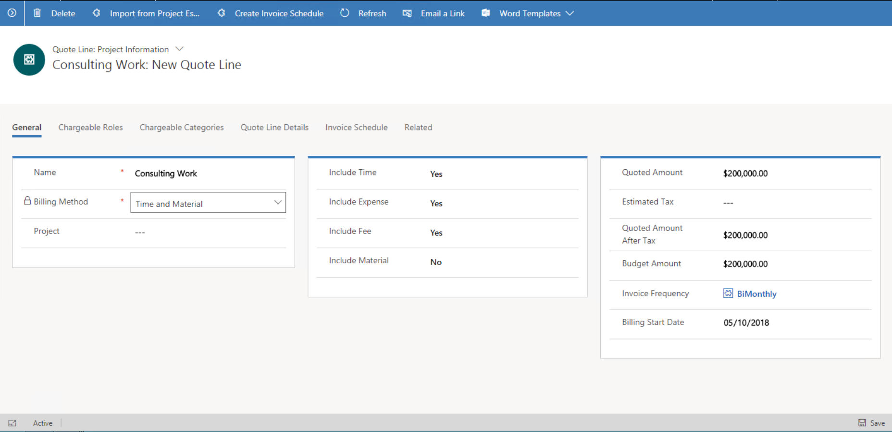

# Quotes and quote lines

[!INCLUDE[cc-applies-to-psa-app-3.x](../includes/cc-applies-to-psa-app-3x.md)]

In Dynamics 365 Project Service Automation, there are two types of quotes: project quotes and sales quotes. The two types differ in the following ways:

- On a sales quote, there is only one grid for line items. On a project quote, there are two grids for line items: one for project lines and one for product lines.
- A sales quote supports activation and revisions. A project quote doesn’t support those processes.
- You can attach multiple orders to a sales quote. You can attach only one project contract to a project quote.
- You can win a sales quote and keep the related opportunity open. After a project quote is won, the related opportunity is closed.
- A sales quote doesn't include some fields and concepts that are included on a project quote has fields. The fields include **Contracting Unit**, **Account Manager**, and **Bill to Contact Name**.  
- Sales quotes and project quotes are also identified by an option set–based field that is named **Type**. For a sales quote, this field has the value **Item-based**. For a project quote, it has the value **Work-based**.

This topic will focus on the details of project quotes.

A project quote in PSA can have multiple line items or quote lines. In fact, a project quote has two grids for line items. One grid is for project-based lines that allow for detailed estimations. The other grid is for product-based lines that use a simple unit price and quantity-based approach.

- **Project-based** – The amount (quoted value) is determined after you estimate how much work is required. You can estimate work at a high level, or you can estimate it directly as line details below each quote line. Finally, you can estimate work based on ground-up estimates, by using a project and project plan. Project-based quote lines are found only in project-based quotes that are created by using Project Service Automation. This type of quote line is a customized form of the write-in quote lines that are available in Microsoft Dynamics 365 Sales.
- **Product-based** – The amount (quoted value) is determined based on the quantity of units that is sold and the product's unit sales price. The product on a product-based line can come from a product catalog in Sales, or it can be a product that you define. This type of quote line is also available on project-based quotes that are created by using PSA.

The amount on a quote is the total across the product-based lines and the project-based lines.

> [!NOTE]
> Quotes and quote lines aren't required in PSA. You can start the project process with a project contract (sold project). However, an opportunity is always required, regardless of whether you start with a quote or a project contract.

## Project-based quote lines

A project-based quote line in PSA has the following billing methods:

- Time and material
- Fixed price

### Time and material

The Time and material billing method is based on consumption. When you select this billing method, the customer is invoiced as the project incurs costs. Invoices are created on a date-based periodic frequency. During the sales process, the quoted value of a time-and-material component gives only an estimate of the final cost to the customer. The vendor doesn't commit itself to completing the project at exactly the quoted value. Time-and-material components increase the customer's risk. Customers might want to negotiate additional not-to-exceed clauses to minimize their risk. PSA doesn't support setting not-to-exceed clauses.

### Fixed price

In the Fixed price billing method, a vendor commits itself to delivering the project at a fixed cost to the customer. The customer is billed the quoted value of the fixed-price quote line, regardless of the costs that the vendor incurs to deliver that quote line. The fixed-price quote line value is billed in one of the following ways: 

- As a lump-sum amount at the start or end of the project, or when a project milestone is reached. 
- At a date-based frequency of equal installments of the fixed value on the quote line. These installments are known as periodic milestones.
- In installments that have a monetary value that is aligned with the progress of work or specific milestones that are achieved on the project. In this case, the value of each installment can differ, but they must all add up to the fixed value on the quote line.

PSA supports all three types of invoice schedules for fixed-price quote lines.

## Transaction classification

Professional service organizations typically quote and invoice their customers by classification of costs. In PSA, costs are represented by the following transaction classifications:

- **Time** – This classification represents the cost of labor or human resources' time on a project.
- **Expense**: – This classification represents all other kinds of expenses on a project. Because expenses can be broadly classified, most organizations create subcategories, such as travel, car rental, hotel, or office supplies.
- **Fee** – This classification represents miscellaneous overhead, penalties, and other items that are charged to the customer. 
- **Tax** – This classification represents tax amounts that users add while they enter expenses.
- **Material transaction** – This classification represents actuals from product lines on a confirmed project invoice.
- **Milestone** – This classification is used by the fixed-price billing logic in PSA.

One or more of these transaction classifications can be associated with each quote line. After a quote is won, the mapping between transaction classification and quote line is transferred to the contract line.
 
> 
  
For example, a quote might contain the following two quote lines: 
- Consulting work that uses a Time and material billing method where time and fee transaction classifications are applicable. For example, all time and fee transactions for the **Dynamics AX Implementation** example project are invoiced to the customer based on the time and materials that are used. 
- Related travel expenses that use a Fixed price billing method. For example, all travel expenses for the **Dynamics AX Implementation** example project are invoiced at a fixed monetary value.

> [!NOTE]
> The combination of the project and transaction classifications of **Time**, **Expense**, and **Fee** that are associated with a quote line or contract line must be unique. If the same combination of project and transaction class is associated with more than one contract line or quote line, PSA won't work correctly.

## Billing types

The **Billing Type** field defines the concept of chargeability in PSA. It's an option set that has the following possible values:

- **Chargeable** – The cost that is accrued by this role/category is a direct cost that drives project execution, and the customer will pay for this work. The payment can be administered as a time-and-material or fixed-price arrangement. However, the employee who spends this time will receive the corresponding credit for his or her billable utilization.
- **Non-chargeable** – The cost that is accrued by this role/category is considered a direct cost that drives project execution, even though the customer doesn't recognize this fact and won't pay for this work. The employee who spends this time won't be credited with billable utilization for it.
- **Complimentary** – The cost that is accrued by this role/category is considered a direct cost that drives project execution, and the customer recognizes this fact. The employee who spends this time will be credited for billable utilization for it. However, this cost isn't charged to the customer.
- **Not available** – The costs that are incurred on internal projects that don't require revenue tracking are tracked by using this option.

## Invoice schedule

An invoice schedule is a series of dates when invoicing for a project occurs. You can optionally create an invoice schedule on a quote line in PSA. Each quote line can have its own invoice schedule. To create an invoice schedule, you must provide the following attribute values:

- A billing start date 
- A delivery date that represents the billing end date on the project
- An invoice frequency

PSA uses these three attribute values to generate a tentative set of dates to establish invoicing on.

## Invoice frequency

Invoice frequency is an entity that stores attribute values that help express the frequency of invoice creation. The following attributes express or define the Invoice frequency entity:

- **Period** - Monthly, biweekly, and weekly periods are supported. 
- **Runs per period** - For weekly and biweekly periods, you can define only one run per period. For monthly periods, you can define between one and four runs per period. 
- **Days of run** – The days when invoicing should be run. You can configure this attribute in two ways:
  - **Weekdays** - For example, you can specify that invoicing is run every Monday or every second Monday. Customers who must set invoicing to run on a working day might prefer this kind of configuration.. 
  - **Calendar days** - For example, you can specify that invoicing is run on the seventh and twenty-first days of every month. Some organizations might prefer this kind of configuration, because it helps guarantee that invoicing in run on a fixed schedule every month.
  
### Invoice schedule for a fixed-price quote line

For a fixed-price quote line, you can use the **Invoice Schedule** grid to create billing milestones that equal the value of the quote line.

- To create billing milestones that are equally divided, select an invoice frequency, enter the billing start date on the quote line, and select **Requested Completion Date** for the quote in the **Summary** section of the quote header. Then select **Generate Periodic Milestones** to create equally split milestones based on the selected invoice frequency. 
- To create a lump-sum billing milestone, create a milestone, and then enter the quote line value as the milestone amount.
- To create billing milestones that are based on specific tasks in the project plan, create a milestone, and map it to the project's schedule element in the billing milestone UI.
