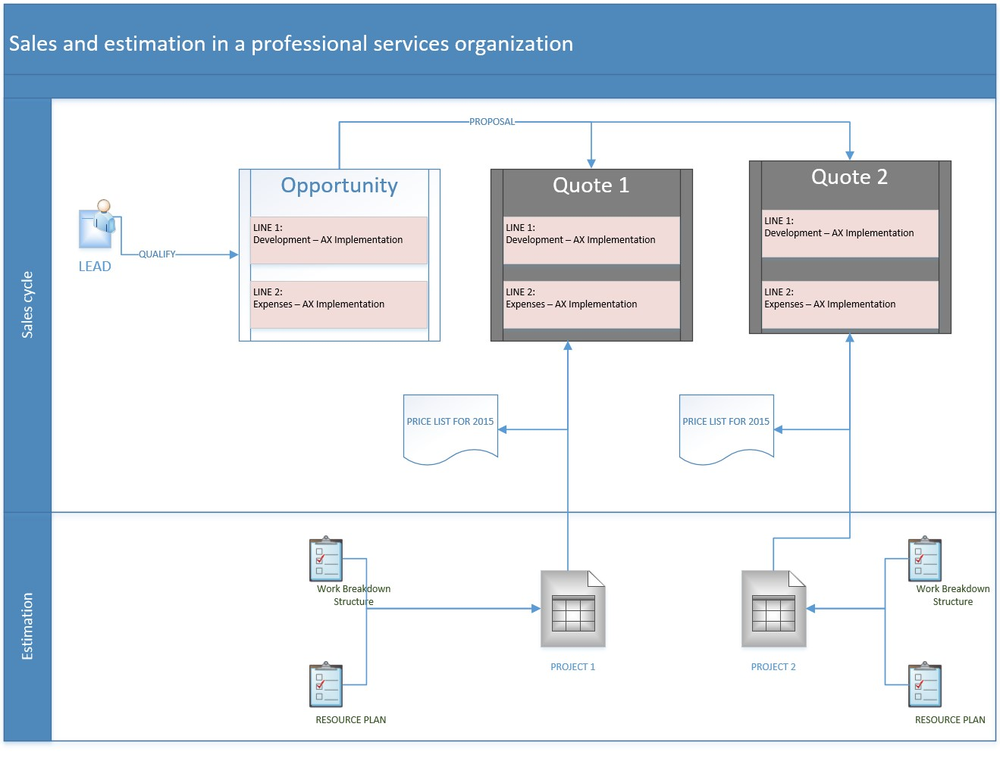
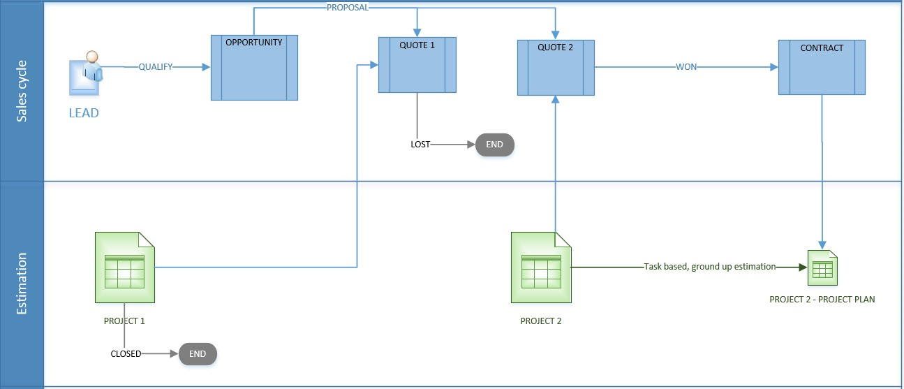
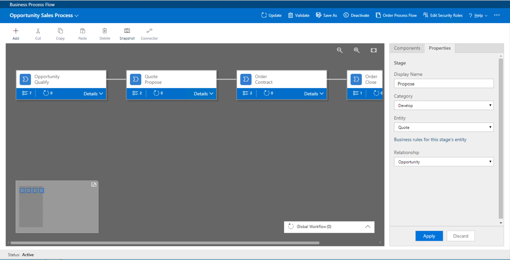
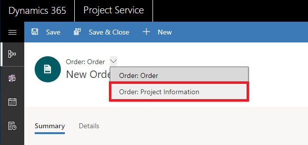

# Sales processes

[!INCLUDE[cc-applies-to-psa-app-3.x](../includes/cc-applies-to-psa-app-3x.md)]

The sales processes that are used in a project-based organization differ from the sales processes that are used in a product-based organization. This difference occurs because the sales cycles for project-based organizations are longer and require customized estimation techniques to analyze and create quotes for each deal. Dynamics 365 Project Service Automation uses some of the same functionality that is used in the sales process for Dynamics 365 Sales. Here are some examples:

- A Lead entity is used to track the sales process.
- Qualifying leads are tracked as opportunities. The sales process can also start with opportunity.
- All related artifacts for an opportunity are accessed. These artifacts include the sales team, stakeholders, probability, rating, sales stages, and business processes.
- Multiple quotes are created for an opportunity.
- A quote is marked **Closed as Won** to create a sales order. In PSA, the sales order is customized and is called a project contract.

The following illustration shows a typical sales process in a project-based organization.

> 

## Estimating a sale
The value of a sale can be estimated based on projects that have previously been delivered and the complexity of projects. For projects that involve extensions to previous projects, or projects where the vendor's expertise is high and well-known work templates are used, you can use a simpler estimation process. More complex projects usually have a longer purchase process. Therefore, there are more stages in the sales estimation process. Early in the process, the sales team uses the input of account managers and subject matter experts (SMEs) to start to create a high-level estimate for each distinct component of work that is quoted. These components of work are represented by quote lines. 

You can create a high-level estimate of the quote. Eventually, this high-level estimate will be replaced by a more detailed estimate that is based on a project plan that you create by using the standardized project templates. These templates help you build a schedule and determine monetary values on the quote and its components (quote lines). 

You can create multiple quotes for a project and group them under a single opportunity entity type. Eventually, one of those quotes is marked **Closed as Won**, and a project contract or statement of work (SOW) is created. A project contract holds the contracted value for each component (contract line) that is accepted by the customer for delivery. An SOW is usually created as a Microsoft Word document. All invoices that are sent to the customer over the course of the project's delivery reference the project contract or SOW.

You can also create alternate quotes under one opportunity entity type or set up the system so that a project contract is created when a quote is won. In this case, you can attach a Word document that represents the SOW to the project contract record.

## Configuring the sales process
You can use business process flows (BPFs) in Microsoft Dynamics 365 to configure your sales process. BPFs give your sales staff a guided visual interface that they can use to move deals forward through the stages that are typical for your company.

For example, your company might have the following six stages in the sales process:

1. Qualify
2. Estimate
3. Internal review
4. Contract
5. Deliver
6. Close

These six stages are represented by chevrons (\>) that you select to expand in each opportunity entity type that you create.

 
Your organization might use different entities to represent the same deal as it evolves. Early in the sales process, a deal is represented by the Opportunity entity. As time passes and more details emerge, you might use high-level estimates to create one or more quotes. If one of these quotes is reviewed by internal and customer stakeholders, the Quote entity represents the deal. After the customer accepts the quote, a project contract or SOW represents the deal. To support this behavior, BPFs are structured so that each stage in the process is linked to a different database table.

The **Qualify** stage in the sales process can be backed by an Opportunity entity. The **Estimate** and **Internal Review** stages can be backed by a Quote entity. The **Contract**, **Delivery**, and **Close** stages can be backed by a Project Contract entity.

As you move deals through the stages, you're prompted to create the appropriate entity record to help and guide you through the process. The stages can be conditional. For example, if you require an internal review of a quote only if the quote uses a custom price list, you can configure that condition in the appropriate stage of the business process. The **Internal Review** stage is then shown only for quotes that use a custom price list. For all other deals and quotes, the **Estimate** stage is followed by the **Contract** stage.

> [!NOTE]
> PSA has specific pages for the Opportunity, Quote, Order, and Invoice entities. You must create project service opportunities, quotes, orders, and invoices using the project information pages for these entities. If you use another page to create a record, you won't be able to open the record from the **Project Information** page. If you want to open a record from the **Project Information** page, you must delete the record and recreate it using the **Project Information** page. On the **Project Information** page, business logic for each of these entity types ensures that the **Type** field of the record is set correctly, and all of the mandatory concepts are properly initialized.

> 
 
## Differences between Project Service Automation and Sales
Although the sales process in PSA uses the basic capabilities of the sales process in Sales, it does have some key differences because of variations in the business practices of project-based organizations. Here are some examples:

- **Project quotes** – In Project Service Automation, a quote is closed after a project contract is created from a quote. In Sales, you can keep a quote open after you've won it. The reason for this difference is that a match between a quote and a project contract is better for project-based organizations. 
- **Activation and revisions** – In PSA, activation and revisions aren't supported for project quotes. In Sales, a quote can be locked to prevent additional edits.
- **Closing a quote as lost or won** – In PSA, when a project quote is closed as won or lost, the opportunity remains open. All other quotes on the opportunity are closed as lost. In Sales, when a quote is closed as won or lost, the user is prompted to take an action on the opportunity. Depending on the user input, the underlying opportunity might be closed or left open.

## Tracking revisions to quotes and project plans in the sales cycle
In PSA, you can't track revisions that are made to a quote. Instead, you must mark the existing quote **Closed as Lost** and then create a new quote. You can copy a quote or clone a project-based quote by using PSA.

## Tracking comments and approvals of quotes and project contracts
You can manage the review and approval of quotes and project contracts by using the record wall and posts. Your organization can create custom workflows and plug-ins to assign, redirect, escalate, and manage notifications of review and approval work items.
