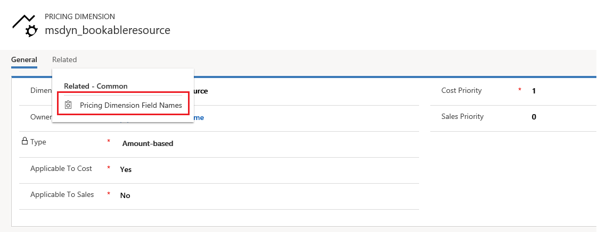
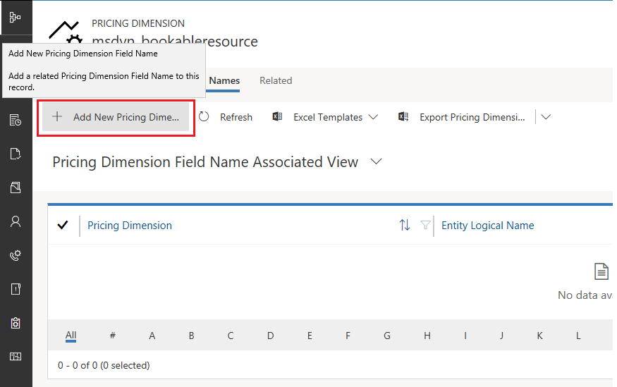
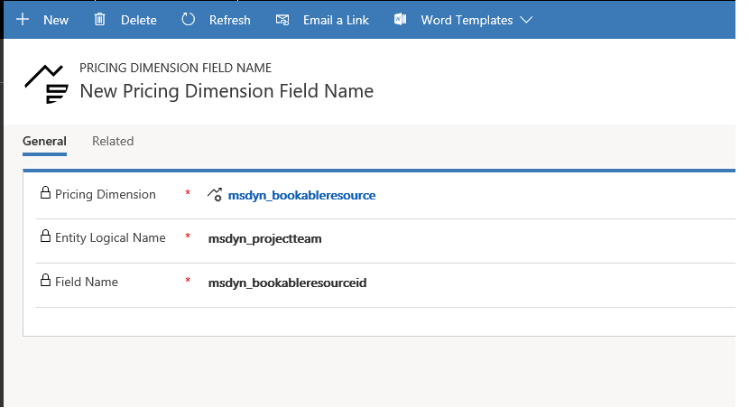

# Use bookable resource as a pricing dimension
This topic provides information about using a bookable resource as a pricing dimension. Before you begin, if you have not already created a pricing dimension solution, you will need to create a new one. If you already have a pricing dimension solution, then you can make your changes in that solution. If you have not created a new pricing dimension solution for your organization, complete the procedures in the [Create custom fields and entities](create-custom-fields-entities.md) topic.

## Add bookable resource to forms and views
To make the fields visible in the UI in the pricing dimension solution, you will need to walk through all of the forms and views of the key Project Service entities and add these fields to the forms and views of those entities.
The following table is a comprehensive list of the out-of-the box forms and views, listed by entity, that will need to be updated. If there are any additional views or forms in your customizations on these entities, add the new fields to those as well.
Open Solution Explorer for the pricing dimension solution and then click **Publish All Customizations**.

|   Entity        | Forms   |Views        |
| ------------------------------|---------------------------------|----------------------------------|
|  Role Price|• Information |• Active Resource Category Prices  • Resource Category Price Associated View|
|  Role Price Markup|• Information|• Active Role Price Markup • Role Price Markup Associated View|
|  Quote line detail|• Project Information • Project Quick Create|• Active Quote Line Detail • Combined Quote Line Details • Quote Line Detail associated view|
|  Project Contract line detail|• Project Information • Project Quick Create|• Combined Contract line Details • Active Contract Line Details • Contract Line Detail associated view|
|  Project Task|• Information • New Form||
|  Project Team Member|• Information • New Form|• Active Project Team Members • Project Team Members • Project Team members associated View|
|  Time Entry|• Information • Create Time Entry|• My Time Entries By Date • My time Entries for this week • Time entries for approval|
|  Journal Line|• Information • Quick create|• Active journal lines • Journal Line associated view|
|  Invoice Line Detail|• Information • Quick create|• Active Invoice Line Details • Chargeable Invoice Transactions • Complimentary Invoice Transactions • Invoice Line Detail associated view • Non-Chargeable Invoice Transactions|
|  Actual|• Information • Active Actuals|• Actual Associated view|

## Set up bookable resource as a pricing dimension

1. In the web interface, go to **Project Service** > **Settings** > **Parameters**. On the **Parameter** page, on the **Amount-Based Pricing Dimensions** tab, notice that the grid on the tab shows the records in the pricing dimensions entity. 
2. Add **Bookable Resource** to this list of pricing dimensions as **msdyn_bookableresource**. 
3. Indicate the context in which the bookable resource works as a pricing dimension and set the **Applicable to cost** and **Applicable to sales** values.
4. In the **Dimension Type** field, select **Amount-based**. 
5. Select the cost and sales priority for the bookable resource. Typically, when included as a pricing dimension, a bookable resource has the highest priority so setting this to **1** (or **0** depending on how you count the priority) would ensure that behavior.

## Set up pricing dimension field names

When the field name of a pricing dimension in the **Role Price** table is different from its field name in any of the other entities where price defaulting needs to work, the pricing dimension record must be made aware of the different names.    
For bookable resource, the **Project Team Members** entity has a slightly different field name (**msdyn_bookableresourceid**) from what it is called on the **Role price** entity (**msdyn_bookableresource**). The pricing dimension record for **msydn_bookableresource** must be made aware of this. 
1. To do this, double-click the row in the **Pricing Dimensions** grid to open the dimension page of **msdyn_bookableresource**.
2. On dimension page, on the **Related** tab, click **Pricing Dimension Field Names**.

 

4. On the associated view that opens, click **Add New Pricing Dimension Field Name**.

 

This opens the **New Pricing dimension field name** page for **msdyn_bookableresource**. 

5. Add **msdyn_projectteam** to the **Entity Locigal Name** field and **msdyn_bookableresourceid** to the **Field Name** field. Save the record.

 
