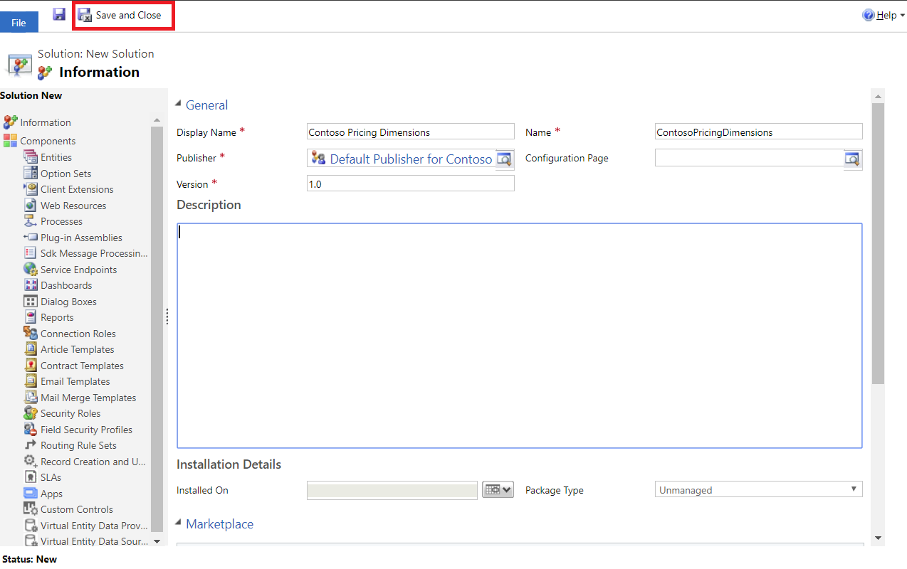
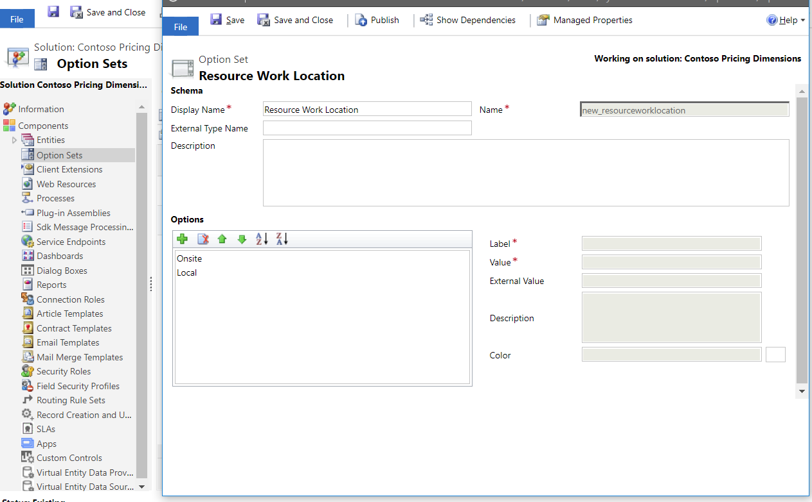
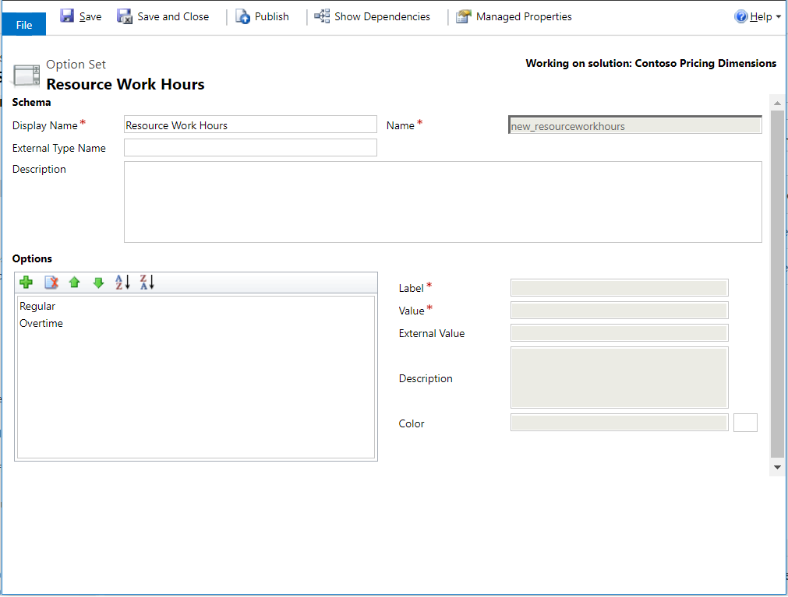
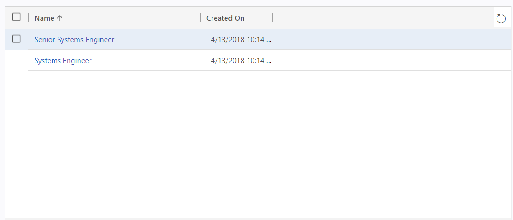
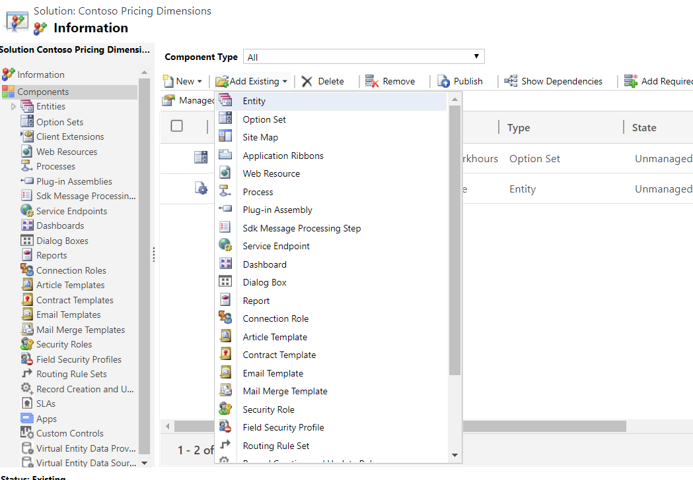
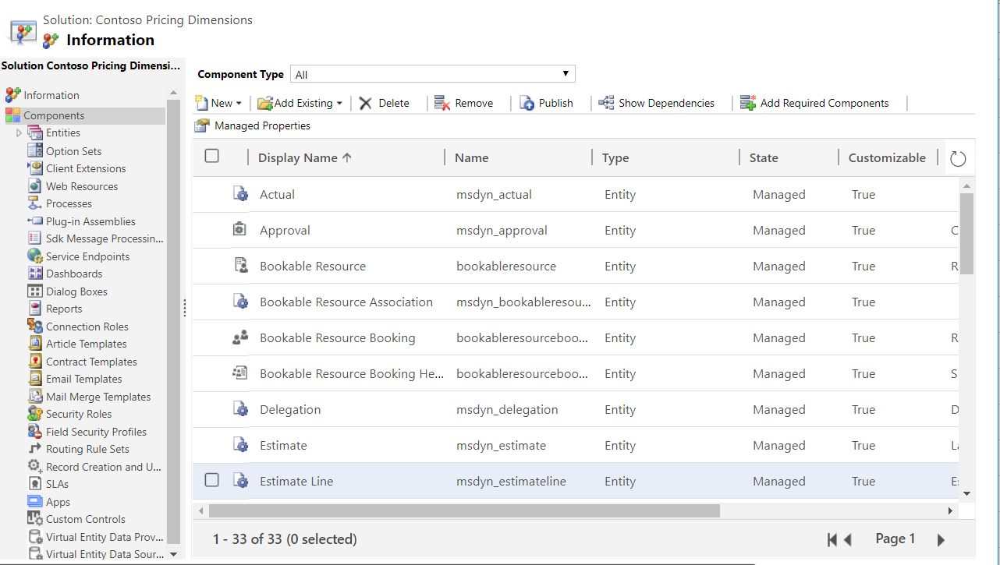
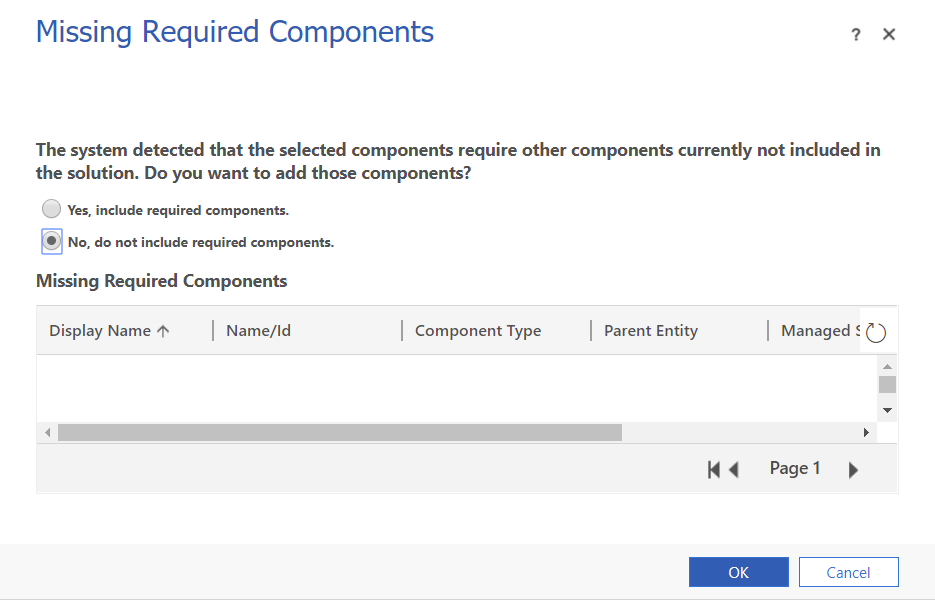

# Create custom fields and entities 

Complete the following steps any time that you want to create a custom option set or entity on the Power Apps platform.  
The procedures in this topic should be completed using the web interface of Project Service Automation (PSA).

> [!IMPORTANT]
> We recommend that you make all custom pricing dimension changes in a separate solution. This important best practice provides flexibility in the future to update or remove changes as needed, will help with re-use of your work, and makes it easier to port these changes to another instance. After you have made all of the required changes, export this solution as a **Managed solution** and import it into other instances to reuse your pricing setup.

## Create a custom solution for pricing dimensions
1. In PSA, click **Settings** > **Solutions**, and then click **New** to create a new solution. 
2. Name the solution, **\<your organization name> pricing dimensions**, enter the remaining required information, and then click **Save**.

> 
  
## Create custom fields and option sets in the pricing dimension solution

A pricing dimension can be an option set or an entity. Both must be created in your pricing solution. The steps in this procedure explain how to create entity-based dimensions and option set-based dimensions.

### Entity-based dimensions

1. In PSA, click **Settings** > **Solutions**, and then double-click **\<your organization name> pricing dimensions**.
2. In Solution Explorer, on the left navigation pane, select **Entities**.
3. Click **New** to create a new entity called **Standard Title**. Enter the remaining required information, and then click **Save**.

> 

### Option set-based dimensions 
You can create two option set-based dimensions. Use **Resource Work Location** to track the price of **Home** location work and **Onsite** work and use **Resource Work hours** with values **Regular** and **Overtime** to apply a markup when work is completed.

1. In PSA, click **Settings** > **Solutions**, and then double-click  **\<your organization name> pricing dimensions**. 
2. In Solution Explorer, on the left navigation pane, select  **Option Sets**. 
3. Click **New** to create a new option set, enter the remaining required information, and then click **Save**.

> 

> 

## Create data for entity-based dimensions

You can create data for entity-based dimensions manually, or by using Microsoft Excel import or service calls. Use the steps in this procedure to create two standard titles, **Systems Engineer** and **Senior Systems Engineer** from the entity-based dimension, **Standard Title**. If the data that you want to create is small, as in the following example, you can use a standard form.

1. In PSA, click **Advanced Find**. Select the entity **Standard Title** and then click **Results**. All of the rows in the **Standard Title** entity will be shown.
2. Click **New**. In the **Name** field, enter "Systems Engineer" and then click **Save**.
3. Close the form. 
4. Repeat steps 1 - 3 to create another standard title for "Senior Systems Engineer".

> 

## Add all required PSA entities and related components to the Pricing Dimension Solution
You will need to add the following Project Service entities to your pricing solution. Use the steps in this procedure to make some important schema changes in the pricing solution so that the entities become aware of the new pricing dimensions.

1. In PSA, click **Settings** > **Solutions**, and then double-click **\<your organization name> pricing dimensions**. 
2. In Solution Explorer, on the left navigation pane, select **Add Existing** > **Entities**.
3. In the **Solution Components** dialog box, select the following entities:

- Actual
- Bookable Resource
- Estimate Line
- Invoice Line Detail
- Journal Line
- Project Contract Line Detail
- Project Team Member
- Quote Line Detail
- Role Price Markup
- Role Price 
- Time Entry 

> 

> 

> [!NOTE]
> Make sure to include all forms and views for each of the entities selected.

4. When prompted to include any dependent entities for the entities selected above, click **No**.

> 

