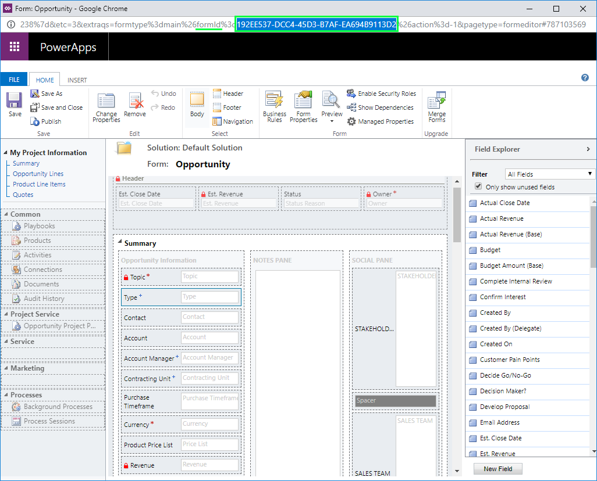

# Add new custom entity forms (Project Service Automation 2.x)

## Type field 

Dynamics 365 Project Service Automation relies on the **Type** (**msdyn\_ordertype**) field of the Opportunity, Quote, Order, and Invoice entities to distinguish **work-based** versions of these entities from **item-based** and **service-based** versions. Work-based versions of these entities are handled by PSA. Lots of business logic on the client side and server side of the solution depends on the **Type** field. Therefore, it's important that the field be initialized with a correct value when the entities are created. An incorrect value can cause incorrect behaviors, and some business logic might not run correctly.

## Automatic form switching

To avoid potential data corruption and unexpected behaviors that are caused by incorrect initialization and editing of the sales entity records, PSA now includes logic for automatic form switching in out-of-box forms. This logic takes users to the correct form for working with the work-based version or any other type of Opportunity, Quote, Order, or Invoice entity. When a user opens the work-based version of an Opportunity, Quote, Order, or Invoice entity, the form is switched to **Project Information**.

The automatic form switching logic relies on the mapping between the **formId** value and the **msdyn\_ordertype** field. All out-of-box forms have been added to that mapping. However, custom forms must be manually added to indicate which version of the entity they are intended to handle. This is based on the **msdyn\_ordertype** field. If the form switching is missing from the mapping, logic will switch to the out-of-box form, based on the value that is saved in the **msdyn\_ordertype** field of the entity.

## Add custom forms and turn on the form switching logic

The following example shows how to add a custom form, **My Project Information**, so that it works with work-based opportunities. The same process is used to add custom forms so that they work with quotes, orders, and invoices.

Follow these steps to create a custom version of the **Project Information** form.

1. In the Opportunity entity, open the **Project Information** form, and save a copy under the name **My Project Information**.
2. Open the new form, and then, in the properties, make sure that the form initialization scripts from the **Project Information** form are present. 

    > [!IMPORTANT]
    > Don't remove the scripts. Otherwise, some data might be initialized incorrectly.

3. Verify that the **Type** (**msdyn\_ordertype**) field is present in the form. 

    > [!IMPORTANT]
    > Don't remove this field. Otherwise, the initialization scripts will fail.

4. Find the **formId** value of the new form. You can complete this step in two ways:

    - Export the **My Project Information** form as part of an unmanaged solution, and then look up the **formId** value in the customization.xml file of the exported solution.
    - Open the **My Project Information** form in the form editor, and then look for the globally unique identifier (GUID) next to the **fromId** parameter in the URL, as shown in the following illustration.

    

5. Create an **msdyn\_ordertype** mapping for the **formId** value by editing the msdyn\_/SalesDocument/PSSalesDocumentCustomFormIds.js web resource. Remove the code from the resource, and replace it with the following code.

    ```javascript
    define(["require", "exports"], function (require, exports) {
        "use strict";
        var SalesDocumentCustomFormIds = (function () {
            function SalesDocumentCustomFormIds() {
            }
            SalesDocumentCustomFormIds.overwriteFormIds = function (mappedFormIds) {
                /*
                ---- Notes ----
                mappedFormIds[SalesEntity][OrderType] => The array of forms IDs that support particular entity and order type
                Add or overwrite customized formId for the particular entity and order type by calling:
                    mappedFormIds[<EntityType>][<msdyn_ordertype>].push("<formId>");
                Allowed msdyn_ordertype values for reference:
                    ServiceBased: 690970002 (Field Service version of the entity)
                    WorkBased: 192350001 (PSA version of the entity)
                    ItemBased: 192350000 (Regular out of the box entity)
                Uncomment and update one of the following lines to register custom PSA form for required entity:
                */		
                //mappedFormIds[1][192350001].push("<formId>"); //Quote
                //mappedFormIds[5][192350001].push("<formId>"); //Quote Line
                //mappedFormIds[2][192350001].push("<formId>"); //Sales Order
                //mappedFormIds[6][192350001].push("<formId>"); //Sales Order Line
                // In this example we have added new form for Opportunity
                mappedFormIds[0][192350001].push("192EE537-DCC4-45D3-B7AF-EA694B9113D2"); //Opportunity
                //mappedFormIds[4][192350001].push("<formId>"); //Opportunity Line
            };
            return SalesDocumentCustomFormIds;
        }());
        exports.default = SalesDocumentCustomFormIds;
    });
    ```

6. Save and then publish the customizations.
