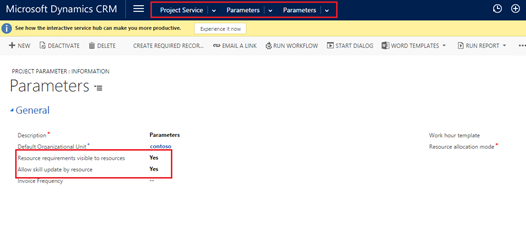
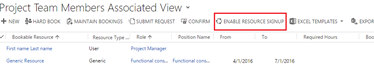

# Enable Project Finder Mobile app features (Project Service Automation)

[!INCLUDE[cc-applies-to-update-9-0-0](../includes/cc_applies_to_update_9_0_0.md)]

Your resources can use the Project Finder Mobile app on their phone with [!INCLUDE[pn_project_service_auto](../includes/pn-project-service-auto.md)] to find new projects to work on and update their skill sets.  
  
 The app is available for [!INCLUDE[tn_Apple_iphone](../includes/tn-apple-iphone.md)], [!INCLUDE[tn_android](../includes/tn-android.md)] phones, and [!INCLUDE[pn_windows_phone](../includes/pn-windows-phone.md)].  
  
 You need to set a couple of options in the parameters setting for your organizational unit to allow users to view projects' resource requirements and update their skills.  
  
> [!NOTE]
>  The Project Finder Mobile app only works with [!INCLUDE[pn_crm_online_shortest](../includes/pn-crm-online-shortest.md)], not with on-premises installations.  
  
1.  Go to **Project Service > Parameters**.  
  
2.  Click the parameters setting you want to use for allowing the Project Finder Mobile app features.  
  
3.  In the **General** area, set **Resource requirements visible to resources** to **Yes**.  
  
4.  Set **Allow skill update by resource** to **Yes**.  
  
   
  
 This is a global setting. Project managers can set whether an individual project will be visible on that project's **Project Team** page.  
  
   
  
## Email notifications  
 [!INCLUDE[pn_project_service_auto](../includes/pn-project-service-auto.md)] sends emails regarding resource requests to the following recipients at the following times:  
  
|Recipient|Event|  
|---------------|-----------|  
|Project manager|-   When a resource signs up for a project with the Project Finder Mobile app.|  
|Resource|-   When the project work the resource has signed up for has already been fulfilled by another resource. -   When their skill approval request has been approved or rejected. -   When their project sign up request has been approved or rejected.|  
  
## Privacy notice  
 [!INCLUDE[cc_privacy_crm_project_finder_mobile_app](../includes/cc-privacy-crm-project-finder-mobile-app.md)]  
  
### See Also  
 [Set up resources](../project-service/set-up-resources.md)
