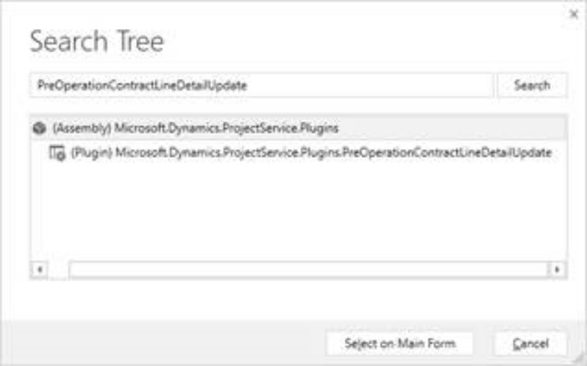
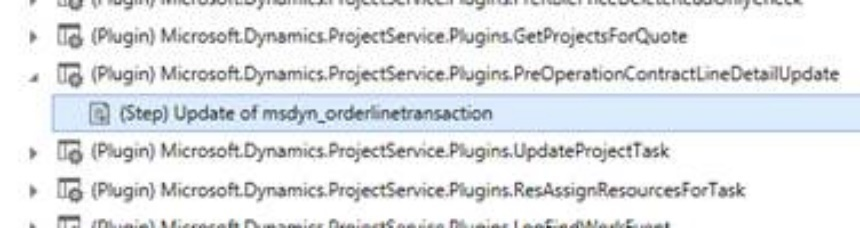
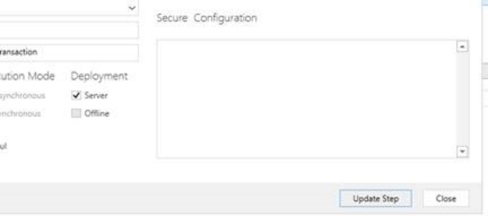

# Estimates

[!INCLUDE[cc-applies-to-psa-app-3.x](../includes/cc-applies-to-psa-app-3x.md)]

On a project-based quote, you can use the Quote line detail entity to estimate the work that is required to deliver a project. You can then share that estimate with the customer.

Project-based quote lines don't have to have any quote line details. Alternatively, they can have many quote line details. Quote line details are used to estimate time, expenses, or fees. PSA doesn't allow for material estimates on quote line details. These are called transaction classes. Estimated tax amounts can also be entered on a transaction class.

In addition to transaction classes, quote line details have a transaction type. PSA support two transaction types for quote line details: **Cost** and **Project Contract**.

## Estimate by using a contract

If you used a PSA quote when you created a project-based contract, the estimate that you did for each quote line on the quote is copied to the project contract. The structure of a project contract is like the structure of project quote that has lines, line details, and invoice schedules.

Estimates can be done directly in a project contract, as in a project quote. For a project quotation, the estimate is done by using contract lines and contract line details. Contract line details can also be generated from a project plan that was created by using the bottom-up estimate approach.

Contract line details can be used to estimate time, expenses, or fees. Estimated tax amounts can also be entered on a contract line detail.

PSA doesn't allow for material estimates on contract line details.

The processes that are supported on a project contract are invoice creation and confirmation. Invoice creation creates a draft of a project-based invoice that includes all unbilled sales actuals until the current date.

Confirmation makes the contract read-only and changes its status from **Draft** to **Confirmed**. After you take this action, you can't undo it. Because this action is permanent, it's a best practice to keep the contract in a **Draft** status.

The only differences between draft contracts and confirmed contracts are their status and the fact that draft contracts can be edited whereas confirmed contracts can't. Invoice creation and tracking actuals can be done on both draft contracts and confirmed contracts.

PSA doesn't support change orders on contracts or projects.

## Estimating projects

You can estimate time and expenses on projects. PSA doesn't allow for estimates of materials or fees on projects.

Time estimates are generated when you create a task and identify the attributes of a generic resource that is required to perform the task. Time estimates are generated from schedule tasks. Time estimates aren't created if you create generic team members outside the context of the schedule.

Expense estimates are entered in the grid on the **Estimates** page.

## Understanding estimation

Use the following table as a guide for understanding the business logic in the estimation phase.

| Scenario                                                                                                                                                                                                                                                                                                                                          | Entity record                                                                                                                                                                                                       | Transaction Type | Transaction Class | Additional information                                                            |
|---------------------------------------------------------------------------------------------------------------------------------------------------------------------------------------------------------------------------------------------------------------------------------------------------------------------------------------------------|---------------------------------------------------------------------------------------------------------------------------------------------------------------------------------------------------------------------|------------------|-------------|-----------------------------------------------------------------------------------|
| When you need to estimate the sales value of time on a quote                                                                                                                                                                                                                                                                                    | Quote line detail (QLD) record is created                                                                                                                                                                               | Project contract | Time        | Transaction origin field on the sales side QLD row references the Cost side QLD |
|                                                                                                                                                                                                                                                                                     | A second QLD record is created by the system to store the corresponding cost values. All non-money fields are copied from the sales QLD to the Cost QLD by the system.                                                                                                                                                                               | Cost | Time        | Transaction origin field on the sales side quote line detail (QLD) row references the Cost side QLD |
| When you need to estimate the sales value of time on a contract                                                                                                                                                                                                                                                                                 | Project contract line detail (CLD) record is created                                                                                                                                                                    | Project Contract | Time        | Transaction origin field on the sales side CLD row references the cost CLD      |
|                                                                                                                                                                                                                                                                                  | A second CLD record is created by the system to store the corresponding cost values. All non-money fields are copied from the sales CLD to the cost CLD by the system.                                                                                                                                                                    | Cost | Time        | Transaction origin field on the sales side CLD row references the cost CLD      |
| When the user describes a resource on a project task                                                                                                                                                                                                                                                                                            | Estimate line record to show the sales value of the task is created when a task is created with all required pricing dimensions. Role and organizational units are the OOB Project Service pricing dimensions | Project Contract | Time        |                                                                                   |
|     | The estimate line record to show the cost value of the task is created when a task is created with all required pricing dimensions. All non-money fields are copied from the sales estimate line to the cost estimate line by the system. Role and organizational unit are the OOB PSA pricing dimensions for both cost and bill rates.                                                                                                                                                                                                                | Cost             | Time           |                                                                                   |

## Customizing the Quote line detail and Contract line detail entities

If you added a custom field on the quote line detail and want the system to enter the value of the field as a default value on the related cost line that it creates, use the PreOperationContractLineDetailUpdate and PreOperationQuoteLineDetailUpdate plug-in registration tools. These plug-ins must be re-registered after the quote line detail or the contract line detail is changed. Follow these steps to complete the process.

1. Open PluginRegistrationTool, and connect to your online instance.
2. Select **Search**, and search for the plug-in to update.

    

3. Select the plug-in, and then, on the main page, select **Select**.
4. Select the step of the plug-in to update, right-click, and then select **Update**.

    

5. In the **Update Existing Step** dialog box, in the **Filtering Attributes** field, select the ellipsis button (**...**):
 
    

6. In the **Select Attributes** dialog box, select check boxes for custom attributes.

    

7. Select **OK** to close the dialog box, and then select **Update Step**.
 
    

8. Repeat steps 1 through 7 for the second plug-in.
9. Close the PluginRegistrationTool.
