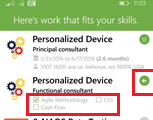

# Find your next project with the Project Finder Mobile app (Project Service Automation)

[!INCLUDE[cc-applies-to-update-9-0-0](../includes/cc_applies_to_update_9_0_0.md)]

With the Project Finder Mobile app on your [!INCLUDE[tn_iphone](../includes/tn-iphone.md)], [!INCLUDE[tn_android](../includes/tn-android.md)] phone, or [!INCLUDE[pn_windows_phone](../includes/pn-windows-phone.md)], you can look up projects and sign up for ones that best meet your skill set and interests. You can also update your skills and proficiency levels with the app.  
  
 When you first start the app, you'll need to enter the URL for your [!INCLUDE[pn_crm_shortest](../includes/pn-crm-shortest.md)] system, your user ID, and your password. If you don't have this information,  contact your [!INCLUDE[pn_crm_shortest](../includes/pn-crm-shortest.md)] administrator.  
  
## Find a project  
 The Project Finder Mobile app shows a list of projects ranked according to how well your skills and proficiency levels match the required skills and proficiency levels for the project. The projects that are the best fit for you appear at the top of the list. A checked box under the project title indicates your skills meet or exceed the requirements for the project.  
  
 Tap the arrow to the right of the project you're interested in to see more details and sign up for it.  
  
   
  
## Update your skills  
 Tap the profile button on the bottom right of the screen to update your skills and proficiency levels.  
  
   
  
### See Also  
 [Time, Expense, and Collaboration Guide](../project-service/time-expense-collaboration-guide.md)
