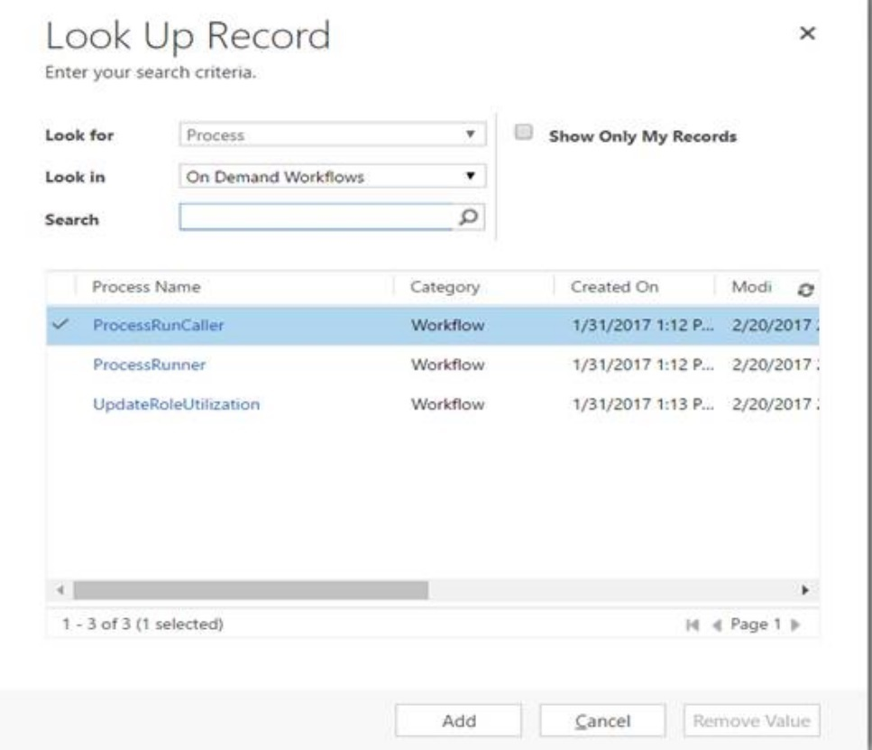

---

title: Invoicing in Project Service Automation
description: This topic provides information about invoicing in Dynamics 365 for Project Service Auotmation (PSA).
author: rumant
manager: kfend
ms.service: dynamics-365-customerservice
ms.custom:
  - dyn365-projectservice
ms.date: 03/11/2019
ms.topic: article
ms.prod: 
ms.service: business-applications
ms.technology: Microsoft Dynamics 365 for Customer Engagement for Project Service 2.x and Microsoft Dynamics 365 for Customer Engagement for Project Service 3.x
audience: Admin
search.audienceType: 
  - admin
  - customizer
  - enduser
search.app: 
  - D365CE
  - D365PS
---
# Invoicing in Project Service Automation

[!INCLUDE[cc-applies-to-psa-app-3.x](../includes/cc-applies-to-psa-app-3x.md)]

Invoicing in Dynamics 365 for Project Service Automation (PSA) is useful as a second level of approval by project managers before they generate an invoice for the customer. The first level of approval is completed when time and expense entries that are submitted by project team members are approved.
PSA isn’t designed for creating customer facing invoices  because it does not contain:

- Tax information
- The ability to convert other currencies to the invoicing currency using properly-configured exchange rates
- The ability to properly format an invoice for printing

You can use a financial or accounting system to create a customer-facing invoice that uses the information from an invoice proposal that is generated in PSA.

## Creating project invoices in PSA
A project invoice can be created as a single invoice or you can generate the invoices in bulk. You can create invoices manually, or they can be configured for automated runs.

### Manually creating project invoices in PSA
Project invoices can be created one-by-one for each project contract, or in bulk from the **Project Contracts** list page.

When you are creating the invoices in bulk, select one or more project contracts from the **Project Contracts** list page, and then click **Create Invoice**. Select all of the project contracts for which you need to create an invoice.

A warning message indicating that there could be a delay in creating invoices and the process will be shown. Click **OK** to close the message. An invoice will be generated for all transactions on a contract line that are in the status **Ready to Invoice**. This includes time, expense, milestones, and product-based contract lines.  

To view the invoices that were generated, go to **Sales** \> **Billing** \> **Invoices**. There will be one invoice created for each project contract.

> 

To create an invoice for each project contract, go to the **Project Contract** list page, open a project contract, and click **Create Invoice**. An invoice will be generated for all transactions that are in the status **Rready to Invoice** for the specific project contract. This includes time, expense, milestones, and product-based contract lines. 

> 

### Automated creation of project invoices in PSA 
Complete the following steps to configure an automated invoice run in PSA.

1. Go to **Project Service** > **Settings** > **Batch jobs**.
2. Create a new batch job and name it "PSA Create Invoices”. The batch job name must include the term **Create Invoices**. 
3. In the **Job type** field, select **None**. The **Frequency Daily** and **Is Active** fields will default to **Yes** .
4. Click **Run Workflow**. You will see the following three workflows in the **Look Up Record** screen:

> 
 
5. Select **ProcessRunCaller** and click **Add**.
6. On the next screen, click **OK**. This results in a workflow of **Sleep** followed by **Process**. You could also choose **ProcessRunner** then click **OK**. This results in a workflow of process followed by **Sleep**.

**ProcessRunCaller** and **ProcessRunner** are the workflows that create invoices. **ProcessRunCaller** calls **ProcessRunner**. **ProcessRunner** actually creates the invoices by running through all of the contract lines that need an invoice created and creates invoices for them. This is discovered by looking at invoice run dates for that contract line. If contract lines that belong to one contract have invoice run dates that fall on the same day, the transactions are combined into one invoice with two invoice lines. If there are no transactions to create invoices, the job will skip invoice creation.

After is has finished, **ProcessRunner** calls **ProcessRunCaller** with the **End time** and shuts down. **ProcessRunCaller** then starts a timer that runs for 24 hours from that end time. At the end of the time, **ProcessRunCaller** shuts down.

The batch process job for creating invoices is the recurrent job. Running this batch process many times creates multiple instances of the job, which causes errors. For this reason, you only need to start it once and you only need to re-start it if it has stopped running.
 
### Edit a draft PSA invoice

When you create a draft project invoice, all unbilled sales transactions that were created when the time and expense entries were approved are pulled on to the invoice. You can make the following adjustments while the invoice is still in draft stage:

- Invoice line details can be deleted or edited. 
- Quantity and billing type can be edited and adjusted. 
- Add time, expense, and fees directly as transactions on the invoice. You can use this feature if the invoice line maps to a contract line that allows these transaction classes.

Click **Confirm** to confirm an invoice. This is a one-way action and makes the invoice read-only and creates billed sales actuals from each invoice line detail for each invoice line. If the invoice line detail was referencing an unbilled sales actual as it would if it were created from a time or expense entry, the system also reverses the unbilled sales actual. For accounting purposes, this reversal can be used by general ledger integration systems to reverse Project WIP for accounting.

### Correct a confirmed PSA invoice

Confirmed PSA invoices can be edited. When you choose to correct a confirmed invoice, a new draft invoice is created with all the transactions from the original invoice with the assumption that you want to reverse all transactions and quantities from the original invoice. The result is that on the draft invoice, all of the quantities are zero. Any transactions that do not need corrections can be removed from the draft corrective invoice. If you want to reverse or return only partial quantity, you can edit the quantity field on the line detail. If you open the invoice line detail, you can see the original invoice quantity and edit the current invoice quantity to be less or more than the original.

Confirming a corrected invoice will reverse the original billed sales actual and create a new one. If the quantity was reduced, the difference will also trigger a new unbilled sales actual to be created. For example, if the original billed sales was for eight hours and the corrective invoice line detail has a reduced quantity of six hours, PSA will reverse the original billed sales line and created two new actuals:

- A billed sales actual for six hours.
- An unbilled sales actual for the remaining two hours. This transaction can then be billed at a later point or can be marked non-chargeable as negotiated with the customer.
