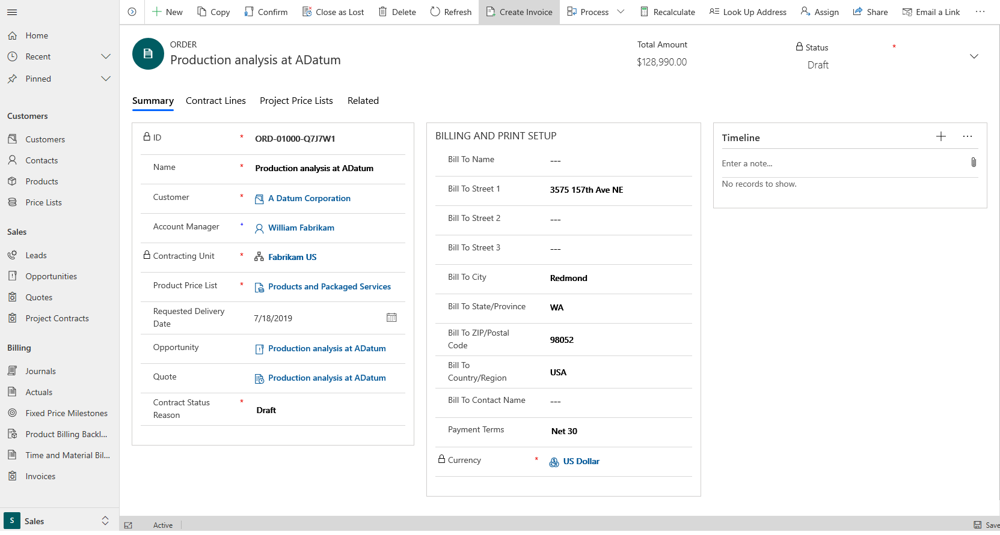
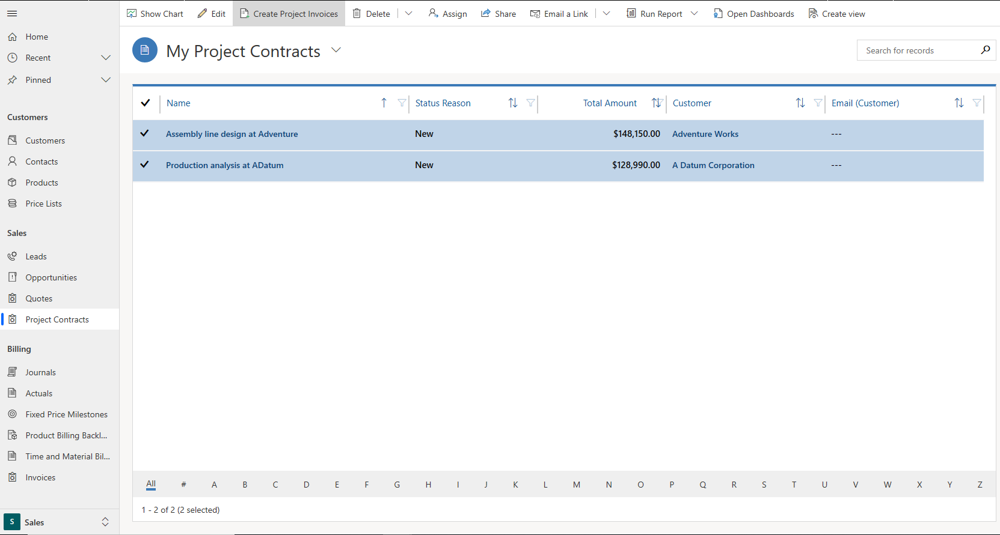

---

title: Invoicing in Project Service Automation
description: This topic provides information about invoicing.
author: rumant
manager: kfend
ms.service: dynamics-365-projectservice
ms.custom:
  - dyn365-projectservice
ms.date: 03/11/2019
ms.topic: article
ms.prod: 
ms.service: business-applications
ms.technology: Microsoft Dynamics 365  Project Service Automation 2.x and 3.x
audience: Admin
search.audienceType: 
  - admin
  - customizer
  - enduser
search.app: 
  - D365PS
---

# Invoicing in Project Service Automation

[!INCLUDE[cc-applies-to-psa-app-3.x](../includes/cc-applies-to-psa-app-3x.md)]

Invoicing in Dynamics 365 Project Service Automation is useful because it gives project managers a second level of approval before they create invoices for customers. The first level of approval is completed when the time and expense entries that project team members submit are approved.

PSA isn't designed to generate customer-facing invoices, for the following reasons:

- It doesn't contain tax information.
- It can't convert other currencies to the invoicing currency by using correctly configured exchange rates.
- It can't correctly format invoices so that they can be printed.

Instead, you can use a financial or accounting system to create customer-facing invoices that use the information from invoice proposals that are generated in PSA.

## Creating project invoices in PSA

Project invoices can be created one at a time or in bulk. You can create them manually, or they can be configured so that they are generated in automated runs.

### Manually create project invoices in PSA

From the **Project Contracts** list page, you can create project invoices separately for each project contract, or you can create invoices in bulk for multiple project contracts.

Follow this step to create an invoice for a specific project contract.

- On the **Project Contracts** list page, open a project contract, and then select **Create Invoice**.

    

    An invoice is generated for all transactions for the selected project contract that have a status of **Ready to Invoice**. These transactions include time, expenses, milestones, and product-based contract lines.

Follow these steps to create invoices in bulk.

1. On the **Project Contracts** list page, select one or more project contracts that you must create an invoice for, and then select **Create Project Invoices**.

    

    A warning message informs you that there might be a delay before invoices are created. The process is also shown.

2. Select **OK** to close the message box.

    An invoice is generated for all transactions on a contract line that have a status of **Ready to Invoice**. These transactions include time, expenses, milestones, and product-based contract lines.

3. To view the invoices that are generated, go to **Sales** \> **Billing** \> **Invoices**. You will see one invoice for each project contract.

### Set up automated creation of project invoices in PSA

Follow these steps to configure an automated invoice run in PSA.

1. Go to **Project Service** \> **Settings** \> **Batch jobs**.
2. Create a batch job, and name it **PSA Create Invoices**. The name of the batch job must include the term "Create Invoices."
3. In the **Job type** field, select **None**. By default, the **Frequency Daily** and **Is Active** options are set to **Yes**.
4. Select **Run Workflow**. In the **Look Up Record** dialog box, you will see three workflows:

    - ProcessRunCaller
    - ProcessRunner
    - UpdateRoleUtilization

5. Select **ProcessRunCaller**, and then select **Add**.
6. In the next dialog box, select **OK**. A **Sleep** workflow is followed by a **Process** workflow.

    You can also select **ProcessRunner** in step 5. Then, when you select **OK**, a **Process** workflow is followed by a **Sleep** workflow.

The **ProcessRunCaller** and **ProcessRunner** workflows create invoices. **ProcessRunCaller** calls **ProcessRunner**. **ProcessRunner** is the workflow that actually creates the invoices. It goes through all the contract lines that invoices must be created for, and it creates invoices for those lines. To determine the contract lines that invoices must be created for, the job looks at invoice run dates for the contract lines. If contract lines that belong to one contract have the same invoice run date, the transactions are combined into one invoice that has two invoice lines. If there are no transactions to create invoices for, the job skips invoice creation.

After **ProcessRunner** has finished running, it calls **ProcessRunCaller**, provides the end time, and is closed. **ProcessRunCaller** then starts a timer that runs for 24 hours from the specified end time. At the end of the timer, **ProcessRunCaller** is closed.

The batch process job for creating invoices is a recurrent job. If this batch process is run many times, multiple instances of the job are created and cause errors. Therefore, you should start the batch process only one time, and you should restart it only if it stops running.
 
### Edit a draft PSA invoice

When you create a draft project invoice, all unbilled sales transactions that were created when the time and expense entries were approved are pulled onto the invoice. You can make the following adjustments while the invoice is still in a draft stage:

- Delete or edit invoice line details.
- Edit and adjust the quantity and billing type.
- Directly add time, expense, and fees as transactions on the invoice. You can use this feature if the invoice line is mapped to a contract line that allows for these transaction classes.

Select **Confirm** to confirm an invoice. The Confirm action is a one-way action. When you select **Confirm**, the system makes the invoice read-only and creates billed sales actuals from each invoice line detail for each invoice line. If the invoice line detail references an unbilled sales actual, the system also reverses the unbilled sales actual. (Any invoice line detail that was created from a time or expense entry will reference an unbilled sales actual.) General ledger integration systems can use this reversal to reverse project work in progress (WIP) for accounting purposes.

### Correct a confirmed PSA invoice

Confirmed PSA invoices can be edited (corrected). When you correct a confirmed invoice, a new draft corrective invoice is created. Because the assumption is that you want to reverse all the transactions and quantities from the original invoice, this corrective invoice includes all the transactions from the original invoice, and all the quantities on it are 0 (zero).

If any transactions don't require correction, you can remove them from the draft corrective invoice. If you want to reverse or return only a partial quantity, you can edit the **Quantity** field on the line detail. If you open the invoice line detail, you can see the original invoice quantity. You can then edit the current invoice quantity so that it's less than or more than the original invoice quantity.

When you confirm a corrective invoice, the original billed sales actual is reversed, and a new billed sales actual is created. If the quantity was reduced, the difference will cause a new unbilled sales actual to be created too. For example, if the original billed sales was for eight hours, and the corrective invoice line detail has a reduced quantity of six hours, PSA reverses the original billed sales line and creates two new actuals:

- A billed sales actual for six hours.
- An unbilled sales actual for the remaining two hours. This transaction can either be billed later or marked as non-chargeable, depending on the negotiations with the customer.
