# Manage resources

[!INCLUDE[cc-applies-to-psa-app-3.x](../includes/cc-applies-to-psa-app-3x.md)]

Dynamics 365 Project Service Automation includes a resource manager dashboard that provides a visual overview of resource demand and utilization throughout the organization. You can use the charts on this dashboard to visualize the following information:

- **Resource demand** – The **Active Resource Request** chart shows resources that have been submitted. The resources are aggregated by either role or project.
- **Unsubmitted resource demand** – The **Unassigned Resource Demand** chart shows all the resource requirements that haven't been submitted. It helps resource managers view demand that isn't firm and might be submitted through a resource request.
- **Billable utilization for the past week** – The **Utilization by Role** chart shows the percentage of the organization's actual billable utilization by role against its target billable utilization by role.

    > [!NOTE]
    > To make the **Utilization by Role** chart available, create a job that runs the UpdateRoleUtilization workflow. This recurring job runs every seven days to calculate billable utilization for the previous seven days. The results are aggregated by role.

## Manage project team members

Project managers can use the resource manager dashboard to manage the resources on projects. For example, they can add a team member directly to a project and book a team member to fulfill the resource requirements that were captured by a generic resource.

### Add a team member directly to a project

To add a team member directly to a project, on the **Projects** page, on the **Team** tab, select **New**. The **Quick Create:Project Team Member** dialog box appears. In this dialog box, you can perform these tasks:

- **Book a named resource** – In the **Bookable Resource** field, select the name of the resource. Then select the role, set the period, and select an allocation method. The named resource that you selected is added to the project by using the selected allocation method and the resources calendar.
- **Add a generic resource** – Leave the **Bookable resource** field blank, and then select the role, set the period, and select the preferred allocation method. A generic resource is added to the team as a placeholder to hold the demand pattern that is used to book named resources on the team. The requirement is made according to the project calendar.
- **Add a named resource to the team without consuming resource capacity** – In the **Bookable Resource** field, select a resource. Then select the period, and select **None** as the allocation method. The resource is added to the team, but the resource's capacity isn't consumed through a booking.

### Book a team member to fulfill resource requirements for a generic resource

In PSA, you can book a generic resource on a project team, and can specify the role, the required capacity, and how that capacity is distributed. On the resource requirement, you can specify attributes that are associated with the generic resource. These attributes include required skills, the preferred organizational unit, and preferred resources.

Follow these steps to specify required skills on a generic resource for a developer.

1. On the **Projects** page, on the **Team** tab, select **New** to book a generic resource.

    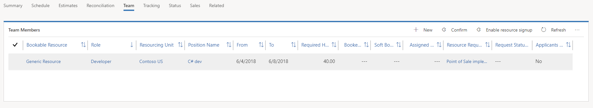

2. In the **All Team Members** view, in the **Resource Requirement** column, select the link to add required skills for the generic resource.

    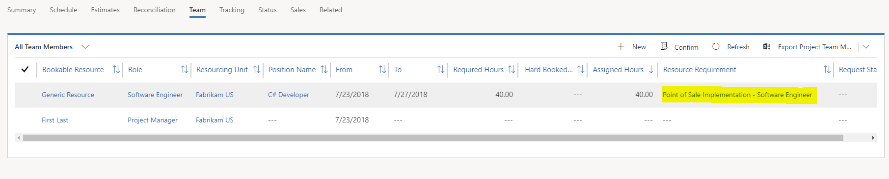

3. On the **Resource Requirement** page that appears, in the **Skills** grid, select the ellipsis (**...**) and then select **Add New Requirement Characteristic** to add the required skills for your developer.

    

4. In the **Quick Create: Requirement Characteristic** dialog box that appears, in the **Characteristic** field, select the required skill. Then, in the **Rating value** field, select the proficiency level for that skill. Finally, in the **Resource Requirement** field, set the requirement to source resources from organizational units or even named resources. When you've finished, select **Save**.

    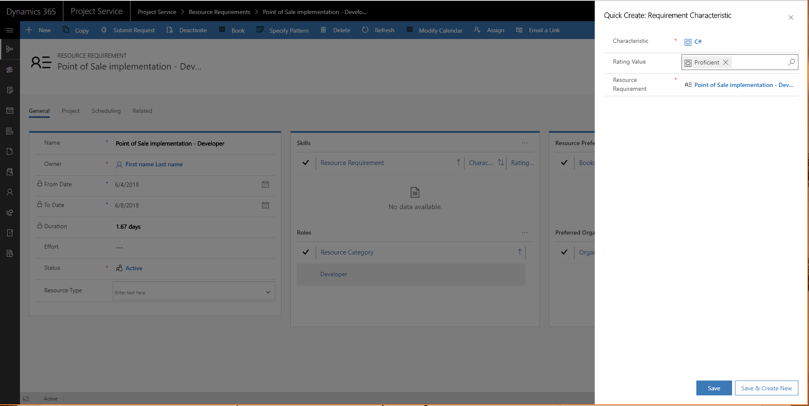

5. On the **Resource Requirement** page, select **Book** to fulfill the resource requirement.

    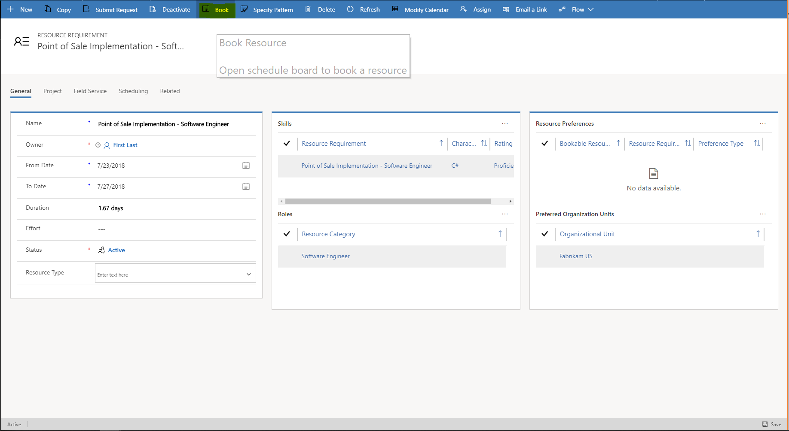

    You can also select the generic resource in the **All Team Members** grid and then select **Book**.

    

    > [!NOTE]
    > In this example, there are 40 required hours but no actual booked hours, because generic resources don't have bookings. Additionally, there are no assigned hours, because the generic resource was added directly to the team. It wasn't added by using task assignment.

    On the **Scheduling Assistant** page, you can filter available resources by the requirements that are specified on the resource requirement. Resources are sorted according to the sorting parameters that are specified on the Schedule Board.

    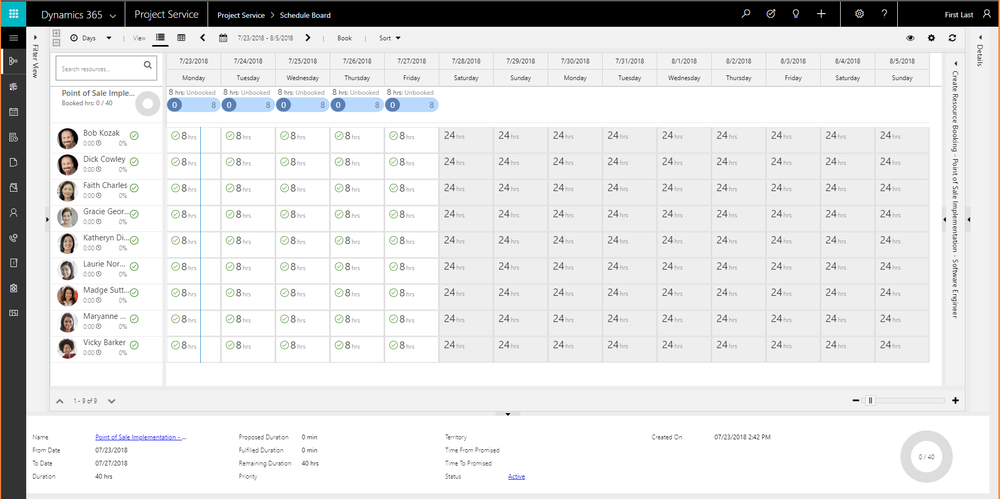

    Here are some filters that are often used:

    - **Characteristics along with a rating** – Filter by skills, certifications, and other resource qualities, in addition to ratings of proficiency.
    - **Roles** – Filter by the default roles that are assigned to bookable resources.
    - **Organizational units** – Filter bookable resources by the organizational units that they are assigned to.

6. If you aren't satisfied with the results of the initial requirement search, you can change the filter criteria. Expand the **Filter View** pane on the left, and then select **Search** to find additional resources.

    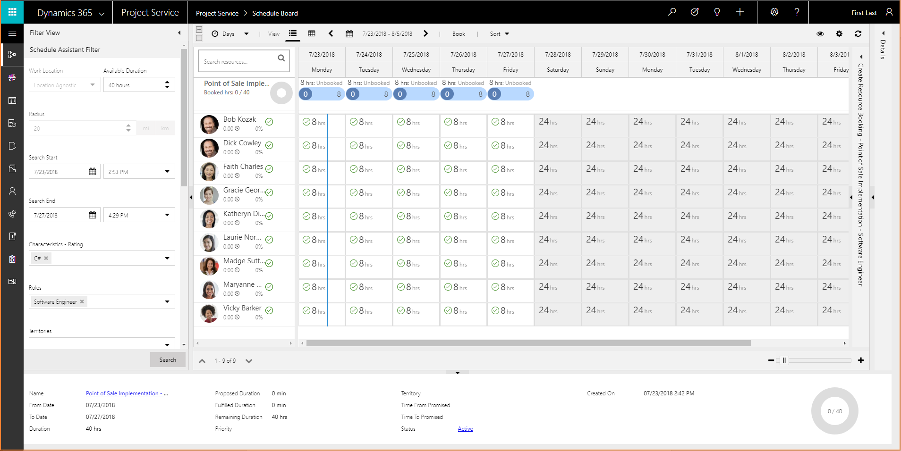

7. To change how the results are sorted, select **Sort**.

    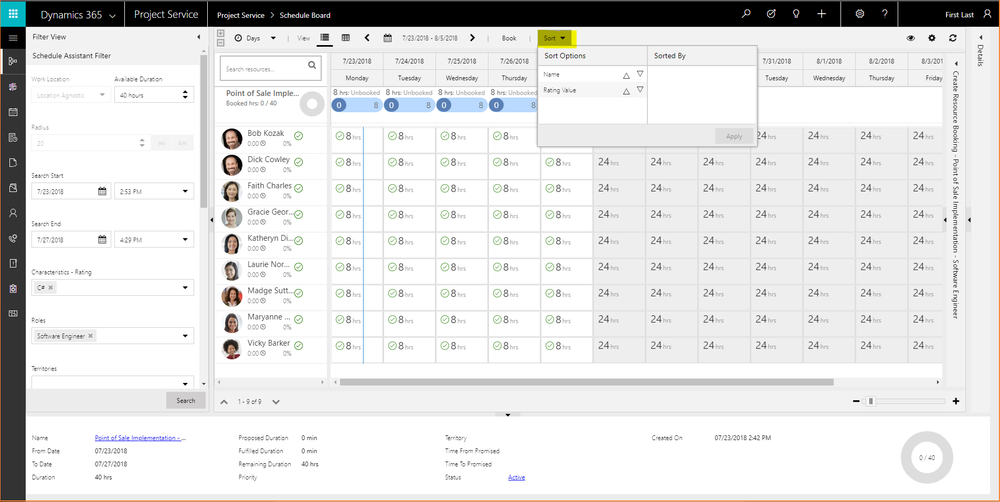

8. Select resources according to the demand that is specified on the requirement, as indicated at the top of the grid. You can clear the selection of cells in the grid and leave that resource capacity open. Only one resource at a time can be selected as booked.

9. Select **Book** to book the selected resource and leave the Schedule Board open, so that you can select additional resources. Alternatively, select **Book & Exit** to book the selected resource and close the Schedule Board.

    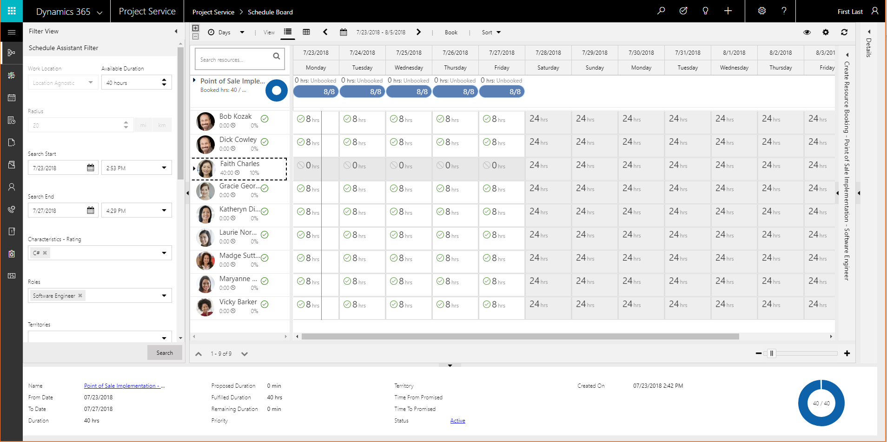

    You receive a notification about booked hours. The demand indicators show how much the booking requirement is satisfied and how much remains. You can also see how much of the selected resource's capacity is consumed. Select **Expand** to view more details about resource bookings.

9. Return to the **All Team Members** view. In the grid, notice that the generic resource has been replaced by the named resource, and 40 hours are listed as booked for that resource.

    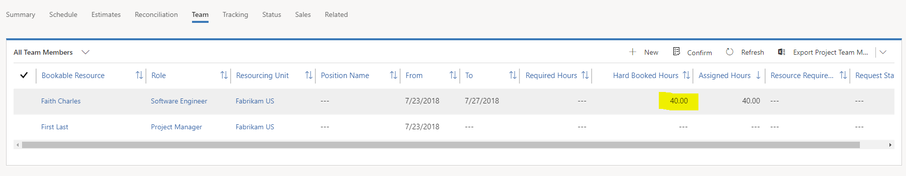

    > [!NOTE]
    > No assigned hours are shown, because they were booked directly on the team. They weren't booked by using task assignment.

## Assign generic resources to tasks and generate resource requirements

In PSA, you can create tasks and then assign generic resources to them. In this way, resource demand can be represented by placeholders while you estimate your schedule and financial numbers. You can then generate resource requirements for the generic resources and fulfill them.

1. On the **Projects** page, on the **Schedule** tab, select **Add** to create a task.

    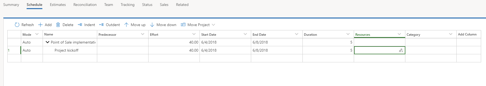

2. In the **Resources** field, select the **Resource Picker** symbol. The Resource Picker appears and shows existing team members for the project.

    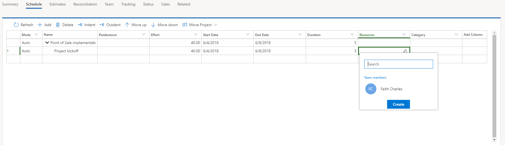

3. Enter the name of the new generic resource, and then select **Create**.

    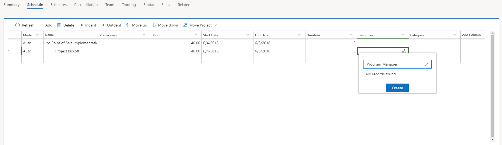

4. In the **Quick Create: Project Team Member** dialog box that appears, in the **Role** field, select the role for the generic resource. In the **Resourcing Unit** field, select the organizational unit for the generic resource. Then select **Save**.

    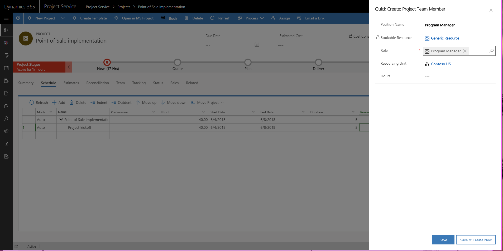

    The generic team member is now assigned to the task.

    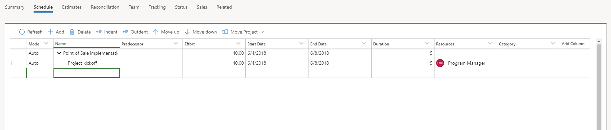

    On the **Team** tab, you will see the new generic team member. Notice that it has only assigned hours. These hours are the sum of all tasks that are assigned to the generic team member. The generic team member doesn't yet have required hours or a resource requirement.

    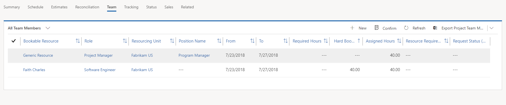

5. You can now assign the generic team member to other tasks by using the Resource Picker.

    

    When you've finished assigning the generic resource to tasks, you can generate a resource requirement for the generic resource.

5. On the **Team** tab, select the generic resource, and then select **Generate Requirement**.

    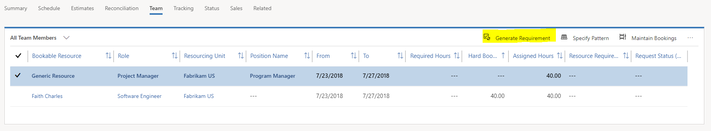

    When the requirement is generated, the generic team member will have required hours and a link for the resource requirement.

    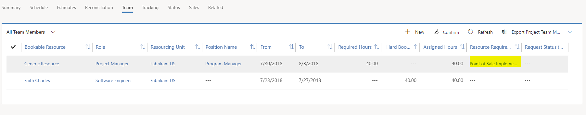

    After you book a named resource, the generic resource is removed from the team and replaced by the named resource.

    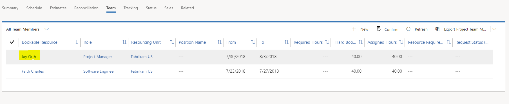

    On the **Schedule** tab, the generic resource assignments are removed and replaced by the named resource.

    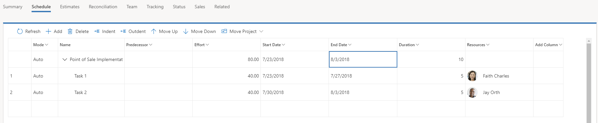

    > [!NOTE]
    > This behavior occurs only when a named resource is fully booked for the generic resource requirement. When either a named resource partially replaces the generic resource requirement or multiple named resources replace the generic resource requirement, the generic resource remains assigned to the task.

    In the following illustration, an 80-hour task has been planned for a five-day duration (16 hours per day over five days) and assigned to the generic resource that is named **Functional**.

    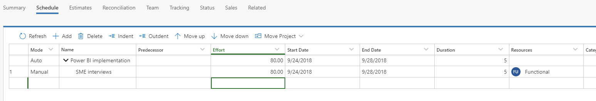

    When you generate the requirement, it's for 80 hours over five days.

    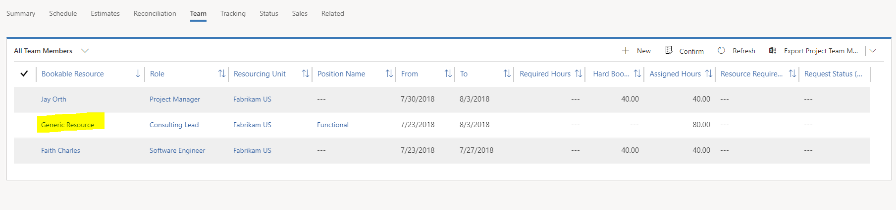

    Because available resources work only eight hours per day, two resources are needed to fulfill the requirement.

    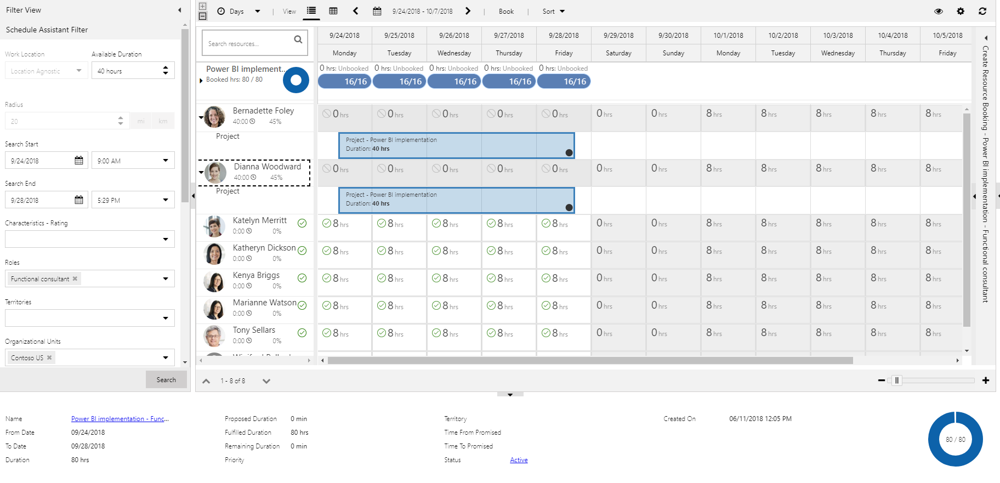

    On the **Team** tab, you can now see that the generic resource has no required hours, but the assigned hours still appear together with the two named resources that make up the fulfillment.

    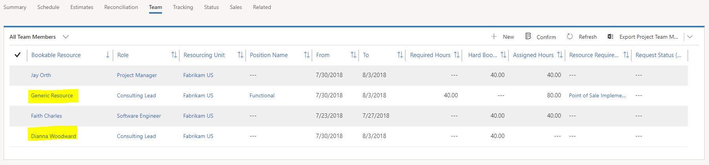

    On the **Schedule** tab, the generic resource remains assigned to the task.

    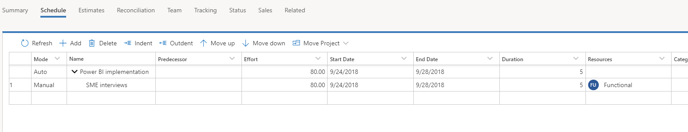

PSA doesn't assign both resources to the task, because that behavior would produce a less predictable schedule. In this simple example, it's easy to divide the hours equally between two resources. However, in more complex scenarios that involve multiple tasks and multiple resources, PSA would have to make assumptions about how it should allocate the bookings that are received for multiple resources across multiple tasks.

Therefore, in these scenarios, the project manager is responsible for parsing the multiple bookings and assigning them as needed. To allocate the bookings, the project manager assigns the tasks from the generic resources to the named resources and then uses the **Reconciliation** view to make sure that the allocation works with the bookings.

### Edit a resource requirement

After a resource requirement has been created, a project manager or resource manager might want to edit the details to refine the search criteria when the Schedule Board is used. To edit the resource requirement, follow these steps.

1. On the **Projects** page, on the **Team** tab, select the link to any requirement on a generic resource.
2. On the **Resource Requirement** page that appears, you can update several attributes. Here are some examples:

    - Name
    - From Date
    - To Date
    - Duration
    - Resource Type

On the **Resource Requirement** page, the project manager or resource manager can also define the following information:

- Skills
- Roles
- Resource preferences
- Preferred organizational unit

### Update resource bookings after they are booked on a project

After you've added a generic or named resource to a project team, you can change the resource's bookings.

1. On the **Projects** page, on the **Team** tab, select a team member, and then select **Maintain Bookings**.

    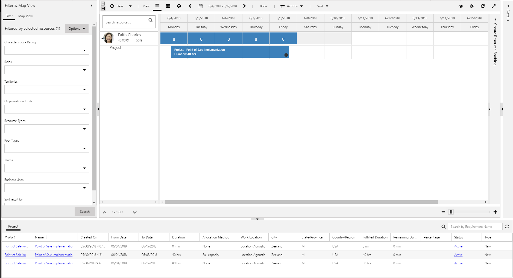

    The Schedule Board appears and shows the project team member's bookings. Expand the team member's record to view the hours that have been booked against this project and other projects that are consuming the team member's capacity.

2. Select and drag the booking to extend or shorten it. A **Create Resource Booking** dialog box appears that lets you adjust the booking.

    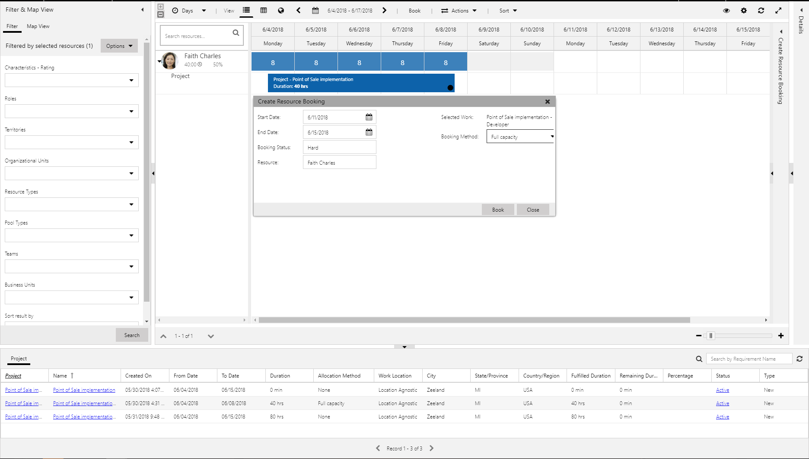

3. Right-click the booking. You can then use the shortcut menu to complete the following actions:

    - Change the booking status.
    - Edit the booking.
    - Substitute a resource on the project team.

### Change the booking status

You can change any default or custom booking status.

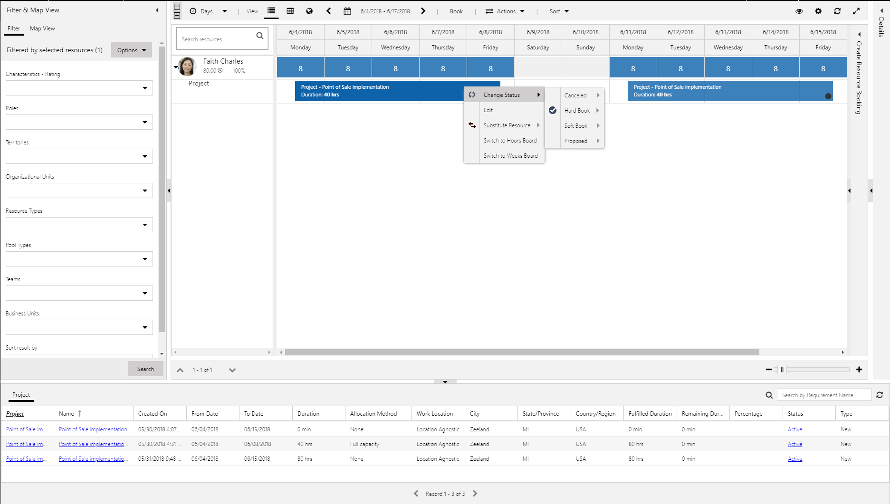

The following statuses are included in PSA:

- **Canceled** – This status cancels a resource's booking and frees up the resource's capacity.
- **Hard Book** – This status consumes a resource's capacity. A booking typically has this status when you open **Maintain Bookings** from the **All Team Members** grid on the **Projects** page.
- **Soft Book** – This status adds a resource to a team but doesn't consume the resource's capacity. It indicates that the resource has been reserved for potential work but still has capacity if it's needed on other jobs. In the view of overall resource availability, soft bookings have a different status than hard bookings.
- **Proposed** – This status represents a resource manager's or project manager's proposal for a resource. Proposals don't consume the capacity of a resource, and the resource isn't added to the project team. To hard-book the resource on the team, the project manager must accept the proposal.

### Submit resource requests

Resource requests are used to carry the demand (resource requirement) that must be fulfilled by a resource manager. For a generic resource that is already on the team, you can submit a resource request directly. A resource request can be fulfilled in two ways:

- The resource manager directly fulfills the request. In this case, the generic resource is replaced by a hard booking that has a named resource.
- The resource manager proposes a resource to the project manager, and the project manager approves or rejects the proposed resource.

#### Direct fulfillment of resource requests

When a resource requirement is generated, a project manager can submit a resource request for a generic resource by selecting the resource and then selecting **Submit Request**.

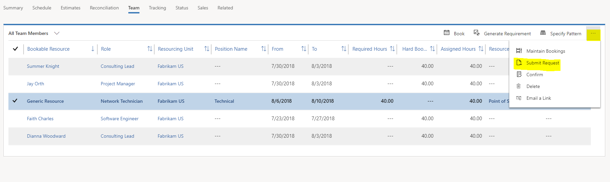

Comments about the resource can be provided to the resource manager who is fulfilling the request. After the request is submitted, the **Status** field for the team member is changed to **Submitted**.

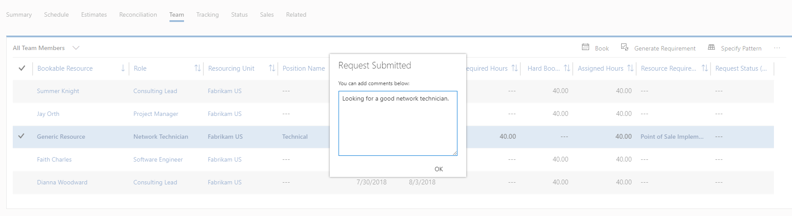

When the resource manager fulfills the request, the generic team member is replaced by the named resource in the **All Team Members** grid.

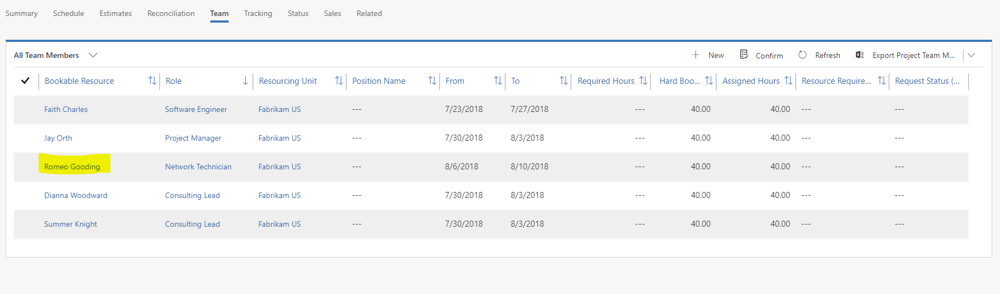

#### Use a resource proposal for resource requests

Instead of directly booking a resource on a resource request, a resource manager can propose a resource to the project manager. A resource manager might use this option when an exact match for the requirements isn't available. When a resource manager proposes a resource, the project manager sees that the **Status** field for the generic team member is changed to **Needs Review**.

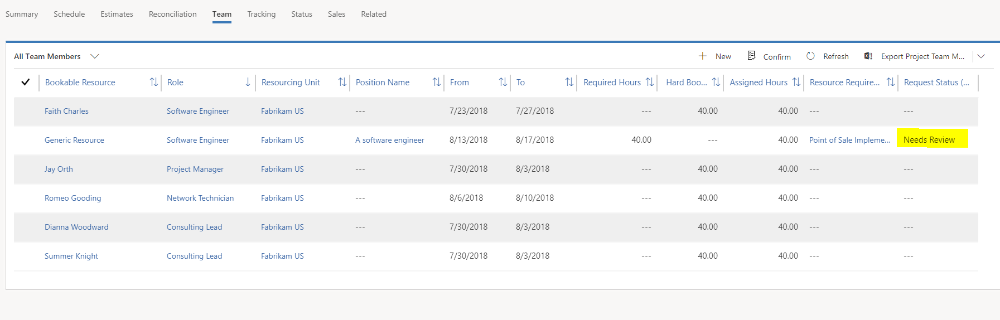

To view the proposed resource together with a visualization of the effect of the proposal's booking, double-click the team member that has a status of **Needs Review**. Then select the **Proposed Resources** tab.

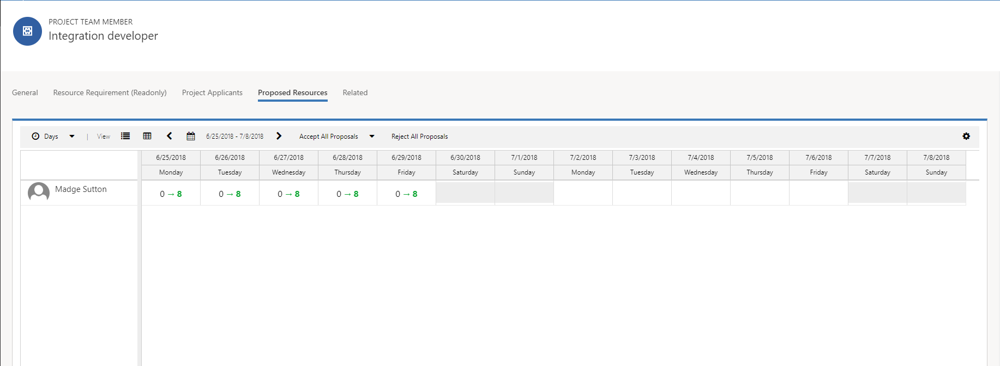

Select **Accept All Proposals** to accept all proposed resources or **Reject All Proposals** to reject them. If you accept the proposed resources, they are hard-booked on the project as team members and replace the generic resources.

> [!NOTE]
> You must either accept or reject all proposed resources. You can't partially accept or reject them.

### Substitute a resource on the project team

Sometimes, a project manager must substitute a booked team member on a project.

1. On the **Projects** page, on the **Team** tab, select the resource that needs a substitute, and then select **Maintain Bookings**.
2. Expand the resource to view the projects that it's assigned to.

    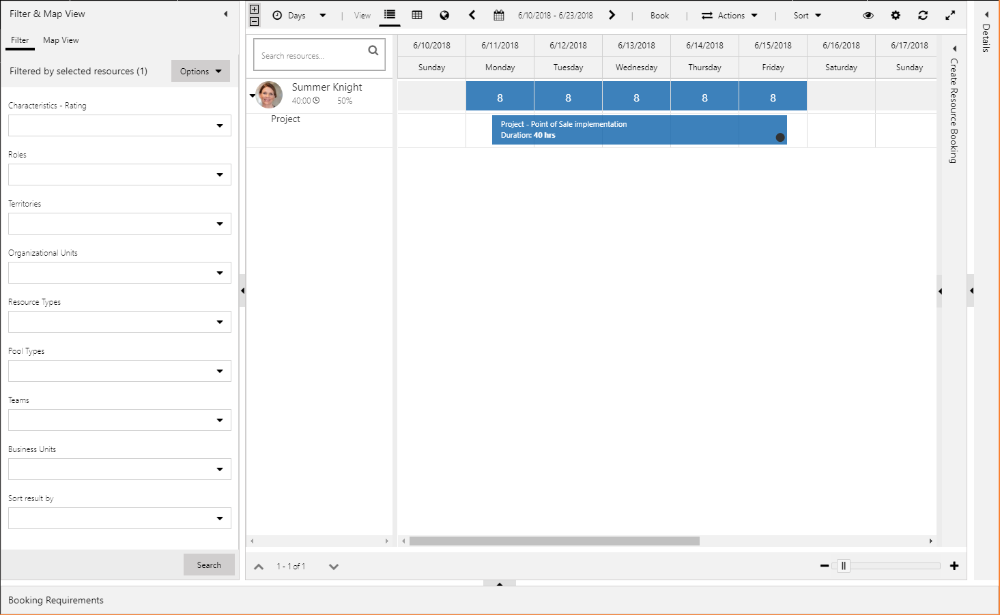

3. Right-click the project, and then select **Substitute Resource**.
4. If you know the resource that you want to substitute for the current resource, select or type the name, and then select **Re-assign**.

    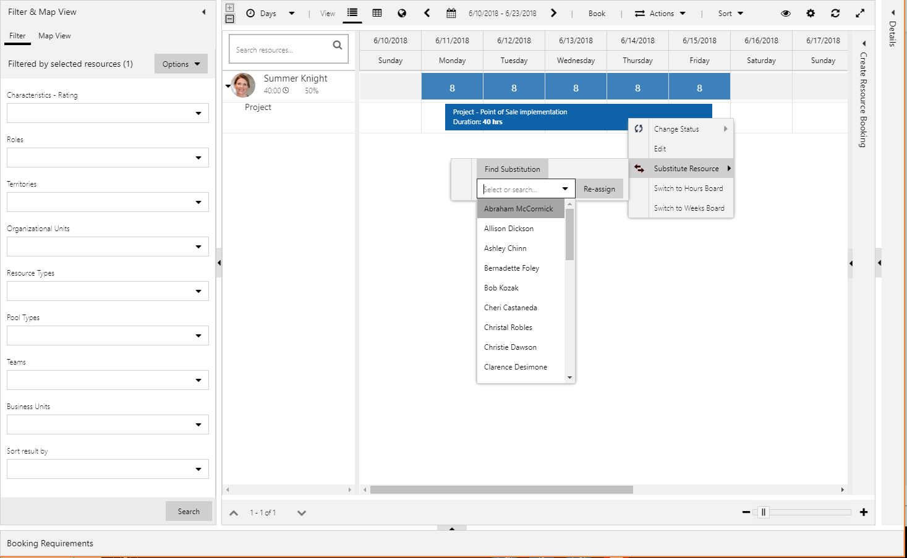

    Alternatively, follow these steps to search for a resource:

    1. Select **Find Substitution**.

        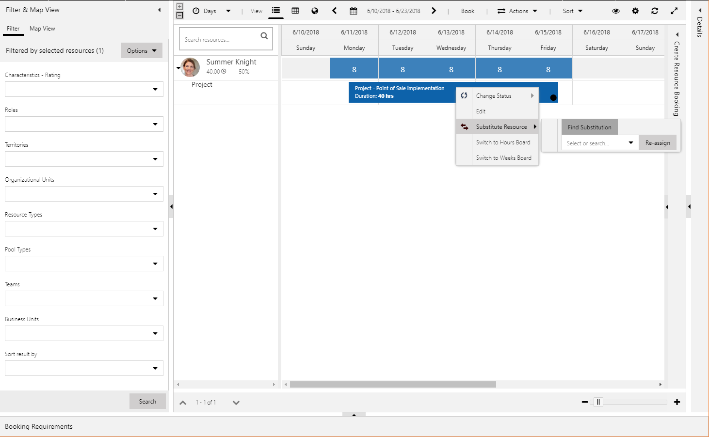

        The Schedule Assistant returns a list of available substitutes. In the Schedule Assistant, you can further filter the available resources to find a suitable substitute.

        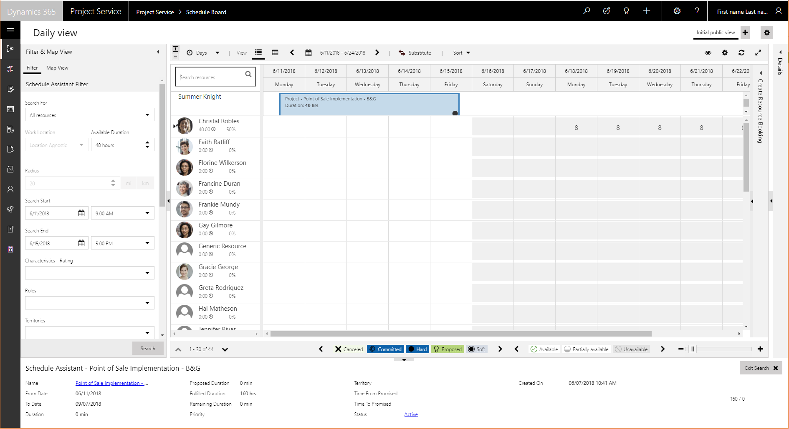

    2. To substitute the resource, select the resource that you want, and then select **Substitute**.

        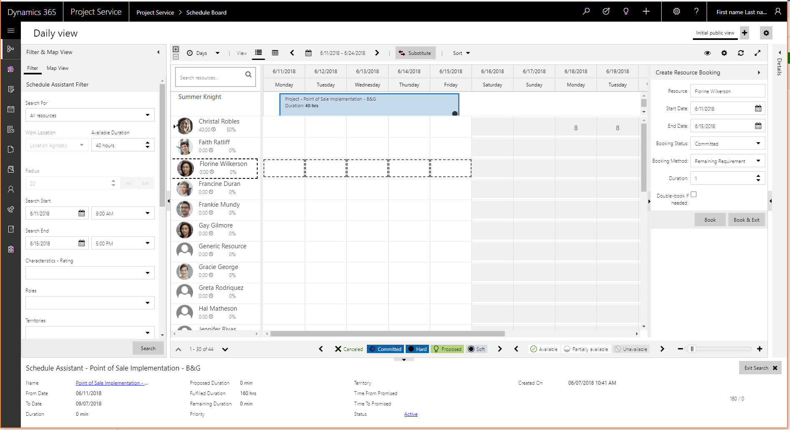

    The bookings and assignments are substituted with the new resource.

    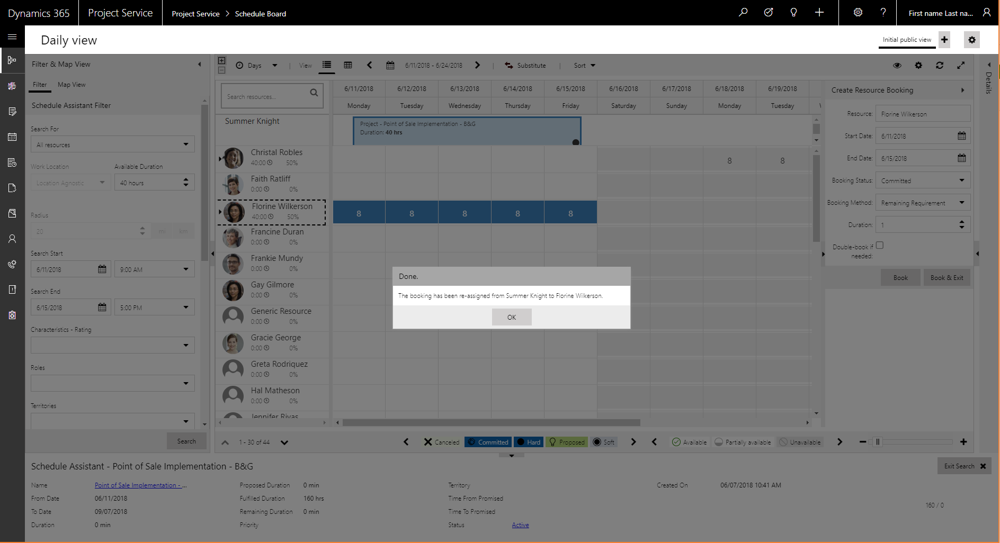

## Reconcile team member bookings and assignments

For team members, bookings and assignments are loosely coupled. In other words, resources can have assignments but no bookings, or they can have bookings but no assignments. Ideally, bookings and assignments should be aligned, so that resources have committed capacity to perform the task assignments. However, the bookings might be based on availability, and task timings might change as the project continues. Therefore, the loose coupling of bookings and assignments provides flexibility.

PSA has a **Reconciliation** tab that lets project managers reconcile team members' bookings and their assignments for project teams.

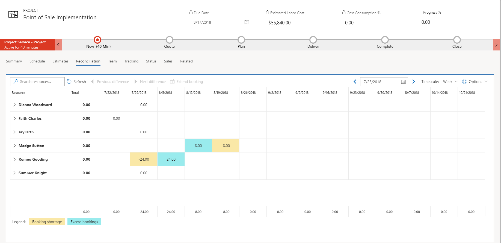

The **Reconciliation** tab shows bookings and assignments down to the level of the individual task assignment for each team member. It shows hours in cells that represent time periods from months down to days.

The tab also shows an overall net total for the project, together with a total column.

For each resource, the tab calculates the difference between the team member's bookings and a rollup of the team member's task assignments. Ideally, this difference should be 0 (zero). In other words, there should be no difference between bookings and assignments. Differences are colored and shaded to draw attention to two conditions:

- **Booking shortage** – A booking shortage occurs when a resource has more assignments than bookings. Because this capacity hasn't been reserved, a project manager might want to correct this condition by extending the resource's bookings to cover the deficit.
- **Excess bookings** – Excess bookings occur when a resource has been booked to the project but hasn't been assigned to tasks. This condition might be acceptable in the cases where the resource was booked to the project before task assignment occurred. However, in other cases, the resource isn't planned to be assigned to tasks. In these cases, the project manager should consider canceling the resource's bookings, so that the capacity can be used for another project.

In some cases, when you view time at a higher level than the day level (for example, the month level), you might see a net difference of zero for a resource (in other words, bookings = assignments). However, if you view time at the week level, you might see that there are assignments of zero hours and bookings of 40 hours in the first week, but assignments of 40 hours and bookings of zero hours in the second week. Overall, the bookings and assignments are reconciled, but they differ from one week to the next.

When you view time at higher levels, cells in the **Reconciliation** tab have an indicator to inform you that there are differences at lower levels. By double-clicking in a cell, you can zoom in to view the difference. You can then right-click to zoom out. By selecting a resource and then using the **Next difference** control on the grid toolbar, you can go to the next difference between bookings and assignments for that resource. You can then use the **Previous difference** control to go back. You can also turn off the difference indicator and navigation behavior under **Settings**.

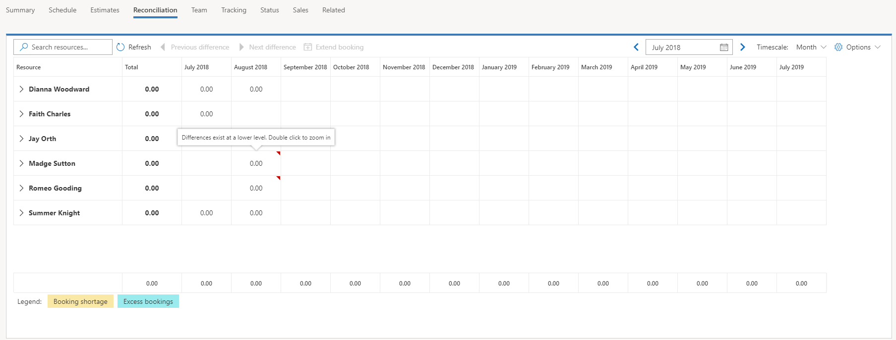

If you have task assignments for a resource but no bookings, on the **Projects** page, on the **Reconciliation** tab, select the booking shortage, and then select **Extend Booking**. The **Extend Booking** dialog box appears and shows the booking that is needed to address the resource's shortage. It also shows the resource's existing bookings across all projects or other schedulable entities. If you select **OK** to create the booking for the resource, regardless of that resource's availability, you might cause overbooking.

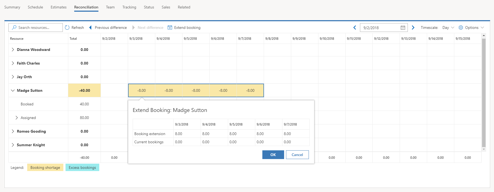

The project manager or resource manager can then use the Schedule Board to manage any situations where a resource is overbooked beyond its capacity.
