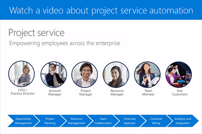

# What is Dynamics 365 Project Service Automation?

[!INCLUDE[cc-applies-to-psa-apps-all](../includes/cc-applies-to-psa-apps-all.md)]

The Project Service Automation (PSA) application helps organizations efficiently track, manage, and deliver project-based services, from the initial sale all the way to invoicing. The app enables you to:

- Plan projects, and create estimates and work schedules
- Estimate and track project cost and revenue
- Forecast resource requirements for projects in the pipeline
- Track project progress and cost consumption
- Manage quoting, pricing, and billing for projects
- Assign and manage resources
- Use reports and interactive dashboards to monitor key performance indicators for successful projects
- ...and more

In addition, to help you monitor and control costs for your project-based work, individual consultants
easily enter and track project time and expenses either on mobile or using a web browser.

## What's new in PSA
The team is excited to announce our newest updates! Ranging from improvements to the user interface, all the way to more powerful search queries for resource scheduling, and more. You asked; we listened.

Take a look at the [April '19 Release Notes](https://docs.microsoft.com/business-applications-release-notes/April19/index) to see our newest enhancements and additions.

### In development
To see what we have planned in the near future, head over to the [Dynamics 365: 2019 release wave 2 plan](https://docs.microsoft.com/dynamics365-release-plan/2019wave2/index).

## Get help with PSA version 3.x
Looking for resources to help plan your implementation? Check out these downloadable guides.

 [Project planning and tracking guide](../project-service/implementation-guides/project-planning-tracking.md)

 [Basic quoting, pricing, and billing guide](../project-service/implementation-guides/begin-quoting-pricing-billing.md)

 [Advanced quoting, pricing, and billing guide](../project-service/implementation-guides/adv-quoting-pricing-billing.md)

 [Resource management guide](../project-service/implementation-guides/resource-management-guide.md)

 [Reporting guide](../project-service/implementation-guides/reporting-guide.md)

 [Notes for developers](../project-service/developer-guides/overview-dev-notes-v3.x.md)

## Guidance for earlier versions (app version 2.x or 1.x)
 [Administrator guide](../project-service/admin-guide.md)

 [Resource manager guide](../project-service/resource-manager-guide.md)

 [Project manager guide](../project-service/project-manager-guide.md)

 [Account manager guide](../project-service/account-manager-guide.md)

 [Time, expense, and collaboration](../project-service/time-expense-collaboration-guide.md)

 [White papers (app version 2.x or 1.x)](../project-service/white-papers.md)

 [Notes for developers (app version 2.x)](../project-service/developer-guides/add-custom-qoi-forms-v2.x.md)

 ## Watch a 2-minute overview video
  

