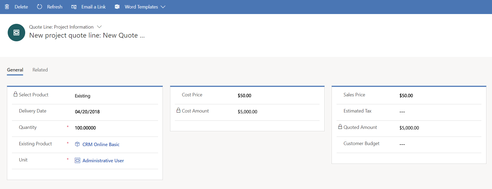

# Product-based quote lines

[!INCLUDE[cc-applies-to-psa-app-3.x](../includes/cc-applies-to-psa-app-3x.md)]

You can create product-based quote lines in Dynamics 365 Project Service Automation. Product-based quote lines can be "write-in" lines, or they can be items from the product catalog.

## Product catalog

The products in a Dynamics 365 product catalog have a default unit and unit group. If several products share the same set of attributes, you can create a product family that also has those attributes. All the products in one product family inherit the same set of attributes.

For example, a company sells subscription licenses for a variety of software. All subscription software has the following two attributes:

- Number of users 
- Subscription duration (in months)

A good way to maintain this type of catalog is to create a product family that is named **Subscription Software**, and that has **Number of users** and **Subscription duration** as attributes. You can then add individual products, such as **Dynamics 365 Sales** or **Dynamics 365 Field Service** to the **Subscription Software** product family.

## Adding product catalog items to a project quote

Project quote and project contract pages have sections for two types of lines: project-based lines and product-based lines. For product-based lines, Dynamics 365 is used to add items from a product catalog to a quote. The drop-down list on the quote line or project contract line includes all the products and units in the product price list that is attached to the quote or project contract. You can also add products that aren't part of quote's product price list.

Additionally, you can select products from other price lists, or you can select products directly from the product catalog. When you select products directly from a product catalog, the default price list of that product is used to get the product's sales price. If a default price list isn't set, the price is set to 0 (zero).

If a quote line is based on a product catalog, you can override the sales price directly on the quote line. 
Note that a quote line in Dynamics 365 has a **Pricing** field. Two values are available:

- Override pricing  
- Use default

If you set this field to **Override pricing**, Dynamics 365 doesn't set a default price. You must enter a price for the product on the quote line. If you set this field to **Use default**, Dynamics 365 uses the default sales price and locks the field to prevent editing.

After you install PSA, default sales prices are entered on the product-based lines on a quote. The **Pricing** field is then set to **Override pricing** so that you can edit the default price on the quote lines.

> 
 
## Quantity factors for products

PSA uses quantity factors to support the sale of subscription-based products. For subscription-based products, the quantity on the quote or project contract line is expressed as the number of user months.

Usually, the price of subscription software is stored in the catalog as the price per user per month. However, you can use other time descriptions instead. During the sales process, the price on the quote line is usually the per-user, per-month price that was negotiated and discounted by the IT sales agent. Each deal has a different number of users and a different number of subscription months. The quantity that is used to compute the amount of the quote line is a product of the number of users and the number of subscription months.

To support this type of sale, PSA introduced the concept of quantity factors. Quantity factors rely on the product attributes in Dynamics 365. When you configure specific properties for a product, PSA lets you flag a subset of those properties, or all the properties, as quantity factors.

PSA validates that only numeric properties or product properties that have a numeric data type are flagged as quantity factors. When a product that quantity factors are configured for is added to a quote line, the **Quantity** field on the quote line becomes a read-only field. After you enter values for product properties that are quantity factors, PSA computes the quantity of the quote line.

For example, Dynamics 365 might have the following properties: 

- **No of users** - The number of users 
- **No of Months** - The number of subscription months
- **Product SKU** 

Tne **No of Users** and **No of Months** properties can be flagged as quantity factors by editing the properties of the product line. 

> 
 
