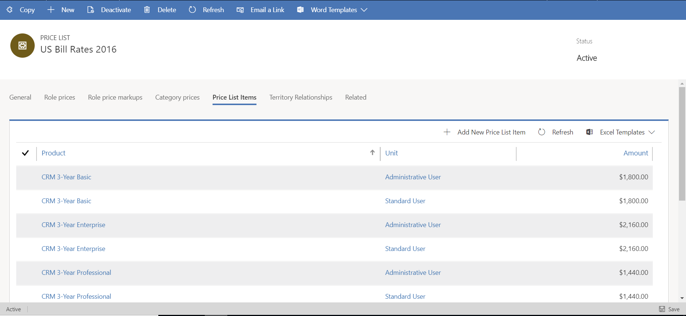

# Product catalog pricing 

[!INCLUDE[cc-applies-to-psa-app-3.x](../includes/cc-applies-to-psa-app-3x.md)]

Price lists and price list item entities support product catalog pricing. For the most part, this functionality is used for catalog-based lines on project quotes and project contracts.

For project-based lines, a contract represents the deal after it was won. Because the process of negotiation usually precedes the win, the pricing that is attached to the quote is always copied as-is to a new price list and attached to the contract. This new price list can't be changed outside the scope of the contract. This limitation helps protect the rate card that was negotiated from any price changes that occur in the master price list.

Products should be set up so that they have default cost and price lists in the product catalog. You must use the list price, standard cost, and current cost to configure default cost and list prices. The default list prices are used on a quote line or a project contract line only when the system can't find a price list line for that product in the product price list for the quote or project contract.

The cost price of product catalog lines can be changed between quotes. This capability is important, because if you don't accurately track costs, you can't determine operational profits on project engagements. By default, the standard cost of the product is used as the cost price. However, the default cost price can be updated on the quote line if there's a different cost price for that quote.

## Price list items

You can add products from a product catalog to different price lists. Price list lines for products always reference a specific unit. Pricing for a product on price list items can be configured as a currency amount. Alternatively, it can be configured as a function of the list price, current cost, or standard cost.

PSA supports various rounding options when prices are configured as a function of the list price, standard cost, or current cost. In addition to taking advantage of multiple pricing methods and rounding options, you can associate discount lists with price list items. 

> 

When you create a new custom price list for a quote by selecting **Create Custom Pricing** on the **Project Quote** page, PSA makes a copy of the price list, and the **Entity** field on the header of the new price list is set to **Sales Entity**. The name of the new price list is appended with the name of the quote and a timestamp. You also can use the name of the new price list and the name of the quote in custom workflows to trigger additional review and approvals for quotes that use custom pricing.

 
## Default product price list
Each customer record has a **Default Price List** field, where you can specify a price list that matches the currency of the customer. In PSA, a default value isn't automatically entered in this field. When a custom pricing agreement with a specific customer exists, you can use this field to associate a price list with that customer.

The Opportunity, Quote, and Project Contract entities use the following order to enter default product price lists. The same order is used for project price lists.

1.	Quote
2.	Opportunity
3.	Customer
4.	Global settings for PSA

By default, the **Product** field on the quote line lists all the active products in the product price list of the quote. If a product has been inactivated, or if it's a draft product, it isn't listed, even if it's in the price list. 

Product catalog lines are added as invoice lines on the first invoice that is created for a project contract. On a draft invoice, those invoice lines can be deleted. In that case, the lines will appear on a subsequent invoice until they are invoiced, or until the invoice is sent to the customer. In PSA, you can't invoice a partial quantity of a product invoice line. When the product lines from the project contract are invoiced, actuals are created. However, those actuals aren't linked to the related project entity. In other words, product-based project contract lines are independent of any project-based use. PSA doesn't track material consumption on projects.
