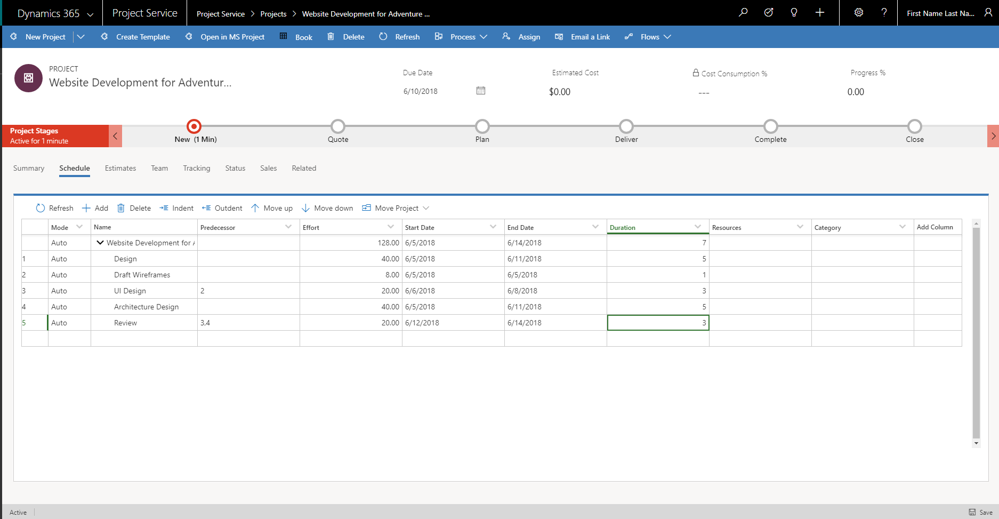

# Project schedules 

[!INCLUDE[cc-applies-to-psa-app-3.x](../includes/cc-applies-to-psa-app-3x.md)]

A project schedule communicates what work must be completed, which resources will do the work, and the timeframe that the work must be finished in. It reflects all the work that is associated with delivering the project on time. In Dynamics 365 Project Service Automation, you create a project schedule by breaking the work down into manageable tasks, estimating the time that is required to do each task, setting task dependencies, setting task durations, and estimating the generic resources that will do the tasks. The project schedule is created on the **Schedule** tab of the project page.
 
## Tasks

The first step in creating a project schedule is to break the work down into manageable portions. The schedule in PSA supports the following features:

- Project root node
- Summary or container tasks
- Leaf node tasks

### Project root node

The project root node is the top-level summary task for the project. All other project tasks are created under it. The name of the root node is always set to the project name. The effort, dates, and duration of the root node are summarized based on the values in the hierarchy below it. You can't edit the properties of the root node. You also can't delete the root node.

### Summary or container tasks 

Summary tasks have sub-tasks or container tasks under them. They have no work effort or cost of their own. Instead, their work effort and cost are a rollup of the work effort and cost of their container tasks. The start date of the summary task is the start date of the container tasks, and the end date is the end date of the container tasks. The name of a summary task can be edited, but scheduling properties (effort, dates, and duration) can't be edited. If you delete a summary task, you also delete all its container tasks.

### Leaf node tasks

Leaf node tasks represent the most granular work on the project. They have an estimated effort, resources, planned start and end dates, and a duration.
 
## Creating a task hierarchy

You can create a task hierarchy by using the following options:

- **Add task** button
- **Indent task** button
- **Outdent task** button
- **Move up** and **Move down** buttons
- Accessibility and keyboard shortcuts

### Add task

The **Add task** button lets you create a new task in the hierarchy. If you don't select a position, the task is inserted at the end. 

A schedule ID is assigned to every task. The schedule ID represents the task's depth and position in the hierarchy. It uses outline numbering. For tasks in the first level under the project root node, a numbering scheme of 1, 2, 3, and so on, is used. For tasks under the first level, a numbering scheme of 1.1, 1.2, 1.3, and so on, is used.

### Indent task

When a task is indented, it becomes a child of the task that is directly above it. The schedule ID of the task is then recalculated so that it's based on the schedule ID of its new parent and follows the outline numbering scheme. The parent task is now a summary task or a container task. Therefore, it becomes a rollup of its child tasks.

### Outdent task 

When a task is outdented, it's no longer a child of the task that was its parent. The schedule ID is then recalculated so that it reflects the task's updated depth and position in the hierarchy. The effort, cost, and dates of the previous parent task are recalculated so that they don't include this task.

### Move up and Move down 

The **Move up** and **Move down** buttons change the position of a task within its parent hierarchy. Changes of this type don't affect the task's effort, cost, dates, or duration. Only the task's schedule ID is affected. The schedule ID is recalculated so that it reflects the task's new position in the parent's list of child tasks.

### Accessibility and keyboard shortcuts

The **Schedule** grid is fully accessible and can be used with screen readers such as Narrator, JAWS, or NVDA. You can move through the grid area by using arrow keys (as in Microsoft Excel), you can use the Tab key to advance through the interactive UI elements, and you can use the Down arrow key, the Enter key, or the Spacebar to select and invoke the drop-down menus. The column headers are also interactive. You can hide and show columns, use the Tab key and arrow keys to move through the column headers, and use the action buttons on the toolbar. In addition, you can use the following keyboard shortcuts:

- **Refresh**: ALT+SHIFT+F5
- **Add**: ALT+SHIFT+Insert
- **Delete**: ALT+SHIFT+Delete
- **Move up/down**: ALT+SHIFT+Up/Down arrows
- **Indent/Outdent**: ALT_SHIFT+Left/Right arrows
- **Expand/Collapse Hierarchies**: ALT+SHIFT+Plus/Minus keys

## Task attributes

A task's name describes the work that must be completed. In PSA, the attributes that are associated with a task describe the schedule of the task and its staffing requirements.

> 
 
### Schedule attributes

The **Effort**, **Start date**, **End date**, and **Duration** attributes define the schedule for the task.

Additional schedule attributes include:

- **Effort hours**: Enter an estimate of the hours that are required to complete the task. 
- **Duration**: Specify the number of workdays that are required to complete the task.
- **Schedule ID**: This automatically generated ID is used to order tasks in the hierarchy. Dependencies between the tasks manage the actual order in which the tasks are worked on.
 
### Staffing attributes

Staffing attributes are accessed through the **Resources** field in the schedule. You can either search for an existing resource, or click **Create** and in the **Quick Create** pane, add a project team member as a new resource.

The **Role**, **Resourcing Unit**, and **Position Name** fields are used to describe the staffing requirements for the task. These staffing attributes together with the task schedule are used to find available resources to do this task.

**Role** - Specify the type of resource that is required to do the task.

**Resourcing unit** - Specify the unit that resources for the task should be assigned from. This attribute affects the cost and sales estimate for the task if the cost and bill rate for the resource are set based on resourcing units.

**Position name** – Enter a friendly name for the generic resource that serves as a placeholder for the resource that will ultimately do the work.

The **Resources** field holds the position name of the generic resource or named resource when one is found.

The **Category** field holds the values that indicate a broader type of work that the task can be grouped into. This field doesn't affect scheduling or staffing. It's used only for reporting.

### Task dependencies 

You can use the schedule in PSA to create predecessor relationships between tasks. The **Predecessor** field under **Tasks** takes one or more values to indicate the tasks that a task depends on. When predecessor values are assigned to a task, the task can start only after all the predecessor tasks have been completed. Because of the dependency, the planned start date of the task is reset to the date when the predecessor tasks are completed.

The task mode has no effect on updates that are made to the start and end dates of predecessor/dependent tasks.

## Task mode 

The task mode determines the scheduling of leaf node tasks. PSA supports two task modes for every task: automatic scheduling and manual scheduling.

### Auto-scheduling 
 
When task mode is set to **Automatically Scheduled** for a task, the task scheduling engine uses the scheduling rules on task attributes to determine the schedule for the task.

#### Scheduling rules

By default, if a leaf node task doesn't have predecessors, its start date is set to the project's scheduled start date. The duration of a leaf node task is always calculated as the number of working days between its start and end dates. When a task is automatically scheduled, the scheduling engine follows these rules:

- The start and end dates of the task must be working days, according to the project's scheduling calendar. 
- For any task that has predecessor tasks, the start date is automatically set to the latest end date of its predecessors.
- Effort is calculated by using this formula: Number of people × Duration × Hours in a standard workday in the project calendar.

### Manual scheduling

If the rules of automatic scheduling don't meet your requirements, you can set the task mode for the task to **Manually Scheduled**. This setting stops the scheduling engine from calculating the values of other scheduling attributes. Regardless of the task mode, if you set predecessors on tasks, you always affect the dependent task's start date.
