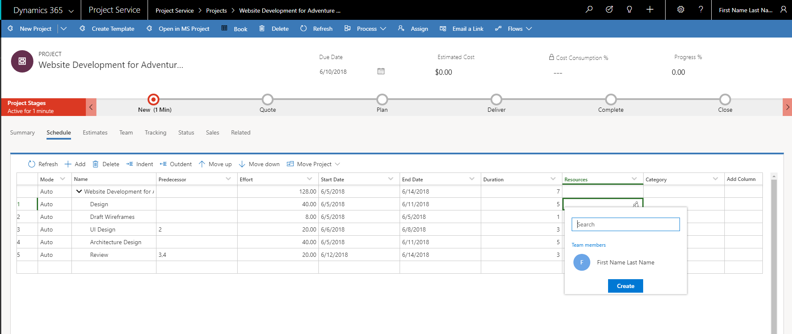
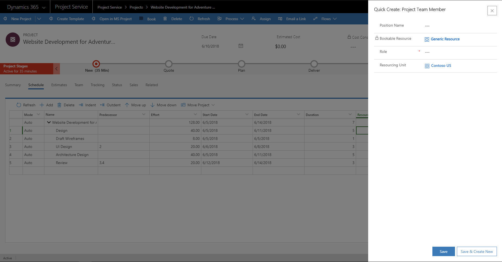

# Project schedules 

[!INCLUDE[cc-applies-to-psa-app-3.x](../includes/cc-applies-to-psa-app-3x.md)]

A project schedule communicates what work needs to be completed, which resources will do the work, and the timeframe in which that work must be finished. The project schedule reflects all of the work associated with delivering the project on time. In Dynamics 365 for Project Service (PSA), you create a project schedule by breaking down work into manageable tasks, estimating the time required to do a task, setting task dependencies, setting task durations, and estimating the generic resources that do the tasks. The project schedule is created in the Schedule tab on the project form.
 
## Tasks

The first step in creating a project schedule is to break down the work into manageable portions. The Schedule in PSA supports the following features:

- Project root node
- Summary or container tasks
- Leaf node tasks

### Project root node

Project root node is the top-level summary task for the project. All other project tasks are created under it. The name of the root task is always set to the project name. The effort, dates, and duration of the root node are summarized based on the values on the hierarchy below it. You can’t edit the properties of the root node or delete it.

### Summary or container tasks 

Summary tasks have sub-tasks or container tasks under them but have no work effort or cost of their own. Their work effort and cost are a rollup of their container tasks. The start date of the summary task is the start date of the container tasks, and the end date is the end date of the container tasks. The name of a summary task can be edited, but scheduling properties of effort, dates, and duration can’t. Deleting a summary task deletes the task and all its constituent tasks.

### Leaf node tasks

These tasks represent the most granular work on the project. They have an estimated effort, resources, planned start and end dates, and a duration. 
 
## Creating a task hierarchy

You can create a task hierarchy with the following options:

- Add task
- Indent task
- Outdent task
- Move up and move down
- Accessibility and keyboard shortcuts

### Add task

This option allows you to create a new task in the hierarchy. If you don’t choose a position, the task is inserted at the end. A Schedule ID is assigned to the task and represents the depth and position in the hierarchy. The Schedule ID uses outline numbering. For tasks in the first level under the root of the project, a numbering scheme of 1, 2, 3, etc. is used. For tasks under the first level root, a numbering scheme of 1.1, 1.2, 1.3, etc. is used.

### Indent task

When a task is indented, it becomes a child of the task directly above it. The Schedule ID of this task is recalculated using the outline numbering scheme from the Schedule ID of its parent. The parent task is now a summary or a container task and therefore becomes a rollup of its constituent tasks.

### Outdent task 

When a task is out-dented, it is no longer a constituent of its parent. It's Schedule ID is recalculated to reflect this updated depth and position in the hierarchy. The effort, cost, and dates of the previous parent task get recalculated, so they do not include this task.

### Move up and Move down 

**Move up** and **Move down** change the position of a task within its parent hierarchy. Moving a task up or down does not have any effect on its effort, cost, dates, or duration. Only the Schedule ID of the task is recalculated to reflect its new position in the parent’s constituent task list.

### Accessibility and keyboard shortcuts

The Schedule grid is fully accessible and can be used with screen readers such as Narrator, JAWS, or NVDA. You can navigate through the grid area using arrow keys (as in Excel), tab through the interactive UI elements and use Down Arrow, Enter, or the spacebar to select and invoke the drop-down menu. The column headers are also interactive, which lets you hide and show columns, use the Tab and arrow keys to navigate through the column headers, and use the action buttons on the toolbar. In addition, you can use the following keyboard shortcuts:

- Refresh: ALT+SHIFT+F5
- Add: ALT+SHIFT+Insert
- Delete: ALT+SHIFT+Delete
- Move up/down: ALT+SHIFT+Up/Down arrows
- Indent/Outdent: ALT_SHIFT+Left/Right arrows
- Expand/Collapse Hierarchies: ALT+SHIFT+Plus/Minus keys

## Task attributes

A task’s name describes the work that needs to be completed. In PSA, the attributes associated to a task describe the schedule of the task and its staffing requirements.

> 
 
### Schedule attributes

**Effort**, **Start date**, **End date**, and **Duration** are used to describe the schedule of the task. By assigning values to these attributes, you can determine the schedule for the task.

Additional schedule attributes include:
- **Effort hours**: An estimate of the hours required to complete the task.    
- **Duration**: The number of work days it will take to complete the task.
- **Schedule ID**: The auto-generated ID is used to order tasks in the hierarchy. Dependencies between the tasks manage the actual order in which the task are worked on.
 
### Staffing attributes

Staffing attributes are accessed through the **Resources** field in the schedule. You can either search for an existing resource, or click **Create** and in the **Quick Create** pane, add a project team member as a new resource.

> 

> 

The **Role**, **Resourcing unit** and **Position name** fields are used to describe the staffing requirements for the task. 

**Role** describes the type of resource needed to do the task. These staffing attributes along with the task schedule are used to find available resources to do this task.

**Resourcing unit** is the unit from which resources should be assigned for that task. This has an impact on the cost and sales estimate for the task if the cost and bill rate for the resource is set based on resourcing units.

**Position name** is a friendly name for the generic resource that serves as the placeholder for the resource that will ultimately do the work. 

The **Resources** field is used to hold the position name of the generic resource or named resource when one is found.

The **Category** field holds the values that indicate a broader type of work that the task can be grouped into. This field doesn’t impact scheduling or staffing and is used only for reporting. 

### Task dependencies 

You can use the schedule in PSA to create predecessor relationships between one or more tasks. The **Predecessor** field under **Tasks** takes one or more values to indicate the tasks that it is dependent on. PSA supports a “Finish to Start” type of dependency. When a predecessor value is assigned to a task, the task can only start when all preceding tasks have been completed. This dependency means the planned start date of the task is reset when the preceding tasks are completed. Updates to the task’s start/end dates are not impacted by the task mode.

## Task mode 

Task mode determines the scheduling of leaf node tasks. PSA supports two task modes for every task: auto scheduling and manual scheduling.

### Auto-scheduling 
 
When task mode is set to **Automatically Scheduled** for a task, the task scheduling engine uses the scheduling rules on task attributes to determine the schedule for the task.

**Scheduling rules**

The start date of a leaf node task that does not have predecessor’s defaults to the project’s scheduled start date. The duration of a leaf node task is always calculated as the number of working days between its start and end dates. When a task is automatically scheduled, the scheduling engine follows these rules: 

- Start and end dates of task must be working days according to the project’s scheduling calendar.  
- For any task that has predecessor tasks, the start date of that task defaults to the latest end date of its predecessors. 
- Effort = number of people * duration * hours in a standard work day of the project calendar.

### Manual scheduling

If the rules of auto-scheduling don’t work for you, you can set the task mode for the task to **Manually Scheduled**. This stops the scheduling engine from calculating the values for other scheduling attributes. Regardless of the task mode, setting predecessors on tasks always impacts the dependent task’s start date.
