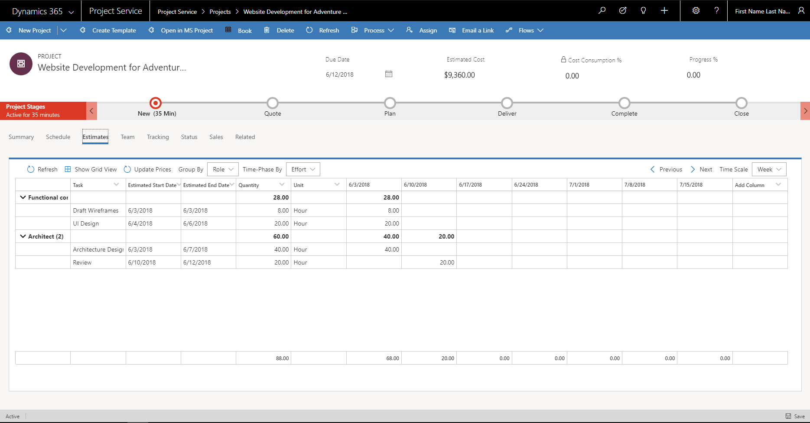
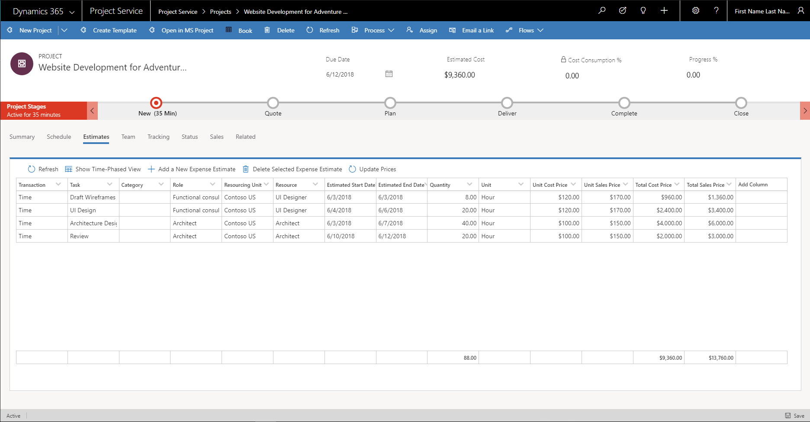
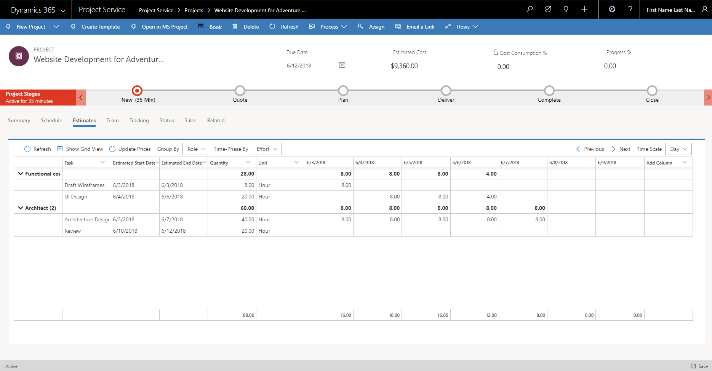

# Project costs and revenue

[!INCLUDE[cc-applies-to-psa-app-3.x](../includes/cc-applies-to-psa-app-3x.md)]

Project estimates provide the financial view for work that is estimated and scheduled in the project schedule. The **Estimates** tab on the **Projects** page shows the cost and revenue impact of the work that you’re planning. It also provides information about many predefined dimensions. 

> 

## Cost and sales values of the project

Price lists define the cost and bill rates for roles in a project. You can determine the cost and revenue impact of the work, based on the roles that are associated with the position name and the named resource that is assigned to a task. If there are tasks that don't have any assignments (generic or named), you can’t get cost or sales estimates. Cost and sales values consider the date that is defined in the price lists.

### Default cost price  

Every project belongs to an organization. This organization is shown in the **Contracting Unit** field in the project. The price list that is associated with the contracting unit is used to determine the unit cost price. To determine the correct cost prices on roles for the date that is defined on estimate lines, search for the combination of role, unit, and organizational unit in the cost price list. 

So that their cost prices can be calculated, all tasks must be assigned to a resource. Any uwnassigned tasks will have a cost price of 0.00.

If the combination of role, unit, and organizational unit doesn't return a cost price from the contracting unit's price list, the system ignores the unit. Instead, it searches for the combination of just role and organizational unit. If a cost price is found, conversion factors are used to convert it to the unit that you selected on the estimate line.

If the combination of role and organizational unit doesn't return a cost price, the system ignores the organizational unit. Instead, it searches for the combination of role and unit to set the default price (after any conversion is applied).

If the system doesn't find a price for the role, the cost price on the estimate line is set to a default value of **0.00**. All cost amounts on the project cost estimate lines are recorded in the currency of the contracting unit.

> [!NOTE]
> By default, Microsoft Dynamics 365 stores cost amounts in your base currency. However, the cost amounts that are shown on the **Estimates** tab are in the currency of the contracting unit.  

### Default sales price 

The sales price list is determined by either the sales entity that the project is attached to or the project customer. When a sales entity, such as opportunity, quote, or contract, is associated with the project, the sales entity's sales price is determined by the price list that is associated with the quote or contract. If the quote or contract has a custom price list, that price list is used as the default sales price list for project estimates. If there is no association with sales entities, the default sales price list from the parameters is used as the project's default sales price list matched by the customer currency that is defined on the project.

Each estimate line has a resourcing unit that is associated with it. The resourcing unit indicates the organizational unit that resources are booked from to complete the task. To determine the sales price for the associated roles, search for the combination of role, unit, and resourcing unit in the sales price list. If there are no assignments on the task, the sales price for the task is 0.00.

If the combination of role, unit, and resourcing unit doesn't return a sales price from the sales price list, the system ignores the unit. Instead, it searches for the combination of just role and resourcing unit. If a sales price is found, conversion factors are used to convert it to the unit that you selected on the sales estimate line. 

If the combination of role and resourcing unit doesn't return a sales price from the sales price list, the system ignores the resourcing unit. Instead, it searches for the combination of role and unit to set the default price (after any conversion is applied).

If the system doesn't find a price for the role, the sales price on the estimate line is set to a default value of **0.00**.

The **Estimates** tab has a grid view that shows estimate lines. The grid includes columns for the unit, total cost price, and total sales price, as shown in the following illustration. 

> 

## Time-phased view of project estimates

The time-phased view of project estimates shows the estimate data from the grid view across the timeline, in a time scale that you select. By default, the estimate data is pivoted on the **Role** dimension.

> 

## Allocating estimated effort based on the task mode

In the time-phased view, you distribute the total effort that is estimated for the task by allocating effort hours per unit time period in the selected time scale. The task mode determines how effort is allocated across the duration of the task. The two kinds of allocation are **Even** and **Work hours–based**.

### Work hours-based allocation
 
In auto-scheduling task mode, the daily default hours for task resources are set at the full work hour rate. This behavior applies when effort is allocated by splitting it across the duration of the task in the time-phased view. For example, if you estimate that a task will be completed by one resource in the **Day** time scale, the effort that is allocated per day won't exceed the work hours per day that are defined in the project calendar. Therefore, the effort allocation always makes sure that the resources are estimated to be used for the full day.

### Even allocation

In manually scheduled task mode, the work hours from the project calendar aren't used. Instead, the task schedule is based on user input. For these tasks, the effort allocation per unit time period in the selected time scale doesn't have any limiting factor. The total effort on the task is equally split and allocated for each unit time period in the selected time scale. Therefore, the task mode that is defined on the task determines the effort distribution, or the allocation of effort per unit time period in time-phased estimates.

## Grouping and time-phasing options

The time-phased view shows the distribution of the effort, cost, and sales estimates on a daily, weekly, monthly, or yearly basis. By default, the estimate data is pivoted on the **Role** dimension. However, you can use the **Group By** option to pivot on two other dimensions: **Category** and **Resource**.

In both the grid view and the time-phased view, you can select which fields are shown. Totals for each time block are shown at the bottom of the project. They show the total estimated effort, cost, and sales for the day, week, month, or year. The default cost price and sales price are date-effective. In other words, they change for each resource, based on the time-phased view that you select.

## Expense estimates

The **Add a New Expense Estimate** button in the grid view lets you record any expenses that are incurred in the project, but that aren't directly related to labor. You can record the expense estimates for a specific task or for the entire project. Select expense categories and the tentative date when you expect to incur the expense. If the associated cost price list and sales price list have default prices (or if markup percentages are defined for expense categories), they are automatically entered on the estimate line when the association occurs.
