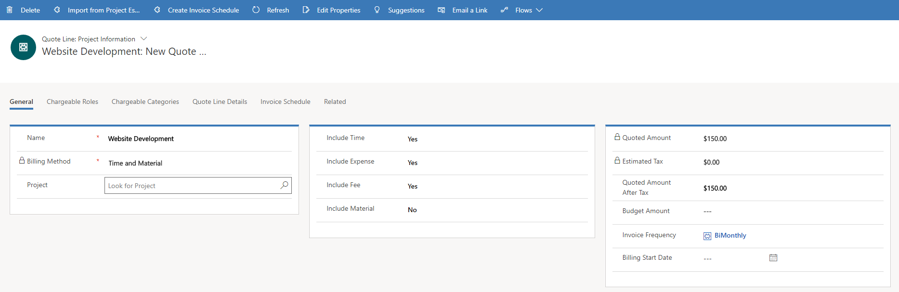

# Sales estimates and projects

[!INCLUDE[cc-applies-to-psa-app-3.x](../includes/cc-applies-to-psa-app-3x.md)]

During the sales process, you can create sales estimates by linking a project to a sales quote. In this way, deterministic estimation can occur during the sales process, to take advantage of project scheduling and estimation capabilities. If the sale goes through, the schedule that was used for sales estimation purposes can be used as the basis for further refinement of the project plan.

## Linking a project to a quote line

When you create a project-based quote line, you can create a new project or associate an existing project pn the **Quote Line** page. 

> 
 
When you create a new project from the quote line details, you can take advantage of project templates. Project templates are model projects that represent standard project plans and financial estimates that are typical in an organization. They can also represent copies of project plans and estimates from past projects.

> 
  
When you create the project from the quote, the project is automatically associated with the quote line.

## Components of estimates in a project

A schedule lets you divide work into tasks, maintain a hierarchy of tasks, determine what resources are required to complete a task, and assign an estimate of the effort that is required to complete a task.

You can define the work effort and schedule estimates by using the fields on the **Schedule** tab of the **Project** page. Because a price list is associated with the project, financial estimates are calculated by using cost and sales prices that are defined in the price list.

## Importing estimates from a project into a quote

After you define project estimates, you can import them into the quote line. On the **Quote Line Details** page, select **Import from estimates** on the ribbon to summarize project estimates by transaction type, role, or task level.
